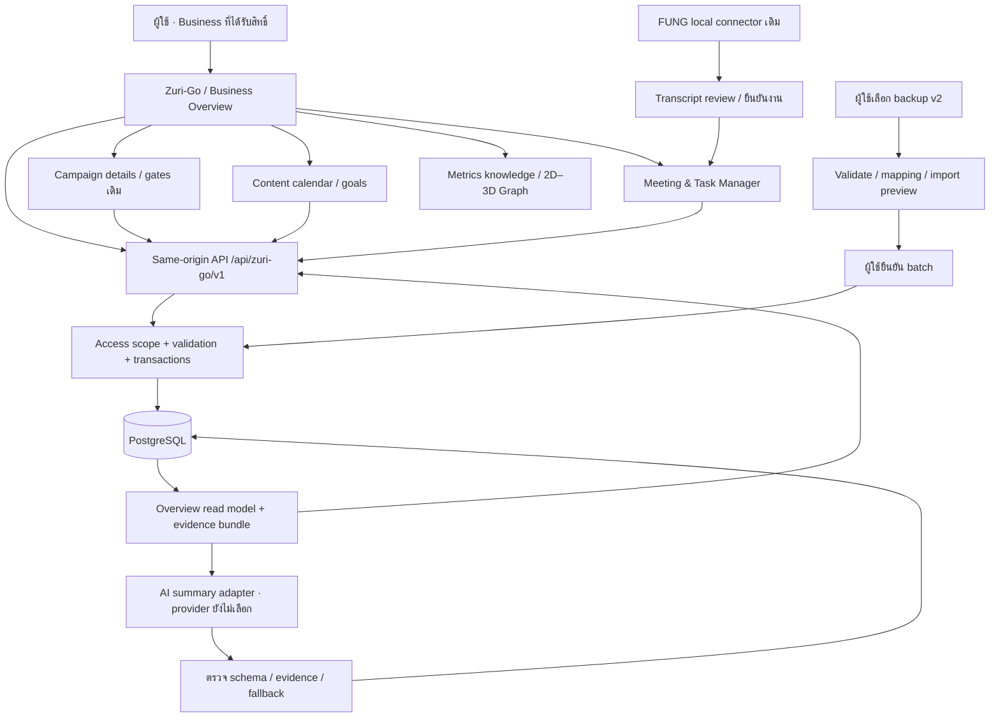
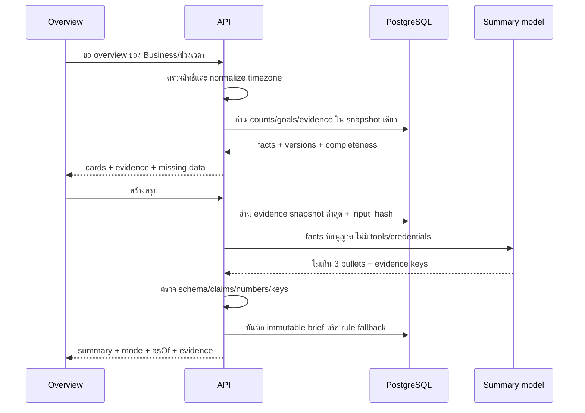

# Zuri-Go — architecture, transition and verification

ขอบเขตตาม [Overview](../features/FEAT-001-business-overview/spec.md) และ [Data model](ARCH-002-postgresql-data-model.md) การออกแบบนี้ไม่แสดงว่ามี PostgreSQL/AI provider เชื่อมต่อแล้ว

## 1. Current → proposed

ปัจจุบัน: Vercel static site เดียว; Dashboard app ID เดิม; Campaign เก็บ localStorage; Meeting/Tasks/Members/Transcript revisions เก็บ IndexedDB; knowledge/graph เป็น static guide ใต้ `/metrics/`

เป้าหมาย: หน้าเว็บและ API ใช้ origin เดียว; PostgreSQL เป็น source of truth เมื่อย้าย workspace สำเร็จ; browser state เก็บเพียง filter/presentation ไม่ถือเป็น replica ที่ sync เอง ไม่มีการออกแบบ offline multi-master ในรอบนี้

ไม่มี browser→PostgreSQL connection string และไม่มี AI→database write access สำหรับเปลี่ยนแคมเปญ/งาน โมเดลรับ evidence ที่ API จัดให้เท่านั้น

## 2. สิ่งที่เปลี่ยนที่แต่ละ layer

| Layer | เปลี่ยน | รักษา |
|---|---|---|
| Product/brand | Zuri-Go name/tagline + Business Overview | brand tokens/mascot identity; human-only asset promotion |
| Authored UI | business overview, content list/calendar, goal setup/actual, campaign drill-down | public component API, shell menus/themes/source inspection |
| Existing campaign model | hydrate relational header + legacy detail; เพิ่ม lifecycle แบบ explicit | measure/evaluate/normal-first DESTINY rules และ reviewed plan |
| Data access | server repository API หลังย้ายข้อมูล | app ID เดิม; export/backup ก่อน migration |
| Meeting domain | map member/task/week/evidence ไป typed PostgreSQL tables | RACI confirmation, MoSCoW per week, draft/review/commit boundaries |
| Guide/graph | product label/navigation ใหม่ | metrics definitions, 18 pages, spherical nodes, texture, 2D/3D, hover/details |
| Build/deploy | package API server boundary + static guide; deployment configuration หลังเลือก runtime | Vercel project เดิมถ้าใช้ server mode บน Vercel; ไม่ใส่ secrets ใน static manifest |

## 3. API contract proposal

ทุก endpoint business-scoped; server ตรวจสิทธิ์จาก session/access context แล้วเทียบ path business ID ไม่รับ business_id จาก client เป็นหลักฐานสิทธิ์เอง

| Route | หน้าที่ |
|---|---|
| GET `/businesses/:id/overview?period=week&date=YYYY-MM-DD` | metrics/campaigns/goal progress/attention/upcoming/evidence/data quality จาก read snapshot เดียว |
| GET/POST/PATCH `/businesses/:id/campaigns[/campaignId]` | campaign metadata และ explicit lifecycle; legacy details ใช้ validated subresource |
| GET/POST/PATCH `/businesses/:id/content[/contentId]` | content master/approval/planning month |
| GET/POST/PATCH `/businesses/:id/publications[/publicationId]` | schedule/reschedule/published confirmation; API ไม่ทำ social dispatch |
| GET/POST/PATCH `/businesses/:id/goals[/goalId]` | period/scope/target/owner และ versions |
| POST `/businesses/:id/observations` | บันทึก actual หรือ correction revision ตาม metric policy |
| POST `/businesses/:id/briefs` | สรุป evidence ล่าสุดแบบ on-demand; return mode/status/asOf/evidence/hash |
| GET/PATCH `/businesses/:id/tasks[/taskId]` และ Members/WeeklyPlan resources | ใช้ meeting domain contract เดิมผ่าน repository ใหม่ |
| POST `/businesses/:id/imports/preview` และ `/imports/:id/commit` | validate/mapping/counts/warnings ก่อน transaction commit |

Mutation ต้องมี expected row_version สำหรับ update, idempotency key สำหรับ create/commit สำคัญ; optimistic conflict → 409 ให้เปิดข้อมูลล่าสุด ไม่ last-write-wins เงียบ ๆ; validation → 422; unauthorized → 401/403; network failure ไม่เปลี่ยน UI เป็น saved

Overview response แต่ละ metric มี `{value,unit,scope,period,asOf,coverage,status,evidenceRef}`; `value:null` แสดงรอข้อมูล, 0 แสดงศูนย์ที่ยืนยันแล้ว; selected period กับ card real-time ระบุคนละ label

## 4. PostgreSQL/access boundary

- สร้าง schema/database ใหม่แยกจากระบบอื่น ไม่สร้าง table ใน FUNG หรือ zuri-ai
- User runtime DB role ไม่ใช่ owner/superuser และไม่มี BYPASSRLS; enable+force RLS สำหรับ business tables พร้อม scoped policies; FK business boundary บังคับอีกชั้น ไม่ใช่แค่ frontend filter
- อ่าน/เขียนผ่าน authenticated API หรือ local private runtime ที่จำกัดให้เครื่องเดียวเท่านั้น ใน public Vercel URL ปัจจุบันห้ามเพิ่ม endpoint อ่าน/เขียนข้อมูลจริงแบบ anonymous
- PostgreSQL table owner และ BYPASSRLS roles สามารถข้าม RLS ได้ จึงต้องแยก migration/admin role จาก app runtime. [PostgreSQL Row Security](https://www.postgresql.org/docs/17/ddl-rowsecurity.html)
- หาก API ใช้ request-local business context ต้อง derive จาก trusted access decision และตั้งภายใน transaction; ห้ามปล่อย pooled connection เก็บ business context ข้าม request และห้ามให้ client เลือก SQL/session setting
- Members เป็นทะเบียนชื่อ ไม่มีสิทธิ์ login ที่เกิดจากการเลือกชื่อ Chef/Boss/Tong/K’jeab. Access control สำหรับ DB production เป็นเรื่องแยกจาก Member และต้องเลือกก่อนเปิดใช้ข้อมูลจริง
- เก็บ DATABASE_URL, AI credentials และ provider tokens เฉพาะ environment ฝั่ง server; dashboard snapshots/public output มีเฉพาะ reference content ไม่บรรจุ private database rows
- Query/business snapshot มี request scope; cache key รวม business/filter/evidence revision; AI read model ไม่รวม phone/email/transcript

รุ่นแรกออกแบบให้ทำ local PostgreSQL + private API validation ได้ก่อน ไม่ต้องสมัครบริการหรือเพิ่ม member login โดยอัตโนมัติ การเลือก managed PostgreSQL/AI provider และเจ้าของสิทธิ์ production เป็น input ก่อนขั้นเชื่อมจริง

## 5. Import และ source-of-truth transition

1. Export backup v2 จาก browser ต้นทางที่ผู้ใช้เลือก เก็บ SHA256/backup schema version และ immutable backup นอก public artifact
2. เลือก Business ปลายทาง; source namespace ใหม่หนึ่งครั้งต่อ workspace ต้นทาง ไม่ใช้ไฟล์ชื่อเหมือนกัน/ชื่อสมาชิกเป็น identity
3. Dry-run ตรวจ schema/hash/references, วันที่/ต้นทุน/qualification, member/task/week links, source/review/batch receipts และแจ้ง field ที่ไม่มี mapping
4. สร้าง typed headers/accounts/members/campaign IDs และ mapping; legacy campaign channel labels ที่กำกวมต้องให้ resolve ไม่ merge Facebook ทุกเพจเป็นบัญชีเดียว
5. เก็บ campaign detail เดิมใน versioned compatibility table; ย้าย tasks ทั้งจาก campaign เดิมและ Meeting ไป canonical tasks โดยยึด (source namespace, entity type, legacy ID); ไม่ merge งานชื่อเหมือนกันเอง
6. Map `sources/reviews` → meeting_revisions kind source/review, `batches` → meeting_draft_batches, `receipts` → batch commit key/hash + meeting_task_links, `events` → change_events; preserve original local-operator actor label ไม่ย้อนอ้างว่าเป็น authenticated person
7. Import preview แสดงจำนวน entity, target versions, net revenue/units/sample metrics ก่อน/หลัง, unmapped fields และ unresolved states; confirm แล้ว commit ทั้ง batch ใน transaction เดียว
8. ข้อมูลไม่มี lifecycle → unconfirmed; owner text ที่ยังไม่ bind member → เก็บ original ใน migration reportและให้ resolve; ไม่เดา active/queued จาก record/date. คอนเทนต์/goals/follower actual ที่ไม่มีใน backupยังว่าง
9. Re-import backup SHA/source namespace เดิม → คืน receipt เดิม; payload เปลี่ยนแต่ legacy ID เดิม → conflict preview ไม่ overwrite อัตโนมัติ
10. เปลี่ยน workspace mode เป็น server เฉพาะหลัง verification; local store เดิมเก็บอ่าน/backup ได้และหยุด dual-write. Failure ก่อน commit rollback ทั้ง batch; หลัง server มีข้อมูลใหม่ rollback ต้อง export server state ก่อน ห้ามกลับใช้ local เก่าแล้วทิ้งงานใหม่

การ migrate transcripts ไป cloud เป็นการส่งเนื้อหาไปปลายทางใหม่ ต้องให้ผู้ใช้เลือกและเห็น scope นั้นก่อน; หากไม่เลือก ยังใช้ FUNG/meeting แบบ local จนพร้อมย้าย ไม่ส่งโดยติดมากับ campaign import เงียบ ๆ

Mapping manifest ต้องระบุสถานะเก่า เช่น campaign task `Done` → canonical `done` และ mapping ย้อนกลับที่ hydrator ใช้ รวม confirmation flags ของ RACI/MoSCoW และ source mode ให้ครบ ไม่ infer confirmed จากแค่มีชื่อ Native FUNG segment IDs, source/review hashes และ canonical transcript content ต้องคงเดิม; UUID remapping เป็น database identity แยกจาก source identity การตรวจ hash หลัง import ต้องใช้ source contract เดิม

## 6. Read model และ AI sequence

ถ้า model result กลับมาหลังผู้ใช้สลับ Business/period ต้องไม่แสดงบน scope ใหม่ และหาก hash ล่าสุดเปลี่ยนต้องมี stale label ไม่ใช้ timestamp generatedAt แทนข้อมูลสดจริง

## 7. Implementation order หลังอนุมัติ

1. ทำ migrations/schema + small fixture dataset ในฐานข้อมูลทดสอบ; verify constraints/RLS/business boundary ก่อนรับข้อมูลผู้ใช้
2. API repository + mapping/import dry-run; ใช้ model regression เดิมเทียบกับ hydrated campaign objects
3. Business Overview + campaign drill-down + name/tagline โดยคง app identity; จัด content/goals entry flows ให้อัปเดตข้อมูลที่ card อ่านจริง
4. Content master/approval/schedule และ goal actual entry พร้อม timezone/freshness/corrections
5. AI brief evidence contract + deterministic fallback; ต่อ model จริงเมื่อ provider/ข้อมูลที่จะส่งได้รับเลือกแล้ว
6. Browser QA desktop/mobile + DB integration + import rehearsal; เลือก production access และ PostgreSQL destination ก่อนเชื่อม/deployข้อมูลจริง

ไม่ deploy production connection ระหว่างที่ยังไม่มี access boundary หรือใช้ placeholder database; UI demo ระหว่างพัฒนาแสดง “ข้อมูลตัวอย่าง” ชัดเจนและไม่ทับ data จริง

## 8. Tests / architecture review required

| Area | Test |
|---|---|
| Business scope | API rejects ID of another business; DB rejects cross-business parent/member/channel links; pooled requestsไม่รั่ว scope |
| PK/FK | orphan rejected; member inactive ไม่ cascade tasks; R/A partial UQ ทำงาน; migration ID collisions remap ครบ |
| Counts | active/queued/unconfirmed/paused และ archived; same content on3channels → 1piece/3publications; overdueไม่รวมupcoming |
| Goal time | Monday boundary, month boundary, weekคาบเดือน, timezone offsets, current snapshot vs period baseline |
| Goal value | missing≠zero; -20/500, 620/500, partialaccounts, stale; aggregateaccountsumไม่claimuniquepeople |
| Duplicate/correction | import retries, publication double-submit, source observation revision; no overlapping flow intervals or double aggregate grains |
| Concurrency | two editors row_version conflict; batch commit crash rollback; one current observation per series/time |
| Legacy parity | 63 existing campaign/meeting tests + hydration/import totals before/after; targets/offers/date/accounting rules preserved |
| FUNG | source/review hash stale rejection, immutable quote lineage, commit retry returns same task IDs; live connector testแยกเมื่อruntimeพร้อม |
| AI | fakeevidence/numbers rejected, promptinjection in source title treated asdata, failure label rule_based, wrongscope late response discarded |
| Frontend | cards link to matching filters, createcontent/goals updatesoverview, mobile/keyboard/mascots, empty/loading/error states |
| Deployment | server secrets absent from public files; unauthorized read/write rejected; DB backup/restore rehearsal; actual hostedroutes verified |

## 9. Open inputs ที่ไม่ต้องเดาเพื่อทำแบบให้เสร็จ

- Business/account scope และรอบวันที่สำหรับ weekly target 500 จริง
- Monthly targets ของแต่ละธุรกิจ; ไม่มีการตั้ง 2,000 โดยคูณ 4 แทนผู้ใช้
- PostgreSQL destination และ access mode สำหรับ production; ยังไม่ตั้ง provider/สร้าง subscription
- AI provider และอนุญาตข้อมูลใดส่งออก; local-only FUNG เดิมไม่อนุญาต cloud summaryโดยอัตโนมัติ
- Workspace/backup ที่จะ migrate และว่าจะรวม transcript revisions ด้วยหรือไม่

รายการนี้ต้อง resolve ก่อน operation ที่เกี่ยวข้อง แต่ไม่ขวางการ review layout/data model ในชุดเอกสารนี้

## 10. Review receipt

- อ่าน parent/peer/source จริงตามรายการใน Overview spec
- ตรวจ reference image แล้ว; ใช้เพียง visual direction และชื่อ/taglineที่ผู้ใช้สั่ง ไม่ดึงข้อความอื่นในภาพมาเป็น requirement
- กำหนด grain, count semantics, time boundaries, PK/FK/business isolation, missing values, AI evidence และ migration rollback แล้ว
- ยังไม่ได้รัน SQL, migration, RLS, UI prototype หรือ production checks ของ Zuri-Go design นี้; acceptance tests ในตารางเป็นแผนตรวจ ไม่ใช่ผล PASS
- ตรวจ local document links ของทั้งสามไฟล์แล้ว ไม่พบปลายทางขาด; code fences จับคู่ครบ มี ER diagram 1 ชุดและ architecture/sequence diagrams 2 ชุด; reviewed table catalog มี 25 ตาราง รวม domain เดิมและ migration metadata ไม่ใช่ 25 หน้า UI ใหม่
- Version diff อยู่ใน Overview spec; รออนุมัติ documentation ก่อนสร้าง code ตาม R5/SOP

Implementation approval: ผู้ใช้ยืนยัน “spprove” (approve) วันที่ 30 กันยายน 2026; เริ่ม implementation ตามแบบนี้ ยังไม่ย้าย private data หรือเลือก cloud provider อัตโนมัติ
