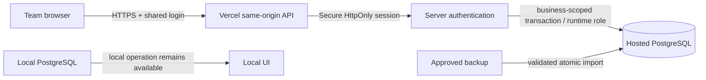

# Zuri-Go PostgreSQL on Vercel — 0.3.0

Status: implemented and deployed; [verification and limits](../history/zuri-go-cloud-review/verification.md).

Date: 2026-09-30. Complexity: C-3. Risk: HIGH.
Authority: user requested importing the attached latest state and deploying the PostgreSQL version to Vercel; user selected one shared team password. This amends the approved local-only deployment boundary; member profiles remain separate from authentication.
Parent: [Architecture](ARCH-001-baseline-architecture.md). Peers: [Overview](../features/FEAT-001-business-overview/spec.md), [Data model](ARCH-002-postgresql-data-model.md), [Unified site](../features/FEAT-008-unified-site/spec.md), [Logo correction](../features/FEAT-009-logo-placement/spec.md).

## Source and import
- Explicit source: `C:/Users/pc/Downloads/mission-control-backup-2026-09-30 (3).json`.
- File SHA256: `2bb504ad273595858c84af4f8b6ce7e94f414e5f6e364b88e8ec2678d907b938`.
- Backup v2, existing app ID; 1 campaign, 11 Task Manager tasks, 4 members, 1 weekly plan, 45 events, no meetings/transcripts. Count campaign-local tasks separately during reconciliation.
- Import with existing validation/transaction/receipt mechanism into the verified empty local Business; full local backup precedes mutation. Preserve original source and browser data. Cloud import uses the same backup contract into a new empty production Business. No automatic overwrite of occupied databases.

## Architecture

## Runtime contract
- Keep the existing UI, metrics guide/graph, stable app ID and production project `zuri-metrics-map`.
- Use hosted PostgreSQL reachable from Vercel. Reuse an existing project-linked database if appropriate; otherwise present the actual provider/free-tier provisioning step before any cost/terms commitment.
- Shared team login gates all private API reads/writes. Hash the shared password; sign expiring Secure/HttpOnly/SameSite cookies. Check same-origin requests and rate-limit failed authentication persistently. Logout clears the session. Shared credentials do not prove which member performed an action.
- Deploy no user backup, private rows, local configs or credentials as static files. Use server environment variables for runtime DB credentials and authentication secrets. Migration owner and restricted runtime roles remain separate; preserve business-scoped RLS.
- API must fail closed if production configuration is incomplete. Hosted mode loads the server workspace automatically; do not silently save business state only in browser storage after an API failure.
- Reuse domain service behavior and local loopback boundary. Serverless request handling cannot depend on persistent local files; stage import data in PostgreSQL or keep one-time production import as a trusted operator task outside public import endpoints.
- FUNG on a user's local machine is not made cloud-accessible by this deployment. AI stays rule-based unless separately configured.

## Acceptance
1. Import receipt and exact row/relationship reconciliation for supplied state; no data loss, duplicate tasks or fabricated active campaign status.
2. Anonymous API read/write denied; valid shared login works; invalid/expired session denied; logout and cross-origin write rejection verified.
3. Production saves to PostgreSQL; update a disposable QA record and read it from a fresh session, then remove/archive only that test record.
4. Verify local regression tests, auth tests, build, asset/secret packaging, hosted main/metrics/graph routes and real production persistence.
5. Report deployment URL/ID and verified state counts; do not claim completion until hosted persistence succeeds.

## Authentication data model amendment
Migration 003 adds `team_login_limits`: composite PK `(business_id, bucket)`, FK `business_id → businesses.id`, integer attempt count and `resets_at` timestamp. Business-scoped RLS is enabled and forced. A global bucket and a bounded hashed-client bucket count attempts atomically in PostgreSQL; raw IP addresses and entered passwords are not stored. There are now 26 application tables.

Hosted imports are trusted operator tasks using the existing import contract. Public hosted import endpoints are disabled because their local staging files are not persistent serverless storage. Shared team auth uses the existing `authenticated` audit kind with subject `shared_team`.

## 0.3.1 access amendment
The user replaced mandatory login for reading with public Guest read-only access. [Guest access and attachments](../features/FEAT-005-guest-access/spec.md) supersedes the read-access rule above; authenticated write, origin, session and rate-limit rules remain. Migration 004 adds task evidence bytes to PostgreSQL.

## 0.4.0 approved identity amendment
The approved [Member identity contract](../features/FEAT-006-member-identity/spec.md) supersedes all shared-password/session assumptions above. Guest reads remain public. Writes require PID + individual password, a versioned Member cookie, and a current active/enabled credential checked in the same PostgreSQL transaction as the write. The API derives the audit actor from that session. Migration 005 preserves Member UUIDs, adds immutable Business-scoped PIDs, credentials and actor references. Provisioning/reset is a trusted local operator action; no credentials ship to the browser or static package. The obsolete shared-password environment variable is removed at rollout after verifying individual access. The local loopback workspace remains explicitly local-operator access. [Release verification](../history/zuri-go-member-review/verification.md) records the exact rollout status.

## 0.4.2 login amendment

Approved [single-code login](../features/FEAT-007-single-code-login/spec.md) supersedes PID + password input: the user enters one masked **รหัสระบุตัวตน**. Existing personal codes remain valid; the server resolves exactly one active/enabled owner across all Business credentials. PID remains a stable internal/public member identifier and audit identity. Guest access, sessions, RLS and schema remain unchanged. See [verification](../releases/0.4.2/verification.md).

## Hosted deployment after 0.5.0 (amendment, 2026-10-01)

Added after releases [0.5.0](../releases/0.5.0/verification.md) and [0.5.1](../releases/0.5.1/verification.md); the text above is unchanged. Production runs PostgreSQL **schema 7** (`006_visibility.sql`, `007_tasks_projects.sql`, applied at the 0.5.0 release; 0.5.1 carried no migration). The architecture, the same-origin API, the Vercel project binding and the Guest, session and write rules above stand; what changed is the packaged code and the way a release is made.

### Hosted package
- `scripts/deploy/build_cloud.py` is the allowlist; it copies only the listed files and fails on any file outside its expected set. The API modules now include `viewer.mjs`, `audience.mjs`, `teams.mjs`, `tasks.mjs`, `projects.mjs`, `campaign-tasks.mjs` and `meeting-commit.mjs` beside the earlier `api.mjs`, `cloud.mjs`, `config.mjs`, `db.mjs`, `http.mjs`, `service.mjs`, `workspace.mjs`, `team-auth.mjs`, `attachments.mjs` and `member-auth.mjs`. Authored modules shared with the browser are packaged too: `shared/model.mjs`, `shared/visibility.mjs`, `shared/task-rules.mjs`, `meeting/model.mjs` and `business/model.mjs` under `apps/web/src/content/`. Read the script for the current list rather than this paragraph.
- Operator scripts (`migrate.mjs`, `provision-members.mjs`, `backfill-workboard.mjs`, `backup-local.mjs`, `setup-local.mjs`, `server.mjs`) are not packaged; the hosted function is `api/index.mjs`, which re-exports `cloud.mjs`.
- Every read resolves a viewer and row-level security enforces visibility ([FEAT-011](../features/FEAT-011-visibility-and-confidential-meetings/feature.md)); production Guests read public items only, and Member profiles are limited for Guests since 0.5.1. Meeting tasks commit on the server (`meeting-commit.mjs`); `PUT /workspace` refuses receipts the server did not write.

### Release procedure used for 0.5.0 and 0.5.1
The runbook is [RB-001, “Production release procedure”](../operations/RB-001-runbook.md); each step needs the owner's authorization for that release, and no connection string is printed or stored in the repository. In order:
1. `npm run build` and `npm test` on the release commit.
2. Read-only production checks: schema version, row counts of every table of the Business, backfill dry run.
3. Production backup with `pg_dump` 18 (matching the server major), `--no-owner --no-privileges`, kept privately under `.local/backups/`. The 0.5.0 dump was restored once into a throw-away PostgreSQL 18 container and its counts matched ([restore drill](../releases/0.5.0/restore-drill.md)); that is not a production restore.
4. Staged deployment: `vercel deploy --prod --skip-domain`; the public domain does not move. Verify the unique URL with authenticated Vercel access.
5. Migration, only when the release carries one (0.5.0 did, 0.5.1 did not): `apps/api/migrate.mjs` with the admin connection supplied for that one process, after the staged deployment and before promotion, because code and schema must match. For 0.5.0 `migrate.mjs` had no production guard and the host was checked by hand; since PLAN-003 R3 it takes `--cloud` and refuses a non-local target without it ([RB-001](../operations/RB-001-runbook.md)).
6. Hosted checks on the unique deployment, then `vercel promote`, then the same checks on the public URL and the count comparison. Record the deployment ID, URLs, HTML digest and what was not run under `docs/releases/<version>/`.

There is no down-migration. Promoting the previous deployment does not restore previous behavior on a migrated schema; the fallback is to fix forward ([0.5.0 rollback](../releases/0.5.0/verification.md)). The 0.5.1 rollback target is the first 0.5.1 deployment, on the same schema ([0.5.1 record](../releases/0.5.1/verification.md)). Deployment is not authorization to migrate, restore or roll back.
