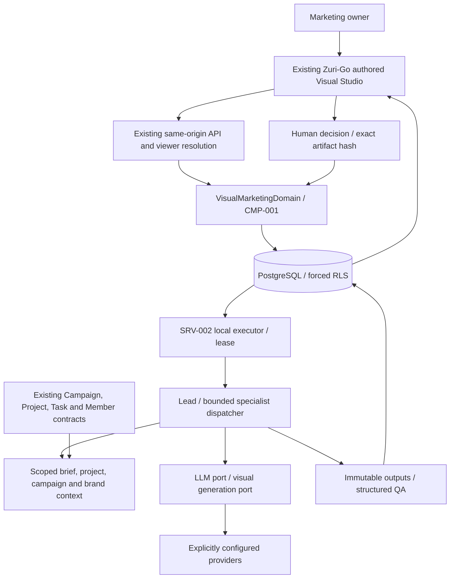

# ARCH-004 — Visual Marketing Domain Architecture

## Authority and evidence

Initial source audit based on main f8026a81518ec6454548cb262a1f3bc1e758af20, application 0.5.1, checked 2026-10-02. Source migrations end at 007; this is not a live database inspection. Parent PRD-001 and architecture amendments, peer FEAT-007/010/011, API-001/005/010/017, DOM-BRN and apps/web/AGENTS.md remain authoritative. Old shared-password/local-only text does not override current identity/visibility contracts.

Inspected boundaries: apps/api/api.mjs routes; db.mjs resolves a viewer and sets transaction-local Business/viewer context; viewer.mjs refuses hosted operator principals; migrations 006/007 enforce audiences and Business composite FKs. service.mjs contains narrow optional loopback Ollama evidence selection, not a general agent abstraction. Preserve that summary's no-cloud-fallback behavior.

## Context and ownership

DOM-BIZ/DOM-IAM supply Business/viewer identity, DOM-TSK supplies existing Project/Task context, DOM-CAM supplies campaign references. DOM-VIS is a downstream reader in the first slice. DOM-BRN retains product brand authority. CreativeProject extends projects.id; production stage never replaces project.status. A BrandProfile is a brief-context snapshot, not a new brand authority. Future campaign asset writes must go through an approved DOM-CAM contract. No direct writes to content_items or metrics.

## Security and execution

Context is built only from viewer-readable records. Jobs recheck originator authorization, credential version and project audience at claim and commit. Revocation cancels further work. Persisted originator metadata is server-derived. The local executor uses the explicitly trusted operator and restricted DB role; models have neither principal construction nor database access.

Hosted execution would require a durable scheduler and a trusted originator-revalidation mechanism; neither is installed here. No hosted runnable job is accepted without them. Function maxDuration and protected runtime remain unchanged. Provider calls happen outside DB transactions; PostgreSQL stores job state and lease fencing.

Prompt text, URLs and generated data are untrusted. Validate output schema, size and references; escape text through React; never run returned code or render provider HTML. Effective tools = role allowlist intersect run authorization intersect current viewer access. No shell, arbitrary path, SQL, MCP installer or model-selected provider endpoint. Keys stay server-side and out of prompts/events/DTOs.

Initial research uses structured user evidence, not open web fetching. Future research.fetch stays disabled until it enforces HTTPS/host/IP rules, redirect revalidation, private/link-local/metadata address denial for IPv4/IPv6, DNS/connect protections, content and byte limits. Operator-configured loopback Ollama is a separate fixed endpoint exception, never inferred from a reference URL.

## Rollout

After document approval: AC tests, additive migration review against refreshed main, isolated QA database, local build/regressions and browser checks. A migration file is not permission to execute it on the user's database. No cloud migration, deploy, promotion, credential rotation or visibility change.

See [upstream inventory](visual-marketing/upstream-analysis.md), [provenance and audit](visual-marketing/upstream-provenance.md), and [data amendment](visual-marketing/data-model.md). API/job details are canonical in the domain contracts and SDD; this architecture does not duplicate them.

Owner approved this architecture on 2026-10-02. The implementation is rebased on main `9e224c851b6c5c2b25232d41e183bf8623b5bb7a`; migration source now includes 008, applied only to isolated QA. [Verification](../features/FEAT-014-visual-marketing-team/verification.md) distinguishes local evidence from unperformed hosted/production checks.
