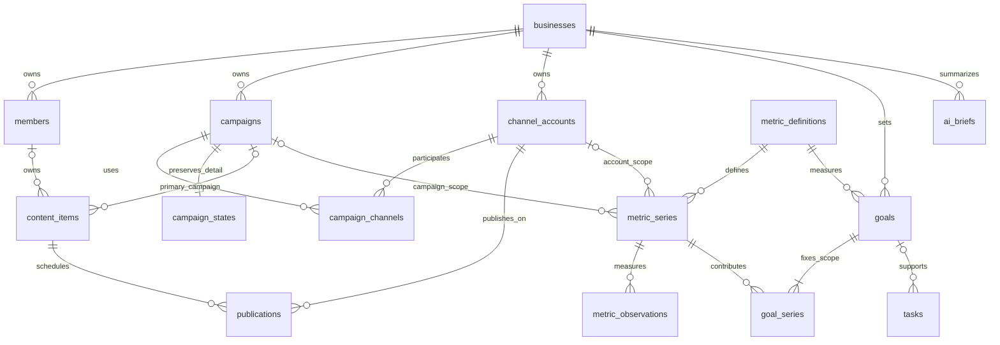

# Zuri-Go — PostgreSQL data model

อ้างอิง [Overview contract](overview-spec.md) และ [Architecture](architecture.md) นี่คือ physical schema design สำหรับ review ยังไม่มี executable DDL/migration และยังไม่ได้สร้างฐานข้อมูลจริง

## 1. กติกาข้อมูลร่วม

- เป้าความเข้ากันได้ PostgreSQL 17 ขึ้นไป ไม่ต้องใช้ extension สำหรับ ID; entity PK ใช้ `uuid` และเสนอ default `gen_random_uuid()` ไม่ใช้ชื่อ, email หรือเลขลำดับ UI เป็น PK. [PostgreSQL UUID](https://www.postgresql.org/docs/17/functions-uuid.html)
- รหัสอ่านง่าย เช่น `CAM-0001`, `CNT-0001`, `TSK-0001` เป็น `code text` UNIQUE ต่อ Business สร้างด้วย counter ที่ lock ใน transaction; ไม่ใช้ `MAX(code)+1` และไม่ใช้ code แทน FK
- ทุกตาราง business-owned มี `business_id uuid NOT NULL FK → businesses.id`; entity ที่ลูกอ้างข้ามตารางมี UNIQUE `(business_id,id)` เพิ่มจาก PK เพื่อทำ composite FK ป้องกันการเชื่อมข้อมูลคนละธุรกิจ
- FK child → parent ใช้ `(business_id,parent_id)` → `(business_id,id)` เสมอ; ตาราง global catalog `metric_definitions` เป็นข้อยกเว้น ไม่มี business_id
- ทุก mutable entity มี `created_at timestamptz`, `updated_at timestamptz`, `row_version bigint` เริ่ม 1; update ตรวจ expected version และเพิ่ม version ใน transaction. Immutable facts/revisions/receipts มี created_at แทน updated_at
- วันปฏิทินใช้ `date`; เวลาเกิดจริง/กำหนดลงใช้ `timestamptz`; timezone IANA เช่น Asia/Bangkok เก็บแยก เพราะ timestamp เก็บ instant ไม่รักษาชื่อ zone เดิม. [Date/time](https://www.postgresql.org/docs/current/datatype-datetime.html)
- เงินใช้ `numeric(18,2)` + `currency char(3)`; เป้า/ค่าที่อาจมีทศนิยมใช้ `numeric(20,4)`; counts ต้องเป็นจำนวนเต็ม; phone/external ID ใช้ text
- `NULL` = ยังไม่รู้/ยังไม่ตั้งค่า; 0 = ยืนยันว่าเป็นศูนย์; ห้ามเปลี่ยน NULL เป็น 0 ก่อนคำนวณ completion
- สถานะใช้ text + CHECK ในรุ่นแรกเพื่อแก้ vocabulary ผ่าน migration ได้ง่าย; NOT NULL ต้องแยกจาก CHECK; partial UNIQUE/FOREIGN KEY ใช้สำหรับกฎข้ามแถว ไม่ใช้ CHECK อ่านตารางอื่น. [Constraints](https://www.postgresql.org/docs/17/ddl-constraints.html)
- สถานะ archived/inactive เก็บแบบย้อนกลับได้; default `ON DELETE RESTRICT` สำหรับ parent ที่มีงาน/หลักฐาน ไม่ cascade ลบคนแล้วทำให้งานหาย
- JSONB จำกัดที่เอกสาร immutable, AI evidence, legacy compatibility และ change payload; business keys/relationships/status/schedule/goal อยู่ใน typed columns
- ตาราง overview ไม่เก็บ counter ซ้ำ เช่น `active_campaign_count`; คำนวณจาก source rows เพื่อไม่เกิด drift

สัญลักษณ์ด้านล่าง: `?` nullable, PK primary key, FK foreign key, UQ unique. Common columns ข้างต้นใช้ร่วมโดยไม่เขียนซ้ำทุกแถว

## 2. ER diagram — ธุรกิจ แคมเปญ คอนเทนต์ และเป้าหมาย



FK ที่เป็น optional ใน ERD ไม่ได้แปลว่า key ข้ามธุรกิจได้; composite business FK ยังคงบังคับทุกเส้นตามกติกาข้างต้น

## 3. Core tables

### 3.1 `businesses` — ธุรกิจหนึ่งแห่ง

| Column | Type / key | ความหมาย |
|---|---|---|
| id | uuid PK | identity ธุรกิจ |
| name | text NOT NULL | MUJEEN เป็นต้น; ชื่อ product Zuri-Go ไม่ใช่ชื่อ business |
| slug | text UQ NOT NULL | slug ไม่ใช่ authorization token |
| timezone | text NOT NULL | ค่าเริ่มต้น Asia/Bangkok; ตรวจ IANA ฝั่ง service |
| currency | char(3) NOT NULL | THB เป็นค่าเริ่มต้น |
| week_starts_on | smallint NOT NULL CHECK =1 | Monday ในรุ่นแรก |
| archived_at | timestamptz? | ปิดใช้งานแบบกู้ได้ |
| next_campaign_no / next_content_no / next_task_no | bigint NOT NULL | counters สำหรับ code; lock business row ตอน allocate |

### 3.2 `members` — ทะเบียนชื่อคนทำงาน

`id uuid PK`, `business_id FK`, `display_name text NOT NULL`, `full_name text?`, `nickname text?`, `team text?`, `position text?`, `email text?`, `phone text?`, `notes text?`, `status text CHECK active/inactive`.

ชื่อซ้ำได้และไม่ auto merge ตามชื่อ/email; stable ID คือคนที่ task อ้าง Member ไม่ใช่ authenticated user และไม่ใช่หลักฐานว่าเจ้าตัวเป็นผู้แก้ข้อมูล

### 3.3 `channel_accounts` — เพจ/บัญชีหนึ่งรายการ

`id uuid PK`, `business_id FK`, `platform text NOT NULL` (facebook/instagram/tiktok/line/website/other), `display_name text NOT NULL`, `external_account_id text?`, `url text?`, `status text active/inactive`, `default_freshness_hours integer >0`.

UQ `(business_id,platform,external_account_id)` เมื่อ external_account_id ไม่ NULL. ไม่มี access token ในตารางนี้; credentials เป็น server secret แยกต่างหากเมื่อมี integration ที่ได้รับอนุมัติ

### 3.4 `campaigns` — ตัวแคมเปญและ lifecycle

`id uuid PK`, `business_id FK`, `code text`, `name text NOT NULL`, `objective text NOT NULL`, `lifecycle text NOT NULL`, `owner_member_id uuid? FK members`, `planned_start date?`, `planned_end date?`, `actual_started_at timestamptz?`, `actual_ended_at timestamptz?`, `currency char(3)`, `archived_at timestamptz?`.

- UQ `(business_id,code)`; objective คง inventory/commerce/leads/awareness; lifecycle CHECK `unconfirmed/draft/queued/active/paused/completed/cancelled`
- start ≤ end เมื่อมีทั้งคู่; actual_end ≥ actual_start; การเปลี่ยน active ต้องมี actual_started_at; queued ต้องมี planned_start
- lifecycle จากข้อมูลเก่าที่ไม่มีสถานะให้ unconfirmed ไม่ infer จากวันที่/records
- ย้ายชื่อ/objective/owner/วันที่เป็น authoritative columns ที่นี่; current selected campaign เป็น UI preference ไม่อยู่ใน business table

### 3.5 `campaign_channels` — ช่องทางที่แคมเปญใช้งาน

PK `(business_id,campaign_id,channel_account_id)`; composite FKs → campaigns และ channel_accounts; `created_at timestamptz`.

### 3.6 `campaign_states` — compatibility ของรายละเอียด Campaign เดิม

PK `(business_id,campaign_id)` และ FK campaigns; `schema_version integer NOT NULL`, `state_json jsonb NOT NULL`, `payload_hash text NOT NULL`, `row_version bigint`, timestamps.

รักษา collections `ads/leads/orders/inventory/decisions/releases/history/reviews/alertActions` และ settings เช่น targets/cap/committed/minSample/BOM/cutoff ที่ใช้ model เดิม ตรวจ payload ด้วย validator เดิมก่อนเขียน และ round-trip ให้ผล measure/evaluate เท่าเดิม

**ไม่มี** canonical id/name/objective/owner/dates หรือ tasks ซ้ำใน state_json หลัง migration; API hydrator ประกอบ header จาก campaigns, tasks จากตาราง tasks. Original backup เก็บนอก runtime เป็น migration evidence ไม่ถูกเสิร์ฟเป็น public asset

เป็น bridge ที่ระบุขอบเขตชัดเพื่อไม่ออกแบบ order/stock system ใหม่ในงาน Overview; การ normalize sales/inventory ledger เป็นงานแยกก่อนเชื่อม ERP ไม่อ้างว่าตารางนี้คือ transaction warehouse ที่ normalize แล้ว

### 3.7 `content_items` — ชิ้นคอนเทนต์หนึ่งชิ้น

`id uuid PK`, `business_id FK`, `code text`, `title text NOT NULL`, `description text?`, `format text?` (image/video/carousel/text/other), `planning_month date NOT NULL`, `campaign_id uuid? FK campaigns`, `owner_member_id uuid? FK members`, `approval_status text NOT NULL`, `approved_by_member_id uuid? FK members`, `approved_at timestamptz?`, `asset_url text?`, `archived_at timestamptz?`.

- UQ `(business_id,code)`; planning_month เป็นวันที่ 1 ของเดือน; status=draft/in_review/changes_requested/approved
- หนึ่งชิ้นผูก primary campaign ได้ 0 หรือ 1 เพื่อไม่ double attribute ในรุ่นแรก; ไม่บังคับทุกโพสต์อยู่ใน campaign
- media bytes ไม่เก็บใน PostgreSQL; asset_url ต้องเป็นแหล่งที่ได้รับสิทธิ์และไม่ฝัง token
- การแก้ข้อความ/media ที่อนุมัติแล้ว invalidate approval และเปลี่ยน publication ที่ยังไม่ลงกลับ draft ใน transaction เดียว โดยคง scheduled_at เป็นเวลาที่เสนอ; UI แจ้งให้ยืนยันใหม่
- Archive content ต้องแสดงรายการ schedule ที่ได้รับผลและเปลี่ยนรายการที่ยังไม่ลงเป็น cancelled ใน transaction เดียว เก็บประวัติ published ไว้; restore content ไม่เปิด schedule กลับเอง

### 3.8 `publications` — รายการลงหนึ่งชิ้นบนหนึ่งช่องทางหนึ่งเวลา

`id uuid PK`, `business_id FK`, `content_item_id uuid FK content_items`, `channel_account_id uuid FK channel_accounts`, `status text NOT NULL`, `scheduled_at timestamptz?`, `published_at timestamptz?`, `external_post_id text?`, `published_url text?`, `failure_reason text?`, `idempotency_key uuid NOT NULL`.

- status=draft/scheduled/published/failed/cancelled; scheduled ต้องมี scheduled_at; published ต้องมี published_at และหลักฐาน link หรือ confirmation note ใน change event
- UQ `(business_id,idempotency_key)` ป้องกัน double submit; UQ `(business_id,channel_account_id,external_post_id)` เมื่อ post ID มีค่า
- ตั้ง scheduled ต้องตรวจ content approved และช่องทาง active; เมื่อ content มี campaign ต้องมี channel ใน campaign_channels; ใช้ transaction/service validation ไม่ใช้ cross-table CHECK
- รีโพสต์เป็น publication ใหม่; reschedule เดิมแก้ row เดิม+event; ไม่มี auto social publish ในเฟสนี้

## 4. Measurement / goals

### 4.1 `metric_definitions` — registry ของ metric ที่อนุญาตให้ตั้ง goal

`code text PK`, `label_th text NOT NULL`, `unit text NOT NULL`, `kind text CHECK stock/flow/derived_delta`, `base_metric_code text? FK metric_definitions.code`, `direction text CHECK higher_is_better/lower_is_better`, `definition_version integer`, `allows_negative boolean`, `integer_only boolean`.

เริ่มจาก `followers_total` stock, `followers_net` derived_delta ของ followers_total, `leads` flow, `net_revenue` flow, `published_posts` flow. Formula เป็น audited code registry ไม่เป็น SQL/expression ที่ client ส่งมา Reference metrics 40 คำยังอยู่ใน guide; ไม่สร้าง observation ปลอมครบ 40 metrics

### 4.2 `metric_series` — metric + ขอบเขต + วิธีรับข้อมูลที่เป็น canonical

`id uuid PK`, `business_id FK`, `metric_code text FK metric_definitions`, `channel_account_id uuid? FK channel_accounts`, `campaign_id uuid? FK campaigns`, `source_kind text CHECK manual/import/campaign_projection/publication_projection`, `source_label text NOT NULL`, `freshness_hours integer >0`, `status text active/inactive`.

- UQ NULLS NOT DISTINCT `(business_id,metric_code,channel_account_id,campaign_id)` ทำให้ metric/scope เดียวไม่สร้าง manual และ import ซ้ำกัน
- followers_total ต้องมี channel_account_id และ campaign_id เป็น NULL; ไม่ระบุว่า follower growth ของ account มาจาก campaign ใดโดยไม่มี attribution
- derived_delta ไม่มี series ของตัวเอง: followers_net goal อ้าง followers_total series แล้วคำนวณ delta
- raw series ที่ campaign=NULL เป็น account/business total ไม่ใช่ผลรวมพร้อมกับลูก campaign; goal scope ต้องเลือกได้เพียงระดับเดียวที่ไม่ซ้อนกัน
- revenue ต้องเป็น currency ของ business; ถ้าข้อมูลคนละ currency ให้รอการแปลงที่มีหลักฐาน ไม่ SUM ตรง ๆ
- ค่า published_posts เป็น projection จาก publications ตาม published_at; ไม่กรอกอีกสำเนาที่ขัดกับ calendar

### 4.3 `metric_observations` — ค่าที่วัดได้จริงและ provenance

`id uuid PK`, `business_id FK`, `series_id uuid FK metric_series`, `effective_at timestamptz NOT NULL`, `period_start timestamptz?`, `value numeric(20,4) NOT NULL`, `coverage text CHECK complete/partial`, `source_ref text NOT NULL`, `collected_at timestamptz NOT NULL`, `recorded_by_member_id uuid? FK members`, `revision integer NOT NULL`, `supersedes_id uuid? FK metric_observations`, `is_current boolean NOT NULL`, `correction_reason text?`.

- stock: effective_at = เวลาที่ stock นั้นอ้างถึง, period_start=NULL; flow: [period_start,effective_at) เป็นช่วงวันปฏิทินของ business หนึ่งวันและต้องครบช่วงก่อน coverage=complete
- UQ `(business_id,series_id,effective_at,revision)`; partial UQ `(business_id,series_id,effective_at) WHERE is_current` เพื่อมี current revision เดียว; flow ห้ามมีช่วงซ้อนกันใน series เดียว
- แก้ค่าด้วย insert revision ใหม่+ปิด is_current เดิมใน transaction ที่ lock series; ไม่ลบทิ้งหลักฐานก่อนแก้; supersedes ต้องอยู่ series/effective_at เดียวกัน ตรวจ service/constraint trigger
- integer_only/negative policy ตาม metric registry; followers_total ≥0, followers_net คำนวณออกมาติดลบได้
- captured/collected_at ไม่ใช่ effective_at: ดึงข้อมูลวันนี้ที่อ้างยอดเมื่อวานต้องบันทึกสองเวลาให้ถูก
- goal delta ต้องมี baseline ที่ effective_at ตรงต้นรอบและ latest ที่ทราบเวลาถึงจริง; ไม่มี boundary ที่เชื่อถือได้ให้ pending/partial ไม่ interpolate หรือเลือกยอดก่อนรอบหลายวันเงียบ ๆ
- Flow coverage ต้องครบทุกช่วงวันที่คาดว่าจะมีข้อมูลก่อนแสดง complete; วันที่ไม่มีแถวไม่เท่ากับ zero day ต้องมีค่า 0 ที่ยืนยันหรือ projection จากชุดข้อมูลที่มี complete watermark
- การรวมหลาย account ต้องมี reporting cutoff ที่สอดคล้องกันก่อนแสดง complete/pace; ถ้า effective_at ต่างกัน ให้แสดง per-account freshness และ aggregate แบบ partial ไม่ผสม timestamp แล้วอ้างว่าเป็นยอด ณ เวลาเดียวกัน

### 4.4 `goals` — เป้าหนึ่ง metric ต่อช่วงและ scope ที่ประกาศ

`id uuid PK`, `business_id FK`, `name text NOT NULL`, `metric_code text FK metric_definitions`, `campaign_id uuid? FK campaigns`, `owner_member_id uuid? FK members`, `period_kind text CHECK weekly/monthly`, `period_start date NOT NULL`, `period_end_exclusive date NOT NULL`, `timezone text NOT NULL`, `target_value numeric(20,4) NOT NULL`, `status text CHECK draft/active/closed/archived`, `change_reason text?`.

- target>0; weekly Monday→next Monday; monthly วันที่1→วันที่1เดือนถัดไป; timezone snapshot ของรอบนั้น
- draft ยังไม่ครบ series ได้; active ต้องมี series และ scope ที่ไม่ overlap; metric ต้องตรงหรือเป็น derived ของ series metric
- ตัวเลข actual/percentage ไม่เก็บใน goals; คำนวณจาก observations/projections ที่อ้างอยู่
- การเปลี่ยน scope/target ใช้ row_version + immutable change_event ก่อน/หลัง; ปิดรอบไม่แก้ period เดิมเพื่อ reuse เป้า ให้สร้าง goal รอบใหม่
- campaign_id NULL=business goal; ถ้ามี campaign_id ต้องไม่ผูก account-only followers โดยแสร้งว่าเป็น campaign-attributed growth

### 4.5 `goal_series` — ขอบเขตข้อมูลที่ใช้คำนวณเป้า

PK `(business_id,goal_id,series_id)`; FKs goals/metric_series; `created_at timestamptz`.

Fixed account set ในรอบเดียว ไม่เอา account เปิดใหม่กลางสัปดาห์มาบวก gain อัตโนมัติ การเปลี่ยน membership เป็น versioned goal edit; current actual ห้ามรวม snapshot ของแต่ละวัน หรือรวม business total กับ campaign subtotal

## 5. งานและคน — ใช้ entity เดิมให้เป็น relational

### 5.1 `tasks`

`id uuid PK`, `business_id FK`, `code text UQ per business`, `title text NOT NULL`, `description text?`, `deliverable text?`, `status text CHECK planned/doing/blocked/review/done`, `status_confirmed boolean`, `due_date date?`, `campaign_id uuid? FK campaigns`, `content_item_id uuid? FK content_items`, `goal_id uuid? FK goals`, `source_kind text CHECK manual/manual-from-meeting/meeting/weekly-plan/campaign-legacy`, `acceptance text?`, `acceptance_proposed boolean`, `evidence text?`, `blocker text?`, `project_label text?`, `dependency_note text?`, `kpi_note text?`, `recheck_date date?`, `source_url text?`, `completed_at timestamptz?`, `archived_at timestamptz?`.

รายละเอียดเติมภายหลังได้ตามข้อกำหนดเดิม ไม่สร้าง task ซ้ำเมื่อเลือกเข้าหลายสัปดาห์; primary campaign/content/goal ที่เลือกต้องไม่ขัด campaign scope กัน; field legacy อื่นต้องมี mapping manifest ก่อน migration ห้ามเงียบ ๆ ทิ้ง

### 5.2 `task_roles`

PK `(business_id,task_id,member_id,role)`; FKs tasks/members; `role text CHECK R/A/C/I`, `confirmation text CHECK proposed/confirmed`, timestamps.

Partial UNIQUE `(business_id,task_id,role) WHERE role IN ('R','A')` ทำให้มี R/A อย่างละไม่เกินหนึ่งคนตาม UI เดิม; C/I หลายคนได้ คนเดียวเป็น R และ A ได้ ช่องที่ยังไม่เลือกเป็นไม่มี row ไม่สร้าง member “รอยืนยัน” ปลอม; A proposed ไม่ถือว่ายืนยันแล้ว

### 5.3 `weekly_plans`

`id uuid PK`, `business_id FK`, `week_start date NOT NULL`, `timezone text NOT NULL`; UQ `(business_id,week_start)`; week_start ต้อง Monday

### 5.4 `weekly_plan_tasks`

PK `(business_id,weekly_plan_id,task_id)`; FKs weekly_plans/tasks; `priority text? CHECK must/should/could/wont`, `priority_note text?`, timestamps/row_version.

MoSCoW อยู่บน membership ของสัปดาห์: task เดิมสัปดาห์นี้ Must สัปดาห์หน้า Could ได้; `NULL`=ยังไม่จัดลำดับ ไม่ใช่ Could/Won’t; lane เป็น task.status ไม่ทำสำเนาสถานะแยกในแต่ละ week

## 6. Meeting/FUNG — รักษา evidence และ idempotency

### 6.1 `meetings`

`id uuid PK`, `business_id FK`, `campaign_id uuid? FK campaigns`, `title text`, `started_at timestamptz?`, `source_instance_id text`, `source_project_id text`, `source_recording_id text`.

UQ `(business_id,source_instance_id,source_project_id,source_recording_id)`; ไม่ใช่ FUNG credential; ไม่เก็บเสียง/ASR model ใน DB นี้

### 6.2 `meeting_revisions`

`id uuid PK`, `business_id FK`, `meeting_id uuid FK meetings`, `kind text CHECK source/review`, `parent_revision_id uuid? FK meeting_revisions`, `content_hash text`, `source_revision text?`, `source_cursor text?`, `source_mode text?`, `schema_version integer`, `segments jsonb NOT NULL`, `coverage jsonb`, `captured_at timestamptz`, `reviewed_by_member_id uuid? FK members`.

Immutable revision; review parent อ้าง source/review ใน meeting เดียว; source metadata/version ของ FUNG คงค่าจริง ไม่สร้าง revision ปลอม Quote/time span เป็น document fields ที่ตรวจ schema และ parent links ก่อน commit; UQ `(business_id,meeting_id,kind,content_hash,parent_revision_id)` แบบ NULLS NOT DISTINCT

### 6.3 `meeting_draft_batches`

`id uuid PK`, `business_id FK`, `meeting_id uuid FK meetings`, `review_revision_id uuid FK meeting_revisions`, `request_id text`, `source_hash text`, `review_hash text`, `mode text CHECK local_ai/manual`, `model_ref text?`, `items jsonb`, `generated_at timestamptz`, `committed_at timestamptz?`, `commit_key text?`, `commit_payload_hash text?`.

UQ `(business_id,request_id)` และ partial UQ `(business_id,commit_key)` เมื่อมีค่า; review ต้องเป็น meeting เดียว และ hash ตรง revision ที่ตรวจ; commit lock batch, reject stale source/review, ตรวจ idempotency key + payload hash ใน transaction

### 6.4 `meeting_task_links`

`id uuid PK`, `business_id FK`, `batch_id uuid FK meeting_draft_batches`, `proposal_id text`, `task_id uuid FK tasks`, `review_revision_id uuid FK meeting_revisions`, `evidence jsonb NOT NULL`, `committed_at timestamptz`.

UQ `(business_id,batch_id,proposal_id)`; mapping proposal→task เป็น receipt มี FK จริง ไม่ทิ้ง task IDs ใน JSON อย่างเดียว; evidence array เก็บ segmentId/startMs/endMs/quote ตรวจตรง immutable revision; manual-from-selected-text ใช้ batch mode=manual ด้วย จึงมี contract หลักฐานเดียวกัน

## 7. สรุปและประวัติ

### 7.1 `ai_briefs`

`id uuid PK`, `business_id FK`, `period_start date`, `period_end_exclusive date`, `as_of timestamptz`, `input_hash text`, `prompt_version text`, `mode text CHECK ai/rule_based`, `provider text?`, `model text?`, `status text CHECK ready/failed`, `summary jsonb`, `evidence_snapshot jsonb NOT NULL`, `generated_at timestamptz`, `error_code text?`.

summary เป็น 0–3 items `{text,evidenceKeys,suggestedAction}` ที่ validate schema; evidence snapshot มีค่าจริง/unit/เวลา/scope/source rows IDs+revision/goal version/rule version; ตรวจ evidenceKeys เป็นสมาชิกของ snapshot; immutable ไม่ join current rows แล้วอ้างว่าเป็นหลักฐาน ณ วันที่สรุป

Unique cache key `(business_id,input_hash,prompt_version,mode)` สำหรับ ready result เท่านั้น; failure retry ได้; input_hash รวมช่วง/filter/time cutoff และ freshness state. ตัว browser ตรวจ current input hash ไม่เท่ากันแล้วติด stale; ไม่มี cron AI หรือส่งข้อความออกภายนอกในเฟสนี้

### 7.2 `change_events`

`id uuid PK`, `business_id FK`, `entity_type text`, `entity_id uuid`, `event_type text`, `before_data jsonb?`, `after_data jsonb?`, `actor_member_id uuid? FK members`, `actor_kind text CHECK local_operator/authenticated/system/import`, `actor_subject text?`, `request_id text`, `occurred_at timestamptz`.

Append-only record ของ changes; entity reference ใน audit เป็น historical identifier แบบ polymorphic ไม่ใช่ runtime FK; existing task references ที่ต้องใช้งานจริงอยู่ในตาราง typed แยก ไม่อ้าง log เป็น source of truth; client เลือก Member ไม่ได้แปลว่า authenticated actor. ไม่เก็บ token/raw request credentials ใน payload

## 8. Migration tables — ใช้เฉพาะการนำเข้าที่ผู้ใช้เลือก

### 8.1 `migration_batches`

`id uuid PK`, `business_id FK`, `source_namespace uuid`, `backup_sha256 text`, `backup_schema_version integer`, `status text CHECK validated/committed/failed`, `report jsonb`, `created_at timestamptz`, `committed_at timestamptz?`.

UQ `(business_id,source_namespace,backup_sha256)`; preview/dry-run ไม่สร้าง canonical rows; ยืนยันหนึ่ง batch จึง commit จริง ข้อมูล backup ไม่วางใน public output

### 8.2 `migration_keys`

PK `(business_id,source_namespace,entity_type,legacy_id)`; `batch_id uuid FK migration_batches`, `new_id uuid NOT NULL`, `source_hash text NOT NULL`.

mapping เป็น migration metadata หลายชนิดจึงไม่มี generic FK new_id; importer ต้อง resolve กับตารางตาม entity_type และตรวจ orphan ทั้งหมดก่อน commit. Runtime FK ทุกจุดใช้ UUID ที่ resolve แล้ว ไม่ lookup ชื่อคนหรือ title; UUID ที่ collision หรือ legacy ID ไม่ใช่ UUID สร้าง UUID ใหม่แล้ว remap ลูกใน transaction เดียว

## 9. Indexes และ transaction invariants

| Query / operation | Index / rule |
|---|---|
| active/queued counts | campaigns `(business_id,lifecycle)` partial WHERE archived_at IS NULL |
| content month list | content_items `(business_id,planning_month,approval_status)` partial non-archived |
| upcoming / overdue | publications `(business_id,scheduled_at)` WHERE status='scheduled' |
| published actual | publications `(business_id,published_at)` WHERE status='published' |
| follower baseline/latest | metric_observations `(business_id,series_id,effective_at DESC)` WHERE is_current |
| goals period | goals `(business_id,period_start,period_end_exclusive,status)` |
| task attention / campaign | tasks `(business_id,status,due_date)`, `(business_id,campaign_id)` |
| member assignment | task_roles `(business_id,member_id,role)` |
| audit/evidence | change_events `(business_id,entity_type,entity_id,occurred_at DESC)` |
| reverse FK traversal | child FK columns ที่ยังไม่เป็น leading prefix ของ PK/index เพิ่ม index เฉพาะตาม query plan |

Cross-row rules เช่น RACI cardinality ใช้ partial unique; cross-business references ใช้ composite FK; content approval, goal series compatibility/no overlap, revision lineage และ import idempotency ใช้ transactional services + constraint trigger เมื่อจำเป็น ระบุแยกใน migration tests ไม่อ้างว่าการใส่ CHECK อย่างเดียวครอบคลุมทั้งหมด

การคำนวณ Overview ใช้ query/read model ภายใน consistent transaction snapshot เดียว: counters, goal evidence, freshness cutoff และ AI input_hash ต้องอ้าง revision ชุดเดียวกัน

## 10. ตัวอย่างข้อมูลเชิงสัมพันธ์ — illustrative only

```text
B1: Business MUJEEN, timezone Asia/Bangkok
A1: Facebook page, business=B1
C1: Campaign MUJEEN M1, business=B1, lifecycle=unconfirmed (import เดิม)
I1: Content "แนะนำ DESTINY", business=B1, campaign=C1, planning_month=2026-09-01
P1: Publication content=I1, channel=A1, status=scheduled, scheduled_at=<เวลาที่ยืนยัน>
S1: Series followers_total, business=B1, account=A1
O1: Observation S1, effective_at=ต้นสัปดาห์, value=4500
O2: Observation S1, effective_at=เวลาปัจจุบัน, value=4820
G1: Goal followers_net, weekly, target=500, scope={S1}
=> G1 actual = O2−O1 = 320; completion=64%; remaining=180
```

B1/A1/C1 เป็น label อธิบาย relationship ไม่ใช่ค่า UUID ที่จะใช้จริง และ 4,500/4,820/320 ไม่ใช่ข้อมูลจริงของ MUJEEN

## 11. Design review status

- กำหนด grain และ PK/FK ทุกตารางแล้ว; แยก joins/composite keys กับ entity IDs
- ระบุ compatibility boundary ของ sales/inventory เดิม และไม่ duplicate campaign/task authority
- กำหนด count/content, follower net, timezone, missing data, corrections และ evidence history แล้ว
- ยังต้องสร้าง/ทดสอบ SQL DDL, constraints, indexes, API และ migrations หลังอนุมัติ; ยังไม่มีคำกล่าวว่า DB constraints รันผ่านจริง

Implementation approval: ผู้ใช้ยืนยัน “spprove” (approve) วันที่ 30 กันยายน 2026; เริ่ม implementation ตามแบบนี้ ยังไม่ย้าย private data หรือเลือก cloud provider อัตโนมัติ

## Implementation 0.2.0 / schema 2

- Executable DDL: `apps/api/migrations/001_core.sql` and `002_compatibility.sql`. Both applied to local PostgreSQL 17.
- `businesses.domain_revision` provides optimistic concurrency for the existing campaign/meeting aggregate. Every new resource write invalidates that version.
- `legacy_metadata jsonb` on businesses, members, tasks, weekly_plans, meetings, revisions and draft batches preserves original IDs, field provenance, seed keys and FUNG evidence/receipts during the compatibility transition. Typed relational columns remain authoritative for current fields.
- `publications.confirmation_note` permits manual publication proof where a public URL is unavailable. Scheduling never posts automatically.
- `campaign_states` holds the pre-existing sales/ad/order/inventory model. It does not duplicate normalized campaign headers or task rows. Those detailed ledgers have not been split into new SQL tables in this version.
- Local runtime role is non-owner, non-superuser, NOBYPASSRLS. UUID composite Business FKs and forced RLS are verified with real rejected writes. No browser database credentials.
- Local period default is Asia/Bangkok. The initial UI has no timezone switch. Actuals are entered manually; no social connector is implied.

## 0.3.1 amendment: task evidence attachments
`task_attachments`: `id UUID` PK; `business_id UUID` FK to businesses; `(business_id, task_id)` composite FK to tasks. Fields: filename, media_type, byte_size (1–2,097,152), sha256, payload bytea, created_at, deleted_at. Partial active-file index `(business_id, task_id) WHERE deleted_at IS NULL`; forced Business RLS. Five active files per task are enforced by the API in a transaction serialized through the Business revision. Compatibility task IDs are resolved to canonical FK IDs inside the same Business scope.

Existing tables/PKs are unchanged. Attachment upload/removal is audited without file bytes. Public reads follow the user-approved Guest policy; mutations require a signed shared-team session. See [Guest and evidence specification](guest-access-spec.md).

## 0.4.0 amendment: Member identity / schema 5

Migration `005_member_identity.sql` preserves all existing UUID PKs and relationship FKs. `businesses.next_member_no` allocates immutable `members.pid` values using an atomic Business-row increment; UNIQUE `(business_id,pid)` and a trigger prohibit client allocation or reassignment. PID is a display/login identifier, never a replacement FK. Legacy import IDs preserve the four existing identities through backfill.

`member_credentials` has composite PK and Member FK `(business_id,member_id)`, salted `password_hash`, positive `credential_version`, `enabled` and timestamps. Forced Business RLS applies; the runtime role has SELECT only on this table. No public endpoint, Member metadata, or v2 export includes credential records. Only the trusted operator provisions/resets/enables/disables credentials. These operations increment the version, invalidating prior sessions, and serialize with API writes on the Business row.

`change_events.actor_member_id` already existed with its composite Member FK; reuse it and add nullable `actor_pid`. `task_attachments.uploaded_by_member_id` and `deleted_by_member_id` are nullable composite Member FKs. New authenticated mutations obtain these values from validated server session context; pre-existing unknown/shared actors remain unchanged. Local trusted operator writes remain explicitly distinct. See [approved contract](member-identity-spec.md) and [verification](../history/zuri-go-member-review/verification.md).
