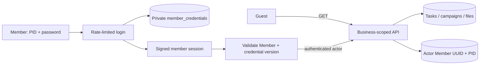

# Zuri-Go — Member PID and individual sign-in

User request: create a different sign-in password for each Member and a PID identifying that Member. The user approved this contract under R5/SOP on 2026-09-30. Implementation and verification are tracked in the [release evidence](../history/zuri-go-member-review/verification.md).

Parent: [Cloud architecture](cloud-deployment-spec.md). Peers: [Guest access and files](guest-access-spec.md), [PostgreSQL data model](data-model.md), [Architecture](architecture.md). It supersedes only the shared-team identity/authentication parts after approval; Guest visibility, task assignments, file limits, logos and metrics remain as previously approved.

## 1. Current evidence and intended change

Current source: `apps/api/team-auth.mjs` signs a Business-only team session; `cloud.mjs` checks one shared password hash. `service.mjs:audit` records authenticated subject `shared_team`. `workspace.mjs:writeDomain` imports/persists legacy task events with local actor labels. These cannot identify an individual authenticated member.

Live production read on 2026-09-30 confirmed exactly these four Active members. The approved PID assignments below have been issued by migration 005 with independent credentials and private handovers:

| Member | Existing PostgreSQL member UUID (retained) | PID |
|---|---|---|
| Chef | c0a536e6-b701-4868-a2dd-b2fe0517ea47 | ZGO-P0001 |
| Boss | c058670c-8808-4a8a-af5b-26fc92462156 | ZGO-P0002 |
| Tong | d94913fc-0c84-46ff-ac0a-b7a69e2bbdd0 | ZGO-P0003 |
| K’jeab | 9cff23e9-3992-4819-a3f8-9746fb4b5f75 | ZGO-P0004 |

[ASSUMPTIONS]
1. PID is a public, stable identifier within the configured Business, not a password or a government identifier. Display-name changes do not change PID. It is never reassigned to another person.
2. All activated members have the existing shared editor permissions. This request does not introduce an owner/admin/viewer permission matrix.
3. Enabling member sign-in ends acceptance of the shared password and Business-only sessions. Existing historical events retain their honest shared/unknown identity; they are not attributed retroactively.
4. First provisioning covers the four existing members. Future Member registration receives a PID automatically, while enabling/resetting sign-in credentials is a trusted local operator action in this release. Editing a public profile never exposes or resets a password.
5. Production is the team identity boundary. The existing loopback-only local workspace remains a trusted operator workspace, with explicit local-operator attribution rather than impersonating a Member. Local and cloud databases are not synchronized.

## 2. User flow

- Guest opens the same site and can read data/download evidence without signing in.
- A write action opens a modal with **PID** (or a member picker displaying name + PID) and **รหัสผ่านส่วนตัว**. The submitted identity is the PID, never the editable display name.
- Successful login resumes the chosen action and displays **Chef · ZGO-P0001** (corresponding member) in the upper-right toolbar. Logout returns to Guest mode.
- Members page and member details display PID with a copy action. Name/RACI/task references continue using the existing identity mapping.
- Generate an independent cryptographically random password (24 URL-safe characters) for each provisioned member. Only salted password hashes are stored in PostgreSQL. Provisioning writes a one-time private handover file per member under `.local/member-access/` and a private index for the operator, excluded from deployment and ordinary JSON backups. Do not show all passwords inside the app, a public Member card, logs or a spec.
- Provisioning is idempotent: rerunning does not silently rotate an existing password or reassign a PID. Reset must explicitly name the target PID and increases its credential version to invalidate prior sessions.
- Inactive or disabled sign-in accounts cannot log in or write. Re-enabling/resetting identity is performed by the trusted operator; other users cannot select an actor ID in a request to impersonate that member.

## 3. PostgreSQL amendment (migration 005)

| Table | Added fields / relationships | Rules |
|---|---|---|
| businesses | next_member_no bigint | PID allocation uses a locked atomic increment; no MAX+1 or reuse |
| members | pid text NOT NULL after backfill | UNIQUE(business_id,pid); server-assigned and immutable; retain id UUID PK and all existing FKs |
| member_credentials (new) | business_id UUID, member_id UUID, password_hash text, credential_version bigint, enabled boolean, created_at/updated_at timestamptz | Composite PK and FK (business_id,member_id) → members(business_id,id); forced Business RLS; no public list/read endpoint |
| change_events | reuse existing actor_member_id UUID nullable; add actor_pid text nullable | Composite nullable FK (business_id,actor_member_id) → members; new authenticated mutations have server-derived actor; legacy shared/local events stay nullable |
| task_attachments | uploaded_by_member_id UUID nullable, deleted_by_member_id UUID nullable | Composite Member FKs for new uploads/removals; existing files retain unknown actor |

PID is not a replacement PK. Compatibility-view Member IDs in legacy_metadata are resolved to the canonical Member UUID before authentication or FK writes. Automatic PID assignment must cover both direct Member saves and legacy workspace saves without changing an existing PID or allowing the client to supply another one. Credentials must never be embedded in Member legacy_metadata, Business snapshots or v2 exports.

## 4. Session and server contract

- `/session` returns authenticated flag, Business ID and, for a valid login, public identity `{memberId,pid,displayName}`. It never returns a password hash or credential record.
- `/login` verifies the Business-scoped PID and password. Use uniform errors and an equivalent hash verification path for unknown PID. Retain existing persistent attempt counters, same-origin checks, HttpOnly/Secure/SameSite cookie policy and bounded lifetime.
- New versioned session payload contains Business ID, canonical Member UUID, credential version and expiry; a distinct member-cookie name and schema reject the old team cookie even if its signing secret has not yet been removed.
- Every write validates credential enabled/version and Member active status from PostgreSQL. Validation and mutation occur in the same scoped transaction with locking sufficient to serialize a concurrent revoke/reset. Do not rely solely on the UI or a stale signed cookie.
- Server injects actor context into domain services/audit. Never accept actor/PID/memberId/password_hash fields from a save payload as authorization. New legacy task events are attributed server-side, previous events remain immutable. RACI A/R is assignment data, not proof of who performed the change.
- Guest reads remain available when a session expires or becomes invalid; subsequent write opens login. Editing a Member profile does not grant credential-management privileges.
- No guest response, public state snapshot, error, log, frontend bundle or exported artifact exposes password hashes, plaintext credentials or session secrets.

## 5. Migration, credential handover and rollout

1. Record a private backup/rollback checkpoint and current Member/Task/RACI counts. Inspect migration 005 against both local and hosted schemas.
2. Add/backfill PIDs without changing existing PKs; resolve the four approved production identities using the UUID mapping above, not display-name lookup alone. For local copies, reconcile preserved import identity before mapping; do not imply synchronization.
3. Provision four independent credentials through the trusted operator path. Verify private handover files exist and correspond to the intended PID; never publish them. Report their private local location to the user. No messaging to members is authorized.
4. Build and stage the new UI/API in the existing Vercel project. Run authenticated/guest/identity isolation tests before promoting.
5. Deploy the new member-session contract; reject all old team sessions and the shared password. Remove obsolete shared-password configuration once staged/member access and the handover files are verified. Avoid an undocumented shared-password fallback.
6. Verify each actual Member sign-in and an isolated mutation per identity. Check server-recorded actor PID, cancel harmless editor checks, archive only QA data, and recheck existing task/assignment/file counts.
7. If rollout fails, keep Guest reads and fail closed for writes while repairing or rolling back deliberately. Do not silently reactivate a publicly disclosed shared password. Preserve data and credential handover files.

## 6. Acceptance / success / exit criteria

- Four distinct credentials authenticate exactly the intended Member; a correct password paired with another PID fails.
- Four unique, stable PIDs; rename/reload/repeated provisioning do not change them; new concurrent Member creation cannot duplicate them; canonical and legacy paths preserve the correct UUID/FK.
- Guest read/download works; creation/edit/delete/upload/status change requires a valid individual Member session.
- Every newly authenticated business/task/file mutation records the real session Member. Crafted actor claims cannot impersonate another member. Existing shared/local historical events remain honestly labeled.
- Reset, disable or inactive status blocks old sessions immediately for writes; tampering, expiry, wrong Business and the old shared cookie/password fail.
- Credentials absent from public GET responses, bundles, generic backups and logs. Private handover works; no email or external notification sent.
- PostgreSQL, API, UI and packaging tests pass; actual staged/production checks are reported separately. Original Member, Task, RACI, MoSCoW, campaigns and evidence remain intact.
- Parent/peer docs amended only after approval/implementation; provide version diff and final deployment identity.

## 7. Scope and dependencies

Impacted: auth/session handler and UI, Members display/registration, server actor propagation, legacy task history, attachments actor metadata, migration/provisioning, Vercel environment/packaging tests and docs. Reuse PostgreSQL and the current site; no new provider/account needed.

Out of scope: email delivery, OTP, OAuth, self-registration with automatic write access, self-service password recovery, granular Member roles, profile contact-data visibility redesign, historical actor guessing, local/cloud synchronization, redesigning the dashboard or metrics graph.

## Documentation version diff

| 0.3.1 behavior | 0.4.0 behavior |
|---|---|
| One shared team password | Independent Member password + PID |
| Business-only team session | Member UUID + credential-version session |
| Team mode | Member name + PID |
| Audit shared_team / local labels | Server-derived Member actor for new authenticated actions |
| Member profile without login identity | Stable PID + separately protected credential record |
| Public Guest reads | Preserved |

The user approval satisfied the R5/SOP implementation gate. Completed production rollout and credential handover are evidenced in the [release verification](../history/zuri-go-member-review/verification.md); secrets are absent from this document.

Approval: user explicitly approved this specification on 2026-09-30.

## 0.4.2 login amendment

Approved [single-code login](identity-code-login-spec.md) supersedes PID + password input: the user enters one masked **รหัสระบุตัวตน**. Existing personal codes remain valid; the server resolves exactly one active/enabled owner across all Business credentials. PID remains a stable internal/public member identifier and audit identity. Guest access, sessions, RLS and schema remain unchanged. See [verification](../releases/0.4.2/verification.md).
