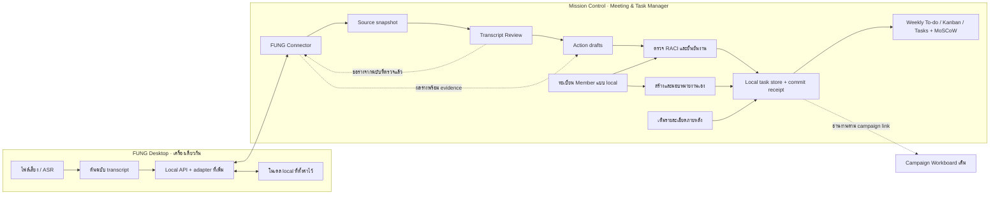
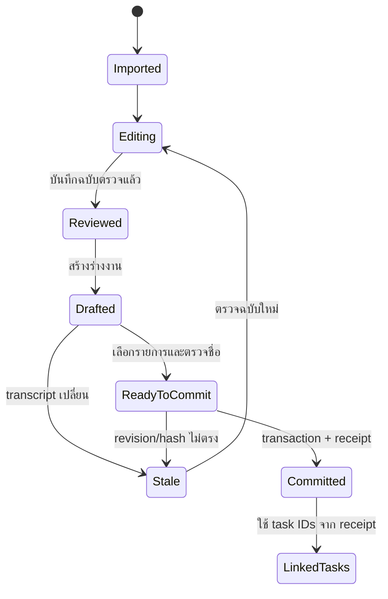
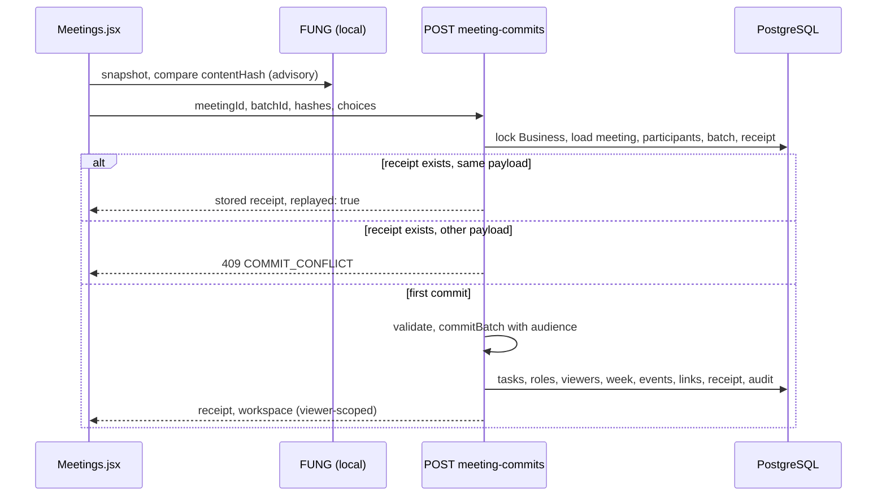

# Meeting & Task Manager — architecture and connector contract

## 1. ขอบเขตที่ยืนยัน

Mission Control นี้เป็นเจ้าของ task ที่สร้างจากประชุม; ใช้ local บนเครื่องเดียว บันทึกชื่อผู้รับผิดชอบ ผู้ใช้ยังไม่ได้ขอ shared login/notification รอบนี้ งานดังกล่าวไม่ถูกส่งไป Zuri Project Manager



ลูกศร API/adapter ที่เพิ่มเป็นข้อเสนอ ต้องไม่แสดงใน product ว่าเชื่อมแล้วจากการมีเอกสารนี้

## 2. หลักฐาน source ที่ตรวจในรอบนี้

FUNG checkout: `C:/Users/pc/workspace/fung`, HEAD `de696eaa68dbf9705bf57b765ad00b73f33ca282` วันที่ตรวจ 2026-09-30 มีไฟล์ tracked/untracked ของงานอื่นค้างอยู่; branch รายงาน behind cached origin/main 4 commits ไม่ได้ fetch และไม่ได้รับรอง remote freshness

| Ref | ไฟล์ / symbol | สิ่งที่ตรวจพบ |
|---|---|---|
| MC1 | `campaign-mission-control/src/content/dashboard/DashboardContent.jsx:9–18` | 5 tabs, localStorage ต่อ app ID, ยังไม่มี shared identity/backend |
| MC2 | `campaign-mission-control/src/content/shared/model.mjs:1–23,86–108` | schemaVersion 1; task อยู่ใต้ campaign; status/Done checks; restore รับ version เดียว |
| F1 | `fung/src-tauri/src/local_api.rs:1–63,561–686` | local HTTP API, per-launch token, loopback default, origin allowlist และ import/read routes |
| F2 | `fung/src-tauri/src/local_api.rs:824–861` + `fung/src-tauri/src/lib.rs:1926,4374` | HTTP transcript เรียก legacy `transcript_view`, ให้ segments; ไม่ใช่ native revision snapshot |
| F3 | `fung/src/lib/meetingIntelligence.ts:23–62,644–654` | native transcript snapshot/replay/correct ports มี revision, state และ human corrections |
| F4 | `fung/src-tauri/src/graph_build.rs:11–34` | มี extraction shape ของ action_items / owner / evidence แต่ยังไม่ใช่ task-manager import contract |
| F5 | `fung/src/lib/meetingIntelligence.ts:626` | external meeting dispatch flag เป็น false; ไม่ใช่เหตุให้ปิด local HTTP routes ที่ F1 มีอยู่ |
| W1 | `output/draft/weekly-kanban-2026-09-28.md` | งาน 5 รายการ, PIC ยืนยัน, A/due ยังไม่ยืนยัน, C/I/DoD เสนอ |

ตารางนี้เป็น static code evidence ไม่ใช่ test ผลเสียงจริง, runtime acceptance หรือ production integration

## 3. ทางเชื่อม FUNG

### 3.1 Reuse ที่มีอยู่

| Route ปัจจุบัน | ใช้ทำอะไร |
|---|---|
| `GET /health` | ตรวจว่าเป็น FUNG; ไม่ถือว่า credential ใช้งานได้จาก health เพียงอย่างเดียว |
| `GET /recordings` | รายการที่ผู้ใช้เลือกนำเข้า; auth ต้องสำเร็จก่อนสถานะ Connected |
| `POST /recordings/import` | ส่งไฟล์ที่เลือกไป FUNG และรับ jobId/projectId/recordingId |
| `GET /jobs/{id}` | แสดงสถานะถอดเสียงจริง |
| `GET /recordings/{id}/transcript` | legacy segments fallback แบบระบุ source mode |
| `GET /recordings/{id}/audio` | เล่นเสียงอ้างอิงในเครื่องเดียว |

Connect URL มาจาก FUNG Settings › Runtime และถือเป็น credential ไม่ใส่ตัวอย่าง token จริงในเอกสาร/log/UI notice เก็บ token ใน memory ของ connector รอบนี้ ไม่ใส่ใน task records, local backup, exported JSON หรือ URL ของ Mission Control

ยอมรับเฉพาะ loopback origin + port ของเครื่องนี้ ตรวจ URL/path ก่อน request ไม่ proxy ผ่าน server, ไม่เปิด LAN listener, ไม่สแกนพอร์ต, ไม่ค้น credential ใน browser อื่น อนุญาตให้ต่อใหม่เมื่อ FUNG restart แล้ว token เปลี่ยน

การเล่นเสียงใช้ authenticated fetch เป็น blob URL เมื่อทำได้ และ revoke หลังใช้ แทนการส่ง credential ไป URL ภายนอก การรองรับ seek/ขนาดไฟล์ต้องทดสอบกับ route จริง; maximum upload ของ FUNG source ปัจจุบันคือ 512 MiB แต่ UI ตรวจชนิด/ความพร้อมก่อน upload ไม่ใช้ขนาดสูงสุดเป็นเป้ารับไฟล์ทุกชนิด

### 3.2 Contract ที่ต้องเพิ่ม — ยังไม่มี implementation

เพื่อไม่อ้าง legacy text เป็น native reviewed revision และเพื่อใช้โมเดล FUNG โดยไม่เปิด endpoint ของโมเดลให้เว็บเรียกตรง เสนอ namespace `/integrations/meeting-task-manager/v1` ภายใต้ auth/origin gate เดิม:

| Operation ที่เสนอ | Request / Response หลัก |
|---|---|
| `GET .../capabilities` | ส่ง protocolVersion, snapshot availability, actionDraft availability, readiness reason; ไม่แสดง secrets |
| `GET .../recordings/{recordingId}/snapshot` | เรียกเจ้าของ transcript ผ่าน native service; ส่ง native revision/cursor หากมี หรือ legacy mode + content hash หากไม่มี |
| `POST .../action-drafts` | รับ selected source, reviewed revision/hash, bounded segments และ requestId; ตรวจ source ก่อน/หลัง model call; คืน draft actions พร้อม quote/span/model provenance |

FUNG เป็นผู้ใช้งาน read/service ports ของตัวเอง ห้าม Mission Control เปิด GenesisBlockDB หรือสร้าง table mutation ข้าม boundary การเพิ่ม routes ไม่เปิด external meeting provider dispatch หรือ MCP write tools

ถ้า version/readiness ไม่รองรับ ให้ UI แสดงความสามารถที่มีจริงและหยุดปุ่ม AI drafting ส่วน manual task from selected text ยังใช้ได้ โดยไม่แต่งผลลัพธ์ AI มาทดแทน

### 3.3 Source snapshot contract

Required fields: `schemaVersion`, `sourceInstanceId`, `projectId`, `recordingId`, `sourceMode`, `sourceRevision` (nullable), `sourceCursor` (nullable), `contentHash`, `capturedAt`, `meetingStartedAt` (nullable), `timezone`, `segments[]`, `coverage`.

Segment fields: `segmentId`, `nativeRevisionId` (nullable), `startMs`, `endMs`, `text`, `speakerLabel` (nullable), `reviewState` (unknown/committed/reviewed), `sourceRef`.

- `sourceInstanceId` คือ local connection identity ที่ไม่ใช่ token; ผู้ใช้ยืนยัน mapping เมื่อต่อ installation ใหม่
- Hash canonical UTF-8 JSON ของ project/recording, source mode/revision, ordered segment IDs/timecodes/text/speaker และ coverage โดยไม่รวม capturedAt; timestamps เก็บ integer milliseconds
- legacy ไม่มี native revision ให้เป็น null ไม่สร้าง revision หมายเลข 1 แทน
- error, source gaps และ empty speech เป็นคนละสถานะ; coverage unknown แสดง unknown
- HTTP legacy route เดิมไม่รับรอง M1 human edits ล่าสุด จึงไม่ใช้แทน enhanced snapshot แบบเงียบ ๆ

### 3.4 Draft request / response

Request: `requestId`, `sourceInstanceId`, `projectId`, `recordingId`, `expectedSourceHash`, `reviewRevisionId`, `reviewHash`, `reviewedSegments[]`, `locale`, `meetingStartedAt`, `timezone`.

Response: `draftBatchId`, `requestId`, `sourceHash`, `reviewRevisionId`, `reviewHash`, `modelRunRef`, `modelName`, `generatedAt`, `items[]`.

`draftBatchId` สร้างแบบ deterministic จาก requestId และ source/review identity; retry request เดิมไม่เปลี่ยน batch identity ส่วนการขอ extract ใหม่ต้องสร้าง request ใหม่และผ่าน duplicate review ก่อน commit โมเดลเป็นผู้เสนอข้อความ ไม่ได้เป็นผู้กำหนด identity ของ batch

Item: `proposalId`, `kind` (task/decision/question), `title`, `deliverable`, `suggestedResponsibleLabel` (nullable), `suggestedDueText` (nullable), `suggestedDueDate` (nullable), `evidence[]`, `unresolvedFields[]`.

Evidence: `segmentId`, `startMs`, `endMs`, `quote`, `reviewRevisionId`. Server/consumer ต้องตรวจว่า quote เป็นข้อความจริงของ revision นั้นและเวลาอยู่ใน source segment เดียวกัน ช่วงไหนไม่มีหลักฐานให้เป็น unresolved ไม่สร้าง cite หรือ confidence ขึ้นเอง

ไม่ส่ง credential, email หรือรายชื่อคนอื่นทั้งระบบเข้า prompt เนื้อหา transcript เป็น untrusted source; model ไม่มี tool execution, การเลือกปลายทาง หรืออำนาจสร้าง task โดยตรง

ใช้เฉพาะ provider local ที่ผ่าน readiness ของ FUNG และขอบเขต local-only ของงานนี้ ไม่ fallback ไป cloud เมื่อโมเดล local ใช้งานไม่ได้

## 4. Local data ownership

ใช้ IndexedDB ใน namespace ที่ผูก app ID สำหรับข้อมูลโดเมนใหม่ เหตุผลคือ transcript/revision และ task commit ต้องบันทึกหลาย records แบบ transaction; ไม่ใส่เสียงหรือ base64 media ใน localStorage

| Entity | หน้าที่และ key สำคัญ |
|---|---|
| Member | stable local ID + displayName/fullName/nickname/team/position/email/phone/notes + active/inactive + timestamps; ไม่ใช่ authenticated account |
| Meeting | ID + sourceInstanceId/projectId/recordingId + title/date + project/campaign relation ที่ผู้ใช้เลือก |
| SourceSnapshot | immutable imported source + contentHash + native revision ถ้ามี |
| ReviewRevision | ID + sourceSnapshotId + edited text/speaker mapping + parentRevisionId + reviewedAt |
| DraftBatch | reviewed revision/hash + model/manual provenance + candidates + stale flag |
| Task | stable ID + title + nullable description/deliverable + R/A/C/I + confirmation flags + state + acceptance/evidence + source references |
| WeeklyPlan | weekStart/timezone + entries `{taskId, priority, priorityNote}`; priority เป็น must/should/could/wont/null ของรอบนี้ ไม่ใช่ task copies |
| CommitReceipt | idempotencyKey + payloadHash + proposal→task mapping + committedAt |
| TaskEvent | local change history ของ assignment/status/evidence/description และ weekly priority พร้อม weekStart; ไม่อ้าง authenticated audit |

Member IDs ต้อง bind ชื่อที่ seed ไว้ ไม่ใช้ string comparison อย่างเดียวในภายหลัง การเปลี่ยน displayName ไม่เปลี่ยนคนที่รับผิดชอบ งาน manual กับงานจาก meeting ใช้ Task entity และ RACI member references ชุดเดียวกัน

Manual create/update อยู่ใน local repository ไม่ผ่าน FUNG; ใช้ sourceKind manual หรือ manual-from-meeting ตามหลักฐานที่มีจริง Member registration เก็บชื่อเป็นข้อมูลหลักและช่องอื่น optional; phone เป็น string การปิดใช้งานเป็น reversible update ห้าม cascade-delete tasks/history ส่วน seed member IDs ใช้สำหรับ idempotent mapping ไม่ใช่ user login identity

การ restore ตรวจ referential integrity ของ R/A/C/I กับ Member records ก่อนบันทึก; กรณีข้อมูลเก่าไม่มีสมาชิกที่อ้าง ให้แสดงรายการที่ต้อง resolve ไม่ผูกกับสมาชิกชื่อเหมือนกันเอง Contact data อยู่ใน local backup ที่ผู้ใช้เลือก export แต่ไม่อยู่ใน connector state, model request หรือ notification service

### 4.1 รายละเอียดที่เติมภายหลังได้

- Create task ต้องมี title และ create member ต้องมี displayName; `Task.description` และ `Member.notes` เป็น nullable multiline plain text พร้อมข้อมูลเสริม optional ตาม spec
- ไม่สร้างข้อความรายละเอียดแทนผู้ใช้; input ที่ว่าง/มีแต่ whitespace เก็บเป็น null ข้อความที่มีเนื้อหาเก็บบรรทัดภาษาไทยครบและแสดงเป็น text ไม่ execute HTML
- Update เฉพาะ field ที่ส่งมา: omitted field หมายถึงคงเดิม ส่วน null เป็นการล้างค่าที่ผู้ใช้ตั้งใจ ไม่ reset RACI/status/weekly membership เมื่อเติมรายละเอียด
- แก้ข้อมูลเสริมของสมาชิกคง memberId; แก้รายละเอียด task คง source provenance/quote และ task ID เดิม บันทึกการแก้กับ timestamp/event ใน transaction ของ store ที่เกี่ยวข้อง
- การเพิ่มรายละเอียดภายหลังไม่ผ่าน FUNG และไม่บังคับ Done validation จนผู้ใช้ขอเปลี่ยนเป็น Done

### 4.2 MoSCoW ต่อรอบสัปดาห์

- เก็บ `priority: "must" | "should" | "could" | "wont" | null` และ `priorityNote: string | null` ใน entry ของ WeeklyPlan; key ไม่ซ้ำคือ weekStart + taskId ภายใน namespace/timezone เดิม
- Task ไม่มี global priority ซ้ำอีกชุด; ฟอร์ม/list/card resolve จากสัปดาห์ที่เลือก งานที่ไม่มีสัปดาห์ยังสร้าง Backlog ได้และเลือก priority เมื่อจัดรอบ
- Seed JSON ใช้ priority/priorityNote บนแถว task เพื่ออธิบายการนำเข้า แล้ว mapper เขียนลง weekly entry ของ weekStart ไม่เขียนเป็น Task fields; description ลง Task
- เปลี่ยน priority/note พร้อม event ที่ระบุ weekStart ใน transaction เดียวกัน; null เป็นรอยืนยัน ไม่ถูกแปลงเป็น Should หรือค่าจากโมเดล
- เพิ่มงานเดิมเข้าสัปดาห์ใหม่สร้าง membership ใหม่โดย priority/note เริ่ม null; entry รอบก่อนคงอยู่ ไม่มีการ clone task หรือเปลี่ยน task state
- Won’t เป็นการกันออกจากงานที่เลือกทำในรอบนั้นเท่านั้น; projection แสดงรายการแยกที่ยังเปิดได้โดยไม่ลบ source task หรือเปลี่ยนเป็น Done การสรุปความคืบหน้ารอบนี้ใช้ M/S/C และแยก unclassified/Won’t ตาม spec
- Contract FUNG ไม่ต้องเพิ่ม field priority สำหรับรอบนี้: การเลือก MoSCoW เป็น local human input ใน Action Review/Task detail หลังได้ draft
- backup/restore ตรวจ enum, unique membership และ task references; รวม optional details/priority/note กับ event ตามข้อมูลจริง ค่า domain field ที่ขาดใน draft/seed เก่าปรับเป็น null ในขั้น normalize โดยไม่ overwrite ข้อมูลผู้ใช้หรือเดาค่า legacy campaign

## 5. Revision และการกันงานซ้ำ



- Idempotency key ผูก source instance + project + recording + reviewed revision/hash + stable draftBatchId; rerun batch/retry เดิมใช้ key เดิม
- payloadHash ผูก selected proposal IDs + final task fields + assignment/weekly plan ที่ preview แล้ว; key เดิมแต่ payload ต่างตอบ Conflict ให้ตรวจ ไม่คืน success เงียบ ๆ
- เขียน tasks, weekly membership, events และ receipt ใน IndexedDB transaction เดียว; UI แจ้ง success เมื่อ transaction complete
- ก่อน commit ตรวจ source/review revision และ task versions ที่เลือกผูก เพื่อไม่เขียนทับงานที่ถูกแก้ไปแล้ว
- extract ใหม่จาก review เดิมหรือฉบับใหม่ต้องแสดงรายการที่เคยสร้างและให้เลือก link/update/create; ใช้ source span/recording เพื่อเสนอความซ้ำ และ human review ตัดสิน ไม่ใช้ fuzzy title เพียงอย่างเดียวเป็น identity
- การแก้ transcript หลัง commit ไม่แก้ title/R/due/status ของ task ที่สร้างแล้ว อาจสร้าง proposal เปลี่ยนแปลงที่ผู้ใช้เห็นและยอมรับเท่านั้น

## 6. Compatibility และ backup

- Campaign localStorage schema v1 และ app ID เดิมคงอยู่; เพิ่ม domain store แยก มี `schemaVersion` ของตัวเอง
- ไม่ย้าย/copy legacy campaign tasks โดยอัตโนมัติ ลดความเสี่ยงกับงานที่ผู้ใช้มีอยู่
- งานใหม่ที่ผูก campaign แสดงผ่าน read projection ของ task store ใหม่; การแก้ link card dispatch ไปยัง task owner เดียว
- รวม domain snapshot ใน backup envelope v2 ที่มี `campaignWorkspace` และ `meetingTaskManager`; export พร้อม members/source/review/task/receipt แต่ไม่มี token/audio
- import backup v1 ทำงานกับ campaign scope ตาม flow เดิมและไม่ล้าง domain store ใหม่; v2 ตรวจทั้งสองส่วนก่อน preview/confirm
- การ restore ข้าม localStorage + IndexedDB ไม่ใช่ transaction เดียว: ใช้ restore journal, stage-and-validate, backup ก่อนเปลี่ยน และ recoverable finalize marker; ป้องกัน UI เขียนระหว่าง restore ให้ restart แล้ว resume/rollback ได้โดยไม่เหลือชุดข้อมูลปนกัน
- ไม่ scan localStorage ของ app ID อื่น, ไม่ล้าง browser storage, ไม่เติมข้อมูล demo ทับ user data
- private mode/quota/storage failure แสดงข้อจำกัดและให้ export; ไม่อ้าง multi-user sync หรือส่งงานถึงบุคคลจากการบันทึกชื่ออย่างเดียว

## 7. Impact / implementation boundary

| Layer | การเปลี่ยนที่จำเป็นหลังอนุมัติ |
|---|---|
| Parent product | เพิ่ม domain switch และ navigation ใน authored content; campaign เดิมยังเข้าถึงได้ |
| Peer campaign | linked tasks เป็น projection; ไม่เปลี่ยน metrics/offer rules/history |
| New domain | local member/task/meeting/review store, manual task, optional details, UI, RACI/weekly/MoSCoW, evidence/commit |
| FUNG | adapter สำหรับ normalized snapshot และ bounded local action drafting; reuse upload/auth/origin/native ownership |
| Protected app runtime | ใช้ public APIs; ไม่แก้ shell/build/context โดยการขยาย content ตามปกติ |
| Other repos / cloud | ไม่มี Zuri Project Manager writes, provider activation, messages หรือ production deploy ในขอบเขตนี้ |

## 8. Review และ exit criteria

- เอกสารแยก existing code กับ proposed contract ชัดเจน และไม่ใช้ memory เป็นหลักฐาน runtime
- Local-only, task ownership และ 5 PIC ตรงคำยืนยันผู้ใช้
- Native versus legacy transcript revision, source refresh, ambiguous people/dates, model unavailable, double import/commit, storage failure และ restore interruption มี handling ที่กำหนดไว้
- ตรวจ source/doc references และ weekly/member JSON ในรอบเอกสาร; หลัง implementation ต้องใช้ focused unit/contract/integration/browser tests ตาม MT-01–29 และทดสอบ FUNG ที่รันจริงก่อนอ้างเชื่อมต่อสำเร็จ
- ผู้ใช้อนุมัติเอกสารก่อน code ตาม R5; ไม่มีการตั้ง ready/deployed จากผลตรวจเอกสาร

## 9. Version diff

v0.2 → v0.3: เพิ่ม nullable details และ update semantics สำหรับเติมภายหลัง; เปลี่ยน weekly task-ID list เป็น entries ที่อ้าง task เดิมพร้อม MoSCoW/note; เพิ่มกติกา carryover, history และ backup ของ priority ขอบเขต FUNG API/เจ้าของข้อมูลเดิมคงอยู่ และยังไม่มีการรัน migration หรือแก้ app code

## Implementation verification — 2026-09-30

ผู้ใช้อนุมัติ v0.3 ก่อน implementation แล้ว สถานะรอบเอกสารด้านบนเป็นประวัติ; สถานะปัจจุบันและ requirement matrix อยู่ที่ [verification report](verification.md) และวิธีใช้ใน [คู่มือ](guide.md)

Authored dashboard content build สำเร็จโดยคง app ID และ protected runtime เดิม; ฟังก์ชัน local ทดสอบแล้ว FUNG adapter ผ่าน source/production-handler fixture แต่ยังไม่เปลี่ยนแอป FUNG ที่ติดตั้งอยู่ จึงยังไม่ปิด acceptance การทดสอบเสียงและโมเดลจริงครบเส้นทาง

## Proposed amendment — server-side meeting commit (PLAN-002 WI-09)

> **Approved by the owner on 2026-10-01**, with its open questions answered as recommended ([PLAN-002](../../governance/plans/PLAN-002-task-and-meeting-domains.md) Q15; see “Decisions” below). It authorizes the code of WI-09; it authorizes no migration or deployment, which stay with the release (PLAN-002 P5). It designs how [PLAN-002](../../governance/plans/PLAN-002-task-and-meeting-domains.md) WI-09 (phase P3) moves the meeting commit to the server, for [FR-011-009](../FEAT-011-visibility-and-confidential-meetings/requirements/FR-011-009-confidential-meeting-tasks.md) and [FR-011-010](../FEAT-011-visibility-and-confidential-meetings/requirements/FR-011-010-transcript-custody.md), following [SDD-011](../FEAT-011-visibility-and-confidential-meetings/design.md) “Meetings (P3)” and [ADR-003 / ADR-004](../../architecture/decisions.md). If approved, it supersedes the “IndexedDB transaction” bullet of section 5 (line 184) and the `CommitReceipt` row of section 4 (line 138) for the PostgreSQL stores; the payload-conflict, stale-batch and link/update/create review rules are kept.

### How the commit works today

Verified against the source at commit `d57cd9f`.

- **The client runs the commit.** `commit()` re-reads the FUNG snapshot, hashes the choices and calls `commitBatch` on its own copy of the state (`apps/web/src/content/meeting/Meetings.jsx:24`).
  - `commitBatch` (`apps/web/src/content/meeting/model.mjs:99-112`) replays by comparing the stored receipt’s `payload` string (`:102-103`), refuses a stale batch (`:104`, `isBatchStale` at `:89`), validates the evidence quotes (`:106`, `validateEvidence` at `:90`) and creates tasks with random IDs.
  - It pushes a receipt whose key is `sourceInstanceId:projectId:recordingId:reviewId:reviewHash:batchId` (`:112`).
- **The server stores the result.** `PUT /workspace` (`apps/api/api.mjs:40`, `saveLegacy` at `apps/api/workspace.mjs:141`) calls `writeDomain`, which checks the receipt’s shape (`workspace.mjs:84-86`), writes the batch’s `commit_key` and `commit_payload_hash` (`:134`) and the `meeting_task_links` rows (`:135`). It never re-runs the commit rules, so a client can store tasks and a receipt that no commit produced.
- **Idempotency is the client’s.** The server stops a second client only through the Business-wide revision (`workspace.mjs:142`) and the immutability check on a stored receipt (`:84`), with `UNIQUE(business_id,commit_key)` as the last backstop (`apps/api/migrations/001_core.sql:128`).
- **Tasks inherit no audience.** `commitBatch` passes no `visibility` or `viewerIds` to `saveTask` (`model.mjs:109`), so a task from a restricted meeting is stored `business` (`workspace.mjs:91`).
- **Evidence quotes sit inside the task row.** The task’s `sourceRefs` carry the quotes (`model.mjs:108-109`) and are written into `tasks.legacy_metadata` (`workspace.mjs:108`). `readLegacy` drops the references to meetings the viewer cannot read (`workspace.mjs:44`), but a direct query on `tasks` still returns the quotes to anyone who can read the task. FR-011-009 says the quotes live in `meeting_task_links.evidence`, which follows the meeting (`006_visibility.sql:88`), so this has to change (see Audience inheritance).
- **Transcript custody is fail-closed only.** A non-operator cannot store a restricted meeting’s revisions or batches (`workspace.mjs:128-130`, `:134`).

### Proposal

One new write endpoint. The server loads the stored meeting, participants and draft batch, runs the existing pure `commitBatch` rules on a scratch copy of the viewer’s readable state with the meeting’s audience, then persists the created or changed tasks, the receipt, the links, the events and one audit event in a single transaction. The client sends choices only; it no longer creates tasks, task IDs, receipts or hashes for a meeting.



### Endpoint and payload

`POST /api/zuri-go/v1/businesses/{businessId}/meeting-commits`

- The path fits the existing resource pattern (`api.mjs:27`); a new branch goes beside `imports` (`api.mjs:36`). Like every write it needs `x-zuri-go: 1` and a JSON body (`api.mjs:16`).
- Hosted (SRV-001): a Member is required (`api.mjs:14`, `authorizeWrite` at `apps/api/member-auth.mjs:27`; Guest gets 401 `AUTH_REQUIRED`). Local (SRV-002): the operator principal (`apps/api/server.mjs:20`).
- The operator path does not go through `authorizeWrite`, so the handler takes `SELECT … FOR UPDATE` on the Business row itself, as `saveLegacy` does (`workspace.mjs:142`).

Request. IDs are the workspace’s legacy IDs, as in the rest of the API. `choices` keep the shape `commitBatch` reads today (`model.mjs:108-109`).

```json
{
  "meetingId": "…", "batchId": "…",
  "reviewRevisionId": "…", "reviewHash": "…", "sourceHash": "…",
  "choices": [
    {"proposalId": "…", "mode": "create", "title": "…", "description": null,
     "responsibleId": "…", "accountableId": null, "dueDate": null,
     "week": "2026-09-28", "priority": "must", "priorityNote": null},
    {"proposalId": "…", "mode": "link", "taskId": "…", "taskVersion": 3},
    {"proposalId": "…", "mode": "skip"}
  ]
}
```

- `reviewRevisionId`, `reviewHash` and `sourceHash` are expected-state guards: they must equal the stored batch (409 `STALE_BATCH` otherwise).
- The request carries no idempotency key, no IDs for new tasks, no audience, no receipt and no payload hash. The server derives them.

Response, 200 for a first commit and for a replay:

```json
{
  "receipt": {"id": "…", "batchId": "…", "idempotencyKey": "…", "payloadHash": "…",
              "taskIds": ["…"], "mappings": [{"proposalId": "…", "taskId": "…"}], "committedAt": "…"},
  "replayed": false,
  "workspace": { }
}
```

`workspace` is the viewer-scoped `readLegacy` result, the same object `saveLegacy` returns (`workspace.mjs:146`), so the client replaces its state and its `version` in one step.

### Idempotency and replay

- **Key.** The server builds it with today’s formula from the stored meeting, review and batch rows (`model.mjs:112`), never from the request. Receipts written by the current client therefore keep the same key.
- **Payload hash.** The server hashes the canonical form of the choices: keys sorted, choices ordered by `proposalId`, with `hash` from `apps/api/service.mjs:6`. Today’s browser hash is the plain `JSON.stringify` of the choices (`model.mjs:134`, `Meetings.jsx:24`) and depends on key order. A receipt without `origin: 'server'` is compared by the old rule too (`receipt.payload` equals `JSON.stringify(choices)`, `model.mjs:103`), so a replay of an old receipt is still recognized.
- **Order of checks.** (1) Lock the Business row. (2) Read the batch’s `commit_key`. (3) If it is set and the payload matches, return the stored receipt with `replayed: true`: no write, no `domain_revision` bump, no audit event, no new events. (4) If it is set and the payload differs, answer 409 `COMMIT_CONFLICT` and change nothing (the rule of `model.mjs:103`). (5) Otherwise commit.
- **Concurrency.** Two requests with the same body are serialized by the lock; the second finds the receipt and replays. `UNIQUE(business_id,commit_key)` is only the backstop.
- **Retry.** A lost response is safe to retry with the same body: the same task IDs come back (PLAN-002 P3 “Done when”).
- **Who sees the replay.** The response drops the task IDs and mappings the viewer cannot read, as `readLegacy` does for receipts (`workspace.mjs:52`).
- **Atomicity.** The commit is one transaction (`db.mjs:9`). Any failure leaves no task, receipt, link or `commit_key` behind.

### Validation moves to the server

The server reuses `commitBatch` (model.mjs:99) and its helpers unchanged, so the client preview and the server cannot disagree. It adds the checks the client could skip:

| Check | Rule | Answer on failure |
|---|---|---|
| Access | The meeting exists and `canRead` allows the viewer; hosted requires a Member | 404 `ไม่พบประชุม` for missing and hidden alike; 401 for a Guest |
| Batch | The batch belongs to the meeting; `reviewRevisionId`, `reviewHash`, `sourceHash` equal the stored rows; `isBatchStale` is false on the stored meeting (`model.mjs:89`) | 409 `STALE_BATCH`, today’s message “ร่างเก่าใช้สร้างงานไม่ได้ กรุณาตรวจฉบับใหม่” |
| Choices | Array; no duplicate `proposalId` (`model.mjs:101`); each proposal is in the stored batch; `mode` is one of four; at least one non-`skip` (`:112`); R present for `create` and `update` (`:109`); people exist and are active (`person`, `:16`); week and MoSCoW valid (`setPriority`, `:26`) | 422 with the existing Thai messages |
| Targets | A `link` or `update` target is readable by the viewer and `taskVersion` equals its current version (`checkVersion`, `:15`; the task’s `version` is `row_version`, `workspace.mjs:40`) | 404 `ไม่พบงาน` for missing and hidden alike; 409 “reload” on a version mismatch |
| Evidence | Where the stored review has segments, `validateEvidence` (`:90`) runs on the stored review; no client-supplied quote is trusted. Where it is a custody stub, see Transcript custody | 422 `ข้อความอ้างอิงไม่ตรงฉบับตรวจแล้ว` |

The FUNG source-hash comparison in `Meetings.jsx:24` stays in the client: the server cannot reach FUNG on the recording machine, so that check remains advisory.

### Audience inheritance

- **Source of the audience.** The server calls `meetingAudience(meeting, participantIds)` (SDD-011, not yet in code) with the stored `meeting_participants`, organizer included. The request never supplies it.
- **Restricted meeting.** Every task the commit **creates** gets `visibility: 'restricted'` and `viewerIds` equal to the participants, through the `saveTask` inputs that already exist (`model.mjs:43-44`). The per-task writes (RACI, viewers, visibility) use the same code as `PUT` (`workspace.mjs:104-113`). A new task is not a widening, so no reason is asked (`visibilityChange`, `apps/web/src/content/shared/visibility.mjs:24`), and the actor is always named (a participant, or the operator), so `SELF_EXCLUDED` cannot occur (AC-011-009-01).
- **Other meetings.** `meetingAudience` returns null and tasks keep today’s default `business` (`workspace.mjs:91`).
- **Snapshot.** The audience is fixed at commit time. Later changes of participants do not change existing tasks (open question 3).
- **R, A, C and I outside the participants.** Allowed. They are named on the task, so they read it, and they get it without the quotes (AC-011-009-02).
- **Where the quotes live.** The server writes each selected proposal’s evidence to `meeting_task_links.evidence` only (`001_core.sql:131-133`) and stores the task’s `sourceRefs` without `evidence`. `readLegacy` re-attaches the evidence from `meeting_task_links` when the viewer can read the meeting and otherwise returns `evidence: {withheld: true}` (SDD-011 “Meetings (P3)”). `validateState` (`model.mjs:129`) then has to accept a withheld reference. `writeDomain` strips `evidence` from `sourceRefs` before writing task metadata (`workspace.mjs:108`), so a later `PUT` cannot put the quotes back into the task row. Tasks written before P3 keep their inline evidence (FR-011-012).
- **Widening a task** never touches the links (AC-011-009-03).
- **`link` and `update` on an existing task never change its audience.** For a restricted meeting:
  - `link` is allowed, because the reference carries no quote;
  - `update` writes meeting-derived text into the task, so it is allowed only when the target is `restricted` and everyone named on it is a participant; otherwise 422 `AUDIENCE_WIDER` (open question 1).

### Transcript custody interplay

- **The commit never uploads a transcript and never changes `transcript_custody`.** It works on what is stored.
- **`local_only` meeting.** The hosted database holds a revision stub and a batch stub (SDD-011 “Meetings (P3)”): `content_hash`, lineage and `segments = []` for the revision, and draft items without evidence text. `writeDomain` writes the stubs through `custodyRevision` (SDD-011) and a new pure `custodyBatch` instead of failing (`workspace.mjs:128-130`, `:134`). `custodyBatch` replaces each evidence entry with its span only: `segmentId`, `startMs`, `endMs`, `reviewRevisionId`.
- **Commit on stubs.** The server checks that `reviewHash` and `sourceHash` equal the stored stub’s hashes and that every selected proposal’s span belongs to the stored review. It cannot check quote text, and none is sent. Production receives the title, date, participants and approved tasks, and no transcript segments (AC-011-010-01). The links hold spans only.
- **Trust limit.** On a stub, quote authenticity is checked only by the client on the recording machine, which still runs `validateEvidence` on its full local copy before it sends the request. The hashes bind the request to that review. A participant’s client can still send a span that does not match the transcript; the effect stays inside the meeting’s own audience.
- **After an upload.** When a participant uploads the transcript (AC-011-010-02), custody becomes `cloud` and later commits validate against the real segments. Stub batches created earlier keep span-only evidence; nothing is back-filled, and existing receipts are unchanged.
- **The local operator** stores full content as today (`workspace.mjs:128`). The server decides by the stored data (segments present or not), not by the principal.
- The upload endpoint itself (reason, audit, custody switch) is part of WI-09 but is not designed here (open question 5).

### Migration of the existing client flow

1. **No schema change.** The columns already exist (`001_core.sql:128`, `006_visibility.sql:30`). The audit event uses entity type `meetings` with the meeting ID, event `commit` and IDs only, so the history policy ties it to the meeting (`006_visibility.sql:93`); an entity type such as `meeting_draft_batches` would fall under `ELSE true` and show to every Member.
2. **Server.** New module `apps/api/meeting-commit.mjs` and the route in `api.mjs`. The module must be added to the hosted package list (`scripts/deploy/build_cloud.py:25`), which copies only named files.
3. **Client.** `commit()` (`Meetings.jsx:24`) keeps the FUNG snapshot comparison, then calls the endpoint instead of `change(s=>commitBatch(…))` and replaces its state from `workspace`. `commitBatch` stays in the model for the server and its tests; the client may run it on a clone to preview the result.
4. **`PUT /workspace`.** It refuses any receipt that is not already stored, 422 `RECEIPT_SERVER_OWNED`. Stored receipts stay immutable (`workspace.mjs:84`). `importCommit` still writes receipts from a backup (`workspace.mjs:164`), so the refusal is a parameter of `writeDomain` that `saveLegacy` sets and `importCommit` does not. The hosted rule for restricted meetings stays as in SDD-011 until the stubs exist.
5. **Staging.** Release A ships the endpoint and the new client. Release B turns the `PUT` refusal on, after cached old client bundles have gone. At the last record production held no meetings (ADR-004, Context), so the two may be one release; that has to be re-checked at release time.
6. **Existing data.** Receipts and tasks from the old flow keep their IDs and their `business` visibility (FR-011-012) and replay through the endpoint by the legacy comparison. There is no backfill.
7. **Local database.** The same code runs there under the operator principal; the local and production databases stay separate (AGENTS.md).

### Failure modes

| Failure | Behavior |
|---|---|
| Guest or expired session on hosted | 401 `AUTH_REQUIRED`; nothing changes |
| Meeting or batch missing, or hidden from the viewer | 404, the same answer for both |
| Source, review or batch hash differs from the stored rows, or the batch is stale | 409 `STALE_BATCH`; the client re-imports and reviews again |
| Same batch, different payload | 409 `COMMIT_CONFLICT`; nothing changes |
| Same batch, same payload (retry, double click, second tab) | 200 with `replayed: true`; no write |
| Two identical requests at once | Serialized by the Business lock; the second replays |
| `link` or `update` target missing, hidden or at another version | 404 `ไม่พบงาน` or 409 “reload” |
| Restricted meeting with an `update` target wider than the participants | 422 `AUDIENCE_WIDER` |
| Restricted meeting with nobody named (should not exist) | 422; nothing is created |
| An error in the middle of the commit | The transaction rolls back: no task, link, receipt or `commit_key`; the client may retry |
| A client `PUT` carries a receipt the server did not write (Release B) | 422 `RECEIPT_SERVER_OWNED` |
| A stale client `PUT` after a commit | 409 “reload”, because the commit bumped `domain_revision` (`workspace.mjs:142`) |
| Logs | Error codes and IDs only; request bodies and quotes are never logged (AC-011-008-05) |

### Tests

TC IDs are not assigned yet (PLAN-001 WI-08); these are planned tests and the criteria they cover.

1. `apps/web/src/content/meeting/model.test.mjs`, extended: `commitBatch` with an `audience` option; `canonicalChoices` gives the same string for any key order; the existing replay, conflict and stale tests still pass.
2. New `apps/api/test/meeting-commit.test.mjs`, run for five viewers (Guest, Member outside the audience, participant, named R who is not a participant, local operator):
   - AC-011-009-01: a restricted meeting with three participants gives a `restricted` task with those three as viewers;
   - AC-011-009-02: the R outside the participants reads the task with `evidence: {withheld: true}`;
   - AC-011-009-03: widening the task leaves `meeting_task_links` unchanged;
   - a replay returns the same task IDs and writes nothing (row counts and `domain_revision` equal);
   - two parallel identical requests give one set of tasks;
   - the same key with another payload gives 409;
   - a stale batch gives 409;
   - a failure after the first created task (an unreadable `link` target) leaves nothing stored;
   - a legacy receipt made by the old flow replays.
3. `apps/api/test/visibility-db.test.mjs`, extended: a direct query as a non-participant who can read the task finds no quote text in `tasks.legacy_metadata`, and none in `meeting_task_links` (NFR-011-001).
4. Custody (AC-011-010-01, AC-011-010-04): on a `local_only` meeting the hosted database holds no segments and no quote text after a commit; a `cloud` meeting behaves as today.
5. `apps/api/test/cloud-handler.test.mjs`, extended: the hosted route answers 401 to a Guest; `PUT` refuses a new receipt after Release B; the package built by `scripts/deploy/build_cloud.py` contains `meeting-commit.mjs`.
6. The UI (`Meetings.jsx` calling the endpoint, the confidential-meeting note): checked with approved browser tools, or reported as not run.

### Interfaces

Same style as SDD-011. **Pure** signatures have no I/O; the boundaries are in-process calls within SRV-001 and SRV-002, and their API-/EVT- declarations wait for PLAN-001 WI-09.

- **FR-011-009** · `apps/api/meeting-commit.mjs` (new, DOM-MTG) · `commitMeeting(client, businessId, input, viewer) → {receipt, replayed, workspace}`. Owns the commit transaction, the batch’s `commit_key` and `commit_payload_hash`, and `meeting_task_links`; exposes `POST /businesses/{businessId}/meeting-commits`.
- **FR-011-009** · `apps/web/src/content/meeting/model.mjs` · `commitBatch(s, batchId, choices, payloadHash = null, {audience} = {}) → taskIds` — **pure**, signature extended. `audience` is `{visibility, viewerIds}` or absent.
  - acceptance: with `audience` restricted and three viewers, every created task is `restricted` with those viewers; `link` and `update` leave the audience of the target unchanged.
  - holdout: without `audience`, tasks carry no visibility fields, as today.
- **FR-011-009** · `apps/web/src/content/meeting/model.mjs` · `canonicalChoices(choices) → string` — **pure**.
  - acceptance: the same choices with keys in another order give the same string.
  - holdout: a different `dueDate` gives a different string.
- **FR-011-009** · `apps/web/src/content/shared/visibility.mjs` · `meetingAudience(meeting, participantIds) → {visibility, viewerIds} | null` — **pure**, as in SDD-011.
- **FR-011-009** · `apps/api/workspace.mjs` · `readLegacy` and `writeDomain` (changed): evidence lives in `meeting_task_links` and is re-attached or withheld on read; `sourceRefs` are written without `evidence`; `writeDomain` takes a parameter that refuses new receipts.
- **FR-011-010** · `apps/api/workspace.mjs` · `custodyRevision(revision, custody) → revision` — **pure**, as in SDD-011.
- **FR-011-010** · `apps/api/workspace.mjs` · `custodyBatch(batch, custody) → batch` — **pure**.
  - acceptance: `local_only` → every evidence entry keeps `segmentId`, `startMs`, `endMs` and `reviewRevisionId` and has no `quote`.
  - holdout: `cloud` → unchanged.
- **FR-011-009, -010** · `apps/web/src/content/meeting/Meetings.jsx` · `commit(batch, choices)` (changed): the FUNG comparison, then the endpoint call, then state replaced from `workspace`.
- **FR-011-009, -010** · `apps/api/api.mjs` · one route branch for `meeting-commits`; `scripts/deploy/build_cloud.py` · `meeting-commit.mjs` added to the package list.

### Decisions (owner, 2026-10-01)

The owner answered the open questions of this amendment as recommended (PLAN-002 Q15).

1. **`update` and `link` on an existing task from a restricted meeting.** `link` is allowed; `update` only onto a `restricted` task whose named people are all participants, otherwise 422 `AUDIENCE_WIDER`.
2. **Tasks from a `team` meeting** stay `business`; only a restricted meeting gives its tasks an audience.
3. **Audience snapshot.** Fixed at commit; later changes of the meeting's participants do not change existing tasks.
4. **Quote text for a `local_only` meeting.** Only spans reach production; a Member who is not at the recording machine never sees a quote.
5. **Transcript upload.** Built in P3 as its own endpoint (FR-011-010, `POST /businesses/:b/meetings/:id/transcript`, SDD-011 “Changes found while building P3”); WI-09 does not change it. Stub batches keep span-only evidence after an upload.
6. **Decisions** stay inside the stored batch items, as today; no decision record.
7. **Who may commit.** Anyone who can read the meeting (for a restricted meeting, a participant).
8. **Staging.** One release when production still holds no meetings at release time (checked read-only before the release); otherwise Release A, then Release B. Applied: production held 0 meetings on 2026-10-01 (04:54, Bangkok), so WI-09 shipped in the one release 0.5.0 ([verification](../../releases/0.5.0/verification.md)).

### Open questions (answered)

Kept as asked; the answers are in “Decisions” above.


1. **`update` and `link` on an existing task from a restricted meeting.** FR-011-009 covers created tasks only. Proposed: `link` allowed, `update` only onto a `restricted` task whose named people are all participants. The alternative is to allow `create` and `skip` only in the first release.
2. **Tasks from a `team` meeting.** SDD-011 gives an audience to restricted meetings only. Proposed: a `team` meeting’s tasks stay `business`. Should they inherit `team`?
3. **Audience snapshot.** Proposed: fixed at commit. Should the tasks’ viewers follow later changes of the meeting’s participants?
4. **Quote text for a `local_only` meeting.** Proposed: only spans reach production, so a Member who is not at the recording machine never sees a quote. Is that the intended reading of ADR-004 D5, or may approved quotes be stored?
5. **Transcript upload.** Design it as a sibling amendment of WI-09 (reason, audit, custody switch, re-validation of stub batches), or inside this one?
6. **Decisions.** AC-011-010-01 lets “approved tasks and decisions” reach production, but no table holds decisions. Proposed: decisions stay inside the stored batch items, as today. Is a decision record needed?
7. **Who may commit.** Proposed: anyone who can read the meeting (for a restricted meeting, a participant). Should it be limited to the organizer or the A?
8. **Staging.** One release, or Release A and Release B apart, once production is checked for meetings?

### Changes found while building WI-09 (2026-10-01)

These refine the approved amendment without changing a decision; the owner reviews them with the WI-09 change. The endpoint was released to production on 2026-10-01 with 0.5.0 (PLAN-002 P5; [verification](../../releases/0.5.0/verification.md)): the hosted Guest meeting-commit write answers 401 and the route is in the package; a Member's commit and the restricted-meeting checks are not yet run hosted.

- **The commit writes through `writeDomain`.** `commitMeeting` (`apps/api/meeting-commit.mjs`) reads the viewer's workspace (`readLegacy`), runs `commitBatch` on that copy and stores the result with the same `writeDomain` a `PUT` uses, so a created task looks like every other task (TSK code, roles, viewers, week entry, history, links, the batch's `commit_key` and payload hash). The write therefore covers the viewer's whole readable state, like a `PUT`, and `writeDomain` adds its own audit events (for example the viewers of a new task) next to the one `commit` event on the meeting. `writeDomain` is exported and takes `{refuseNewReceipts}`; only `saveLegacy` sets it.
- **`commitBatch` options.** `{audience, allowStub}`: `allowStub` lets the server commit a stub review on its spans, while the client still refuses a stub (`keptLocal`, existing test). `AUDIENCE_WIDER` is thrown by the pure function with `code`. A restricted meeting with no participants is refused there too.
- **Concurrent requests.** A transaction runs at `REPEATABLE READ`, so the second of two identical requests fails to serialize (`40001`) when the first commits, instead of waiting and replaying. The route retries it (at most twice) in a new transaction, which finds the receipt and replays.
- **Withheld evidence.** As built in P3, a task reference to a meeting the viewer cannot read is removed with `sourceRefsWithheld: true`, so AC-011-009-02 holds that way (existing tests). `evidence: {withheld: true}` is returned only when the viewer can read the meeting but no link holds the evidence; `validateState` accepts it.
- **When a reference loses its `evidence`.** `writeDomain` stores a task reference without `evidence` when `meeting_task_links` holds it (stored, or written by the same save) and the task row did not already hold it inline. A reference with no link, such as a task made by hand from a meeting, keeps its evidence, so nothing is lost.
- **Span-only evidence stays valid after an upload.** A link written from a stub batch holds spans and no quote, and is not back-filled (Decision 5). `validateEvidence` takes `{spans}` and `validateState` uses it for task references, so such a reference validates against the uploaded review.
- **Targets.** `taskVersion` of `null` is no guard, as in `commitBatch` (the client sends `null` until a task is picked). An empty `taskId` gets the existing 422; an unknown or hidden one gets 404.
- **Replay answer.** A receipt from the old client is returned as stored (no `origin`).
- **Tests that moved.** Five tests in `visibility-db.test.mjs` created receipts through `PUT /workspace` (`restricted meetings…`, `a task created from a restricted meeting…`, `a task from a business meeting…`, and the `savedByMember` helper behind `a Member saves a restricted meeting as stubs…` and `a participant uploads the transcript…`); they now save the meeting and then call `commitMeeting`. The assertion that `/state` shows a participant the quote in a task row was turned around: the row holds no quote any more, and the workspace read is asserted as before. `database.test.mjs` still imports its backup through `importCommit`, which stores receipts.

### Open items from the WI-09 build

- **An inactive participant blocks a commit.** The viewers of a created task pass through `saveTask`'s person check, so a participant who is inactive makes the commit answer 422. Dropping such a person from the viewers is a product choice and is not made here. Decided 2026-10-01 (D2, below): an Inactive participant is access, not work, so the commit no longer refuses.
- **History events still carry quotes.** The `task-created` and `source-linked` events hold the task snapshot with its references, as for a `PUT`; `withholdQuotes` removes the quotes on read, but a direct query of `change_events` by someone who can read the task still finds them. Decided 2026-10-01 (D14, below): new events keep no quote.
- **The UI.** `Meetings.jsx` calling the endpoint and showing the returned state was built but not checked in a browser (released in 0.5.0; production browser checks are not yet run).

### Design gaps decided (2026-10-01)

The owner decided the gaps of the WI-12 requirement files on 2026-10-01 ([PLAN-002 “Design gaps decided”](../../governance/plans/PLAN-002-task-and-meeting-domains.md#design-gaps-decided-2026-10-01)). Only the decisions that change what this amendment says are listed; the code of D2, D4, D6, D12 and D14 was released on 2026-10-01 in 0.5.1. Requirements: [FR-012-007](../FEAT-012-meeting-intake/requirements/FR-012-007-assignment-check.md), [FR-012-008](../FEAT-012-meeting-intake/requirements/FR-012-008-idempotent-commit.md), [FR-011-009](../FEAT-011-visibility-and-confidential-meetings/requirements/FR-011-009-confidential-meeting-tasks.md).

- **D1 — the commit is the task domain’s contract.** “Changes found while building WI-09” records that the commit writes through `writeDomain` and not through the per-task create. Accepted: the in-process call applies the same task rules, audit and single transaction, and counts as the contract of ADR-002 D2. The key stays one per batch. No code change.
- **D2 — an Inactive participant does not block the commit.** The participants a restricted meeting hands to `saveTask` as `viewerIds` are checked for existence only (`model.mjs:known`); `person` still refuses an Inactive R, A, C or I. On the server the Inactive rule lives in `writeDomain` (and `tasks.mjs:checkActive` for the per-task API): it refuses a new R, A, C or I with 422 `MEMBER_INACTIVE`, keeps a role the task already had, and is skipped for the operator’s backup import (`restore`). The participant stays a viewer of every task the commit creates, so the audience of FR-011-009 is whole.
- **D4 — the FUNG comparison is optional with a server workspace.** The amendment kept the FUNG source-hash comparison in the client and called it advisory; it is now skipped when the client has a server workspace and no connected FUNG, while the server still compares the stored review and source hashes (`STALE_BATCH`). The screen says the comparison was skipped. Browser storage still requires FUNG.
- **D6 — copy.** The line under the commit button names the store (“บันทึกงานและผู้รับผิดชอบใน PostgreSQL …” with a server workspace), and with FUNG off it adds that the stored version is checked instead.
- **D12 — a link or create with no priority writes no priority event.** `commitBatch` sets the week entry through `setPriority`, which writes a `priority` event only when the priority or the note changes.
- **D14 — history events keep no quote.** `writeDomain` applies the same `bare()` rule to the snapshots in an event (`detail.before`, `detail.after`, a `source-linked` reference) as to the task row, so a reference whose evidence lives in `meeting_task_links` is stored without it. Events written before stay as they are and stay withheld on read.
