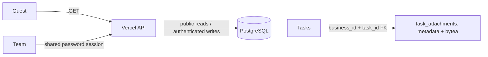

# Zuri-Go 0.3.1 — Guest read-only access

Date: 2026-09-30. Complexity: C-3. Risk: HIGH (production authorization boundary).
Authority: user explicitly requested public viewing without login, Guest mode at the upper right, and shared-team login only when creating/deleting/editing; user also requested Vercel deployment.

This supersedes the mandatory-login-for-reading rule in the 0.3.0 cloud spec. Parent: [Cloud architecture](../../architecture/ARCH-003-hosted-deployment.md). Peers: Business Overview, campaign editor, Meeting/Tasks, Metrics/Graph.

**0.4.0 amendment:** [Member identity](../FEAT-006-member-identity/spec.md) replaces the shared-team password/session references below with individual PID/password sign-in and authenticated Member attribution. Public Guest reads, write-intent modal, action resume, file limits and downloads are unchanged. The old team password/cookie is no longer accepted by 0.4.0.

## Behavior
- An anonymous visitor opens the same live PostgreSQL workspace immediately and sees **Guest mode** in the upper-right authored toolbar, with an explicit login action.
- Session/bootstrap and existing business read routes are public and remain restricted to the configured Business. No arbitrary tenant selection, database credentials or private server files are exposed.
- All state-changing API methods still require a valid shared-team session and same-origin write checks. Guest mutation attempts return 401 and do not change database rows.
- A create/edit/delete UI intent opens a login modal before the editable action starts. After successful login, continue that chosen action. Cancel leaves state unchanged. Navigation, filtering, metric details and read-only views remain available without login.
- Expired sessions return to Guest mode and request login for a write. Logout clears the session and keeps the readable workspace visible.
- The existing shared team password stays unchanged. Shared access still does not identify individual members.

## Verification
1. Anonymous browser renders Overview and current tasks without a login wall; badge is visible.
2. Anonymous API reads succeed; wrong Business fails. Anonymous POST/PATCH/PUT fail with no mutation.
3. Create/edit intents and task-status changes request login; cancelling causes no writes. Successful login resumes the chosen editor.
4. Authenticated edits persist to PostgreSQL; logout preserves readable state and blocks later writes.
5. Build, access regression tests and production browser checks pass; redeploy the same Vercel project and report final URL/version.

## Evidence attachments (user amendment)
- Keep existing evidence text/URLs. Add images and files to a saved Task, up to 2 MiB per file and 5 active files per task. New tasks are saved first, then accept attachments; this avoids orphan files or implicit task creation.
- PostgreSQL `task_attachments`: UUID PK `id`, composite FK `(business_id,task_id)` to Tasks, filename, verified display MIME, byte size, SHA-256, bytea payload, timestamps and soft-delete marker. Forced Business RLS and app-scoped queries match existing ownership.
- Guest may list/download evidence and view task details. Team login is required to upload/remove. Safe raster images (PNG/JPEG/GIF/WebP, signature checked) render previews; all other files download as octet-stream, with nosniff, attachment disposition and sandbox CSP. Do not render user HTML/SVG.
- Upload is bounded JSON/base64 (under Vercel request limit); the server enforces size/count under task lock. Attachment changes are separate explicit saves and are audited, with no raw bytes in events. Removing a file soft-deletes it and makes its download unavailable.
- The existing v2 JSON backup excludes file bytes; full PostgreSQL backup includes them. Local and cloud remain separate databases.
- Verify actual image/file round trip, byte hash, unauthenticated rejection, foreign-business denial, size/count/invalid payload rules, removal and deployment persistence.

## 0.4.2 login amendment

Approved [single-code login](../FEAT-007-single-code-login/spec.md) supersedes PID + password input: the user enters one masked **รหัสระบุตัวตน**. Existing personal codes remain valid; the server resolves exactly one active/enabled owner across all Business credentials. PID remains a stable internal/public member identifier and audit identity. Guest access, sessions, RLS and schema remain unchanged. See [verification](../../releases/0.4.2/verification.md).
