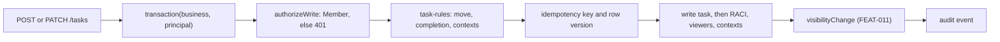

# SDD-010 — Task Manager for every department — design

> **Approved by the owner on 2026-10-01; phase P2 released to production the same day with 0.5.0 ([verification](../../releases/0.5.0/verification.md)).** Designs the approved requirements [FR-010-001…016 and NFR-010-001, NFR-010-002](feature.md#requirement-index) under [ADR-002 and ADR-003](../../architecture/decisions.md). Code cited below exists today unless it is marked *proposed*; line numbers refer to the baseline commit `d57cd9f`. The migration needed its own authorization locally and again for production; it was applied to production on 2026-10-01.

## Scope and delivery

| PLAN-002 phase | Requirements | Note |
|---|---|---|
| P2 — Task Manager | FR-010-001…015, NFR-010-001, NFR-010-002 | Work items WI-06 (migration), WI-07 (API, shared rules, allowlist), WI-08 (boards, Projects view, Workboard as a view) |
| P3 — Meetings | FR-010-009 AC-010-009-05, FR-010-011 AC-010-011-03 | The server-side meeting commit (WI-09) calls the same create operation; the whole-workspace save stops writing tasks in the same release |
| P4 — Workboard consolidation | FR-010-016 | WI-10; owner authorization for production |

- **Visibility is FEAT-011’s and released with it.** This design reuses `canRead`, `visibilityChange`, the `visibility` and `team_id` columns of `tasks` and the layered policies of `006_visibility.sql`; it restates none of them ([FR-011-004](../FEAT-011-visibility-and-confidential-meetings/requirements/FR-011-004-task-project-visibility.md)). It only adds the same columns and policy to `projects`, as [SDD-011](../FEAT-011-visibility-and-confidential-meetings/design.md) reserved.
- **Decisions** taken with the approval are listed under “Decisions (2026-10-01)” below.
- **Campaign records, Member profiles and the meeting pipeline are out of scope** beyond the task contract they call.

## Components

| Module | Domain | Change | Role |
|---|---|---|---|
| `apps/web/src/content/shared/task-rules.mjs` | DOM-TSK | *proposed*, new | Pure task rules shared by the API and the UI: move, completion, contexts, boards, idempotency outcome, project checks. Extracted from `saveTask` (`apps/web/src/content/meeting/model.mjs:35`) |
| `apps/api/tasks.mjs` | DOM-TSK | *proposed*, new | `createTask`, `updateTask`, `readTask`, `listTasks`: the task contract |
| `apps/api/projects.mjs` | DOM-TSK | *proposed*, new | Projects: list, read, create, update |
| `apps/api/campaign-tasks.mjs` | DOM-CAM | *proposed*, new | `saveCampaignTask` (task and details in one transaction through the task contract) and the projection of `campaign.tasks` |
| `apps/api/backfill-workboard.mjs` | DOM-CAM | *proposed*, new | Operator script for the reviewed backfill (dry run, run, reconcile); never part of a routine start or build |
| `apps/api/api.mjs` | DOM-PLT | changed | Routes of the API contract below; must not shadow the attachments route tested first at `:19` |
| `apps/api/service.mjs` | DOM-BIZ | changed | `allocate` (`:32`) gains `projects` (`PRJ`); `TABLES` (`:8`) gains `projects` and `campaign_task_details` so `snapshot` (`:10`) serves them to the viewer |
| `apps/api/workspace.mjs` | DOM-TSK / DOM-CAM | changed | `readLegacy` (`:30`) builds `campaign.tasks` from the projection; `writeCampaigns` (`:58`) stops replacing values that live in details; after P3 `writeDomain` (`:74`) stops writing task rows |
| `apps/api/audience.mjs` | DOM-TSK | changed | Names on a project, once decided (Open items) |
| `apps/api/migrations/007_tasks_projects.sql`, `apps/api/migrate.mjs` | DOM-PLT | *proposed*, new / changed | Additive schema and policies; the file number is provisional until the migration is written |
| `scripts/deploy/build_cloud.py` | DOM-PLT | changed | The new server modules join the allowlist at `:25` and `shared/task-rules.mjs` the list at `:27`; the packager refuses unlisted files (`:47`) and an unlisted import would fail only on Vercel |
| Data App UI (`apps/web/src/content/meeting/`, `dashboard/`) | DOM-TSK / DOM-CAM | changed | Boards, context pickers, Projects view, Workboard as a view, task from a finding. Obeys `apps/web/AGENTS.md` (protected runtime) |

Components have no CMP IDs yet; the module path identifies them until PLAN-001 declares components.

### How a task write flows

A campaign task goes through the same steps, with `saveCampaignTask` writing the details row inside the same transaction.

## Data

The change is additive (NFR-010-002). Every new table keeps `business_id`, the composite foreign keys of the existing model and `FORCE ROW LEVEL SECURITY` with `business_scope` (`006_visibility.sql`, the loop over new tables). `migrate.mjs` gains the file in its list and grants `SELECT, INSERT, UPDATE` through its existing `ALL TABLES` grant (`migrate.mjs:14`).

| Object | Owner | Definition |
|---|---|---|
| `projects` | DOM-TSK | `id uuid PK`, `business_id`, `code text` (`PRJ-nnnn`), `name text` (trimmed, 1–80 characters as `teams`), `description text`, `status text NOT NULL DEFAULT 'active'` checked against `active`, `on_hold`, `done`, `archived`, `owner_member_id` and `team_id` with composite foreign keys, `planned_start`, `planned_end` with `CHECK (planned_end >= planned_start)`, `visibility` and its `CHECK (visibility <> 'team' OR team_id IS NOT NULL)` as on `tasks`, timestamps and `row_version`. `UNIQUE (business_id, id)` and `UNIQUE (business_id, code)`; the `stamp` trigger of `001_core.sql:165` |
| `businesses.next_project_no` | DOM-BIZ | `bigint NOT NULL DEFAULT 1`, read and advanced by `allocate` like `next_task_no` (`001_core.sql:7`) |
| `tasks.project_id` | DOM-TSK | `uuid`, composite foreign key `(business_id, project_id)` to `projects` |
| `tasks.owner_label` | DOM-TSK | `text`; the Workboard owner text until a Member is bound (FR-010-008) |
| `tasks.completion_rule` | DOM-TSK | `text NOT NULL DEFAULT 'standard'` checked against `standard` and `workboard` (FR-010-007) |
| `tasks.idempotency_key`, `tasks.idempotency_hash` | DOM-TSK | `uuid` and `text`, both nullable, with `UNIQUE (business_id, idempotency_key)`. The hash is the SHA-256 of the canonical create body, so a replay with another body is told apart (FR-010-009). Precedent: `publications.idempotency_key` (`001_core.sql:51-53`) and `commit_key` with `commit_payload_hash` (`:128`) |
| `campaign_task_details` | DOM-CAM | `(business_id, task_id)` primary key with a composite foreign key to `tasks`; `gate`, `offer`, `hypothesis`, `action` as `text`; `estimate numeric` (a number in baht on the form, `Forms.jsx:54`); `priority` checked against `Low`, `Medium`, `High`; `original_status` checked against the six Workboard statuses; `outcome text`; timestamps and `row_version` |
| `tasks.team_id`, `tasks.visibility` | DOM-TSK / DOM-IAM | **Exist** since `006_visibility.sql`; not added again. `team_id` is both the team context (FR-010-002) and the team of visibility `team` (FR-011-004) — one column, so PLAN-002 WI-06 adds no `team_id` |

**Campaign, content item and goal keep their columns** (`tasks.campaign_id`, `content_item_id`, `goal_id`, `001_core.sql:93`). The rule that they must not contradict one another (ARCH-002 §5.1) is a server rule in `task-rules.mjs`, not a cross-table `CHECK`, as ARCH-002 §3.8 does for publications.

### Workboard field mapping

ARCH-001 §5 and ARCH-002 §5.1 ask for a mapping manifest before legacy fields move. The Workboard task shape is `Forms.jsx:39`; the status map today is the inline object at `workspace.mjs:68`, in which Backlog and Ready reach `planned` only through the `||'planned'` default.

| Workboard field | After the backfill | Note |
|---|---|---|
| `id` | `legacy_metadata.id`, unchanged | The row ID is already derived from it (`safeId`, `workspace.mjs:9`) |
| `title`, `description` | `tasks.title`, `tasks.description` | Already written (`:68`) |
| `status` | `tasks.status` (Backlog and Ready → `planned`) and `campaign_task_details.original_status` | FR-010-013 shows the original as a badge (Q8, decided 2026-10-01) |
| `owner` | `tasks.owner_label` | No Member is bound (FR-010-008) |
| `due` | `tasks.due_date` | Already written (`:68`) |
| `priority` | `campaign_task_details.priority` | Never converted to MoSCoW |
| `offer`, `gate`, `hypothesis`, `action`, `estimate`, `outcome` | `campaign_task_details` | |
| `dependencies` | `tasks.dependency_note` | The column exists (`001_core.sql:95`) |
| `acceptance`, `evidence` | `tasks.acceptance`, `tasks.evidence` | Columns exist |
| `recheck` | `tasks.recheck_date` | Column exists |
| a Done task | `tasks.completion_rule = 'workboard'` | FR-010-007 |
| whole task JSON | `legacy_metadata`, left untouched | ADR-003 D9 |

### Row-level security

- **`campaign_task_details`** is layer L2 (content follows its item): `EXISTS (SELECT 1 FROM tasks WHERE …)`, so the task’s own policy decides, as for `task_attachments` (SDD-011 “Row-level security”).
- **`projects`** is layer L1 with the audience rule of `006_visibility.sql` (`task_audience`). Its people-named branch cannot be written until the owner decides who is named on a project (Open items); until then the `projects` policy is not written and NFR-010-001 is not measured for it.
- **Guests** read public projects and public tasks only (FR-011-007); a task served to a viewer who cannot read its project carries no project code or name (AC-010-002-05), the way `readLegacy` withholds meeting references (`workspace.mjs:43-44`).

## Read paths

| Path | Today | After |
|---|---|---|
| `GET /state` | Snapshot tables filtered to the viewer (`api.mjs:32`, `service.mjs:10`) | Also `projects` and `campaign_task_details`, limited to the viewer |
| `GET /workspace` | Campaigns with tasks rebuilt from `legacy_metadata` (`workspace.mjs:37`) | `campaign.tasks` is the projection of task rows and details (FR-010-015); meeting-domain tasks unchanged (`:40`) |
| `GET /tasks`, `GET /tasks/:id`, `GET /projects…` | — | New, viewer-filtered (API contract) |
| Attachments | `/tasks/:id/attachments` (`api.mjs:19`) | Unchanged |

## Write paths

- **Per-task writes.** `createTask` and `updateTask` run inside `transaction()` (`db.mjs:7`), call `authorizeWrite` (`member-auth.mjs:27`), apply `task-rules`, and write the row, then its RACI and viewers, then its contexts, then read it back — the write order of SDD-011, since a restricted task can only be read once the rows naming its people exist.
- **Codes and versions.** `allocate` (`service.mjs:32`) gives `TSK-nnnn` and `PRJ-nnnn`. The `stamp` trigger increments `row_version` on every update; `updateTask` compares the client’s `row_version` first, as `save` does (`service.mjs:35`).
- **Idempotency.** A create looks up `(business_id, idempotency_key)`: no row → create; a row with the same hash → return it; a row with another hash → 409.
- **Visibility.** Every change of `visibility` or `team_id` passes `visibilityChange` (`shared/visibility.mjs:24`) and is audited, exactly as in `writeDomain` (`workspace.mjs:90-97`).
- **Campaign tasks.** `saveCampaignTask` writes the task through `createTask` or `updateTask` and the details row in the same transaction; a failure of either rolls back both.
- **`PUT /workspace` stays.** It keeps writing the columns it names; the new columns are outside `T_FIELDS` (`workspace.mjs:12`) so an old client cannot clear them. `writeCampaigns` must stop overwriting campaign-owned values with stale JSON (FR-010-011). After P3 `writeDomain` no longer writes task rows.
- **Projects** are written by `projects.mjs` with the same steps, without RACI; widening is FR-011-011 with the project’s owner.

## API contract (proposed)

An outline for review, not a declaration: API- artifacts wait for PLAN-001 WI-09, and these are in-process calls of SRV-001 behind the existing HTTP surface.

**Conventions (from the existing handler).** Base path `/api/zuri-go/v1/businesses/:businessId`. Writes need the headers `X-Zuri-Go: 1` and `Content-Type: application/json` (`api.mjs:16`). Success answers 200 (`api.mjs:43`). Errors are `{error, code}` (`sendError`, `api.mjs:10`): 401 `AUTH_REQUIRED` for a write without a Member (`cloud.mjs:28`), 403 for another Business, 404 for a missing *or unreadable* item, 409 for a stale `row_version` or a reused idempotency key, 422 for a rule violation with the rule’s code. Field names follow the snake_case of `save` (`service.mjs:35`). IDs are UUIDs; the existing attachments route keeps its looser task ID pattern and is tested first.

| Request | Purpose | Who | Answer |
|---|---|---|---|
| `GET /tasks?board=all\|campaign\|project\|team\|unlinked\|mine&campaign_id=&project_id=&team_id=&status=` | Tasks of a board, readable by the viewer | Guest (public only), Member, operator | `{tasks}`; `board=mine` needs a Member, else 401 |
| `GET /tasks/:id` | One task with roles, viewers, contexts and, for a campaign task, its details | as above | the task object; 404 when unreadable |
| `POST /tasks` | Create. Body: `idempotency_key` (uuid, required), `title` (required) and any of `description`, `deliverable`, `due_date`, `acceptance`, `evidence`, `blocker`, `kpi_note`, `recheck_date`, `status`, `campaign_id`, `project_id`, `team_id`, `content_item_id`, `goal_id`, `visibility`, `viewer_ids`, `roles` (`R`, `A`, `A_confirmed`, `C[]`, `I[]`) | Member, operator | the task object; a replay returns the same task |
| `PATCH /tasks/:id` | Update, including a status move. Body: `row_version` (required) and the fields above, plus `visibility_reason` (sent once, never stored) | Member, operator | the task object; 409 when stale; 422 `BLOCKER_REQUIRED` etc. |
| `GET /projects`, `GET /projects/:id` | Projects readable by the viewer; the page adds task counts per status | as for tasks | `{projects}`; `{project, tasks, counts}` |
| `POST /projects`, `PATCH /projects/:id` | Create with `name` (required) and optional `description`, `status`, `owner_member_id`, `team_id`, `planned_start`, `planned_end`, `visibility`; update with `row_version` | Member, operator | the project object |
| `POST /campaigns/:campaignId/tasks`, `PATCH /campaigns/:campaignId/tasks/:taskId` | Campaign task: the task fields above plus `details` (`gate`, `offer`, `hypothesis`, `action`, `estimate`, `priority`, `original_status`, `outcome`), written together | Member, operator | the task object with `details` |

- **Rule codes** (422) come from `task-rules.mjs`: `TITLE_REQUIRED`, `STATUS_INVALID`, `BLOCKER_REQUIRED`, `R_REQUIRED`, `A_UNCONFIRMED`, `ACCEPTANCE_UNCONFIRMED`, `EVIDENCE_REQUIRED`, `RECHECK_REQUIRED`, `DUE_REQUIRED` (Q7, decided 2026-10-01), `CONTEXT_CONFLICT`. The visibility errors keep their FEAT-011 codes and statuses (`CHANGE_ERRORS`, `workspace.mjs:72`).
- **Unknown fields** are refused with 422; `actor`, `memberId` and `pid` are ignored (FR-010-010).
- **Campaign-only fields** sent to `/tasks` are refused; they are accepted only under `/campaigns/…` (FR-010-012).
- **Compatibility.** `GET` and `PUT /workspace` are unchanged in shape (FR-010-011).
- **Not in this outline:** a bulk create for meeting commits (WI-09 decides whether it loops over `POST /tasks` in one transaction), delete, and reorder within a lane (PLAN-002 Q10, later).

## Failure modes

| Failure | Behavior |
|---|---|
| A write without a Member | 401 `AUTH_REQUIRED`; nothing changes |
| Stale `row_version`, a reused idempotency key with another body, or a task ID held by an item the viewer cannot read | 409 with the existing “reload” message; the last case does not reveal the item |
| A rule violation (blocker, completion, contexts, dates) | 422 with the rule’s code; nothing is stored |
| Task row written, RACI, viewers, contexts or details fail | The transaction rolls back; no half task (AC-010-009-07, AC-010-012-01) |
| Two requests with the same idempotency key at once | The unique key makes one of them fail with `23505`, which becomes 409 and a retry returns the stored task |
| An old client saves the workspace | New columns are not in `T_FIELDS` and stay; a save that omits an existing task still fails with 409 (`workspace.mjs:101`) |
| The packaged site lacks a new module | `build_cloud.py` refuses an unlisted file but does not detect a missing import; the deployment check must exercise a task route on the unique deployment before promotion |
| Backfill run twice, or interrupted | Idempotent: a row already carrying details and a marker is skipped; an interrupted run is one transaction per campaign and resumes |
| Backfill count differs from the dry run | The run stops before commit and reports the difference; nothing is promoted |
| A Blocked Workboard task without a blocker | Kept valid, shown as Blocked; the move rule applies only when a person moves a task into Blocked (Open items) |

## Interfaces

Signatures marked **pure** have no I/O; each lists acceptance examples and holdout examples the implementer does not see (STD-005 R2). Signatures marked *proposed* do not exist yet; the others are cited as they are today.

- **FR-010-001, -006, -007, -010** · `apps/web/src/content/meeting/model.mjs` · `saveTask(state, input, {week, priority, priorityNote}) → taskId` — **exists**, `:35`. Its rules move to `task-rules.mjs`; the function then calls them.
- **FR-010-006** · `shared/task-rules.mjs` · `moveError(task, toStatus) → code | null` — **pure**, *proposed*.
  - acceptance: a task with no blocker moved to `blocked` → `BLOCKER_REQUIRED`; the same task moved to `doing` → null.
  - holdout: a blocker present, moved to `blocked` → null; `toStatus = 'archived'` → `STATUS_INVALID`; moved to `done` without evidence → the code of `completionError`.
- **FR-010-007** · `shared/task-rules.mjs` · `completionError(task) → code | null` — **pure**, *proposed*.
  - acceptance: R, confirmed A, confirmed acceptance and evidence present → null; evidence empty → `EVIDENCE_REQUIRED`.
  - holdout: `kpi` set and no recheck date → `RECHECK_REQUIRED`; a campaign gate set and no recheck date → `RECHECK_REQUIRED`; a campaign context and no due date → `DUE_REQUIRED` (Q7, decided 2026-10-01); A present but not confirmed → `A_UNCONFIRMED`.
- **FR-010-002** · `shared/task-rules.mjs` · `contextError(task, {contentItem, goal}) → code | null` — **pure**, *proposed*.
  - acceptance: task campaign B with a content item of campaign A → `CONTEXT_CONFLICT`; no contexts → null.
  - holdout: a goal of campaign A and the task in campaign A → null; content item and goal of different campaigns → `CONTEXT_CONFLICT`.
- **FR-010-005** · `shared/task-rules.mjs` · `onBoard(task, board, memberId) → boolean` — **pure**, *proposed*. `board` is `{kind, id?}` with `kind` one of `all`, `campaign`, `project`, `team`, `unlinked`, `mine`.
  - acceptance: a task of campaign `c1` is on `{kind:'campaign', id:'c1'}`; a task with no contexts is on `{kind:'unlinked'}`; a task with a campaign is not.
  - holdout: a task of campaign `c1` and project `p1` is on both boards; `mine` holds a task whose R is the Member and not one where the Member is unnamed.
- **FR-010-009** · `shared/task-rules.mjs` · `idempotencyOutcome(existing, payloadHash) → 'create' | 'replay' | 'conflict'` — **pure**, *proposed*.
  - acceptance: no stored row → `create`; a stored row with the same hash → `replay`.
  - holdout: a stored row with another hash → `conflict`.
- **FR-010-003** · `shared/task-rules.mjs` · `projectError(project) → code | null` — **pure**, *proposed*.
  - acceptance: a name only → null; a status outside the four → `STATUS_INVALID`.
  - holdout: end before start → `DATES_INVALID`; a blank name → `NAME_REQUIRED`.
- **FR-010-016, -015** · `apps/api/campaign-tasks.mjs` · `workboardFields(workboardTask) → {task, details}` — **pure**, *proposed*; the mapping table above.
  - acceptance: status `Ready` → task status `planned` and `details.original_status = 'Ready'`; owner “Chef” → `owner_label = 'Chef'` and no role.
  - holdout: `Done` → `completion_rule = 'workboard'`; `Blocked` with no blocker → status `blocked`, blocker null.
- **FR-010-015** · `apps/api/campaign-tasks.mjs` · `projectCampaignTasks(taskRows, detailRows) → WorkboardTask[]` — **pure**, *proposed*. The inverse of `workboardFields`.
  - acceptance: `workboardFields` followed by `projectCampaignTasks` returns the original Workboard task.
  - holdout: a task with no details row is omitted.
- **FR-010-009, -010, -001, -002, -006, -007, -008** · `apps/api/tasks.mjs` · `createTask(client, businessId, input, viewer) → Task`; `updateTask(client, businessId, id, input, viewer) → Task`; `readTask(client, businessId, id, viewer) → Task`; `listTasks(client, businessId, query, viewer) → Task[]` — *proposed*. Own `tasks`, `task_roles` and `task_viewers` writes through the existing tables; read `projects`, `teams`, `campaigns`, `content_items`, `goals`. Expose the `/tasks` routes.
- **FR-010-003, -004** · `apps/api/projects.mjs` · `listProjects`, `readProject`, `createProject`, `updateProject` (all `(client, businessId, …, viewer)`) — *proposed*. Own `projects`; expose the `/projects` routes.
- **FR-010-012, -013, -014** · `apps/api/campaign-tasks.mjs` · `saveCampaignTask(client, businessId, campaignId, input, viewer) → Task` — *proposed*. Owns `campaign_task_details`; calls `createTask` or `updateTask`; exposes the `/campaigns/…/tasks` routes.
- **FR-010-016** · `apps/api/backfill-workboard.mjs` · `backfillWorkboard(client, businessId, {dryRun}) → report` — *proposed*. Reads `tasks` with `source_kind = 'campaign-legacy'`; writes `campaign_task_details`, `owner_label` and `completion_rule`.
- **FR-010-011, -015** · `apps/api/workspace.mjs` · `readLegacy(client, businessId, viewer) → Workspace` (`:30`), `writeCampaigns(client, businessId, workspace, initial) → Map` (`:58`), `saveLegacy(client, businessId, input) → Workspace` (`:141`) — **exist**; their signatures are unchanged and their bodies change as in Write paths.
- **FR-010-010** · `shared/visibility.mjs` · `canRead` (`:13`), `visibilityChange` (`:24`); `apps/api/member-auth.mjs` · `authorizeWrite(client, businessId) → Member` (`:27`); `apps/api/service.mjs` · `allocate` (`:32`), `audit` (`:29`) — **exist**, reused as they are.
- **NFR-010-001, NFR-010-002** · `apps/api/migrations/007_tasks_projects.sql` · the schema and policies in Data — *proposed*.

## Tests

TC IDs are not assigned yet (PLAN-001 WI-08); these are the planned tests and the criteria they cover. Every read path runs for the five viewers of ADR-004: a Guest, a Member outside the team, a team Member, a named person and the local operator.

1. `apps/api/test/task-rules.test.mjs` *(proposed)*: the pure rules above, holdout examples included.
2. `apps/api/test/tasks-api.test.mjs` *(proposed)*: create, replay, conflict, stale version, unknown field, Guest 401, unreadable 404, the rule codes (FR-010-009, -010).
3. `apps/api/test/database.test.mjs`, extended: direct queries on `projects` and `campaign_task_details` as each viewer kind (NFR-010-001); the previous release’s suite against the migrated local database (NFR-010-002).
4. `apps/api/test/cloud-handler.test.mjs`, extended: `PUT /workspace` from a client without the new fields leaves them intact (FR-010-011).
5. A migration and backfill rehearsal on a QA Business: equal counts before and after the migration; dry run, run, second run (FR-010-016).
6. The UI (boards, pickers, Workboard view): checked with approved browser tools, or reported as not run.

## Decisions (2026-10-01)

Taken by the owner with the approval, or, where marked *default*, taken for P2 as the reversible, conservative reading, for the owner to confirm. The *default* items were confirmed on 2026-10-01 (delegated by the owner, PLAN-002 Q16).

- **PLAN-002 Q6–Q11 as recommended:** a task may have a campaign and a project at once; a task with a campaign context needs a due date before Done; Backlog and Ready become `planned` with the original status as a badge; menu names “Task Manager” and “Meetings”; no reordering within a lane yet; DOM-TSK and DOM-MTG are adopted and frozen. Q12 is asked again at P4.
- **People named on a project (owner):** its owner and an explicit viewers list, `project_viewers`, like `task_viewers`. A project must have an owner Member.
- **“My tasks” (owner):** tasks whose R or A is the Member.
- **Project progress (*default*):** task counts per status, as FR-010-003 states; no percentage.
- **Blocked Workboard tasks without a blocker (*default*):** kept valid; the blocker is required only when a person moves a task into Blocked.
- **Backlog and Ready on the campaign form (*default*, as built):** the Workboard form keeps its six statuses, which map onto the five lanes (Backlog and Ready → `planned`, kept as the badge); the Workboard counts and filters by the five lanes.
- **Removing a campaign link from a task with details (*default*):** the details row is kept and no longer shown, so re-linking restores it; nothing is deleted.
- **Before the backfill (P4) (*design change*):** a campaign task without a details row is projected from its `legacy_metadata`, not omitted, so the Workboard keeps every task until FR-010-016 runs.
- **`PUT /workspace` after P3:** decided with WI-09, not in P2.

## Changes found while building P2 (2026-10-01)

- **Done Workboard tasks before the backfill.** The new column defaults to `standard` and the migration may not rewrite rows (NFR-010-002), so a campaign-legacy task that is Done and has no details row is served and saved as `workboard` until P4 records it (AC-010-007-03).
- **Workboard saves write details.** `writeWorkboardEntry` gives a Workboard task its details row and owner label the first time it is saved, the same values the backfill would write; untouched tasks wait for P4.
- **A new completion from the Workboard follows the standard rule.** Moving a Workboard task to Done through `PUT /workspace` now needs an R, a confirmed A, acceptance and evidence (FR-010-007); Workboard users bind an R first.
- **Tasks created in the Task Manager for a campaign** appear in its Workboard (`campaign.tasks`) and a Workboard save lands on the same record; its `source_kind` and metadata are kept.
- **One UPDATE per task write.** The people are written first and the fields and new audience in one `UPDATE`, so `row_version` rises by one; removing oneself while restricting is refused (`SELF_EXCLUDED`).
- **Idempotent campaign creates** store details only when none exist, so a replay never changes them.
- **History of projects** uses a new restrictive policy `follows_project` beside `follows_entity`, which stays unchanged (additive migration).
- **Response shapes** (as built): a single task or project is returned as the object itself; lists are `{tasks}` and `{projects}`; a project page is `{project, tasks, counts}`.
- **Hosted query parameters** reach the handler through the rewrite's query string (`route=…&board=…`).

## Design gaps decided (2026-10-01)

The owner decided the gaps of the WI-12 requirement files on 2026-10-01 ([PLAN-002 “Design gaps decided”](../../governance/plans/PLAN-002-task-and-meeting-domains.md#design-gaps-decided-2026-10-01)). Only the decisions that change what this design says are listed. The code of D2, D3 and D12 is built locally and not released (production still runs 0.5.0).

- **D1 — the meeting commit is the task domain’s contract.** The table “Scope and delivery” says the commit of WI-09 “calls the same create operation”. It does not: it writes its tasks through `writeDomain`. Accepted: that in-process call applies the same task rules, audit and single transaction, and counts as the contract of ADR-002 D2 and AC-010-009-05. No code change ([FR-010-009](requirements/FR-010-009-task-api-create-update.md) Notes).
- **D2 — the server refuses an Inactive Member in a new role.** After `checkPeople`, `createTask` and `updateTask` call `checkActive` (`apps/api/tasks.mjs`): a new R, A, C or I naming an Inactive Member is refused with 422 `MEMBER_INACTIVE`; a role the task already had with that Member is kept; named viewers are access, not work, and may be Inactive. `writeDomain` applies the same rule to the workspace save and so to the meeting commit, except for the operator’s backup import. As a failure mode (not yet a row of the table above): a new R, A, C or I naming an Inactive Member answers 422 `MEMBER_INACTIVE` and nothing is stored ([FR-010-019](requirements/FR-010-019-assign-by-member.md) AC-010-019-05).
- **D3 — who adds a Member from the task form.** The quick add “＋ เพิ่ม Member จากฟอร์มนี้” is offered only to the Business admin and the local operator; the server refuses a Member added by anyone else with 403 (DOM-IAM, [FR-006-001](../FEAT-006-member-identity/requirements/FR-006-001-register-member.md) AC-006-001-07). Other Members pick from the registered Members.
- **D5 — R and A may be the same Member.** `task_roles` and the task rules keep allowing it; nothing is added ([FR-010-018](requirements/FR-010-018-raci-rules.md) AC-010-018-07).
- **D10 — no per-task weekly MoSCoW operation yet.** The API contract above carries no weekly priority; it is written through the workspace save and the meeting commit, and a per-task operation is later ([FR-010-020](requirements/FR-010-020-moscow-values.md)).
- **D12 — no history event for an unchanged weekly priority.** The workspace model (`model.mjs:setPriority`) writes the `priority` event only when the priority or the note changes, so choosing a week with no priority, and the seed, leave no event ([FR-010-022](requirements/FR-010-022-priority-per-week.md) AC-010-022-06).

## Open items

- **API- / EVT- contracts.** The boundaries are in-process calls within SRV-001; their declarations wait for PLAN-001 WI-09.
- **Before building the schema:** the migration needs its own authorization, locally and again for production; the production backfill needs another (PLAN-002 Q12). Done: migration 007 was applied locally and to production (2026-10-01); the production backfill was not needed (dry run: 0 Workboard tasks).
