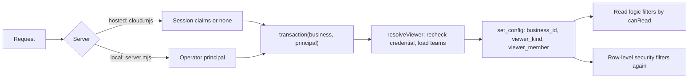

# SDD-011 — Visibility, teams and confidential meetings — design

> **Approved by the owner on 2026-10-01; built and released to production the same day with 0.5.0 ([verification](../../releases/0.5.0/verification.md)).** Designs the approved requirements [FR-011-001…012 and NFR-011-001](feature.md#requirement-index) under [ADR-004](../../architecture/decisions.md) (approved). The schema change (migration 006) and the production change each needed their own authorization (AGENTS.md, [PLAN-002](../../governance/plans/PLAN-002-task-and-meeting-domains.md)); both were given and applied on 2026-10-01.

## Scope and delivery

| PLAN-002 phase | Requirements | Note |
|---|---|---|
| P1 — Visibility | FR-011-001…008, FR-011-011, FR-011-012, NFR-011-001 | FR-011-006 in full: visibility, team and participants of meetings |
| P3 — Meetings | FR-011-009, FR-011-010 | Delivered with the server-side meeting commit (PLAN-002 WI-09), which changes FEAT-004 |

- **Before P3 the hosted API fails closed.** It refuses transcript revisions and draft batches for a `restricted` meeting (see Failure modes). A restricted meeting can therefore exist in production only with its title, date and participants. P3 is released (0.5.0), so the hosted API now stores a stub instead.
- **Projects come later.** FEAT-010 creates the `projects` table (WI-06). This design fixes that table's visibility columns and policy now, so FR-011-004 applies to projects the day the table exists.
- **Campaign records and Member profiles are out of scope** (FR-011-007, PLAN-002 Q1). Campaign tasks are not: they are `tasks` rows, so they follow the rule below (see Data).

## Components

| Module | Domain | Change | Role |
|---|---|---|---|
| `apps/api/viewer.mjs` | DOM-IAM | new | Resolves the viewer from the session and loads its teams |
| `apps/api/db.mjs` | DOM-PLT | changed | `transaction()` receives a principal, resolves the viewer and sets it for row-level security |
| `apps/api/cloud.mjs` | DOM-IAM | changed | Hands the session claims to every request, reads included; Guest when there are none |
| `apps/api/server.mjs` | DOM-PLT | changed | The local server always acts as the operator principal |
| `apps/api/api.mjs` | DOM-PLT | changed | Passes the viewer through and adds the `teams` routes |
| `apps/api/teams.mjs` | DOM-IAM | new | Teams and team membership; admin check |
| `apps/web/src/content/shared/visibility.mjs` | DOM-TSK | new | Pure audience and change rules, shared by the API and the UI |
| `apps/api/audience.mjs` | DOM-TSK / DOM-MTG | new | Application filter: loads the people named on tasks and meetings and keeps the rows `canRead` allows (added while building) |
| `apps/api/service.mjs` | DOM-BIZ | changed | `snapshot()` and `brief()` see only the viewer's rows; the brief cache key includes the audience |
| `apps/api/workspace.mjs` | DOM-TSK / DOM-MTG | changed | Viewer-scoped read; viewer-scoped merge on save |
| `apps/api/attachments.mjs` | DOM-TSK | changed | Attachments of an unseen task answer 404 |
| `apps/api/provision-members.mjs` | DOM-IAM | changed | `--admin <PID>` and `--no-admin <PID>` operator flags |
| `apps/api/migrations/006_visibility.sql`, `apps/api/migrate.mjs` | DOM-PLT | new / changed | Additive schema, policies and grants (schema 6) |
| Data App UI (`business/`, `meeting/`, new `meeting/Visibility.jsx`) | DOM-TSK / DOM-MTG | changed | Visibility, team and people pickers; team management; sign-in prompt for Guests (PLAN-002 WI-04) |

Components have no CMP IDs yet; the module path identifies them until PLAN-001 declares components.

### How a request flows

## Viewer

A viewer is `{kind, memberId, teamIds, admin}`, where `kind` is `guest`, `member` or `operator` (FR-011-003).

- **Hosted (SRV-001).**
  - `cloud.mjs` reads the claims on every request, as it already does at `cloud.mjs:26`.
  - Inside the transaction, `resolveViewer` rechecks the claims the way `resolveMember` does for writes today (`member-auth.mjs:21-25`): the Member is active, the credential is enabled and the credential version matches. The result is a `member` viewer.
  - Missing, expired, tampered or wrong-Business claims give a `guest` viewer (AC-011-003-02, AC-011-007-05).
  - Writes still require a Member: 401 `AUTH_REQUIRED`, as today (`cloud.mjs:27`, `member-auth.mjs:26-31`).
- **Local (SRV-002).** `server.mjs` passes the operator principal, so the viewer is `operator` and sees the whole local database (AC-011-003-04, ADR-004 D6).
- **The hosted runtime can never be the operator.** `transaction()` throws when an operator principal reaches it with `VERCEL=1`, and the only principal `cloud.mjs` can build is a session principal.
- **Request fields never select the viewer.** `memberId`, `pid` and `actor` in a query or body are ignored (AC-011-003-03).
- **Teams.** `teamIds` holds every team the Member belongs to, archived teams included, so their existing items stay visible (AC-011-001-04).
- **Admin.** `admin` comes from `members.is_business_admin`. Only team management reads it; the audience rule never does (FR-011-002, ADR-004 D7).
- **Database settings.** `transaction()` sets `zuri_go.viewer_kind` and `zuri_go.viewer_member` with `set_config(…, true)`, next to `zuri_go.business_id` (`db.mjs:6`, AC-011-003-05).
  - The settings are transaction-local, so pooled connections never carry them over.
  - A missing setting reads as `guest`.
- **Writes use the same viewer.** `authorizeWrite` takes the viewer that `transaction()` already resolved instead of resolving the Member a second time. It keeps the `FOR UPDATE` lock on the Business row.

## Audience rule

`canRead(viewer, item, named)` is pure and shared by the API and the UI. `named` is the set of people named on the item:

- for a task: its R, A, C and I, plus its `task_viewers`;
- for a meeting: its `meeting_participants`, the organizer included.

| Visibility | `guest` | `member` | `operator` |
|---|---|---|---|
| `public` | yes | yes | yes |
| `business` | no | yes | yes |
| `team` | no | if the item's team is one of `teamIds`, or the Member is named | yes |
| `restricted` | no | if the Member is named | yes |

**Changing visibility.** `visibilityChange` rules on every change of `visibility` or `team_id` (FR-011-011, AC-011-006-04). Breadth runs `restricted` < `team` < `business` < `public`.

- **Widening** is any move to a broader level, and moving a `team` item to another team. It needs:
  - the task's A, or the meeting's organizer (the local operator may also widen);
  - a non-empty reason.
- **Narrowing** is open to any editor who can read the item, with no reason needed.
- **Refused in every case:**
  - `team` without a team (AC-011-004-02);
  - `restricted` with nobody named;
  - a change after which the actor can no longer read the item. The actor must name themselves first, so no one can lose an item by accident.
- **Audit.** Every change writes one audit event with the old and new level, the reason and the session actor (AC-011-011-02).

**Campaign tasks.** Workboard tasks with `source_kind = 'campaign-legacy'` stay `business` in P1, and the API refuses another level for them. Per-task visibility on campaign tasks arrives with the Workboard consolidation (PLAN-002 P4).

## Data

Migration `006_visibility.sql` is additive: it adds tables, columns, indexes and policies, and it deletes and rewrites nothing. `migrate.mjs` adds `[6,'006_visibility.sql']` to its list, grants `DELETE` on the three membership tables as it does for `task_roles` (`migrate.mjs:15`), and reports schema 6.

| Object | Owner | Definition |
|---|---|---|
| `teams` | DOM-IAM | `id`, `business_id`, `name`, `archived_at`, timestamps, `row_version`. Unique `(business_id, id)`; unique active name per Business |
| `team_members` | DOM-IAM | `(business_id, team_id, member_id)` primary key, composite foreign keys, `created_at`. Index on `(business_id, member_id)` |
| `members.is_business_admin` | DOM-IAM | `boolean NOT NULL DEFAULT false`; set only by `provision-members.mjs` |
| `tasks.visibility`, `tasks.team_id` | DOM-TSK | `text NOT NULL DEFAULT 'business'` checked against the four levels. `team_id` has a composite foreign key to `teams`. `CHECK (visibility <> 'team' OR team_id IS NOT NULL)` |
| `task_viewers` | DOM-TSK | `(business_id, task_id, member_id)` primary key, `added_by_member_id`, `created_at`. Index on `(business_id, member_id)` |
| `meetings.visibility`, `meetings.team_id` | DOM-MTG | As on `tasks` |
| `meetings.transcript_custody` | DOM-MTG | `text NOT NULL DEFAULT 'cloud'`, checked against `local_only` and `cloud`. The app sets `local_only` when a meeting becomes `restricted` (P3) |
| `meeting_participants` | DOM-MTG | `(business_id, meeting_id, member_id)` primary key, `role` (`organizer` or `participant`), at most one organizer per meeting. Index on `(business_id, member_id)` |
| `projects.visibility`, `projects.team_id` | DOM-TSK | Added with the `projects` table by FEAT-010 WI-06, as on `tasks` |

- **Existing rows** (FR-011-012). `ADD COLUMN … DEFAULT 'business'` gives every existing task and meeting the level `business` and changes no other field.
  - Before and after the migration, a reconciliation query counts tasks, `task_roles`, `weekly_plan_tasks`, `task_attachments` and `change_events` per Business. The counts must be equal (AC-011-012-02).
  - In production the migration runs only after `npm run backup` and with the owner's specific authorization (AC-011-012-03).
- **Campaign tasks.** Workboard tasks are `tasks` rows with `source_kind = 'campaign-legacy'`; `readLegacy` rebuilds each campaign's `tasks` array from them (`workspace.mjs:20`). `campaign_states.state_json` never holds them, because both writers remove `tasks` first (`workspace.mjs:40`, `service.mjs:70`). The row filter on `tasks` therefore also removes them from campaigns (AC-011-007-01).

### Row-level security

The policies are layered so that no policy refers back to itself. PostgreSQL rejects a cycle, for example `tasks` → `task_roles` → `tasks`, as infinite recursion. Two SQL helpers read the settings:

- `zuri_go.viewer_kind()` returns the setting, or `'guest'` when it is missing;
- `zuri_go.viewer_member()` returns the member ID, or null.

Both are `STABLE` and `SECURITY INVOKER`. Migration 005 had to disable row-level security to backfill (`005_member_identity.sql:23-34`), which shows that the owning role is itself subject to it, so a `SECURITY DEFINER` bypass is neither available nor wanted.

| Layer | Tables | Read policy, in addition to `business_scope` |
|---|---|---|
| L0 — membership | `team_members`, `task_roles`, `task_viewers`, `meeting_participants` | `viewer_kind() IN ('member','operator')` |
| L1 — items | `tasks`, `meetings`, later `projects` | The audience rule in SQL. The people named are found through L0 with `EXISTS … member_id = viewer_member()`, and team membership through `team_members` |
| L2 — content | `task_attachments`, `weekly_plan_tasks` (via `tasks`); `meeting_revisions`, `meeting_draft_batches` (via `meetings`); `meeting_task_links` (via `meeting_draft_batches`) | `EXISTS (SELECT 1 FROM <parent> WHERE id = <fk>)`. The parent's own policy decides, so content follows its item |
| L2 — history | `change_events` | `viewer_kind() IN ('member','operator')`, and for task and meeting entity types `EXISTS` of the visible task, attachment or meeting named by `entity_id`. `legacy_task_event` rows whose `entity_id` is the Business stay visible to Members |
| — | `ai_briefs` | `viewer_kind() IN ('member','operator')` |

- **Only reads carry the audience rule.** `INSERT` and `UPDATE` keep `business_scope` in `WITH CHECK`. `UPDATE` and `SELECT` both carry the audience rule in `USING`, so nobody can change or read a row they cannot see.
- **Write order.** A restricted task can only be seen once the rows that name its people exist. Task and meeting writes therefore:
  - insert or update the item without `RETURNING` or `ON CONFLICT`: a plain `INSERT` without `RETURNING` checks only `WITH CHECK`, while `ON CONFLICT` and `RETURNING` apply the read policy to the new row;
  - then write the RACI, viewers and participants;
  - then read the row back.
  - The generic `upsert` in `workspace.mjs:12-14` stays in use for other tables.
- **Residual gap.** L0 rows hold IDs only, never titles or text. A signed-in Member could read them for items outside their audience only through a code path that forgot its filter. The application filters them, and the direct-query test (NFR-011-001) covers them.
- **Guests and people.** Guests see public tasks without their RACI or viewers, because L0 is closed to Guests.

## Read paths

| Path | Today | After |
|---|---|---|
| `GET /session` (hosted) | Identity only (`cloud.mjs:28`) | Also the viewer's `admin` flag and team IDs, for the UI |
| `GET /bootstrap` | Business row (`api.mjs:16`) | Unchanged |
| `GET /state` | Every snapshot table (`api.mjs:30`, `service.mjs:7-10`) | `tasks`, `task_roles` and `weekly_plan_tasks` limited to the viewer |
| `GET /overview` | Overview over the full snapshot (`api.mjs:31`, `model.mjs:54`) | Built from the viewer's snapshot, so hidden tasks are neither listed nor counted (AC-011-008-02) |
| `POST /briefs` | Input and cache key from the full snapshot (`service.mjs:92`) | Input from the viewer's snapshot. The cache key adds `audienceKey`, a hash of the IDs and versions of the visible tasks, so a brief built for a wider audience is never returned to a narrower one (AC-011-008-03) |
| `GET /workspace` | Tasks, meetings, transcripts and history (`workspace.mjs:16-31`) | Only visible tasks, their roles, weekly entries and events; only visible meetings with their revisions and batches; each campaign carries only its visible tasks. The UI backup (“Backup ข้อมูลที่เห็น”) is built from this response, so it holds only what the viewer sees (AC-011-008-04) |
| Attachments list and download | Found by task ID alone (`attachments.mjs:22`) | Found only among visible tasks. Unseen and missing both answer 404 `ไม่พบงาน` (AC-011-007-02, AC-011-008-01) |
| `GET /teams` (new) | — | Members and the operator get the Business's teams; Guests get 401 |
| Imports | Local operator only (`cloud.mjs:30`) | Unchanged |

## Write paths

- **`PUT /workspace` becomes a merge scoped to the viewer.** Today the save demands every existing task and Member (`workspace.mjs:62-63`), then rewrites each task's roles (`:66-68`). After the change:
  - Only tasks and meetings the viewer can read must be present. Items the viewer cannot see are never read, rewritten or stripped of their roles.
  - A submitted task or meeting whose ID exists but is hidden from the viewer is refused with the generic 409 “reload” answer, which does not reveal the item.
  - An event whose `taskId` names a hidden task is refused the same way (`workspace.mjs:79`).
  - Task payloads gain `visibility`, `teamId`, `viewerIds` and `visibilityReason`; meeting payloads gain `visibility`, `teamId`, `participantIds` and `organizerId`. Every change passes `visibilityChange`.
  - `domain_revision` stays Business-wide. A change to a hidden item still makes a Member's next save return 409 and reload, which is a timing signal and not content.
- **Teams (FR-011-001).**
  - `POST /teams` takes `{name}`.
  - `PATCH /teams/:id` takes `{name?, archived?, memberIds?}`; `memberIds` replaces the whole membership.
  - Only an admin may call them. Any other Member gets 403 and nothing changes (AC-011-001-02).
  - Each change writes an audit event with the admin as actor.
- **Admin (FR-011-002).**
  - Set on the operator path only: `provision-members.mjs --admin <PID>` and `--no-admin <PID>`, validated like `--reset` (`provision-members.mjs:49-50`).
  - The command writes an audit event with actor kind `local_operator` and subject `provision-members`.
  - Any API body that carries an admin field is refused, because the `members` resource does not list the field (`service.mjs:13`, `:28`).
- **Named viewers (FR-011-005).** They are written in the same transaction as the task, and each change writes an audit event. The event's `entity_type` is `task_viewers` and its `entity_id` is the task ID, so the history policy can find the task.

## Meetings (P3)

- **Tasks from a confidential meeting (FR-011-009).**
  - `meetingAudience(meeting, participants)` returns `{visibility: 'restricted', viewerIds: participants}` for a restricted meeting, and nothing for any other meeting.
  - The server-side meeting commit (WI-09) applies that audience to every task it creates.
  - Evidence quotes stay in `meeting_task_links`, which follows the meeting (L2). A person who can read the task but not the meeting gets the task with `evidence: {withheld: true}`; the UI then shows the confidential-meeting note (AC-011-009-02).
  - Widening the task never touches the quotes (AC-011-009-03).
- **Transcript custody (FR-011-010).**
  - For a meeting with `transcript_custody = 'local_only'`, the hosted API stores a revision as a stub: its `content_hash`, lineage and `segments = []`, with `{withheld: true}` in `legacy_metadata`. Draft-batch items are stored without evidence text.
  - The recording machine keeps the full content; the stored hash lets that machine prove its local copy matches.
  - Uploading the transcript needs a participant, a reason and an explicit request. It sets `transcript_custody = 'cloud'`, stores the segments under the meeting's audience and writes an audit event (AC-011-010-02).
  - A meeting that is not restricted keeps today's rule: the user chooses and sees the scope before a transcript goes to the cloud (AC-011-010-04).

## Failure modes

| Failure | Behavior |
|---|---|
| The viewer settings are missing in a transaction | The policies read `guest`: the fewest rows, never more |
| A session is expired, tampered or from another Business on a read | Guest view. The UI shows a sign-in prompt where work is hidden (AC-011-007-03) |
| An operator principal reaches the hosted runtime | `transaction()` throws before any query. The response is 500, and the log holds the code only |
| A policy refers to itself | Prevented by the layers (L0 → L1 → L2). A migration test creates the policies and queries each table once |
| A read path forgets to filter | Row-level security still returns only the viewer's rows (NFR-011-001) |
| A widening request without the A or the organizer, or without a reason | 403 `VISIBILITY_WIDEN_DENIED` or 422 `REASON_REQUIRED`; nothing changes |
| `team` without a team, `restricted` with nobody named, or the actor locked out | 422, backed for `team` by the database `CHECK` |
| Before P3, a transcript or draft batch arrives on the hosted API for a restricted meeting | Superseded by P3: a Member's save stores stubs for a `local_only` meeting (see "Changes found while building P3") |
| An error on a restricted item | The logs hold the error code and IDs only (`api.mjs:9` already logs only `e.code \|\| e.name`); request bodies are never logged (AC-011-008-05) |
| The source is rolled back after migration 006 | Old code ignores the new columns and shows everything to Guests again. A rollback therefore reopens the exposure and needs its own decision (AGENTS.md) |
| Performance | Every visible row costs a few `EXISTS` lookups on indexed membership tables. Production held 11 tasks (12 at the 0.5.0 release) and no meetings |

## Interfaces

Signatures marked **pure** have no I/O; each lists acceptance examples, and holdout examples the implementer does not see (STD-005 R2 shape, per ADR-001 D1). The boundaries between the parts are in-process calls within SRV-001, and their API-/EVT- declarations wait for PLAN-001 WI-09.

- **FR-011-003** · `apps/api/viewer.mjs` · `resolveViewer(client, businessId, principal) → Viewer`. `principal` is `{kind:'operator'}` or `{kind:'session', claims}`; reads `members`, `member_credentials` and `team_members`.
- **FR-011-003** · `apps/api/db.mjs` · `transaction(businessId, principal, fn) → result`. Sets `zuri_go.business_id`, `zuri_go.viewer_kind` and `zuri_go.viewer_member`, and exposes `client.zuriViewer`.
- **FR-011-003** · `apps/api/viewer.mjs` · `viewerSettings(viewer) → {kind, member}` — **pure**.
  - acceptance: operator → `{kind:'operator', member:''}`; a Member → `{kind:'member', member:<uuid>}`.
  - holdout: a Guest → `{kind:'guest', member:''}`.
- **FR-011-004, -006, -007** · `shared/visibility.mjs` · `canRead(viewer, item, named) → boolean` — **pure**.
  - acceptance: Guest with `public` → true; Guest with `business` → false; a Member of the item's team with `team` → true; a Member not in the team but named, with `team` → true; an admin who is not named, with `restricted` → false.
  - holdout: operator with `restricted` → true; a Member not named, with `restricted` → false; a Member in another team, not named, with `team` → false.
- **FR-011-011, -006** · `shared/visibility.mjs` · `visibilityChange(viewer, before, after, {accountableId, organizerId, reason, named}) → {ok:true} | {error}` — **pure**. `error` is one of `LEVEL_INVALID`, `WIDEN_DENIED`, `REASON_REQUIRED`, `TEAM_REQUIRED`, `NAMED_REQUIRED` or `SELF_EXCLUDED`.
  - acceptance: the R widens `restricted` → `business` → `WIDEN_DENIED`; the A does so with a reason → ok; any editor narrows `business` → `team` with a team and no reason → ok.
  - holdout: the A widens without a reason → `REASON_REQUIRED`; `team` without a team → `TEAM_REQUIRED`; an actor narrows to `restricted` without being named → `SELF_EXCLUDED`.
- **FR-011-001** · `apps/api/teams.mjs` · `listTeams(client, businessId, viewer) → Team[]`; `saveTeam(client, businessId, viewer, input, id?) → Team`. Owns `teams` and `team_members`; exposes `GET`, `POST /teams` and `PATCH /teams/:id`.
- **FR-011-002** · `apps/api/provision-members.mjs` · `provisionMembers(cfg, folder, {adminPid?, revokeAdminPid?, …}) → report`. Owns `members.is_business_admin`.
- **FR-011-007, -008** · `apps/api/service.mjs` · `snapshot(client, businessId, viewer) → Snapshot`; `brief(client, businessId, input, viewer) → Brief`.
- **FR-011-008** · `apps/api/service.mjs` · `audienceKey(snapshot) → string` — **pure**.
  - acceptance: the same visible tasks and versions → the same key; one extra visible task → a different key.
  - holdout: the same tasks in another order → the same key.
- **FR-011-004, -005, -007, -008** · `apps/api/workspace.mjs` · `readLegacy(client, businessId, viewer) → Workspace`.
- **FR-011-004, -005, -011** · `apps/api/workspace.mjs` · `saveLegacy(client, businessId, input, viewer) → Workspace`.
- **FR-011-008** · `apps/api/attachments.mjs` · `attachmentAction(client, businessId, task, id, method, input) → result`. The signature is unchanged; the task lookup obeys the viewer.
- **FR-011-009** · `shared/visibility.mjs` · `meetingAudience(meeting, participantIds) → {visibility, viewerIds} | null` — **pure** (P3).
  - acceptance: a restricted meeting with three participants → `restricted` and those three.
  - holdout: a `business` meeting → null.
- **FR-011-010** · `apps/api/workspace.mjs` · `custodyRevision(revision, custody) → revision` — **pure** (P3).
  - acceptance: `local_only` → `segments: []`, the same `content_hash` and `withheld: true`.
  - holdout: `cloud` → unchanged.
- **FR-011-012, NFR-011-001** · `apps/api/migrations/006_visibility.sql` · the schema, helpers and policies in Data.

## Tests

TC IDs are not assigned yet (PLAN-001 WI-08); these are the planned tests and the criteria they cover. Every read path runs for five viewers: a Guest, a Member outside the team, a team Member, a named person and the local operator (ADR-004 Consequences).

1. `apps/api/test/visibility.test.mjs`: the pure rules above, including the holdout examples.
2. `apps/api/test/database.test.mjs`, extended: direct queries as each viewer kind on each L0, L1 and L2 table, bypassing the application filters. It also checks that the runtime role is still `NOSUPERUSER NOBYPASSRLS` (NFR-011-001).
3. `apps/api/test/cloud-handler.test.mjs`, extended:
   - Guest reads of `/workspace`, `/state`, `/overview` and attachments return no non-public task, meeting or event, campaign tasks included;
   - an unseen attachment answers 404;
   - an expired session reads as a Guest.
4. `apps/api/test/database.test.mjs`: the scoped merge of `PUT /workspace` leaves hidden tasks, their roles and their attachments byte-for-byte unchanged.
5. Migration 006 on a QA Business: equal reconciliation counts before and after; every existing row is `business`.
6. The UI (sign-in prompt, pickers): checked with approved browser tools, or reported as not run.

## Changes found while building P1 (2026-10-01)

These refine the approved design without changing a requirement; the owner reviews them with the P1 change.

- **Restrictive policies.** The audience policies are `AS RESTRICTIVE`, so they add to the existing permissive `business_scope` instead of replacing it. L0 also covers `teams` and `ai_briefs` (`signed_in`).
- **Write order, for updates.** PostgreSQL checks an `UPDATE … WHERE` against the read policy for the new row too. An existing task or meeting is therefore updated with its old visibility first; its RACI, viewers or participants are written next; the new visibility and team are set last (`setAccess` in `workspace.mjs`).
- **Weekly plans.** A stored week (`weekly_plans.legacy_metadata`) lists every entry, with task IDs and priority notes. `/state` filters that list to visible tasks, and a save keeps the entries of hidden tasks. Weekly entries are returned in the order the client saved, because row order changes once row-level security joins another table.
- **Withheld references and receipts.** A task's `sourceRefs` to a meeting the viewer cannot read are removed on read, with `sourceRefsWithheld: true`, and restored on save. A receipt that names a hidden task is left out on read and kept on save.
- **New history events** that name a task the viewer cannot read are refused with 409.
- **Admin guard.** A trigger lets only the table owner (the operator path) change `members.is_business_admin`; the runtime role gets `42501`.
- **`transaction(businessId, fn)`** without a principal runs as a Guest; service code and tests that need the whole database pass `OPERATOR`.
- **The client refreshes on sign-in and sign-out** (`zuri-go-viewer-changed`), because a Guest no longer sees the same data as a Member.

## Changes found while building P3 (2026-10-01)

These refine the approved design without changing a requirement; the owner reviews them with the P3 change. FR-011-009 and FR-011-010 were released to production with 0.5.0 on 2026-10-01.

- **Built without WI-09.** The meeting commit still runs in the client (FEAT-004). The server enforces the audience of FR-011-009 and the custody of FR-011-010 when that client saves, so moving the commit to the server (PLAN-002 WI-09) is not needed for them. The failure-mode row “Before P3 … 422” no longer applies: the hosted API stores a stub instead of refusing.
- **The marker.** A stub revision carries `withheld: true` next to its unchanged `contentHash` or `reviewHash`, with `segments: []`. `validateEvidence` relaxes the segment and quote check only for a revision carrying it; a normal revision is checked as before. A draft-batch row holds `withheld: true` next to `batch` and `receipt`. `custodyRevision` takes the stored row shape (`{…, segments, legacy_metadata}`).
- **Who is bound.** Only the local operator keeps full content; every other viewer kind is bound, so a Member’s save of a `local_only` meeting is always stubbed. A new revision that claims `withheld` for a meeting that is not `local_only` is refused. Full content sent for a revision that is already stored as a stub is accepted and discarded; only the upload stores it.
- **When custody starts.** `transcript_custody` becomes `local_only` when a meeting becomes restricted, new or from another level, and stays until an upload; leaving `restricted` does not restore `cloud`. Content stored before that moment is not deleted: only later saves are stubbed.
- **Working copy.** `workingCopy` (draft transcript text in the meeting metadata) is dropped from the stored meeting for a `local_only` meeting, for everyone but the operator. The meeting payload gains `transcriptCustody`, which the server owns and never stores from a client.
- **Upload.** `POST /businesses/:b/meetings/:id/transcript` takes `{reason, sources, reviews, batches}`. The caller must be a participant and give a reason. Every stub of the meeting must be matched by its full content (the stub equals the content with its text removed, a review’s hash is recomputed, and every evidence quote is checked against the review). The server cannot recompute a source’s `contentHash`, because FUNG supplies it. The audit event uses `entity_type` `meetings`, so the history policy follows the meeting. The UI reads the content from a backup file of the recording machine.
- **Links keep no quote text.** The runtime role cannot update `meeting_task_links`, so `evidence` written for a stubbed batch stays without quote text after an upload. Since WI-09 `readLegacy` reads that column to attach evidence to the tasks the server committed (see [FEAT-004](../FEAT-004-meeting-task-manager/design.md#changes-found-while-building-wi-09-2026-10-01)).
- **Found while building: history leaked quotes.** A task’s history events (`legacy_task_event`) hold the task snapshot, `sourceRefs` and quotes included. Phase P1 returned them to every reader of the task, including one who cannot read the meeting. `readLegacy` now withholds the quotes from the events of a viewer who cannot read the meeting (`withholdQuotes`), so FR-011-009 holds on that path. The `.brain/rca/` record that AGENTS.md asks for is at [`.brain/rca/zuri-go-meeting-quotes-outside-meeting-audience.md`](../../../.brain/rca/zuri-go-meeting-quotes-outside-meeting-audience.md).

- **Quotes in task JSON (integration, 2026-10-01).** Meeting quotes copied into a task's metadata and history snapshots follow the meeting, not the task: `withholdQuotes` (`apps/api/audience.mjs`) removes them in `readLegacy` and `snapshot` for a viewer who cannot read the meeting ([RCA](../../../.brain/rca/zuri-go-meeting-quotes-outside-meeting-audience.md)).

## Design gaps decided (2026-10-01)

The owner decided the gaps of the WI-12 requirement files on 2026-10-01 ([PLAN-002 “Design gaps decided”](../../governance/plans/PLAN-002-task-and-meeting-domains.md#design-gaps-decided-2026-10-01)). Only the decisions that change what this design says are listed. The code of D2, D14 and D16 was released on 2026-10-01 in 0.5.1 (before it, on 0.5.0, a Guest reads every Member field, the history events keep their quotes, and an Inactive participant blocks a restricted meeting’s commit).

- **D16 — what a Guest reads of a Member.** “Campaign records and Member profiles are out of scope” (Scope and delivery) still holds for the audience levels, but the fields are narrowed: `readLegacy` and `snapshot` return a Guest, for each Member, only the ID, the PID, the display name and the status (`guestMember` in `apps/api/service.mjs`); Members, a Business admin and the operator read every field. The `members` table keeps its `business_scope` policy only, so this is an application filter like the others on those paths, not row-level security; `/overview`, `/bootstrap` and `/session` list no Member to a Guest and the team routes answer a Guest 401 ([FR-011-007](requirements/FR-011-007-guest-public-only.md) AC-011-007-06, -07). A level such as `business` or `team` for a Member’s profile stays the later step of PLAN-002 Q1.
- **D2 — an Inactive participant is access, not work.** The audience a restricted meeting gives its tasks (“Tasks from a confidential meeting (FR-011-009)”) includes every participant, Inactive ones too: viewers and participants are checked for existence only, while a new R, A, C or I must be Active ([FR-011-009](requirements/FR-011-009-confidential-meeting-tasks.md) AC-011-009-04).
- **D14 — history events keep no quote.** “Found while building: history leaked quotes” describes withholding on read (`withholdQuotes`). New events are now also stored without the quote: `writeDomain` applies the `bare()` rule of the task row to the snapshots in an event, so a reference whose evidence lives in `meeting_task_links` is stored without it. Events written before stay as stored and stay withheld on read ([FR-011-009](requirements/FR-011-009-confidential-meeting-tasks.md) AC-011-009-05, NFR-011-001).

## Open items

- **Guests and the people on public tasks.** Guests see public tasks without their RACI (row-level security design), as approved with this SDD. Showing those names to Guests later needs another shape for the L0 policy.
- **API-/EVT- contracts.** STD-001 R5 asks for them at each domain boundary; here they are in-process calls (PLAN-001 WI-09).
- **Before building the schema:** migration 006 needs its own authorization, locally and again for production. Done: applied locally and to production on 2026-10-01.

## Proposed: visibility of campaign records and Member profiles (V1, 2026-10-01)

> **Approved by the owner on 2026-10-01 (PLAN-003 gate G2), with ADR-005's questions Q-V1…Q-V9 answered as recommended; nothing here is built, migrated or released yet.** The heading keeps its original wording so that links to it stay valid. Designs [FR-011-013…020 and NFR-011-002…003](feature.md#requirement-index) under [ADR-005](../../architecture/decisions.md) (proposed; PLAN-003 node V1, gate G2). The approved text above is unchanged. If the owner approves, the bullets “Campaign records and Member profiles are out of scope” (Scope and delivery) and “Campaign tasks … stay `business` in P1” (Audience rule) stop describing the next release; they stay true for 0.5.1. Every code statement below was checked against `apps/api/*.mjs` and migrations 001–007 on 2026-10-01.

### Delivery

| Step | Requirements | Schema | Note |
|---|---|---|---|
| V2a — Campaign records | FR-011-013…019, NFR-011-002, NFR-011-003 | 8: `008_campaign_visibility.sql` | The larger exposure: the ledger holds orders, leads and customer IDs |
| V2b — Member contact details | FR-011-020 | 9: `009_member_contact_visibility.sql` | One column; ADR-005 Q-V7 answered (a) on 2026-10-01 |

File numbers are the next free ones today (the last migration is `007_tasks_projects.sql`); take the next free number at build time. Each migration and each production change needs its own authorization (AGENTS.md).

### Levels per record type

| Record | Where its level comes from | Guest | Signed-in Member |
|---|---|---|---|
| Campaign header (`campaigns`) and `campaign_channels` | its own `campaigns.visibility` and `team_id`; named: the owner and `campaign_viewers` | a `public` campaign only | by level |
| Ledger (`campaign_states`) | the campaign's level, but never to a Guest | never | by level |
| `content_items`, `goals`, `metric_series` that name a campaign | the campaign's | those of a `public` campaign | by level |
| `publications`, `goal_series`, `metric_observations` | their content item, goal or series | as the parent | as the parent |
| The same three tables with no campaign (Business-level) | none | never | yes, as today |
| `channel_accounts` | none; unchanged | yes (they name public pages) | yes |
| Tasks and meetings that name a campaign | their own level (FR-011-004, FR-011-006) | their own level | their own level |
| Member: ID, PID, display name, status | none | yes (D16) | yes |
| Member: full name, nickname, team label, position | none | never | yes |
| Member: email, phone, notes | `members.contact_visibility` | never | by level; the Member, a Business admin and the operator always |

### Components

| Module | Domain | Change | Role |
|---|---|---|---|
| `apps/api/migrations/008_campaign_visibility.sql` (V2a), `009_member_contact_visibility.sql` (V2b) | DOM-PLT | new | Additive schema, helper and policies |
| `apps/api/migrate.mjs` | DOM-PLT | changed | Adds the files to its list (now 1–7), grants `DELETE` on `campaign_viewers` as on `project_viewers` (`migrate.mjs` grant line), reports the new schema number |
| `apps/web/src/content/shared/visibility.mjs` | DOM-TSK | changed | `workboardDefault`, `broaderTasks` (pure); `canRead` and `visibilityChange` are reused unchanged |
| `apps/api/audience.mjs` | DOM-CAM / DOM-IAM | changed | `campaignNames`, `scopeCampaignRecords`, `ledgerFor`, `memberView` |
| `apps/api/service.mjs` | DOM-BIZ | changed | `snapshot` scopes campaign records and Members; `audienceKey` adds campaigns; `save()` takes `visibility`, `team_id`, `viewer_ids`, `visibility_reason` for campaigns and writes in the order below |
| `apps/api/workspace.mjs` | DOM-CAM / DOM-TSK | changed | `readLegacy` (campaigns, Members), `writeCampaigns` (levels, owner, hidden IDs), `writeDomain` (hidden campaign links, Member comparison) |
| `apps/api/campaign-tasks.mjs` | DOM-CAM | changed | A new Workboard task takes `workboardDefault` |
| `apps/api/tasks.mjs` | DOM-TSK | changed | `checkContexts` looks up the campaign, content item and goal only when that link changes |
| Data App UI (`dashboard/DashboardContent.jsx` campaign settings, reusing `meeting/Visibility.jsx` `VisibilityFields`; Member form) | DOM-CAM / DOM-IAM | changed | Level, team and viewers picker; level badge; ledger notice for a Guest |

### Audience rule

- `canRead(viewer, item, named)` is reused with the campaign row as `item` and `campaignNames` as `named`: the owner and the listed viewers. A Business admin gains nothing; the operator reads all.
- The SQL helper `campaign_audience(b, campaign, level, team, owner)` is `STABLE` and reads only `team_members` and `campaign_viewers`, as `project_audience` does (`007_tasks_projects.sql`), so no policy refers back to the campaign tables.
- **The ledger** (`campaign_states`) adds `viewer_kind() IN ('member','operator')` to the campaign's audience: a Guest never reads it, at any level (ADR-005 D3).
- **Changing the level** is `visibilityChange` unchanged, called with the stored `owner_member_id` as `accountableId` and the owner plus the viewers as `named`. Widening needs that owner (or the operator) and a reason; narrowing is open to any Member who can read the campaign; `SELF_EXCLUDED`, `TEAM_REQUIRED` and `NAMED_REQUIRED` apply as for tasks.
- **A new Workboard task** takes `workboardDefault(campaign, named)`: a `team` campaign gives `{visibility:'team', teamId}`, a `restricted` campaign gives `{visibility:'restricted', viewerIds: owner and viewers}`, any other campaign gives nothing, so the task is `business` as today. The creator can pick another level; nothing is propagated afterwards.
- **A task or meeting** that names a campaign keeps its own audience. A viewer who cannot read the campaign gets `campaign_id` and nothing else about it; `projects` are served the same way (AC-010-002-05).

### Data

Both migrations are additive: they add columns, a table, a function and policies, and delete or rewrite nothing.

| Object | Owner | Definition |
|---|---|---|
| `campaigns.visibility`, `campaigns.team_id` | DOM-CAM | `visibility text NOT NULL DEFAULT 'business'` checked against the four levels; `team_id` has a composite foreign key to `teams`; `CHECK (visibility <> 'team' OR team_id IS NOT NULL)`, as `tasks` in 006 |
| `campaign_viewers` | DOM-CAM | `(business_id, campaign_id, member_id)` primary key, composite foreign keys to `campaigns` and `members`, `added_by_member_id`, `created_at`; index on `(business_id, member_id)`; forced Business row-level security |
| `campaign_audience(...)` | DOM-CAM | The helper above |
| `members.contact_visibility` (V2b) | DOM-IAM | `text NOT NULL DEFAULT 'business'` checked against `business`, `team`, `restricted`; there is no `public` value, so contact data can never be made public |

- **Existing rows** (FR-011-019). `ADD COLUMN … DEFAULT 'business'` gives every campaign, and in V2b every Member, the level `business`, which is today's exposure for Members. A Guest no longer reads the campaigns until one is marked `public`.
  - Before and after, a reconciliation query counts `campaigns`, `campaign_states`, `campaign_channels`, `content_items`, `publications`, `goals`, `goal_series`, `metric_series` and `metric_observations` per Business. The counts must be equal; `state_json`, `payload_hash` and every code stay as they are.
  - In production the migration runs only after `npm run backup` and with the owner's specific authorization.
- **No new `owner` data.** The owner stays `campaigns.owner_member_id`; named viewers are the new table.

### Row-level security

Layers, as in “Row-level security” above; policy names follow 006 and 007.

| Layer | Tables | Read policy, in addition to `business_scope` |
|---|---|---|
| L0 — membership | `campaign_viewers` | `signed_in`: `viewer_kind() IN ('member','operator')` |
| L1 — items | `campaigns` | `audience_read`, `audience_update` (`WITH CHECK (true)`) and `audience_delete` use `campaign_audience`. Inserts keep `business_scope` only, so the named people can be written after the row |
| L2 — attached | `campaign_channels` | `follows_campaign`: `EXISTS` of the visible campaign |
| L2 — attached | `content_items`, `goals`, `metric_series` | `follows_campaign`: `(campaign_id IS NULL AND viewer_kind() IN ('member','operator')) OR EXISTS` of the visible campaign |
| L2 — ledger | `campaign_states` | `follows_campaign_ledger`: `viewer_kind() IN ('member','operator') AND EXISTS` of the visible campaign |
| L3 — derived | `publications` (via `content_items`), `goal_series` (via `goals`), `metric_observations` (via `metric_series`) | `EXISTS` of the parent row, so the parent's policy decides |
| History | `change_events` | `follows_campaign_entity`: entity types `campaigns`, `campaign_viewers` and `campaign_visibility` need the visible campaign; `content_items`, `publications`, `goals` and `metric_observations` need the visible record. In V2b, entity type `members` needs the viewer to be that Member, a Business admin or the operator |

- **Why the history policy.** `follows_entity` in 006 and `follows_project` in 007 end with `ELSE true`, and the generic `save()` and `observe()` audit with the table name as `entity_type` and the whole old and new row as data (`service.mjs`, `audit`). Those events, which for Members hold email and phone, are readable by any signed-in viewer that queries `change_events` directly. No API route lists them, so this is a defence-in-depth gap, closed here.
- **Inserts.** A policy without a `FOR` clause also checks new rows, as `follows_task` does for attachments. The database therefore refuses a content item, goal or series that names a campaign the actor cannot read. Foreign-key checks bypass row-level security, so `tasks` and `meetings`, whose policies do not look at campaigns, need the application check in “Write paths”.
- **Depth and cycles.** The deepest chain is `metric_observations` → `metric_series` → `campaigns`, and `campaigns` refers only to `team_members` and `campaign_viewers`, so no policy refers back to itself. A migration test creates the policies and queries each table once (as 006).
- **Write order.** `save()` ends `INSERT … RETURNING *` and `UPDATE … RETURNING *` (`service.mjs:91-92`), which apply the read policy to the new row. A campaign therefore follows the 006 order: the row without `RETURNING` (an update keeps its old level first), then `campaign_viewers`, then the new level, then the read back; for a new campaign its `campaign_states` row is inserted after the viewers (`service.mjs:95`).

### Read paths

| Path | Today | After V2a |
|---|---|---|
| `GET /state` | Every table of `TABLES` and `campaign_channels` (`service.mjs:18`, `api.mjs:45`) | `snapshot` returns the campaigns the viewer may read and what follows them (`scopeCampaignRecords`); row-level security filters the same rows |
| `GET /overview` | Built from the full snapshot (`api.mjs:46`) | Built from the viewer's snapshot, so counts, goals, upcoming publications and pending content cover only readable campaigns (FR-011-018) |
| `POST /briefs` | Cache key from the visible tasks only (`audienceKey`, `service.mjs:35`) | The key also hashes the readable campaigns' IDs and versions and the viewer kind, so a brief built for a wider audience is never returned to a narrower one |
| `GET /workspace` | Every non-archived campaign with its stored state (`workspace.mjs:46`) | Only readable campaigns. A Guest gets the header and the readable tasks with blank ledger collections and `ledgerWithheld: true` (`ledgerFor`). Each campaign still carries only the tasks the viewer may read. The UI backup is built from this response |
| `GET /bootstrap`, `GET /session` | No campaign data and no other Member's data | Unchanged |
| `GET /tasks`, `/projects` | A task carries `campaign_id` | Unchanged: the ID only |
| `POST`/`PATCH /businesses/:b/campaigns`, `content`, `publications`, `goals`, `observations` | `save()` and `observe()` find the row by ID | A hidden row answers 404 or the existing “not found” 422, as a missing one; nothing says it exists |
| Imports | Local operator only | Unchanged; a campaign restored from a backup gets the level and viewers in it, `business` when it has none |

### Write paths

- **Campaign payloads** gain `visibility`, `teamId`, `viewerIds` and `visibilityReason` in `/workspace`, and `visibility`, `team_id`, `viewer_ids` and `visibility_reason` in `CONFIG.campaigns` (`service.mjs:36`, which today allows only columns and `channel_ids`). `writeCampaigns` removes the four from the stored state, as it removes `id`, `name` and `owner` (`workspace.mjs:75`).
- **A hidden ID.** `writeCampaigns` finds known campaigns among the rows the viewer reads (`workspace.mjs:70`) and upserts with `ON CONFLICT` (`:76`). For an ID that exists but is hidden, row-level security would raise `42501`, which `sendError` answers as 500. It writes the item as `writeItem` does for tasks instead: an existing hidden ID answers the generic 409 “reload”, which does not reveal the campaign.
- **The owner.** `writeCampaigns` rebinds `owner_member_id` from the owner text on every save (`workspace.mjs:74`). `keepOwner` keeps the stored owner when the text equals that owner's display name, and rebinds otherwise as today; a change of owner writes an audit event. Widening reads the stored owner before the request, never the one in the same request.
- **Named viewers** are written in the same transaction, each change audited with entity type `campaign_viewers` and the campaign ID, so the history policy finds the campaign; a level change is audited as `campaign_visibility` with the old and new level, the reason and the session actor.
- **A link to a hidden campaign.**
  - `writeDomain` refuses with the generic 409 a task or meeting whose `campaignId` differs from the stored one and names a campaign the viewer cannot read; an unchanged link is kept.
  - `checkContexts` (`tasks.mjs`) runs `SELECT id FROM campaigns` on every create and update. With row-level security that query returns nothing for a hidden campaign, so a status change on a task the editor can read but whose campaign they cannot would fail with `CONTEXT_NOT_FOUND`. Each lookup (campaign, content item, goal) therefore runs only when its link changes, as the project lookup already does. A new link to a hidden campaign is still refused 422.
  - `saveCampaignTask` already answers 404 for a campaign the actor cannot read (`campaign-tasks.mjs`, its `SELECT 1 FROM campaigns`).
- **A new Workboard task** takes `workboardDefault` in `saveCampaignTask` and in `writeWorkboardEntry`, the path an older client uses to add a Workboard entry through `PUT /workspace`.
- **A Member's save of Member records** compares the incoming fields with the viewer's view of the row (`memberView`), not with the stored row: today `memberChanged` compares with the stored row (`service.mjs:11`), so a withheld contact field returned as `null` would look like an edit and a non-admin would be refused with 403. A withheld field is never written. A Member sets `contact_visibility` on their own record; another Member's record needs the admin or the operator (`checkMemberWrite`).

### The Workboard and the campaign level

| The campaign is | The task is | Result |
|---|---|---|
| readable | readable | On the campaign's Workboard and on the Task Manager boards, as today (FR-010-013 AC-010-013-01) |
| readable | not readable | Neither on the Workboard nor anywhere else (FR-011-004) |
| not readable | readable | On the Task Manager boards only, with `campaign_id` and no other campaign field; the campaign's Workboard is not served |
| not readable | not readable | Not served |

- **A level change does not move tasks.** The response of a change that narrows a campaign carries `broaderTasks`, the number of linked tasks that stay broader than the new level, and the UI lists them; each is narrowed by any Member who can read it (FR-011-011). Nothing is narrowed automatically, so a task's A keeps control of the task (ADR-005 D6).
- **Meetings** that name a campaign (`meetings.campaign_id`) follow the same table.

### Member profiles

- **`memberView(viewer, row, teamsOf)`** is the one function that shapes a Member for a viewer, used by `snapshot` (`/state`) and `readLegacy` (`/workspace`), the only two paths that return Members.
  - A Guest gets `guestMember` (D16).
  - The Member concerned, a Business admin and the operator get the row.
  - Another Member gets the row, but when `contact_visibility` is `restricted`, or `team` without a shared team, `email`, `phone` and `notes` are `null`, `contact_withheld: true` is set, and the same three keys are removed from `legacy_metadata`, which repeats them.
- **Teams.** `teamsOf` maps each Member to their teams from `team_members` (readable to Members), archived teams included, as the viewer's `teamIds` do.
- **Level changes** are open to the Member for their own record and to the admin or the operator for any record, as the rest of the registry (`checkMemberWrite`).
- **Residual gap, stated.** Row-level security keeps the Business boundary only for `members`, so contact withholding is an application filter, like D16, and not a second layer. The history policy above closes the other direct-query path; a sidecar table with a policy (ADR-005 Q-V7 option c) is the alternative.

### Failure modes

| Failure | Behavior |
|---|---|
| The viewer settings are missing in a transaction | The policies read `guest`: only public campaigns and no ledger, never more |
| A workspace save carries a campaign ID that exists but is hidden from the actor | Generic 409 “reload”; nothing changes. Without the change it is a 500 from `42501` |
| A Member edits a task whose campaign they cannot read, without changing the link | Saves; the campaign lookup runs only when the link changes |
| A Member links a task, meeting, content item, goal or series to a campaign they cannot read | Tasks and meetings: 422 `CONTEXT_NOT_FOUND` or 409; content, goals, series: refused by the database |
| A Guest opens Mission Control on a public campaign | The notice that the ledger needs sign-in, not zeros; a Guest cannot write, so the blank ledger is never saved |
| A narrowing would lock the actor out | 422 `SELF_EXCLUDED`; nothing changes |
| A campaign has no owner (an unmatched owner text) | Only the operator widens it; naming an owner is an ordinary edit, audited |
| A Business-level aggregate, such as a goal of published posts with no campaign, is computed for two viewers | It counts the publications each reads, so the figures can differ; the screen labels it “ตามข้อมูลที่คุณเห็น” |
| A read path forgets to filter | Row-level security still returns only the viewer's campaign rows (NFR-011-002); contact fields have no second layer |
| Two Members share a display name | `keepOwner` keeps the stored owner. A campaign whose owner text is ambiguous when first saved still gets no owner, as today |
| The source is rolled back after the migration | Old code ignores the new columns and shows the ledger to Guests again; a rollback needs its own decision (as 006) |
| Performance | Each observation costs two `EXISTS` through indexed unique keys; measured by NFR-011-003 before release |

### Interfaces

Signatures marked **pure** have no I/O; each lists acceptance and holdout examples (STD-005 R2 shape). These add to the Interfaces above.

- **FR-011-013, -014** · `apps/api/audience.mjs` · `campaignNames(c, businessId) → Map<campaignId, memberId[]>`: the owner and the rows of `campaign_viewers`, as `projectNames`.
- **FR-011-014, -015** · `apps/api/audience.mjs` · `scopeCampaignRecords(viewer, data, names) → data` — **pure**. `data` is a snapshot.
  - acceptance: a Guest with one `public` and one `business` campaign, a content item in each and one content item with no campaign → only the public campaign and its content item remain, with their publications and series; a Member of the team of a `team` campaign → that campaign and its records remain.
  - holdout: the operator → everything; a Member outside the team and not named, with a `team` campaign → none of its records, including a publication whose content item is hidden and the observations of a hidden series; a Member with a content item that has no campaign → it remains.
- **FR-011-015** · `apps/api/audience.mjs` · `ledgerFor(viewer, payload, row) → payload` — **pure**.
  - acceptance: a Guest → the blank collections of `createCampaign(row.name, row.objective, false)` and `ledgerWithheld: true`; a Member → the stored payload.
  - holdout: the operator → the stored payload; a Guest with no stored payload → blank with the flag.
- **FR-011-016** · `shared/visibility.mjs` · `visibilityChange` — unchanged, called with the stored owner as `accountableId`.
  - acceptance: the owner widens `restricted` → `business` with a reason → ok; a named viewer who is not the owner widens → `WIDEN_DENIED`.
  - holdout: a campaign with no owner, a Member widens → `WIDEN_DENIED`, the operator with a reason → ok; the owner narrows to `restricted` without being named → `SELF_EXCLUDED`.
- **FR-011-016** · `apps/api/workspace.mjs` · `keepOwner(stored, ownerText, members) → memberId | null` — **pure**. `stored` is the stored `owner_member_id`; `members` are the Members with their display names.
  - acceptance: the text equals the stored owner's display name → the stored owner; the text names one other Member → that Member.
  - holdout: two Members share the stored owner's name → the stored owner; the text names nobody → `null`, as today.
- **FR-011-017** · `shared/visibility.mjs` · `workboardDefault(campaign, named) → {visibility, teamId, viewerIds} | null` — **pure**.
  - acceptance: a `restricted` campaign with an owner and two viewers → `{visibility:'restricted', teamId:null, viewerIds:[the three]}`; a `team` campaign → `{visibility:'team', teamId, viewerIds:[]}`.
  - holdout: a `business` campaign → `null`; a `public` campaign → `null`.
- **FR-011-017** · `shared/visibility.mjs` · `broaderTasks(level, tasks) → number` — **pure**: how many tasks have a level broader than `level`.
  - acceptance: `restricted` with tasks `business`, `restricted`, `public` → 2.
  - holdout: `public` → 0.
- **FR-011-017** · `apps/api/campaign-tasks.mjs` · `saveCampaignTask(c, businessId, campaignId, input, viewer, taskId) → Task` and `writeWorkboardEntry(…)` — signatures unchanged; both apply `workboardDefault` to a new task.
- **FR-011-018** · `apps/api/service.mjs` · `audienceKey(data) → string` — **pure**, now over the tasks, the campaigns and the viewer kind.
  - acceptance: the same readable tasks and campaigns → the same key; one extra readable campaign → a different key.
  - holdout: the same campaigns in another order → the same key; a Guest and a Member reading the same records → different keys.
- **FR-011-016, -013** · `apps/api/service.mjs` · `save(c, businessId, 'campaigns', input, id?) → Campaign` and `readLegacy` / `saveLegacy` in `workspace.mjs` — signatures unchanged; they carry the level fields above.
- **FR-011-019, NFR-011-002** · `apps/api/migrations/008_campaign_visibility.sql` · the schema, helper and policies in Data and Row-level security.
- **FR-011-020** · `apps/api/audience.mjs` · `memberView(viewer, row, teamsOf) → row` — **pure**.
  - acceptance: a Member with no shared team reads a Member whose level is `restricted` → `email`, `phone`, `notes` `null`, `contact_withheld: true`, and none of them in `legacy_metadata`; the Member reads their own row → whole.
  - holdout: a Business admin → whole; level `team` with a shared team → whole; a Guest → the `guestMember` shape.
- **FR-011-020** · `apps/api/migrations/009_member_contact_visibility.sql` · `members.contact_visibility` and the `members` history policy.

### Tests

TC IDs are not assigned yet (PLAN-001 WI-08). Every read path runs for the five viewers of the Tests above: a Guest, a Member outside the team, a team Member, a named person and the local operator.

1. `apps/api/test/visibility.test.mjs`: the pure functions above, holdout examples included.
2. `apps/api/test/visibility-db.test.mjs`, extended: direct queries of each campaign table as each viewer kind, with the application filter bypassed; an insert naming a hidden campaign is refused; the runtime role stays `NOSUPERUSER NOBYPASSRLS`; `change_events` of campaign records and, in V2b, of Members (NFR-011-002).
3. `apps/api/test/cloud-handler.test.mjs`, extended: a QA campaign with an order that carries a customer ID and a lead; a Guest reads `/state`, `/workspace` and `/overview` of a `public` and a `business` campaign and finds no order, lead, ad, inventory record or customer ID, `ledgerWithheld: true` on the public one and nothing of the other; an expired session reads as a Guest.
4. `apps/api/test/tasks-api.test.mjs`, extended: a status change on a task whose campaign the editor cannot read saves; a new link to such a campaign is refused; a task created on the Workboard of a `restricted` campaign is `restricted` with its people.
5. A workspace save that carries a hidden campaign ID answers 409 and changes nothing; an unrelated save keeps the owner.
6. Migration 008 on a QA Business: equal reconciliation counts before and after; every campaign `business`. Migration 009 likewise for Members.
7. Member contact: each level for each viewer on `/state` and `/workspace`, `legacy_metadata` included; a save that returns a withheld record unchanged is accepted and writes nothing.
8. NFR-011-003: the timing of `/state` as a Member on a QA Business, before and after, recorded in the release record.
9. The UI (level picker, ledger notice, contact level): checked with approved browser tools, or reported as not run.

### Open items for the owner

- **Nine owner questions** are in [ADR-005](../../architecture/decisions.md) (“Decisions needed”); this section follows the recommendations.
- **Thresholds.** NFR-011-003 proposes a threshold the owner confirms.
- **`notes`.** The recommendation keeps `notes` in the contact group; whether it should be admin-only by default is open.
- **API-/EVT- contracts.** The new fields extend the `/api/zuri-go/v1` bodies; their declarations wait for PLAN-001 WI-09.
- **DOM-CAM index.** FEAT-011-P04 needs a row in the generated participation list of the DOM-CAM README when this is approved.
