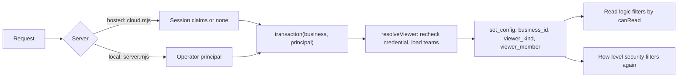

# SDD-011 — Visibility, teams and confidential meetings — design

> **Approved by the owner on 2026-10-01; built and released to production the same day with 0.5.0 ([verification](../../releases/0.5.0/verification.md)).** Designs the approved requirements [FR-011-001…012 and NFR-011-001](feature.md#requirement-index) under [ADR-004](../../architecture/decisions.md) (approved). The schema change (migration 006) and the production change each needed their own authorization (AGENTS.md, [PLAN-002](../../governance/plans/PLAN-002-task-and-meeting-domains.md)); both were given and applied on 2026-10-01.

## Scope and delivery

| PLAN-002 phase | Requirements | Note |
|---|---|---|
| P1 — Visibility | FR-011-001…008, FR-011-011, FR-011-012, NFR-011-001 | FR-011-006 in full: visibility, team and participants of meetings |
| P3 — Meetings | FR-011-009, FR-011-010 | Delivered with the server-side meeting commit (PLAN-002 WI-09), which changes FEAT-004 |

- **Before P3 the hosted API fails closed.** It refuses transcript revisions and draft batches for a `restricted` meeting (see Failure modes). A restricted meeting can therefore exist in production only with its title, date and participants. P3 is released (0.5.0), so the hosted API now stores a stub instead.
- **Projects come later.** FEAT-010 creates the `projects` table (WI-06). This design fixes that table's visibility columns and policy now, so FR-011-004 applies to projects the day the table exists.
- **Campaign records and Member profiles are out of scope** (FR-011-007, PLAN-002 Q1). Campaign tasks are not: they are `tasks` rows, so they follow the rule below (see Data).

## Components

| Module | Domain | Change | Role |
|---|---|---|---|
| `apps/api/viewer.mjs` | DOM-IAM | new | Resolves the viewer from the session and loads its teams |
| `apps/api/db.mjs` | DOM-PLT | changed | `transaction()` receives a principal, resolves the viewer and sets it for row-level security |
| `apps/api/cloud.mjs` | DOM-IAM | changed | Hands the session claims to every request, reads included; Guest when there are none |
| `apps/api/server.mjs` | DOM-PLT | changed | The local server always acts as the operator principal |
| `apps/api/api.mjs` | DOM-PLT | changed | Passes the viewer through and adds the `teams` routes |
| `apps/api/teams.mjs` | DOM-IAM | new | Teams and team membership; admin check |
| `apps/web/src/content/shared/visibility.mjs` | DOM-TSK | new | Pure audience and change rules, shared by the API and the UI |
| `apps/api/audience.mjs` | DOM-TSK / DOM-MTG | new | Application filter: loads the people named on tasks and meetings and keeps the rows `canRead` allows (added while building) |
| `apps/api/service.mjs` | DOM-BIZ | changed | `snapshot()` and `brief()` see only the viewer's rows; the brief cache key includes the audience |
| `apps/api/workspace.mjs` | DOM-TSK / DOM-MTG | changed | Viewer-scoped read; viewer-scoped merge on save |
| `apps/api/attachments.mjs` | DOM-TSK | changed | Attachments of an unseen task answer 404 |
| `apps/api/provision-members.mjs` | DOM-IAM | changed | `--admin <PID>` and `--no-admin <PID>` operator flags |
| `apps/api/migrations/006_visibility.sql`, `apps/api/migrate.mjs` | DOM-PLT | new / changed | Additive schema, policies and grants (schema 6) |
| Data App UI (`business/`, `meeting/`, new `meeting/Visibility.jsx`) | DOM-TSK / DOM-MTG | changed | Visibility, team and people pickers; team management; sign-in prompt for Guests (PLAN-002 WI-04) |

Components have no CMP IDs yet; the module path identifies them until PLAN-001 declares components.

### How a request flows

## Viewer

A viewer is `{kind, memberId, teamIds, admin}`, where `kind` is `guest`, `member` or `operator` (FR-011-003).

- **Hosted (SRV-001).**
  - `cloud.mjs` reads the claims on every request, as it already does at `cloud.mjs:26`.
  - Inside the transaction, `resolveViewer` rechecks the claims the way `resolveMember` does for writes today (`member-auth.mjs:21-25`): the Member is active, the credential is enabled and the credential version matches. The result is a `member` viewer.
  - Missing, expired, tampered or wrong-Business claims give a `guest` viewer (AC-011-003-02, AC-011-007-05).
  - Writes still require a Member: 401 `AUTH_REQUIRED`, as today (`cloud.mjs:27`, `member-auth.mjs:26-31`).
- **Local (SRV-002).** `server.mjs` passes the operator principal, so the viewer is `operator` and sees the whole local database (AC-011-003-04, ADR-004 D6).
- **The hosted runtime can never be the operator.** `transaction()` throws when an operator principal reaches it with `VERCEL=1`, and the only principal `cloud.mjs` can build is a session principal.
- **Request fields never select the viewer.** `memberId`, `pid` and `actor` in a query or body are ignored (AC-011-003-03).
- **Teams.** `teamIds` holds every team the Member belongs to, archived teams included, so their existing items stay visible (AC-011-001-04).
- **Admin.** `admin` comes from `members.is_business_admin`. Only team management reads it; the audience rule never does (FR-011-002, ADR-004 D7).
- **Database settings.** `transaction()` sets `zuri_go.viewer_kind` and `zuri_go.viewer_member` with `set_config(…, true)`, next to `zuri_go.business_id` (`db.mjs:6`, AC-011-003-05).
  - The settings are transaction-local, so pooled connections never carry them over.
  - A missing setting reads as `guest`.
- **Writes use the same viewer.** `authorizeWrite` takes the viewer that `transaction()` already resolved instead of resolving the Member a second time. It keeps the `FOR UPDATE` lock on the Business row.

## Audience rule

`canRead(viewer, item, named)` is pure and shared by the API and the UI. `named` is the set of people named on the item:

- for a task: its R, A, C and I, plus its `task_viewers`;
- for a meeting: its `meeting_participants`, the organizer included.

| Visibility | `guest` | `member` | `operator` |
|---|---|---|---|
| `public` | yes | yes | yes |
| `business` | no | yes | yes |
| `team` | no | if the item's team is one of `teamIds`, or the Member is named | yes |
| `restricted` | no | if the Member is named | yes |

**Changing visibility.** `visibilityChange` rules on every change of `visibility` or `team_id` (FR-011-011, AC-011-006-04). Breadth runs `restricted` < `team` < `business` < `public`.

- **Widening** is any move to a broader level, and moving a `team` item to another team. It needs:
  - the task's A, or the meeting's organizer (the local operator may also widen);
  - a non-empty reason.
- **Narrowing** is open to any editor who can read the item, with no reason needed.
- **Refused in every case:**
  - `team` without a team (AC-011-004-02);
  - `restricted` with nobody named;
  - a change after which the actor can no longer read the item. The actor must name themselves first, so no one can lose an item by accident.
- **Audit.** Every change writes one audit event with the old and new level, the reason and the session actor (AC-011-011-02).

**Campaign tasks.** Workboard tasks with `source_kind = 'campaign-legacy'` stay `business` in P1, and the API refuses another level for them. Per-task visibility on campaign tasks arrives with the Workboard consolidation (PLAN-002 P4).

## Data

Migration `006_visibility.sql` is additive: it adds tables, columns, indexes and policies, and it deletes and rewrites nothing. `migrate.mjs` adds `[6,'006_visibility.sql']` to its list, grants `DELETE` on the three membership tables as it does for `task_roles` (`migrate.mjs:15`), and reports schema 6.

| Object | Owner | Definition |
|---|---|---|
| `teams` | DOM-IAM | `id`, `business_id`, `name`, `archived_at`, timestamps, `row_version`. Unique `(business_id, id)`; unique active name per Business |
| `team_members` | DOM-IAM | `(business_id, team_id, member_id)` primary key, composite foreign keys, `created_at`. Index on `(business_id, member_id)` |
| `members.is_business_admin` | DOM-IAM | `boolean NOT NULL DEFAULT false`; set only by `provision-members.mjs` |
| `tasks.visibility`, `tasks.team_id` | DOM-TSK | `text NOT NULL DEFAULT 'business'` checked against the four levels. `team_id` has a composite foreign key to `teams`. `CHECK (visibility <> 'team' OR team_id IS NOT NULL)` |
| `task_viewers` | DOM-TSK | `(business_id, task_id, member_id)` primary key, `added_by_member_id`, `created_at`. Index on `(business_id, member_id)` |
| `meetings.visibility`, `meetings.team_id` | DOM-MTG | As on `tasks` |
| `meetings.transcript_custody` | DOM-MTG | `text NOT NULL DEFAULT 'cloud'`, checked against `local_only` and `cloud`. The app sets `local_only` when a meeting becomes `restricted` (P3) |
| `meeting_participants` | DOM-MTG | `(business_id, meeting_id, member_id)` primary key, `role` (`organizer` or `participant`), at most one organizer per meeting. Index on `(business_id, member_id)` |
| `projects.visibility`, `projects.team_id` | DOM-TSK | Added with the `projects` table by FEAT-010 WI-06, as on `tasks` |

- **Existing rows** (FR-011-012). `ADD COLUMN … DEFAULT 'business'` gives every existing task and meeting the level `business` and changes no other field.
  - Before and after the migration, a reconciliation query counts tasks, `task_roles`, `weekly_plan_tasks`, `task_attachments` and `change_events` per Business. The counts must be equal (AC-011-012-02).
  - In production the migration runs only after `npm run backup` and with the owner's specific authorization (AC-011-012-03).
- **Campaign tasks.** Workboard tasks are `tasks` rows with `source_kind = 'campaign-legacy'`; `readLegacy` rebuilds each campaign's `tasks` array from them (`workspace.mjs:20`). `campaign_states.state_json` never holds them, because both writers remove `tasks` first (`workspace.mjs:40`, `service.mjs:70`). The row filter on `tasks` therefore also removes them from campaigns (AC-011-007-01).

### Row-level security

The policies are layered so that no policy refers back to itself. PostgreSQL rejects a cycle, for example `tasks` → `task_roles` → `tasks`, as infinite recursion. Two SQL helpers read the settings:

- `zuri_go.viewer_kind()` returns the setting, or `'guest'` when it is missing;
- `zuri_go.viewer_member()` returns the member ID, or null.

Both are `STABLE` and `SECURITY INVOKER`. Migration 005 had to disable row-level security to backfill (`005_member_identity.sql:23-34`), which shows that the owning role is itself subject to it, so a `SECURITY DEFINER` bypass is neither available nor wanted.

| Layer | Tables | Read policy, in addition to `business_scope` |
|---|---|---|
| L0 — membership | `team_members`, `task_roles`, `task_viewers`, `meeting_participants` | `viewer_kind() IN ('member','operator')` |
| L1 — items | `tasks`, `meetings`, later `projects` | The audience rule in SQL. The people named are found through L0 with `EXISTS … member_id = viewer_member()`, and team membership through `team_members` |
| L2 — content | `task_attachments`, `weekly_plan_tasks` (via `tasks`); `meeting_revisions`, `meeting_draft_batches` (via `meetings`); `meeting_task_links` (via `meeting_draft_batches`) | `EXISTS (SELECT 1 FROM <parent> WHERE id = <fk>)`. The parent's own policy decides, so content follows its item |
| L2 — history | `change_events` | `viewer_kind() IN ('member','operator')`, and for task and meeting entity types `EXISTS` of the visible task, attachment or meeting named by `entity_id`. `legacy_task_event` rows whose `entity_id` is the Business stay visible to Members |
| — | `ai_briefs` | `viewer_kind() IN ('member','operator')` |

- **Only reads carry the audience rule.** `INSERT` and `UPDATE` keep `business_scope` in `WITH CHECK`. `UPDATE` and `SELECT` both carry the audience rule in `USING`, so nobody can change or read a row they cannot see.
- **Write order.** A restricted task can only be seen once the rows that name its people exist. Task and meeting writes therefore:
  - insert or update the item without `RETURNING` or `ON CONFLICT`: a plain `INSERT` without `RETURNING` checks only `WITH CHECK`, while `ON CONFLICT` and `RETURNING` apply the read policy to the new row;
  - then write the RACI, viewers and participants;
  - then read the row back.
  - The generic `upsert` in `workspace.mjs:12-14` stays in use for other tables.
- **Residual gap.** L0 rows hold IDs only, never titles or text. A signed-in Member could read them for items outside their audience only through a code path that forgot its filter. The application filters them, and the direct-query test (NFR-011-001) covers them.
- **Guests and people.** Guests see public tasks without their RACI or viewers, because L0 is closed to Guests.

## Read paths

| Path | Today | After |
|---|---|---|
| `GET /session` (hosted) | Identity only (`cloud.mjs:28`) | Also the viewer's `admin` flag and team IDs, for the UI |
| `GET /bootstrap` | Business row (`api.mjs:16`) | Unchanged |
| `GET /state` | Every snapshot table (`api.mjs:30`, `service.mjs:7-10`) | `tasks`, `task_roles` and `weekly_plan_tasks` limited to the viewer |
| `GET /overview` | Overview over the full snapshot (`api.mjs:31`, `model.mjs:54`) | Built from the viewer's snapshot, so hidden tasks are neither listed nor counted (AC-011-008-02) |
| `POST /briefs` | Input and cache key from the full snapshot (`service.mjs:92`) | Input from the viewer's snapshot. The cache key adds `audienceKey`, a hash of the IDs and versions of the visible tasks, so a brief built for a wider audience is never returned to a narrower one (AC-011-008-03) |
| `GET /workspace` | Tasks, meetings, transcripts and history (`workspace.mjs:16-31`) | Only visible tasks, their roles, weekly entries and events; only visible meetings with their revisions and batches; each campaign carries only its visible tasks. The UI backup (“Backup ข้อมูลที่เห็น”) is built from this response, so it holds only what the viewer sees (AC-011-008-04) |
| Attachments list and download | Found by task ID alone (`attachments.mjs:22`) | Found only among visible tasks. Unseen and missing both answer 404 `ไม่พบงาน` (AC-011-007-02, AC-011-008-01) |
| `GET /teams` (new) | — | Members and the operator get the Business's teams; Guests get 401 |
| Imports | Local operator only (`cloud.mjs:30`) | Unchanged |

## Write paths

- **`PUT /workspace` becomes a merge scoped to the viewer.** Today the save demands every existing task and Member (`workspace.mjs:62-63`), then rewrites each task's roles (`:66-68`). After the change:
  - Only tasks and meetings the viewer can read must be present. Items the viewer cannot see are never read, rewritten or stripped of their roles.
  - A submitted task or meeting whose ID exists but is hidden from the viewer is refused with the generic 409 “reload” answer, which does not reveal the item.
  - An event whose `taskId` names a hidden task is refused the same way (`workspace.mjs:79`).
  - Task payloads gain `visibility`, `teamId`, `viewerIds` and `visibilityReason`; meeting payloads gain `visibility`, `teamId`, `participantIds` and `organizerId`. Every change passes `visibilityChange`.
  - `domain_revision` stays Business-wide. A change to a hidden item still makes a Member's next save return 409 and reload, which is a timing signal and not content.
- **Teams (FR-011-001).**
  - `POST /teams` takes `{name}`.
  - `PATCH /teams/:id` takes `{name?, archived?, memberIds?}`; `memberIds` replaces the whole membership.
  - Only an admin may call them. Any other Member gets 403 and nothing changes (AC-011-001-02).
  - Each change writes an audit event with the admin as actor.
- **Admin (FR-011-002).**
  - Set on the operator path only: `provision-members.mjs --admin <PID>` and `--no-admin <PID>`, validated like `--reset` (`provision-members.mjs:49-50`).
  - The command writes an audit event with actor kind `local_operator` and subject `provision-members`.
  - Any API body that carries an admin field is refused, because the `members` resource does not list the field (`service.mjs:13`, `:28`).
- **Named viewers (FR-011-005).** They are written in the same transaction as the task, and each change writes an audit event. The event's `entity_type` is `task_viewers` and its `entity_id` is the task ID, so the history policy can find the task.

## Meetings (P3)

- **Tasks from a confidential meeting (FR-011-009).**
  - `meetingAudience(meeting, participants)` returns `{visibility: 'restricted', viewerIds: participants}` for a restricted meeting, and nothing for any other meeting.
  - The server-side meeting commit (WI-09) applies that audience to every task it creates.
  - Evidence quotes stay in `meeting_task_links`, which follows the meeting (L2). A person who can read the task but not the meeting gets the task with `evidence: {withheld: true}`; the UI then shows the confidential-meeting note (AC-011-009-02).
  - Widening the task never touches the quotes (AC-011-009-03).
- **Transcript custody (FR-011-010).**
  - For a meeting with `transcript_custody = 'local_only'`, the hosted API stores a revision as a stub: its `content_hash`, lineage and `segments = []`, with `{withheld: true}` in `legacy_metadata`. Draft-batch items are stored without evidence text.
  - The recording machine keeps the full content; the stored hash lets that machine prove its local copy matches.
  - Uploading the transcript needs a participant, a reason and an explicit request. It sets `transcript_custody = 'cloud'`, stores the segments under the meeting's audience and writes an audit event (AC-011-010-02).
  - A meeting that is not restricted keeps today's rule: the user chooses and sees the scope before a transcript goes to the cloud (AC-011-010-04).

## Failure modes

| Failure | Behavior |
|---|---|
| The viewer settings are missing in a transaction | The policies read `guest`: the fewest rows, never more |
| A session is expired, tampered or from another Business on a read | Guest view. The UI shows a sign-in prompt where work is hidden (AC-011-007-03) |
| An operator principal reaches the hosted runtime | `transaction()` throws before any query. The response is 500, and the log holds the code only |
| A policy refers to itself | Prevented by the layers (L0 → L1 → L2). A migration test creates the policies and queries each table once |
| A read path forgets to filter | Row-level security still returns only the viewer's rows (NFR-011-001) |
| A widening request without the A or the organizer, or without a reason | 403 `VISIBILITY_WIDEN_DENIED` or 422 `REASON_REQUIRED`; nothing changes |
| `team` without a team, `restricted` with nobody named, or the actor locked out | 422, backed for `team` by the database `CHECK` |
| Before P3, a transcript or draft batch arrives on the hosted API for a restricted meeting | Superseded by P3: a Member's save stores stubs for a `local_only` meeting (see "Changes found while building P3") |
| An error on a restricted item | The logs hold the error code and IDs only (`api.mjs:9` already logs only `e.code \|\| e.name`); request bodies are never logged (AC-011-008-05) |
| The source is rolled back after migration 006 | Old code ignores the new columns and shows everything to Guests again. A rollback therefore reopens the exposure and needs its own decision (AGENTS.md) |
| Performance | Every visible row costs a few `EXISTS` lookups on indexed membership tables. Production held 11 tasks (12 at the 0.5.0 release) and no meetings |

## Interfaces

Signatures marked **pure** have no I/O; each lists acceptance examples, and holdout examples the implementer does not see (STD-005 R2 shape, per ADR-001 D1). The boundaries between the parts are in-process calls within SRV-001, and their API-/EVT- declarations wait for PLAN-001 WI-09.

- **FR-011-003** · `apps/api/viewer.mjs` · `resolveViewer(client, businessId, principal) → Viewer`. `principal` is `{kind:'operator'}` or `{kind:'session', claims}`; reads `members`, `member_credentials` and `team_members`.
- **FR-011-003** · `apps/api/db.mjs` · `transaction(businessId, principal, fn) → result`. Sets `zuri_go.business_id`, `zuri_go.viewer_kind` and `zuri_go.viewer_member`, and exposes `client.zuriViewer`.
- **FR-011-003** · `apps/api/viewer.mjs` · `viewerSettings(viewer) → {kind, member}` — **pure**.
  - acceptance: operator → `{kind:'operator', member:''}`; a Member → `{kind:'member', member:<uuid>}`.
  - holdout: a Guest → `{kind:'guest', member:''}`.
- **FR-011-004, -006, -007** · `shared/visibility.mjs` · `canRead(viewer, item, named) → boolean` — **pure**.
  - acceptance: Guest with `public` → true; Guest with `business` → false; a Member of the item's team with `team` → true; a Member not in the team but named, with `team` → true; an admin who is not named, with `restricted` → false.
  - holdout: operator with `restricted` → true; a Member not named, with `restricted` → false; a Member in another team, not named, with `team` → false.
- **FR-011-011, -006** · `shared/visibility.mjs` · `visibilityChange(viewer, before, after, {accountableId, organizerId, reason, named}) → {ok:true} | {error}` — **pure**. `error` is one of `LEVEL_INVALID`, `WIDEN_DENIED`, `REASON_REQUIRED`, `TEAM_REQUIRED`, `NAMED_REQUIRED` or `SELF_EXCLUDED`.
  - acceptance: the R widens `restricted` → `business` → `WIDEN_DENIED`; the A does so with a reason → ok; any editor narrows `business` → `team` with a team and no reason → ok.
  - holdout: the A widens without a reason → `REASON_REQUIRED`; `team` without a team → `TEAM_REQUIRED`; an actor narrows to `restricted` without being named → `SELF_EXCLUDED`.
- **FR-011-001** · `apps/api/teams.mjs` · `listTeams(client, businessId, viewer) → Team[]`; `saveTeam(client, businessId, viewer, input, id?) → Team`. Owns `teams` and `team_members`; exposes `GET`, `POST /teams` and `PATCH /teams/:id`.
- **FR-011-002** · `apps/api/provision-members.mjs` · `provisionMembers(cfg, folder, {adminPid?, revokeAdminPid?, …}) → report`. Owns `members.is_business_admin`.
- **FR-011-007, -008** · `apps/api/service.mjs` · `snapshot(client, businessId, viewer) → Snapshot`; `brief(client, businessId, input, viewer) → Brief`.
- **FR-011-008** · `apps/api/service.mjs` · `audienceKey(snapshot) → string` — **pure**.
  - acceptance: the same visible tasks and versions → the same key; one extra visible task → a different key.
  - holdout: the same tasks in another order → the same key.
- **FR-011-004, -005, -007, -008** · `apps/api/workspace.mjs` · `readLegacy(client, businessId, viewer) → Workspace`.
- **FR-011-004, -005, -011** · `apps/api/workspace.mjs` · `saveLegacy(client, businessId, input, viewer) → Workspace`.
- **FR-011-008** · `apps/api/attachments.mjs` · `attachmentAction(client, businessId, task, id, method, input) → result`. The signature is unchanged; the task lookup obeys the viewer.
- **FR-011-009** · `shared/visibility.mjs` · `meetingAudience(meeting, participantIds) → {visibility, viewerIds} | null` — **pure** (P3).
  - acceptance: a restricted meeting with three participants → `restricted` and those three.
  - holdout: a `business` meeting → null.
- **FR-011-010** · `apps/api/workspace.mjs` · `custodyRevision(revision, custody) → revision` — **pure** (P3).
  - acceptance: `local_only` → `segments: []`, the same `content_hash` and `withheld: true`.
  - holdout: `cloud` → unchanged.
- **FR-011-012, NFR-011-001** · `apps/api/migrations/006_visibility.sql` · the schema, helpers and policies in Data.

## Tests

TC IDs are not assigned yet (PLAN-001 WI-08); these are the planned tests and the criteria they cover. Every read path runs for five viewers: a Guest, a Member outside the team, a team Member, a named person and the local operator (ADR-004 Consequences).

1. `apps/api/test/visibility.test.mjs`: the pure rules above, including the holdout examples.
2. `apps/api/test/database.test.mjs`, extended: direct queries as each viewer kind on each L0, L1 and L2 table, bypassing the application filters. It also checks that the runtime role is still `NOSUPERUSER NOBYPASSRLS` (NFR-011-001).
3. `apps/api/test/cloud-handler.test.mjs`, extended:
   - Guest reads of `/workspace`, `/state`, `/overview` and attachments return no non-public task, meeting or event, campaign tasks included;
   - an unseen attachment answers 404;
   - an expired session reads as a Guest.
4. `apps/api/test/database.test.mjs`: the scoped merge of `PUT /workspace` leaves hidden tasks, their roles and their attachments byte-for-byte unchanged.
5. Migration 006 on a QA Business: equal reconciliation counts before and after; every existing row is `business`.
6. The UI (sign-in prompt, pickers): checked with approved browser tools, or reported as not run.

## Changes found while building P1 (2026-10-01)

These refine the approved design without changing a requirement; the owner reviews them with the P1 change.

- **Restrictive policies.** The audience policies are `AS RESTRICTIVE`, so they add to the existing permissive `business_scope` instead of replacing it. L0 also covers `teams` and `ai_briefs` (`signed_in`).
- **Write order, for updates.** PostgreSQL checks an `UPDATE … WHERE` against the read policy for the new row too. An existing task or meeting is therefore updated with its old visibility first; its RACI, viewers or participants are written next; the new visibility and team are set last (`setAccess` in `workspace.mjs`).
- **Weekly plans.** A stored week (`weekly_plans.legacy_metadata`) lists every entry, with task IDs and priority notes. `/state` filters that list to visible tasks, and a save keeps the entries of hidden tasks. Weekly entries are returned in the order the client saved, because row order changes once row-level security joins another table.
- **Withheld references and receipts.** A task's `sourceRefs` to a meeting the viewer cannot read are removed on read, with `sourceRefsWithheld: true`, and restored on save. A receipt that names a hidden task is left out on read and kept on save.
- **New history events** that name a task the viewer cannot read are refused with 409.
- **Admin guard.** A trigger lets only the table owner (the operator path) change `members.is_business_admin`; the runtime role gets `42501`.
- **`transaction(businessId, fn)`** without a principal runs as a Guest; service code and tests that need the whole database pass `OPERATOR`.
- **The client refreshes on sign-in and sign-out** (`zuri-go-viewer-changed`), because a Guest no longer sees the same data as a Member.

## Changes found while building P3 (2026-10-01)

These refine the approved design without changing a requirement; the owner reviews them with the P3 change. FR-011-009 and FR-011-010 were released to production with 0.5.0 on 2026-10-01.

- **Built without WI-09.** The meeting commit still runs in the client (FEAT-004). The server enforces the audience of FR-011-009 and the custody of FR-011-010 when that client saves, so moving the commit to the server (PLAN-002 WI-09) is not needed for them. The failure-mode row “Before P3 … 422” no longer applies: the hosted API stores a stub instead of refusing.
- **The marker.** A stub revision carries `withheld: true` next to its unchanged `contentHash` or `reviewHash`, with `segments: []`. `validateEvidence` relaxes the segment and quote check only for a revision carrying it; a normal revision is checked as before. A draft-batch row holds `withheld: true` next to `batch` and `receipt`. `custodyRevision` takes the stored row shape (`{…, segments, legacy_metadata}`).
- **Who is bound.** Only the local operator keeps full content; every other viewer kind is bound, so a Member’s save of a `local_only` meeting is always stubbed. A new revision that claims `withheld` for a meeting that is not `local_only` is refused. Full content sent for a revision that is already stored as a stub is accepted and discarded; only the upload stores it.
- **When custody starts.** `transcript_custody` becomes `local_only` when a meeting becomes restricted, new or from another level, and stays until an upload; leaving `restricted` does not restore `cloud`. Content stored before that moment is not deleted: only later saves are stubbed.
- **Working copy.** `workingCopy` (draft transcript text in the meeting metadata) is dropped from the stored meeting for a `local_only` meeting, for everyone but the operator. The meeting payload gains `transcriptCustody`, which the server owns and never stores from a client.
- **Upload.** `POST /businesses/:b/meetings/:id/transcript` takes `{reason, sources, reviews, batches}`. The caller must be a participant and give a reason. Every stub of the meeting must be matched by its full content (the stub equals the content with its text removed, a review’s hash is recomputed, and every evidence quote is checked against the review). The server cannot recompute a source’s `contentHash`, because FUNG supplies it. The audit event uses `entity_type` `meetings`, so the history policy follows the meeting. The UI reads the content from a backup file of the recording machine.
- **Links keep no quote text.** The runtime role cannot update `meeting_task_links`, so `evidence` written for a stubbed batch stays without quote text after an upload. Since WI-09 `readLegacy` reads that column to attach evidence to the tasks the server committed (see [FEAT-004](../FEAT-004-meeting-task-manager/design.md#changes-found-while-building-wi-09-2026-10-01)).
- **Found while building: history leaked quotes.** A task’s history events (`legacy_task_event`) hold the task snapshot, `sourceRefs` and quotes included. Phase P1 returned them to every reader of the task, including one who cannot read the meeting. `readLegacy` now withholds the quotes from the events of a viewer who cannot read the meeting (`withholdQuotes`), so FR-011-009 holds on that path. The `.brain/rca/` record that AGENTS.md asks for is at [`.brain/rca/zuri-go-meeting-quotes-outside-meeting-audience.md`](../../../.brain/rca/zuri-go-meeting-quotes-outside-meeting-audience.md).

- **Quotes in task JSON (integration, 2026-10-01).** Meeting quotes copied into a task's metadata and history snapshots follow the meeting, not the task: `withholdQuotes` (`apps/api/audience.mjs`) removes them in `readLegacy` and `snapshot` for a viewer who cannot read the meeting ([RCA](../../../.brain/rca/zuri-go-meeting-quotes-outside-meeting-audience.md)).

## Open items

- **Guests and the people on public tasks.** Guests see public tasks without their RACI (row-level security design), as approved with this SDD. Showing those names to Guests later needs another shape for the L0 policy.
- **API-/EVT- contracts.** STD-001 R5 asks for them at each domain boundary; here they are in-process calls (PLAN-001 WI-09).
- **Before building the schema:** migration 006 needs its own authorization, locally and again for production. Done: applied locally and to production on 2026-10-01.
