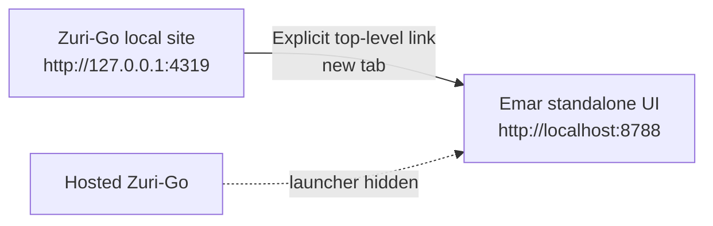

# SDD-013 — Emar local service access — design

## Components

| Component | Owner | Role |
|---|---|---|
| Local site navigation | Zuri-Go DOM-PLT / SRV-002 | Render the local-only service launcher and preserve the existing internal navigation. |
| Emar UI | External Emar service / SRV-003 | Own its local session and serve its standalone interface. |

The two browser origins use different hostnames (`127.0.0.1` and `localhost`). Emar accepts `localhost` in its standalone loopback host checks. This keeps the `emailmar_session` cookie scoped away from the Zuri-Go local host; different ports on one hostname would not isolate cookies.

The local site in `build/site` retains the verified Data App launcher and the Metrics Services navigation and exact-origin gate. Hosted assembly uses `build/hosted-site`: the installed Data App verifier/compiler builds an isolated copy of authored inputs with only the marked FEAT-013 launcher omitted, preserving the snapshot, app ID, protected runtime and original source. Metrics packaging removes the marked `services-nav` and `services-origin-gate` blocks only from the hosted copy before applying the existing loopback-origin guard. Vercel copies the hosted site, not the local site. A package check decodes embedded base64 JavaScript as well as reading HTML, and rejects any remaining launcher URL or origin gate. No compiled bundle or integrity manifest is rewritten.

## Data

Zuri-Go owns no Emar campaign, recipient, consent, suppression, approval, queue, tracking, OAuth, or DAG data. The launcher sends no query data, headers, or API request. Each service keeps its existing independent storage and authority.

## Failure modes

| Failure | Behavior |
|---|---|
| Zuri-Go is served from a non-canonical origin | Do not render the launcher. |
| Emar is not listening on port 8788 | Only the explicitly selected new tab fails to load; Zuri-Go remains available. |
| Gmail callback configuration still names `127.0.0.1` | Emar UI may open, but Gmail OAuth from its `localhost` origin is not ready until the callback and Google authorized redirect URI match `http://localhost:8788/v1/integrations/gmail/callback`. |

## Interfaces

- FR-013-001 · browser navigation · `GET http://localhost:8788/ → Emar HTML document`; explicit user action only; no REST/MCP call or data payload.
- NFR-013-001 · origin gate · `showLauncher(location.origin) → boolean`; pure comparison with `http://127.0.0.1:4319`.

## Verification boundary

The local hostname health check returned HTTP 200 during specification preparation. This does not prove OAuth callback configuration, Gmail connection, production behavior, or an end-to-end service session.
