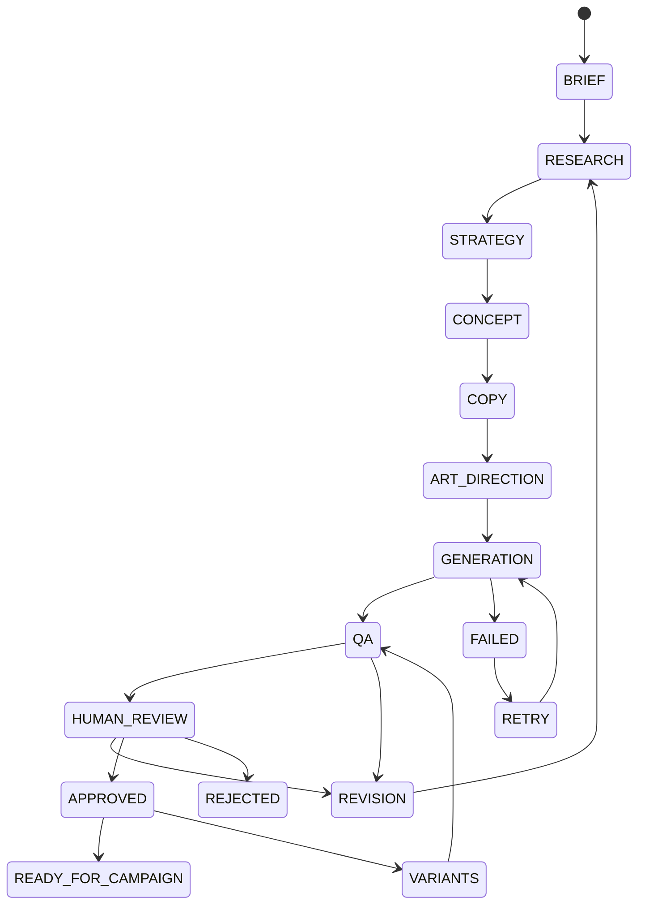
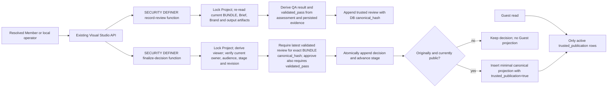

# SDD-014 — Visual Marketing orchestration

## Components and data

CMP-001 is one domain module in apps/api/visual-marketing/, with registry, workflow, providers and repository files only as needed. UI lives in apps/web/src/content/visual-marketing/. api.mjs is the transport adapter; db.mjs/viewer.mjs remain custody boundaries. No second API or new service. The [data amendment](../../architecture/visual-marketing/data-model.md) is canonical for entities and fields.

## Workflow

The server advances stages only after schema-valid output is committed. STRATEGY may wait for human strategy approval in a separate gate field (pending/approved/rejected). Final human review is mandatory for every artifact hash. Revision creates a new workflow revision, restarts at RESEARCH and invalidates downstream decisions; history remains. REJECTED is terminal until a human starts a new revision. Any stage can fail with failed_stage recorded; RETRY returns only to that stage. No client-set workflow stage.

Default limits: delegation depth 2; 16 agent runs per workflow revision; 2 revisions per run; one automatic retry and two total provider attempts per stage, including fallback. Exhaustion requires new human authorization. Illegal jumps return 409. Stage handoffs are not recursive calls.

No image provider is a supported prompt-only deliverable: GENERATION records skipped_optional and QA explicitly evaluates the visual prompt, not nonexistent pixels. No LLM yields labelled manual input at each stage. Tests may use fake providers; UI must never present them as AI generation. READY_FOR_CAMPAIGN is a reviewable bundle, not scheduled/published/spend-enabled. E variants re-enter QA and HUMAN_REVIEW independently.

## Agent definitions

Every entry separates identity, responsibility, inputSchema, outputSchema, skills, allowedTools, memoryScopes, modelPolicy and approvalRequirement. Named DTOs below are schema-validated. No provider name is embedded in identity.

| Identity / responsibility | Input → output | Skills | Allowed tools | Memory | Approval requirement |
|---|---|---|---|---|---|
| VIS-MKT-01 Visual Marketing Lead / plan | BriefSnapshot → StagePlan | planning, delegation | context.read, artifact.read | run, project | human starts run; cannot approve |
| VIS-MKT-02 Audience Researcher / evidence | BriefSnapshot, Evidence → ResearchFindings | source assessment | context.read | run, campaign | external fetch disabled by default |
| VIS-MKT-03 Creative Strategist / concepts | ResearchFindings, BrandSnapshot → Strategy, Concepts | positioning, hooks | context.read, artifact.read | run, brand, campaign | optional strategy gate |
| VIS-MKT-04 Copywriter / copy | Strategy, Concept, BriefSnapshot → CopyDraft | copywriting | context.read, artifact.read | run, brand | final review required |
| VIS-MKT-05 Art Director / visual plan | Concept, CopyDraft, BrandSnapshot → VisualPrompt | art direction | context.read, artifact.read | run, brand | final review required |
| VIS-MKT-06 Visual Designer / generation | VisualPrompt, GenerationPolicy → AssetResult | generation, variants | asset.generate, asset.store | run | explicit provider grant |
| VIS-MKT-07 Creative Reviewer / findings | ArtifactBundle, BrandSnapshot, BriefSnapshot → QAResult | verification | context.read, artifact.read | run, brand | cannot approve |
| VIS-MKT-08 Performance Analyst / interpretation | ObservationRefs, ApprovedVariants → LearningDraft | metric interpretation | analytics.read | campaign, performance | human accepts learning; unavailable until F |

Model policy: {primaryModel, fallbackModels:[], timeoutMs:25000, maxRetries:1, costBudget}. Configuration is server-owned. Remote calls require finite budget and explicit data-egress permission; unknown pricing blocks a spend-capped call unless a configured ceiling exists. Local cost can be null, never assumed zero. Optional image generation does not make any visual provider mandatory.

Lead root depth 0; specialists normally depth 1; Strategist may delegate Art Director at depth 2. Server configuration may lower the maximum or raise it up to hard cap 4 only after operational review. Child tools intersect parent's granted capabilities and run grant; the planner cannot widen authority. Reject unknown role, cycle, wrong project/root and budget exhaustion before invocation. Direct specialist stage scheduling uses an explicit planner-issued capability; it is not an implicit inheritance of every Lead tool.

## Memory and tools

Run, Project, Campaign, Brand and Performance Memory are typed PostgreSQL references. Scope filter AND current viewer access apply at every read. No global prompt folder, unrestricted shared workspace or vector DB. The data amendment defines audience inheritance and source/destination compatibility.

Every tool declares id, name, description, inputSchema, outputSchema, requiredPermissions, networkAccess, sideEffects. READ: context.read, artifact.read, later analytics.read. WRITE: validated artifact persistence and asset.store. EXTERNAL_ACTION: asset.generate and future research.fetch. Agents cannot register tools. There is no generic SQL, shell, arbitrary path, MCP installer or unrestricted HTTP tool. Side effects require a grant bound to actor, Project, input hash, provider/tool allowlist, budget and expiry. Retries preserve the grant.

## Provider ports

LLM: `completeStructured(request, policy, grant, signal) → {output, provider, model, usage?, estimatedCost?, requestId}`. Validate before persistence. Reimplement a narrow local Ollama adapter using the existing summary endpoint restrictions without refactoring or altering summary behavior. No existing reusable multi-agent provider abstraction was found in apps/api. Additional adapters are opt-in.

Definite unavailability/rate-limit may use an authorized fallback. Authorization/safety/schema failures do not switch provider to evade policy. Timeout, retries and fallbacks consume one shared attempt/time/cost budget. No cloud fallback by default. Local Ollama supports structured output and disables thinking; never store hidden reasoning.

VisualGenerationProvider: `generateImage(request)`, `editImage(request)`, `generateVariation(request)` return job references; `getJob(reference)` returns status/result; `cancelJob(reference)` returns acknowledged/cancel_unknown. Capability advertisement returns UNSUPPORTED for unavailable operations. Fal/OpenAI/Gemini/ComfyUI are candidate adapters only. Keys and endpoints are server-resolved.

Ambiguous chargeable submission becomes submission_unknown: query the known provider reference/idempotency key or require operator reconciliation. Do not blindly retry or fallback. Cancellation may be unsupported; retain that state rather than claiming a refund or no charge.

## QA and human decisions

QAResult = {status: pass|needs_revision|blocked, findings:[{category,severity,evidenceRefs,message}], blockingIssues:[], suggestions:[]}. Categories: brand consistency, message accuracy, offer accuracy, CTA clarity, visual hierarchy, readability, channel suitability, policy/safety, hallucinated claims and duplicate concepts. Unsupported checks are not_assessed; essential unassessed checks block approval. No opaque score substitutes for findings.

Approve/request_changes/reject binds artifact hash, QA revision and row_version. Only the current Project owner as authenticated Member, or explicitly trusted local operator, may decide after access recheck. Business-admin does not bypass restricted visibility. Agents cannot approve. Blocking findings require revision; C has no override. Decision, audit and stage change commit atomically. Caller actor/approved_by/status never grants authority. Idempotent replay is stable; competing decisions conflict. Changes to brief, brand, copy or bytes invalidate approval. Publish/paid approvals are separate future actions, unavailable here.

## R3 approved database approval-chain boundary — 2026-10-03

The owner approved the R3 C-3/HIGH rework after the whole-PR L2 REWORK finding. Migration 010 makes review, decision and public projection writes pass through narrow database-owned boundaries; it preserves the existing `zuri_go` Business/viewer settings as the caller identity trust boundary and does not claim to defend against a stolen runtime credential that can rewrite those settings.

`visual_artifacts.canonical_hash` is a PostgreSQL-generated SHA-256 of the stored `jsonb` payload using the pinned `pgcrypto` function. The legacy application `content_hash` remains unchanged in storage for history; the API returns `canonical_hash` under its existing `content_hash` field, and new review, decision and public-projection references use only that canonical value. `visual_record_review(business_id, project_id, artifact_id, assessment)` derives the QA result. `visual_finalize_approval(business_id, project_id, artifact_id, expected_row_version, artifact_hash, qa_revision, decision, reason)` compares the submitted hash with the database value, verifies the BUNDLE payload against the current revision's persisted stage outputs, and constructs the Guest payload itself.

The review entry point accepts only the per-category assessment, not caller-supplied result status, findings, blocking issues or pass flags. It uses the same Project-locked current BUNDLE, Brief and Brand data to derive the stored review result and `validated_pass`: all eight required assessments must be true; COPY and ART_DIRECTION must exist; every claim must match a Brief proof point or approved Brand claim; forbidden terms fail; and nonempty approved claims require bounded Brand source references. The finalizer trusts `validated_pass`, never `visual_reviews.result.status`.

The runtime role cannot directly INSERT into `visual_reviews`, `visual_decisions` or `visual_public_outputs`; it receives EXECUTE only on the two fixed-search-path SECURITY DEFINER functions. PUBLIC EXECUTE is revoked. Function bodies schema-qualify objects, derive Business/viewer/actor from the existing resolved transaction settings, lock the Project for review/finalization ordering, and independently check membership, owner/operator authority, current audience, revision and stage. The migrator repeats these least-privilege grants after its general table grants on every run. Migration 009's one-way `active=true` to `false` retraction remains available.

The migration does not rewrite legacy hashes or approval history. Existing reviews gain `validated=false` and `validated_pass=false` and cannot authorize a new decision; the artifact must be reviewed again. Existing public-output rows gain `trusted_publication=false`, remain readable to Members/operators for history, and are excluded from Guest reads until a new trusted publication is created. A new approval receives its own projection row keyed by its decision, preserving the legacy row. This is an explicit quarantine, not deletion or silent re-approval.

## Jobs and observability

Job states: queued → running → succeeded|failed|cancelled|submission_unknown. Retry creates an attempt with preserved lineage. Claim uses a short transaction, row lock SKIP LOCKED, lease token and expiry; heartbeat renews lease. Network work happens outside transactions. Commit compares live token, input hash and revision, rechecks authorization and atomically saves output/provider metadata/next stage. Stale workers cannot commit. Restart reclaims only safe pre-submission work; reconcile persisted provider references before resubmission.

Record run/root/parent IDs, role, workflow/stage/status, timestamps, provider/model, nullable usage/cost, structured tool summaries, artifact IDs and sanitized error classes. No secrets, request headers, raw provider dumps or private chain-of-thought. Viewer/RLS apply to status, counts, logs and downloads. Revoked credentials, expired grants, missing model/store and no executor are actionable states, not success.

## Interfaces

Every signature listed below belongs to CMP-001, owns DOM-VIS data, reads current viewer/Project contracts and exposes API-023 or internal EVT-002. DB methods receive a transaction client whose viewer was resolved by existing trusted entry code. Provider methods receive server-built grants. No pure local-model micro-tasks are proposed. These interfaces require owner approval before STD-005 packets; test/schema/service/contract/UI ordering and independent review remain mandatory.

- FR-014-001 · CMP-001 · `createBrief(c, businessId, input, viewer) → BriefDto` · owns creative records; consumes Project/current viewer; API-023 / EVT-002.

- FR-014-002 · CMP-001 · `getAgentRegistry(policy) → AgentDefinition[]` · owns creative records; consumes Project/current viewer; API-023 / EVT-002.

- FR-014-003 · CMP-001 · `advanceWorkflow(c, runId, command, viewer) → WorkflowDto` · owns creative records; consumes Project/current viewer; API-023 / EVT-002.

- FR-014-004 · CMP-001 · `dispatchAgent(c, rootRunId, parentRunId, agentId, grant) → RunDto` · owns creative records; consumes Project/current viewer; API-023 / EVT-002.

- FR-014-005 · CMP-001 · `executeProvider(request, policy, grant, signal) → ProviderResult` · owns creative records; consumes Project/current viewer; API-023 / EVT-002.

- FR-014-006 · CMP-001 · `enqueueRun(c, projectId, input, viewer) → JobDto; claimJob(c, executorId) → LeaseDto; commitJob(c, lease, result) → JobDto` · owns creative records; consumes Project/current viewer; API-023 / EVT-002.

- FR-014-007 · CMP-001 · `reviewArtifacts(c, artifactIds, reviewerRunId) → QAResult` · owns creative records; consumes Project/current viewer; API-023 / EVT-002.

- FR-014-008 · CMP-001 · `decideArtifact(c, artifactId, input, viewer) → DecisionDto` · owns creative records; consumes Project/current viewer; API-023 / EVT-002.

- FR-014-009 · CMP-001 · `readVisualResource(c, businessId, resource, id, viewer) → ResourceDto` · owns creative records; consumes Project/current viewer; API-023 / EVT-002.

- FR-014-010 · CMP-001 · `registerAsset(c, projectId, verifiedMetadata, viewer) → AssetDto` · owns creative records; consumes Project/current viewer; API-023 / EVT-002.

- FR-014-011 · CMP-001 · `loadVisualStudio(client, filters) → StudioViewModel` · owns creative records; consumes Project/current viewer; API-023 / EVT-002.

- FR-014-012 · CMP-001 · `forkVariant(c, artifactId, input, viewer) → VariantDto` · owns creative records; consumes Project/current viewer; API-023 / EVT-002.

- FR-014-013 · CMP-001 · `deriveLearning(c, variantId, observationRefs, viewer) → LearningDraft` · owns creative records; consumes Project/current viewer; API-023 / EVT-002.

## Approved implementation ordering and concrete storage

Owner approved this package on 2026-10-02. Initialize the Project extension with POST /projects (strategy_approval_required optional), then confirm BrandProfile, then create its immutable brief. This resolves the FK ordering without creating a duplicate Project master. Once a brief exists it becomes current; a later brief starts a new production revision and revokes pending work/approval. Project audience is frozen at extension creation and intersected with current Project access, including named members; widening never exposes earlier inputs.

First slice includes prompt-only assets (text/plain metadata with content checksum and opaque artifact key); binary stores/image adapters return UNSUPPORTED until configured. QA combines schema/claim checks with explicit per-category human assessment in manual mode; local LLM output never silently turns unassessed claims or pixel checks into pass. Approval concerns copy/visual prompt only. Final decisions can publish a minimal approved-output projection only for an originally public Project.

Local worker processes only jobs initiated by the trusted operator; hosted run creation returns EXECUTOR_UNAVAILABLE. A one-job-at-a-time loop, 60-second lease and fenced result commit implement EVT-002 without any new service. Configuration is feature-specific and server-only; default automatic loopback calls require an explicit run grant. All unrelated summary behavior is unchanged.

## Implemented signatures and execution constraints

The conceptual interface lock above maps to these concrete exports (all SQL clients are created by the existing viewer-scoped transaction): `initialize/brand/brief(c,b,input)`, `project/context/detail(c,b,p)`, `manual/commitStage(c,b,p,input,parent?)`, `run(c,b,p,stage,inputHash,parent?)`, `review/approve(c,b,artifactId,input)`, `strategy(c,b,p,input)`, `enqueue(c,b,p,input)`, `claim(c,b)`, `finish(c,b,lease,result,error?)` and `visualApi(c,b,path,method,input,params)`. The service reads `c.zuriViewer`; it has no caller-controlled viewer parameter. run validates persisted parent lineage; the normal workflow schedules specialists at depth one, while the dispatcher supports the approved depth-two bound. Tools are fixed server operations and declared capabilities; model output cannot invoke any tool. The LLM receives only this revision's Brief, Brand and stage outputs.

Initial adapter is local Ollama only, endpoint + model configured on the server; explicit operator grant lasts ten minutes and is checked before call and commit. One attempt per claim, two claims maximum for an expired-lease stage. Definite errors become failed and a fresh human grant is required for retry. There is no billable provider and no ambiguous paid submission retry. The reusable provider port tests authorized fallback and returns sanitized attempt records; the runtime has only one adapter. Unknown token usage/cost stays null. The worker waits 1.5 seconds between claims and aborts its active request during server shutdown. It never holds a SQL transaction during a network call.

A GENERATION artifact records skipped_optional; Creative QA persists a reviewer run, QA artifact and exact-bundle review. Manual QA is synchronous, because schema/evidence checks need no network. Failed jobs retain their failed stage in job history; Project remains on the actionable stage so manual recovery is possible. Each initial production plus two revisions has at most 16 role runs. Repeated QA/strategy actions consume that same limit. Stage decisions and final approval cannot be manufactured by provider output. A cancelled or stale lease can never publish its result.
