# FEAT-014 verification-closure execution DAG

This companion records the bounded C/D verification closure authorized for PR #1; R3 separately authorized migration 010 on isolated synthetic QA only. The approved FEAT-014 feature, SDD-014 and requirements remain canonical. This file adds no requirement or stable artifact ID. User-local/cloud migration, production, deployment and merge remain out of scope.

## Current R3 correction — 2026-10-04

The active application candidate is `8592f21b337c1e6c3217623cc825cc0c78808b6f` (tree `544bcdcc52d08ea870ba3e5fc355431280fbe3c7`), sealed clean after the narrow RG-R3-001 repair. Independent focused DB, full regression and build passed on a separate exact-byte snapshot; cleanup left zero QA rows, the owned server stopped and port 4319 free. Sol L2 returned PASS_BOUNDED_R3 for the approved slice. Root owns status/Git orchestration and authored no application code. The canonical result is [verification.md](verification.md).

## Historical R2 execution record

- Worktree: `C:\Users\pc\.codex\worktrees\visual-marketing\zuri-go`
- Branch: `feat/visual-marketing-team`
- Starting revision: `b569cf0d3296dbec4285f71e751ea0cca2506310`
- Tested source candidate: `771bbf70e437bf26cbfaa3a4ab643540155d8c59` (tree `cf402db6884ec54a09400a1784d58fd1992d210a`), sealed clean. This documentation-only follow-up is a later commit and does not change the tested candidate.
- Pushed branch HEAD when closeout began: `feat/visual-marketing-team` / `cc03af66e533ad9bc4a788912df91a8bd389f25e`. User-authorized push to Draft PR #1 was completed through `cc03af6`; this documentation-only closeout follows it and does not change the tested source. No merge or deployment occurred.
- Complexity: **C-3/HIGH** for the approved FEAT-014 implementation and verification closure. The narrower extraction-verifier portability packet is **C-2/HIGH** because it changes a security-relevant verification tool without changing application behavior or architecture.
- Risk: **HIGH**, because the extraction verifier checks source integrity and credential leakage.
- Current outcome: **C/minimum-D operational exit and closure-document ReviewGate PASS** for the bounded phase evidence, including the delayed-fake-provider NFR probe. A later whole-PR Sol Max L2 review of HEAD 3fc3fb0 returned **REWORK** with five findings; VerifyGate confirmed four runtime/API cases in isolated QA and the fifth is a static parent-document mismatch. The P1 is SQL-role integrity; no HTTP exploit was demonstrated. L1 strict-schema review is NOT DEMONSTRATED. The owner approved the new C-3/HIGH R3 packet on 2026-10-03; implementation and its gates are in progress, so merge readiness remains REWORK. The first R2 N6 process-policy block remains historical; resumed N6, isolated build, R2 delta review and NFR evidence passed.
- Acceptance for the operational phase record: full regression, isolated build, NFR measurement and scoped independent review are recorded on the sealed source. Manual browser evidence is carried from app source `b569cf0`; UI paths are unchanged through `771bbf7`, but browser acceptance was not rerun on R2. Available source/package/secret checks and immutable output rules remain enforced; absent private-preserved custody inputs remain `NOT_RUN`; docs checks pass; source SHA and verifier hash are recorded. This bounded PASS does not clear the later whole-PR L2 REWORK or establish L1.
- Runtime interruption and recovery: after a host reset the existing isolated QA container was restarted. Resumed N6 used the sealed source with docs HEAD `a111d1c`; its temporary server PID 19800 / session 47820 was stopped and port 4319 was free. The container remains the isolated QA database. No user or cloud database was used. The R2 ReviewGate inspected only the `fef7419..771bbf7` delta; earlier C/D review coverage was carried forward.
- NFR-014-001: validated command `node .local/visual-dag/verifygate/nfr014-001-probe-20261003.mjs` PASS on application source `771bbf7` in isolated QA. The harness reads ignored `.local/config.json`, validates the designated QA target and supplies local `ZURI_GO_*` settings without recording their values. With an 8-second delayed fake HTTP provider, 20/20 enqueue requests returned HTTP 202 (p95 91.66 ms, max 91.72 ms); 20/20 status reads returned HTTP 200 with the requested id and queued state (p95 19.94 ms, max 20.07 ms). The application pool held zero open transactions during provider wait. Evidence: `.local/visual-dag/verifygate/nfr014-001-probe-20261003-validated.json`. This is not real-model quality or process-restart evidence.
- Final cleanup PASS: exactly 3 synthetic Businesses, 63 Projects and child rows removed in FK-safe order; 0 remained. No owned ephemeral server process remained, and cleanup did not start a server on 4319 or 4329; existing preview state is unchanged. The isolated QA container remains up. Evidence: `.local/visual-dag/verifygate/nfr014-001-probe-cleanup-20261003.json`.
- Isolated `npm run build` exited 0 on the sealed application source with docs HEAD `cc03af6`; evidence: `.local/visual-dag/verifygate/build-feat014-cc03af6.raw.log`.

## Nodes and dependencies

| Node | Depends on | Role and owned paths | Acceptance / output |
|---|---|---|---|
| N0 — Freeze scope and base | — | Root orchestrator; no source edits | Confirm branch, starting SHA, dirty state, C/D-only scope and no merge/deploy authority. |
| N1 — Confirm cause and lock verifier contract | N0 | Worker; `.brain/rca/FEAT-014-extraction-verifier-portability.md`, `docs/migrations/extraction-verifier-portability-proposal.md`, this companion | Evidence-backed RCA and minimal behavior contract are reviewed before code. |
| N2 — Add regression cases | N1 | Worker; `scripts/site/test_verify_extraction.py` | Temporary synthetic fixtures cover absent custody inputs, present matching and tampered inputs, a known secret leak, and public immutable tampering. No real credential is read; no tracked report is written. |
| N3 — Implement callable verifier and wire tests | N2 | Worker; `scripts/site/verify_extraction.py`, `scripts/run.mjs` | `npm test` invokes the isolated regression suite. Only absent manifest entries marked `private-preserved` beneath `.local/member-access/` can be `NOT_RUN`; available custody inputs retain SHA checks and available secret scanning. All other source, package, ID and path checks remain mandatory. |
| N4 — Focused verification | N3 | Worker; read-only commands | Regression tests, relevant Python packaging checks, documentation validation and generated-view check pass. Preserve any private-custody gap as `NOT_RUN`; do not fabricate full custody verification. |
| N5 — Seal candidate | N4 | Worker; no further content edits after seal | Commit the candidate locally; write full Git SHA and SHA-256 of `scripts/site/verify_extraction.py` to the ignored append-only seal record. Confirm clean status and inspect the exact diff for credentials and unrelated changes. |
| N6 — VerifyGate | N5 | Independent VerifyGate agent; read-only | Confirm the recorded SHA/hash, rerun the specified deterministic commands against that revision, and report PASS/FAIL/BLOCKED/NOT_RUN with outputs. No edits. |
| N7 — ReviewGate | N6 PASS | Independent ReviewGate agent; read-only | Review the exact same candidate for the narrow contract and integrity regressions. No self-review and no edits. Findings return to a new bounded worker packet. |
| N8 — Record operational state and authorized push | N6, N7, NFR probe, isolated build | Root orchestrator; documentation closure only, no code edits | Record C/minimum-D operational PASS and unresolved merge/custody/provider boundaries. User-authorized push to Draft PR #1 was completed through `cc03af6`; no merge or deployment. |
| N9 — Review closure record | N8 | Independent ReviewGate; read-only | **PASS — 2026-10-03.** The six-document closure update has no remaining C/minimum-D requirement. This closes the bounded phase evidence record only. |
| N10 — Whole-PR L2 review | N9 | Independent Sol Max ReviewGate; read-only | **REWORK — 2026-10-03.** Five findings; VerifyGate confirmed four runtime/API paths in isolated QA. L1 strict-schema review is NOT DEMONSTRATED; merge readiness is reopened. See the L2 RCA and evidence record. |
| R3.1 — Owner authorization and design lock | N10 | Owner approval; worker documentation | **PASS — 2026-10-03.** Owner approved all five findings as a new C-3/HIGH packet. SDD-014 v0.2.0, the R3 RCA, physical data contract and acceptance criteria record the database authority boundary before source edits. |
| R3.2 — Baseline-failing regressions | R3.1 | Worker; focused DB/API/UI tests | **PASS for recorded baseline evidence.** New restricted-role review INSERT regression failed on schema 9 as expected; earlier independent evidence reproduces the other runtime findings. The new full regression set was run after implementation, not claimed as an entirely pre-fix run. |
| R3.3 — Minimal implementation and parent-doc reconciliation | R3.2 | Two Luna Max workers; disjoint ownership | **Implemented.** Migration 010, approval-chain functions, job/run consistency, source references, scoped status URL and parent documentation are integrated. |
| R3.4 — Focused checks, docs and seal | R3.3 | Integration worker; designated isolated QA only | **Focused checks PASS; seal pending.** Pure and DB suites passed 11/11 each. Schema 9→10, legacy preservation/Guest quarantine and migrator-rerun ACL checks passed. Retained transition fixture awaits independent checking and cleanup. Full suite/build/browser belong to R3.5. |
| R3.5 — Independent VerifyGate and Sol L2 ReviewGate | R3.4 | Independent Luna Max VerifyGate, then Sol Max ReviewGate | Pending immutable seal. Full regression/build, focused browser and legacy transition checks precede L2. Confirmed regressions return to a bounded repair packet. No merge or deployment. |
| R3.6 — RG-R3-001 repair and fresh gates | Sol L2 finding on seal 3425a6b | Luna Max worker; VerifyGate; Sol Max ReviewGate | **PASS — 2026-10-04.** Current Project audience check and direct SQL regression; seal `8592f21`; VerifyGate 12/12 DB, 206/206 Node + 15 site + 47 docs, build exit 0, zero fixture residue; Sol L2 PASS_BOUNDED_R3. |

## Execution graph and rework status

Current R3 rework (2026-10-04): `3425a6b` → bounded VerifyGate PASS → Sol L2 RG-R3-001 → independent QA confirmation → current-audience predicate and regression → seal `8592f21` → VerifyGate PASS_BOUNDED_R3_REPAIR → Sol L2 PASS_BOUNDED_R3. This is the first bounded R3 repair and remains inside the approved P1 authority contract. Root owns status/Git orchestration; Luna Max owns code and independent verification; Sol Max owns L2 review. No merge/deployment action is added.

```mermaid
flowchart TD
  N0["N0 Freeze scope and base"] --> N1["N1 RCA and verifier contract"]
  N1 --> N2["N2 Synthetic regressions"] --> N3["N3 Callable verifier and test wiring"] --> N4["N4 Focused checks"] --> S0["N5 seal 27ca9e6"]
  S0 --> G0["N6 R0 FAIL: 6 of 46 docs tests"]
  G0 --> R1["Rework R1: normalize fixture CRLF"] --> S1["N5 seal fef7419"]
  S1 --> G1["N6 R1 PASS: full npm test"] --> H1["N7 R1 PARTIAL: RG-N7-001"]
  H1 --> V1["Synthetic QA confirms payload/hash mutation; original row restored"]
  V1 --> R2["Rework R2: limit runtime UPDATE to one-way active retraction"] --> S2["N5 seal 771bbf7"]
  S2 --> G2a["N6 first attempt BLOCKED: process policy; command not executed"]
  G2a --> G2b["N6 resumed PASS: npm test 200/200 Node, 15/15 site, 47/47 docs"]
  G2b --> B2["Isolated npm run build PASS: exit 0"]
  B2 --> H2["N7 R2 delta PASS: no confirmed new issue; RG-N7-001 closed"]
  H2 --> Q1["NFR-014-001 PASS: enqueue p95 91.66 ms; status p95 19.94 ms; 20 clients"]
  Q1 --> N8["N8 records C/min-D operational PASS; authorized Draft PR push through cc03af6"]
  N8 --> N9["N9 closure-record ReviewGate PASS for bounded C/min-D evidence"]
  N9 --> N10["Whole-PR Sol Max L2 REWORK: 5 findings; L1 NOT DEMONSTRATED"]
  N10 --> R31["R3.1 owner approval + design lock PASS"]
  R31 --> R32["R3.2 baseline-failing regressions"]
  R32 --> R33["R3.3 migration 010 + four focused behavior fixes + parent docs"]
  R33 --> R34["R3.4 isolated QA, build/docs, clean seal"]
  R34 --> R35["R3.5 VerifyGate then Sol L2 ReviewGate"]
  R35 --> R36["RG-R3-001 current Project audience guard + regression"]
  R36 --> S36["Seal 8592f21"]
  S36 --> G36["VerifyGate PASS: DB 12/12; full tests; build; cleanup"]
  G36 --> L36["Sol L2 PASS_BOUNDED_R3"]
```

## Roles, model constraint and rework

The operational authoring worker and VerifyGate used independent `gpt-6-luna` agents at maximum reasoning, as authorized. Sol Max first returned REWORK on the whole-PR candidate, then PASS_BOUNDED_R3 after the approved repairs on seal `8592f21`. Root owns scope, dispatch and status recording and authored no application code. VerifyGate is an operational evidence role, not the deterministic L0 tool itself. Under STD-005 R8 E6, the authorization-sensitive packet was ineligible for local-model L1 and escalated to the Architect's L2 tier; L2 passed.

A failed node stops its dependents. The original R1/R2 implementation limit was two evidence-driven iterations; the owner later authorized the separate R3 packet recorded above. Every content-changing iteration invalidates the previous candidate SHA and requires resealing. An unresolved design, authority or environment gap is escalated to root as BLOCKED; it is never recorded as PASS.

Use statuses precisely: **PASS** means the named check ran and met its acceptance; **FAIL** means a reproducible check failed; **BLOCKED** means the check could not proceed because an identified dependency or authority is unavailable; **NOT_RUN** means it was not executed. If production handover files are absent, only their custody hash/leak checks are NOT_RUN. Package boundaries and scans of every available known secret still run. Do not describe that result as proof that all production credentials are excluded.

## Candidate seal

The R2 seal is recorded in the ignored append-only record under `.local/verification/`. This later documentation-only follow-up cites the already gated source candidate; it does not alter or replace that candidate.

- Candidate Git SHA: `771bbf70e437bf26cbfaa3a4ab643540155d8c59`
- Candidate tree: `cf402db6884ec54a09400a1784d58fd1992d210a`
- `scripts/site/verify_extraction.py` SHA-256: `43058E324FD368CAD9AA1324066C857D2CFC2882231F7FFFE8D3B8A04382E0C4`
- Worktree clean at seal: **PASS**
- VerifyGate R2 resumed: **PASS** — `npm test` exit 0; 200/200 Node, 15/15 site, 47/47 docs; docs validation 0 errors / 166 baseline warnings; views 11 / 0 drift
- ReviewGate R2 delta: **PASS** — no confirmed issue in the R2 delta; RG-N7-001 closed within the reviewed scope
- Isolated build: **PASS** — `npm run build` exit 0 on application source `771bbf7`; docs HEAD `cc03af6`
- NFR-014-001: **PASS** — 20 enqueues HTTP 202, p95 91.66 ms / max 91.72 ms; 20 status reads HTTP 200 with matching id/state, p95 19.94 ms / max 20.07 ms; 0 application-pool transactions during 8-second fake-provider wait
- C/minimum-D operational phase exit: **PASS**; closure-record ReviewGate: **PASS**, 2026-10-03
- Draft PR #1 push: user-authorized and completed through `cc03af6`; merge and deployment were not performed
- Initial VerifyGate R2 policy block: retained as historical evidence in `.local/visual-dag/verifygate/verifygate-r2.json`; resumed evidence supersedes only its full-suite status
- Docs HEAD verified by resumed N6: `a111d1c7a375cfc2d5db7d854c27e8ceb14ceb7d` (tree `4d7a5a6c598fa757c91dcb50ad64a3058356fab9`); this later docs-only follow-up has a separate commit SHA

## Evidence-driven rework R1

The first sealed candidate, `27ca9e6826ac7e72a2a1e19da37036427bbb4c38`, received **N6 FAIL** because six of 46 docs tests failed in the fixture text editor; N7 was blocked. The focused reproduction confirms the failure is `Tree.read` preserving fixture CRLF while `Tree.edit` expects LF substrings, before validator assertions run. See the additional finding in the [RCA](../../../.brain/rca/FEAT-014-extraction-verifier-portability.md).

This is the first of at most two evidence-driven iterations. It is **C-1/LOW** within the parent C-3/HIGH activity: one test-only reader in `scripts/docs/tests/test_docs.py` plus one helper-contract regression. The reader uses UTF-8 text mode, which normalizes fixture line endings while retaining strict decode and BOM behavior. No validator, application, security logic, standards or production files are in scope. Acceptance is all 46 original docs tests plus the new helper regression (47/47 total), 15/15 site tests, docs validation with zero errors and 166 baseline warnings, and views with 11/0 drift. Any failure stops the next gate; a second change requires a new evidence-based packet. Candidate `27ca9e6` is superseded for gate purposes; the next candidate must be resealed before verification.

Worker-side R1 result: **PASS** — docs tests 47/47, site tests 15/15, docs validation 0 errors / 166 baseline warnings, and docs views 11 / 0 drift. N6 later passed on `fef7419`; N7 was PARTIAL with RG-N7-001, which prompted the final R2 iteration.

## Evidence-driven rework R2 — public projection immutability

VerifyGate passed N6 for candidate `fef741976664e64cd38f29a6acf92fcd633d6f4f`; ReviewGate returned N7 PARTIAL with concern RG-N7-001. VerifyGate then confirmed the concern on isolated schema-8 QA using the restricted runtime role: a visible non-owner changed the public projection payload/hash and a Guest read the unapproved copy, while the owner decision stayed unchanged. `active=false` successfully retracted the row, and the original synthetic row was restored. See `.local/visual-dag/verifygate/review-finding-validation.json` and the [RCA](../../../.brain/rca/FEAT-014-public-output-integrity.md).

This was the second and final evidence-driven iteration under the original R2 packet. The later whole-PR L2 review identified findings outside that bounded delta. At the R2 close, R3 was proposed and awaiting owner approval; the owner subsequently approved it on 2026-10-03, as recorded above. The parent activity remains **C-3/HIGH**. The owner-approved data amendment already requires append-only output/decision records with hashes, and FR-014-008 binds approval to the owner and artifact hash. The bounded correction changes only `visual_public_outputs` update authority: revoke runtime table-level UPDATE, grant column-level UPDATE on `active` only, and enforce one-way true-to-false retraction under Business and project-audience scope. Additive migration `009` upgrades isolated QA schema 8 to 9; the migration runner must preserve the least-privilege grant after its general grants. Do not alter approval semantics, API/UI behavior, mutable project/job/run tables, or other database access policy. No user-local/cloud migration, production action, deployment, merge or push was included in R2.

| R2 node | Depends on | Owner / paths | Acceptance |
|---|---|---|---|
| R2.1 — Lock RCA and data contract | N7 PARTIAL + confirmed validation | Worker; `.brain/rca/FEAT-014-public-output-integrity.md`, `docs/architecture/visual-marketing/data-model.md`, this DAG | RCA fields complete; existing immutable-output contract states payload/hash/provenance immutability and the sole one-way retraction exception. **Done before source changes.** |
| R2.2 — Apply additive ACL/policy | R2.1 | Worker; `apps/api/migrations/009_visual_public_output_immutability.sql`, `apps/api/migrate.mjs` | **PASS** — schema 9 applied only to isolated QA; repeat `npm run db:migrate` preserved the grant reconciliation. Runtime UPDATE is column-limited to `active`; RLS accepts only active-to-inactive retraction with Business/project scope. No other table grant or policy changed. |
| R2.3 — Prove restricted-role contract | R2.2 | Worker; `apps/api/test/visual-marketing-db.test.mjs` | **PASS** — a visible non-owner cannot change payload/hash or approval/artifact references and cannot reactivate; owner-approved output creation and new-brief retraction still pass. Synthetic rows only. |
| R2.4 — Focused verification and seal | R2.3 | Worker; focused database/docs checks and ignored seal | **PASS** — DB tests 8/8, docs tests 47/47, docs validation 0 errors / 166 baseline warnings, views 11/0 drift, migration syntax and grant booleans verified. Candidate SHA/tree are sealed in ignored evidence; source edits stopped at the seal. |
| R2.5 — Independent gates | R2.4 | VerifyGate then ReviewGate; read-only | **PASS within operational scope** — resumed VerifyGate ran the full suite on sealed candidate `771bbf7`; ReviewGate then reviewed only the R2 delta and confirmed the immutable-output ACL, one-way retraction and regression evidence. No new issue was confirmed and RG-N7-001 is closed. The prior process-policy block remains historical; no third implementation iteration is authorized. |

Historical operational state: C/minimum-D exit and closure-record ReviewGate passed. Resumed N6 ran `npm test`; the isolated build, validated NFR probe and bounded N7 R2 delta review also passed. N7 carried forward prior C/D review coverage rather than re-auditing the whole PR. The existing isolated QA container remains running; owned temporary servers were stopped and cleanup left no synthetic QA rows. No user or cloud database was migrated during this work.

## Subsequent whole-PR L2 result - 2026-10-03

Independent Sol Max L2 reviewed merge-base `9e224c851b6c5c2b25232d41e183bf8623b5bb7a` through HEAD `3fc3fb01ba424aa75b9006936bb0bb68d03dfc76` and returned **REWORK** with five findings. Application source remains the sealed `771bbf7` candidate; the reviewed HEAD adds documentation only. VerifyGate confirmed four runtime/API paths in isolated QA: an invalid public-output INSERT was Guest-readable after restricted-role SQL (no HTTP exploit; guessed POST paths returned 404); empty-reference approved claims passed the API and QA; exhausted/stale and new-Brief job transitions left linked runs running; and returned `status_url` did not resolve (handler 403, canonical scoped GET 200). Parent-doc status/schema drift is statically confirmed. Evidence: `.local/visual-dag/reviewgate/l2-review-3fc3fb0.md` and `.local/visual-dag/verifygate/l2-public-insert-validation.json`.

The owner-approved C-3/HIGH R3 implementation and independent gates are complete for the bounded C/manual + minimum-D slice. Two Luna Max workers divided the implementation and integration ownership before QA; root orchestrated and updated status documentation without authoring application code. Isolated QA advanced schema 9→10; application remains 0.5.1, feature remains 0.1.0, and SDD-014 is 0.2.0. L1 strict-schema review is NOT DEMONSTRATED. User/cloud schema 7 is a last-recorded baseline, not live-inspected or migrated here. Real-provider, hosted and production checks remain NOT RUN.
