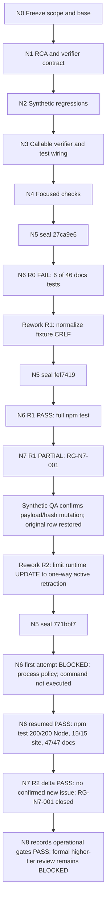

# FEAT-014 verification-closure execution DAG

This companion records the bounded C/D verification closure authorized for PR #1. The approved FEAT-014 feature, SDD-014 and requirements remain canonical. This file adds no requirement or stable artifact ID. Scope is existing C behavior and minimum D registry/dispatcher; E/F, user-local/cloud migration, production, deployment and merge are out of scope. One additive schema migration is allowed only on the isolated synthetic QA database for R2 validation.

## Execution record

- Worktree: `C:\Users\pc\.codex\worktrees\visual-marketing\zuri-go`
- Branch: `feat/visual-marketing-team`
- Starting revision: `b569cf0d3296dbec4285f71e751ea0cca2506310`
- Tested source candidate: `771bbf70e437bf26cbfaa3a4ab643540155d8c59` (tree `cf402db6884ec54a09400a1784d58fd1992d210a`), sealed clean. This documentation-only follow-up is a later commit and does not change the tested candidate.
- Complexity: **C-3/HIGH** for the approved FEAT-014 implementation and verification closure. The narrower extraction-verifier portability packet is **C-2/HIGH** because it changes a security-relevant verification tool without changing application behavior or architecture.
- Risk: **HIGH**, because the extraction verifier checks source integrity and credential leakage.
- Current outcome: **R2 operational gates PASS** on the sealed source candidate. The first N6 attempt was blocked before execution and remains in the historical record; the resumed full suite passed, followed by a bounded R2 delta review. Formal STD-005 higher-tier review remains blocked, and provider, hosted and production checks remain open.
- Acceptance for a PASS closure: full regression and independent review must pass on the same sealed candidate; available source/package/secret checks and immutable output rules remain enforced; missing private-preserved custody inputs remain `NOT_RUN`; docs checks pass; candidate SHA and verifier hash are recorded.

## Nodes and dependencies

| Node | Depends on | Role and owned paths | Acceptance / output |
|---|---|---|---|
| N0 — Freeze scope and base | — | Root orchestrator; no source edits | Confirm branch, starting SHA, dirty state, C/D-only scope and no merge/deploy authority. |
| N1 — Confirm cause and lock verifier contract | N0 | Worker; `.brain/rca/FEAT-014-extraction-verifier-portability.md`, `docs/migrations/extraction-verifier-portability-proposal.md`, this companion | Evidence-backed RCA and minimal behavior contract are reviewed before code. |
| N2 — Add regression cases | N1 | Worker; `scripts/site/test_verify_extraction.py` | Temporary synthetic fixtures cover absent custody inputs, present matching and tampered inputs, a known secret leak, and public immutable tampering. No real credential is read; no tracked report is written. |
| N3 — Implement callable verifier and wire tests | N2 | Worker; `scripts/site/verify_extraction.py`, `scripts/run.mjs` | `npm test` invokes the isolated regression suite. Only absent manifest entries marked `private-preserved` beneath `.local/member-access/` can be `NOT_RUN`; available custody inputs retain SHA checks and available secret scanning. All other source, package, ID and path checks remain mandatory. |
| N4 — Focused verification | N3 | Worker; read-only commands | Regression tests, relevant Python packaging checks, documentation validation and generated-view check pass. Preserve any private-custody gap as `NOT_RUN`; do not fabricate full custody verification. |
| N5 — Seal candidate | N4 | Worker; no further content edits after seal | Commit the candidate locally; write full Git SHA and SHA-256 of `scripts/site/verify_extraction.py` to the ignored append-only seal record. Confirm clean status and inspect the exact diff for credentials and unrelated changes. |
| N6 — VerifyGate | N5 | Independent VerifyGate agent; read-only | Confirm the recorded SHA/hash, rerun the specified deterministic commands against that revision, and report PASS/FAIL/BLOCKED/NOT_RUN with outputs. No edits. |
| N7 — ReviewGate | N6 PASS | Independent ReviewGate agent; read-only | Review the exact same candidate for the narrow contract and integrity regressions. No self-review and no edits. Findings return to a new bounded worker packet. |
| N8 — Record gate state | N6, N7 | Root orchestrator; documentation closure only, no code edits | Record the partial/blocked result and unresolved formal review/custody boundaries. This does not close feature acceptance. Push, merge and deployment remain outside this scope. |

## Execution graph and rework status

## Roles, model constraint and rework

Worker, VerifyGate and ReviewGate run as independent `gpt-6-luna` agents at maximum reasoning (all-Luna Max, as authorized). The authoring worker owns the listed implementation files sequentially; the two gates own no files and must not edit. The root orchestrator owns scope, dispatch and status recording, and did not author implementation code. VerifyGate is an operational evidence role, not the deterministic L0 tool itself. ReviewGate is independent in agent instance and task, but uses the same model family and tier. This task-specific same-model exception does **not** satisfy or claim STD-005 R10's higher-tier L1/L2 review. Formal merge review remains unresolved and merge is outside this DAG.

A failed node stops its dependents. Allow at most two evidence-driven rework iterations, each with a changed packet tied to a specific finding; never repeat a blind retry. Each content-changing iteration invalidates the previous candidate SHA and requires resealing. An unresolved design, authority or environment gap is escalated to root as BLOCKED; it is never recorded as PASS.

Use statuses precisely: **PASS** means the named check ran and met its acceptance; **FAIL** means a reproducible check failed; **BLOCKED** means the check could not proceed because an identified dependency or authority is unavailable; **NOT_RUN** means it was not executed. If production handover files are absent, only their custody hash/leak checks are NOT_RUN. Package boundaries and scans of every available known secret still run. Do not describe that result as proof that all production credentials are excluded.

## Candidate seal

The R2 seal is recorded in the ignored append-only record under `.local/verification/`. This later documentation-only follow-up cites the already gated source candidate; it does not alter or replace that candidate.

- Candidate Git SHA: `771bbf70e437bf26cbfaa3a4ab643540155d8c59`
- Candidate tree: `cf402db6884ec54a09400a1784d58fd1992d210a`
- `scripts/site/verify_extraction.py` SHA-256: `43058E324FD368CAD9AA1324066C857D2CFC2882231F7FFFE8D3B8A04382E0C4`
- Worktree clean at seal: **PASS**
- VerifyGate R2 resumed: **PASS** — `npm test` exit 0; 200/200 Node, 15/15 site, 47/47 docs; docs validation 0 errors / 166 baseline warnings; views 11 / 0 drift
- ReviewGate R2 delta: **PASS** — no confirmed issue in the R2 delta; RG-N7-001 closed within the reviewed scope
- Initial VerifyGate R2 policy block: retained as historical evidence in `.local/visual-dag/verifygate/verifygate-r2.json`; resumed evidence supersedes only its full-suite status
- Docs HEAD verified by resumed N6: `a111d1c7a375cfc2d5db7d854c27e8ceb14ceb7d` (tree `4d7a5a6c598fa757c91dcb50ad64a3058356fab9`); this later docs-only follow-up has a separate commit SHA

## Evidence-driven rework R1

The first sealed candidate, `27ca9e6826ac7e72a2a1e19da37036427bbb4c38`, received **N6 FAIL** because six of 46 docs tests failed in the fixture text editor; N7 was blocked. The focused reproduction confirms the failure is `Tree.read` preserving fixture CRLF while `Tree.edit` expects LF substrings, before validator assertions run. See the additional finding in the [RCA](../../../.brain/rca/FEAT-014-extraction-verifier-portability.md).

This is the first of at most two evidence-driven iterations. It is **C-1/LOW** within the parent C-3/HIGH activity: one test-only reader in `scripts/docs/tests/test_docs.py` plus one helper-contract regression. The reader uses UTF-8 text mode, which normalizes fixture line endings while retaining strict decode and BOM behavior. No validator, application, security logic, standards or production files are in scope. Acceptance is all 46 original docs tests plus the new helper regression (47/47 total), 15/15 site tests, docs validation with zero errors and 166 baseline warnings, and views with 11/0 drift. Any failure stops the next gate; a second change requires a new evidence-based packet. Candidate `27ca9e6` is superseded for gate purposes; the next candidate must be resealed before verification.

Worker-side R1 result: **PASS** — docs tests 47/47, site tests 15/15, docs validation 0 errors / 166 baseline warnings, and docs views 11 / 0 drift. N6 later passed on `fef7419`; N7 was PARTIAL with RG-N7-001, which prompted the final R2 iteration.

## Evidence-driven rework R2 — public projection immutability

VerifyGate passed N6 for candidate `fef741976664e64cd38f29a6acf92fcd633d6f4f`; ReviewGate returned N7 PARTIAL with concern RG-N7-001. VerifyGate then confirmed the concern on isolated schema-8 QA using the restricted runtime role: a visible non-owner changed the public projection payload/hash and a Guest read the unapproved copy, while the owner decision stayed unchanged. `active=false` successfully retracted the row, and the original synthetic row was restored. See `.local/visual-dag/verifygate/review-finding-validation.json` and the [RCA](../../../.brain/rca/FEAT-014-public-output-integrity.md).

This is the second and final evidence-driven rework iteration. The parent activity remains **C-3/HIGH**. The owner-approved data amendment already requires append-only output/decision records with hashes, and FR-014-008 binds approval to the owner and artifact hash. The bounded correction changes only `visual_public_outputs` update authority: revoke runtime table-level UPDATE, grant column-level UPDATE on `active` only, and enforce one-way true-to-false retraction under Business and project-audience scope. Additive migration `009` upgrades isolated QA schema 8 to 9; the migration runner must preserve the least-privilege grant after its general grants. Do not alter approval semantics, API/UI behavior, mutable project/job/run tables, or other database access policy. No user-local/cloud migration, production action, deployment, merge or push is included.

| R2 node | Depends on | Owner / paths | Acceptance |
|---|---|---|---|
| R2.1 — Lock RCA and data contract | N7 PARTIAL + confirmed validation | Worker; `.brain/rca/FEAT-014-public-output-integrity.md`, `docs/architecture/visual-marketing/data-model.md`, this DAG | RCA fields complete; existing immutable-output contract states payload/hash/provenance immutability and the sole one-way retraction exception. **Done before source changes.** |
| R2.2 — Apply additive ACL/policy | R2.1 | Worker; `apps/api/migrations/009_visual_public_output_immutability.sql`, `apps/api/migrate.mjs` | **PASS** — schema 9 applied only to isolated QA; repeat `npm run db:migrate` preserved the grant reconciliation. Runtime UPDATE is column-limited to `active`; RLS accepts only active-to-inactive retraction with Business/project scope. No other table grant or policy changed. |
| R2.3 — Prove restricted-role contract | R2.2 | Worker; `apps/api/test/visual-marketing-db.test.mjs` | **PASS** — a visible non-owner cannot change payload/hash or approval/artifact references and cannot reactivate; owner-approved output creation and new-brief retraction still pass. Synthetic rows only. |
| R2.4 — Focused verification and seal | R2.3 | Worker; focused database/docs checks and ignored seal | **PASS** — DB tests 8/8, docs tests 47/47, docs validation 0 errors / 166 baseline warnings, views 11/0 drift, migration syntax and grant booleans verified. Candidate SHA/tree are sealed in ignored evidence; source edits stopped at the seal. |
| R2.5 — Independent gates | R2.4 | VerifyGate then ReviewGate; read-only | **PASS within operational scope** — resumed VerifyGate ran the full suite on sealed candidate `771bbf7`; ReviewGate then reviewed only the R2 delta and confirmed the immutable-output ACL, one-way retraction and regression evidence. No new issue was confirmed and RG-N7-001 is closed. The prior process-policy block remains historical; no third implementation iteration is authorized. |

Current state: R2 worker and operational gate checks passed. Resumed N6 ran `npm test` successfully; N7 passed a bounded review of the R2 delta, carrying forward prior C/D coverage rather than re-auditing the whole PR. The existing QA container was restarted after host reset and remains running; temporary QA server PID 19800, session 47820, was stopped and port 4319 was free. No user or cloud database was migrated. All agents used Luna Max, so STD-005 higher-tier review remains blocked. Provider execution and production acceptance remain open.
