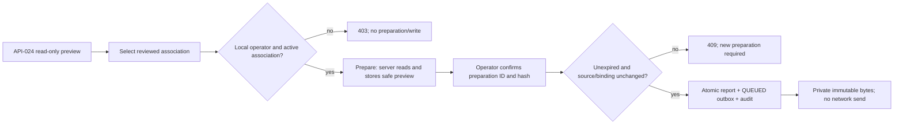

# P2 — เก็บรายงานเดิมให้ตรวจย้อนกลับได้ ก่อนเปิดการส่งจริง

**PROPOSED / NOT_IMPLEMENTED.** This is the canonical P2 design chapter of [SDD-015](design.md), following P1 commit `11283e34d98130f1ee1f7c73e788e577624394a4`. The request to commit/push and continue authorizes preparing this review packet; it does not mark this new schema approved. P1 remains the approved read-only implementation.

ผลที่เสนอ: operator เลือก campaign/week และ association ที่ผ่านการ review แล้ว → server เก็บ sanitized preview พร้อมเวลาจับข้อมูล → operator ยืนยัน preview นั้น → ตรวจ source revision ซ้ำและบันทึก immutable report + QUEUED outbox + audit ใน transaction เดียว. ยังไม่มีการส่งเครือข่ายหรือ receipt จาก Zuri-AI.

## Parent and peer evidence

- [ARCH-005](../../architecture/commercial-pipeline/ARCH-005-commercial-pipeline.md), [FEAT-015](feature.md), [FR-015-001](requirements/FR-015-001-scoped-source-snapshot.md), [FR-015-003](requirements/FR-015-003-immutable-report-envelope.md) and [wire proposal](contract.md) govern scope, identity and privacy. This chapter owns P2 persistence/operation details; it does not duplicate the payload field schema.
- P1 `apps/api/marketing-report.mjs` includes capturedAt in previewHash and has no persistent preparation. Regenerating a preview at a later transaction timestamp changes its hash even when rows are unchanged. **Design gap:** a freeze cannot verify that the operator confirmed a server-issued preview by trusting body-supplied bytes/time/hash alone. This is a missing P2 protocol, not a defect in P1's read-only promise.
- `apps/api/db.mjs` already resolves the viewer and Business settings inside REPEATABLE READ; `apps/api/workspace.mjs` locks the Business on workspace saves. Reuse those boundaries; do not import a client workspace as evidence.
- `apps/api/migrate.mjs` currently enumerates migrations 001–010, broadly grants runtime SELECT/INSERT/UPDATE, then revokes sensitive writes. New append-only grants must be explicitly revoked **after** that broad grant, including on a repeated migration run. Migration number is allocated only after approval and a fresh main check.
- `010_visual_approval_boundary.sql` provides the peer precedent: protected records created through narrow finalization functions, explicit scope/viewer checks, fixed search_path and PUBLIC/runtime write revocations. Its existing digest of JSONB text is **not** the marketing wire canonicalization; do not reuse that serialization as the envelope bytes.
- Parent `O:/zuri.ai` was rechecked read-only at clean `a6e295a5e30b61aa0e6a178454e371d59e053818` on 2026-10-05. No external-marketing-report/marketing.report.ingest implementation was found in inspected growth routes and Marketing modules. P2 cannot claim a parent receiver or machine-write permission exists.

## Scope and decisions proposed for approval

| Decision | Proposed choice | Tradeoff / boundary |
|---|---|---|
| Remember a reviewed preview | New explicit persisted preparation operation; API-024 remains read-only | One extra request/table; avoids a new signing secret and preserves server-created time/hash |
| Preparation lifetime | 15 minutes from server preparation time; clock checked at freeze, no extension on replay | Small confirmation window; an expired preview requires a new preparation/key |
| Target association | Admin-managed reviewed local registry, one exact source deployment/Business and parent binding/initiative per record | No title matching or caller target override; empty/unreviewed registry blocks real preparation/freeze |
| Snapshot storage | Store only canonical sanitized preview/envelope text and whitelisted identity/revision metadata | No raw state or free-text review; exact persisted bytes, not JSONB reserialization, are replayed |
| Atomic freeze | Report + queued outbox + one audit event commit together | More DB constraints; failure cannot leave a report without its queue record |
| Corrections | P2 creates reportRevision 1 only; supersedesReportId null; second report for the same campaign/activity-week/target scope is 409 | Avoids inventing a correction before a parent acceptance/receipt contract is implemented |
| Metric readiness | Keep current HELD/UNKNOWN measurements; a valid state/revision is required to freeze | A reported-evidence report can carry unknowns; no new timezone/coverage trust is invented |
| Private retention | Preparations expire but remain private audit evidence; no purge task or delete API in P2 | Storage grows until an owner-approved retention/purge procedure exists; irreversible cleanup is separate |
| Execution | Local SRV-002 operator only; no startup worker, send operation or hosted writer | Verifies immutability without credentials or real parent traffic |

Source deployment and reviewed parent identifiers are registered values, not automatically the local/hosted website URL or the same UUID/code as a source campaign. Registry review is a human control; it does **not** authenticate a parent request or grant parent Marketing OWNER permission. Parent Identity must later authorize the real sender separately. No real association is provisioned by approving code or migration-file creation.

## Flow and operation contracts

Candidate paths below have no allocated API IDs or code yet. The existing [API-024](../../domains/campaign/contracts.md#api-024--local-marketing-report-preview) request/response and no-write guarantee stay intact.

| Candidate operation | Strict request | Proposed success |
|---|---|---|
| `POST /businesses/{b}/campaigns/{id}/marketing-report-preparations` | exactly idempotencyKey UUID, associationId UUID and window (the four API-024 fields) | 201 server preparation ID, original preview/hash and expiresAt; exact replay 200 same persisted preparation |
| `POST /businesses/{b}/campaigns/{id}/marketing-reports` | exactly idempotencyKey UUID, preparationId UUID, expectedPreviewHash SHA-256 and expectedSourceRevision (P1 five-field tuple) | 201 immutable report identity/hash and QUEUED; exact replay 200 same persisted result |
| `GET /businesses/{b}/marketing-reports/{reportId}` | no body; local operator only | 200 persisted whitelisted envelope/hash and queue state; 404 unreadable/nonexistent |

Both POST bodies are at most 4096 UTF-8 bytes, reject duplicate/unknown keys at every level, and use the existing same-origin JSON/header rules. No body-supplied campaign state, actor, capture/freeze time, deployment, parent Tenant/Business/initiative, receiver URL, credential or envelope is accepted. Association is selected by local record UUID; all envelope routing is derived from its server-owned row. Schema/size errors reject before writes; malformed JSON is 400, excessive bytes 413, bad fields 422. All responses are no-store.

Preparation requires a readable non-archived campaign, supported state schema/hash, non-null settings/state revisions and reviewed active association. Missing state produces `SOURCE_INCOMPLETE` (422), rather than freezing the incomplete preview allowances of P1. It stores only the sanitized P1 projection and captured revision/time. Each preparation is scoped to Business/campaign/association and one request key. Reusing that key with changed selection/window is `IDEMPOTENCY_CONFLICT` (409). An exact replay returns the original time/hash/expiry; it does not capture current rows or extend expiry. Revoked/stale association is refused before disclosure.

## Proposed physical records and ownership

All four tables are DOM-CAM-owned in SRV-002. Actual SQL, migration number, grants and component/API IDs are created only after this proposal is approved. No cascade deletes, drop/backfill, source-table rewrite or counter reset is proposed.

| Proposed table | Typed columns / key | Stored document and rule |
|---|---|---|
| `marketing_report_associations` | id UUID; business_id; source_deployment_id; external_binding_id; parent_tenant_id; parent_business_id; parent_initiative_id; reviewed_at; review_ref; active; row_version; created_at | No credentials. Association fields/review are immutable; active status may be changed by the admin only, with version increment. A different mapping creates a new ID. Runtime has only scoped SELECT |
| `marketing_report_preparations` | id UUID; business_id; campaign_id; association_id/version; request_key UUID; request_hash; preview_hash; captured_at; expires_at; created_at | canonical_preview text (UTF-8 ≤256 KiB), containing the captured source revision/window/payload; append-only. Unique Business/campaign/request_key; hash and typed scope must agree with text |
| `marketing_reports` | id UUID; business_id; campaign_id; preparation_id; freeze_key UUID; freeze_request_hash; source_deployment_id; external_binding_id; target_initiative_id; activity_start/end_exclusive/timezone; report_revision=1; supersedes_report_id null; payload_hash; frozen_at; created_at | canonical_envelope text (UTF-8 ≤256 KiB), sole source of wire bytes. Unique Business/freeze_key and Business/preparation_id. Unique original-report scope: Business/deployment/external binding/target initiative/campaign/activity start/end/timezone; asOf is captured content, not a way around the week key |
| `marketing_report_outbox` | business_id; report_id PK within Business; state=`QUEUED`; created_at | Composite FK to immutable report, no second payload copy. P2 has no status mutation/send attempts; later delivery work extends this record under its own reviewed migration |

Business-owned foreign keys use `(business_id,id)` and point to the same Business; preparations/reports reference campaign, reviewed association and one another through composite keys. No parent UUID is used as a local FK. Public code/title is not an association key. SHA-256 is canonical lowercase hex; request-key and scope collisions compare exact scoped fields and never overwrite earlier rows.

Hash storage rule: canonical_preview stores the P1 content **without** previewHash; preview_hash is SHA-256 of those compact UTF-8 bytes, and the response adds that field back. canonical_envelope stores the complete frozen wire body **with** payloadHash; payload_hash is SHA-256 of canonicalized envelope **without** payloadHash, as the wire contract requires. It is not SHA-256 of the full self-hashed body. The finalizer must independently verify canonicalization and hash/typed-field parity against these exact rules; JS/SQL golden vectors are a gate, not an assumed equality. Capture time remains in the preparation; the wire whitelist is unchanged and adds no capturedAt/previewHash/preparationId fields. Later sending reuses persisted complete envelope bytes, with no current-row rebuild.

RLS is ENABLED/FORCED on every new table with the existing Business predicate and a restrictive resolved-operator predicate for **every** read/write. Guest and Member, including a Business admin, cannot read these records through hosted runtime. Admin/operator config does not synthesize a Member actor. Existing Guest-visible campaign/state APIs do not join, expose or export this ledger; backup JSON/import cannot manufacture associations, preparations, reports or queue rows.

After the migrator's broad grants, revoke runtime and PUBLIC INSERT/UPDATE/DELETE on the association/preparation/report/outbox tables. Grant only private scoped SELECT and EXECUTE of narrow preparation/freeze finalizers to the runtime role. Finalizers have a fixed search_path, explicit resolved-operator/current-Business assertions and strict nested whitelist, source-revision and byte/hash/scope checks. They never accept raw records or credential fields. A plain runtime SQL INSERT/UPDATE/DELETE must fail, even with an operator viewer setting; repeated migration must not reopen writes. SQL byte hashing must agree with the compact canonical text supplied by the server; JSONB's formatted text is not used as substitute bytes.

The DB finalizer must verify persisted preview/context against the scoped source and construct/validate its exact routing and server clock, not simply bless an arbitrary JSON object because its caller used an allowed function. P2 actual scalars/n/N/cohort counts are constrained null with UNKNOWN/timezone-unattested provenance. Tests include malicious but correctly hashed documents passed directly to finalizers. The implementation review must reject a design where direct runtime SQL can fabricate a server-issued source snapshot.

## Freeze transaction, conflict and replay

1. Resolve local operator, configured Business and current active reviewed association before accessing a preparation/report. Wrong scope is 403; unreadable preparation/report is 404. No parent call is made.
2. Check existing scoped freeze_key. Same preparation/hash/revision request returns the original report/QUEUED result after current authority checks, even after its preparation expires or source changes. Different request with that key is 409. Revoked association still denies replay; no stored receipt is disclosed to a newly unauthorized caller.
3. For a new freeze, serialize on the Business, campaign, state, association and preparation in a documented common lock order. Locks must also serialize against workspace saves, campaign-only writes and association revocation. Verify expected preparation/hash/source tuple and current row versions/hash/Business revision; use original persisted capture time when reconstructing the confirmed preview. A new transaction time cannot replace capturedAt. Check 15-minute expiry using the actual server clock after waiting for locks; starting before expiry does not grant an unlimited freeze lease.
4. Any source revision, association version, preview hash or scope mismatch is 409 with **zero** report/outbox/audit writes. No silent recapture, new target, regenerated preview or hash repair. Return stable error codes with no raw state.
5. Allocate one report ID and frozenAt for the successful transaction; build the strict existing wire-proposal envelope with the original source/payload/window and server-derived deployment/target. ReportRevision is 1; correction is not implemented. A prior original report for the same week/target yields `REPORT_SCOPE_EXISTS` (409), including a different preparation/asOf; no implicit replacement.
6. Insert immutable canonical bytes/hash, QUEUED outbox and one existing change_events audit entry (IDs/hashes/scoped actor only, no payload/private text) atomically. Assert byte/hash/typed-column parity. The operation does not change campaigns, campaign_states, source Business domain_revision or native parent records.
7. Concurrent same-key freeze creates one report/outbox/audit; the losing transaction retries only serialization/exact-key conflicts through a bounded router policy and returns the committed result. Different keys for one preparation create one success and one conflict. Retrying never mutates persisted bytes, extends expiry or invents a second report ID visible to the caller. A failed transaction is not acknowledged.

Locking and idempotency must be proved under REPEATABLE READ, including waiting edits and serialization retries; a static query assertion cannot stand in for this acceptance.

## Interface lock proposed for P2

All signatures below are proposed extensions to SDD-015, not existing exports. They must be fixed in the approved SDD before implementation packets. The ledger adapter stays in existing SRV-002; no new deployment.

| FR / layer | Proposed signature | Responsibility |
|---|---|---|
| FR-015-001 / service | `prepareMarketingReport(tx, businessId, campaignId, request) → Preparation` | trusted source/association read, persisted safe preview and original time/hash |
| FR-015-003 / contract | `validateFreezeRequest(input) → FreezeRequest` (pure) | strict keys/IDs/hash and exact source tuple; no caller data/authority |
| FR-015-003 / contract | `buildMarketingEnvelope(preparation, association, serverIdentity) → CanonicalEnvelope` (pure) | existing wire whitelist/limits, original capture and new frozen identity; no source read/network |
| FR-015-001/003 / service | `freezeMarketingReport(tx, businessId, campaignId, request) → FrozenReport` | locks/recheck/idempotency and atomic report/outbox/audit finalization |
| FR-015-003 / read | `readMarketingReport(tx, businessId, reportId) → PrivateReport` | resolved-operator/scoped immutable bytes and QUEUED state |

`serverIdentity` is constructed once by the finalizer/server from the reviewed association and server-generated report ID/time; it is not an HTTP body. Parent credentials are never part of any interface. FR-015-004 delivery/receipts and FR-015-005 parent receiver stay NOT_IMPLEMENTED.

## Isolated QA and acceptance plan

Proposed scope is new **test-owned** PostgreSQL QA only, with synthetic Business/campaign/association records. Before running, inspect the resolved target, major version, grants, current schema and existing data; refuse any real Business or production Neon target. Applying a new schema to the ordinary local database or production is a separate operator approval. No Docker installation, database-volume removal, restore, credential provisioning or user-data import is included. This checkout currently has neither DB config nor Docker in PATH, so runtime acceptance is NOT_RUN and no environment readiness is assumed.

| Required case | Acceptance / FR |
|---|---|
| Confirm original server preview later | Same prepared capture time/hash survive a later freeze transaction; captured source still matches — AC-015-001-01 / AC-015-003-01 |
| Edit any source revision after prepare | Campaign/state/hash/Business changes reject 409; no report/outbox/audit — AC-015-001-03 |
| Crossed scope or fake server preview | Other Business/campaign/association, hosted/Guest/Member, raw state, client clock, correctly hashed private/forged payload, direct SQL insert/update/delete all refuse — AC-015-001-02 / AC-015-002-04 / AC-015-003-02 |
| Expiry while waiting | Frozen attempt after the server deadline rejects; exact already-committed replay returns original after auth checks |
| Transaction faults | Failure between report/outbox/audit leaves all absent; source hashes/versions and all unrelated records remain unchanged — AC-015-001-03 / AC-015-003-01 |
| Concurrency and retries | Same-key identical calls yield one report/outbox/audit and same bytes; different request/key/preparation/window conflicts never overwrite — AC-015-003-01 |
| Canonical bytes and precision | Compact UTF-8 JS/DB parity; object-key sorting vs ordered arrays, valid bounded IDs and exact bigint/count/decimal strings; 256-KiB boundary and boundary+1; duplicate nested keys and invalid Unicode — AC-015-003-02 / NFR-015-001 |
| Migration rerun and audience | Actual restricted-role permissions stay revoked after a second run; Guest/Member raw SELECT sees nothing; private ledger never joins existing Guest workspace/state |
| No transport or authority promotion | Queue is only QUEUED; zero network calls, send attempts or parent writes; unknown metrics/legacy approval trust remain unchanged — AC-015-002-03 |

Allocate additional TC IDs only when their actual test files exist. All cases above are NOT_RUN. Existing P1 Node tests and Python packaging/docs checks remain required regressions. Independent architecture/security review is required before merge; passing a synthetic test cannot prove real binding, provider completeness or production acceptance.

## Approval and exit boundary

Approval requested: this P2 design, its strict operation/storage/grant contracts and writing the corresponding code/tests/additive migration **file**. No approval is inferred for applying schema to a real database, registering real parent mappings/credentials, real sending, parent source changes, merge or deployment. Parent registry/Identity contract remains a prerequisite for any real association; synthetic tests do not remove it.

P2 exit: actual source-stale/expiry/concurrency/rollback/RLS/grant/hash tests pass in explicitly identified isolated QA; no source/private-data regression; docs and source traceability agree. Until then the feature stays building. Afterwards P3 can propose a separately approved sender and parent durable receipt contract.

Version diff: P1 SDD-015 v0.2.0 has stateless read-only preview. This draft chapter adds a server-issued preparation protocol, minimal reviewed association registry, immutable report/QUEUED storage, common-lock/replay rules and a concrete isolated-QA gate. It adds no runtime source or applied schema.
