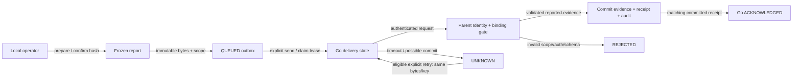

# P3 — ส่งรายงาน Marketing และรับหลักฐานตอบกลับ

Physical follow-up: เจ้าของอนุมัติ [sender physical design](p3-physical-delivery.md), wire v0.4.0 และ parent `ZURI-GO-REPORT-PHYSICAL-DESIGN.md` v0.3.0 แล้ว รวม machine gate แบบ deny-default, first committed claim clock และ legacy backup refusal งาน implementation/native QA อยู่ระหว่างดำเนินการ; ยังไม่ใช่ runtime acceptance หรือ live operation approval.

**APPROVED / P3-A PARTIAL.** Parent main-first reconciliation และ exact manifest ผ่าน independent review ก่อนออก fresh `ZAI:FR-281`, `ZAI:FR-282`, `ZAI:FR-283`, `ZAI:SDD-112` ที่ `d08f08a8f2604bd9657360d37f7c135d636189b7` บน `codex/marketing-report-reconciled` ทุก record ยัง planned ไม่มี FEAT membership ใหม่ หลักฐานอยู่ที่ parent `ZURI-GO-RECONCILED-TOOLING-VERIFICATION.md`; manifest digest `758bd232d12fa7c8768ce0f924b3b83344aea3dc118bdc6047d387792c440ee0`.

ชุดเก่า `FR-278/279/280/SDD-111` ที่ `cdb9518bc50019e876c15c6b1f6c1c98af84f65a` บน `codex/marketing-report-p3` และ receipt เดิมเป็น historical evidence ไม่ใช่ alias ของชุดใหม่ Main FR-278 เป็น dashboard และคงเดิม ไม่มีการ merge PR630 ที่ conflict หรือแก้ checkout/runtime หลัก การออก records ไม่ใช่ native receiver proof.

## จุดเริ่มต้นที่ตรวจแล้ว

- [P1/P2 verification](verification.md#local-production-backup-restore--2026-10-05): Local/Production schema 11; Local preview HTTP, native concurrency/lock, data preservation และ independent review ผ่านแล้ว รายงานจริงยังไม่ถูก prepare/freeze เพราะไม่มี reviewed parent association
- Migration `011_marketing_report_ledger.sql` ล็อก outbox ให้ append-only และ `state = QUEUED`; รายงาน revision 1 เท่านั้นและ `supersedes_report_id` ต้องเป็น null P3 ห้ามแก้ migration 011 หรือเปลี่ยน bytes ของรายงานเดิม
- ตรวจ Zuri-AI checkout `O:/zuri.ai` ที่ `a6e295a5e30b61aa0e6a178454e371d59e053818` แบบอ่านอย่างเดียว; fetched remote main `332b88c9277ee0995798f125f99d5343e7d493f0` ไม่มี diff ใน Marketing/Identity modules, growth routes, Prisma schema และ domain specifications ที่ใช้ตรวจ ไม่เลื่อน checkout ที่มี runtime ใช้งานอยู่
- Parent `apps/server/src/app/api/growth/plans/route.js` ใช้ session viewer; `marketing-authority.js` ตรวจ visibility และ Business owner; `api-access-auth.js` คืน Tenant/service-account viewer ไม่ใช่ Person/OWNER
- ไม่พบ receiver/permission `external-marketing-reports` หรือ `marketing.report.ingest` ใน growth routes, Marketing modules และ Prisma schema ที่ตรวจ Parent Prisma ใช้ SQLite; Go ใช้ PostgreSQL จึงต้องออกแบบ transaction/concurrency แยกตาม engine ไม่คัดลอก SQL ข้ามระบบ
- การตรวจนี้เป็น source readiness ไม่ใช่ hosted receiver/deployment acceptance; parent route และ permission ใน [wire contract](contract.md) ยังเป็นข้อเสนอ

## ผลลัพธ์ที่เสนอ

Local operator เลือก campaign/week ที่มี binding ตรวจแล้ว → prepare → ตรวจ preview → freeze → สั่งส่งชัดเจน → Zuri-AI เก็บ external reported evidence และ receipt ใน transaction เดียว → Go เก็บ receipt ที่ตรวจครบและแสดง ACKNOWLEDGED

รายงานที่รับยังเป็น reported/unverified evidence ค่า UNKNOWN/null และ readiness HELD คงเดิม ไม่สร้าง MarketingReview/MarketingDecision และไม่เพิ่มยอด verified revenue

## ขอบเขตและลำดับงานที่เสนออนุมัติ

| ขั้น | งาน | หลักฐานผ่านก่อนขั้นถัดไป |
|---|---|---|
| P3-A | จัดทำ parent-owned Identity binding, evidence/receipt storage และ ingestion/read policy ผ่าน record migration ของ Zuri-AI | approved records ของทั้งสอง repository; exact permission, scope, endpoint และ retention ตรงกัน |
| P3-B | ปิด HTTP acceptance ของ P2 บน isolated QA: reviewed synthetic association → prepare → freeze → read/replay | native DB + actual HTTP ผ่าน; source ไม่เปลี่ยน; crossed scope/Guest/Member/expired/stale ปฏิเสธ; ไม่แตะ restored Business |
| P3-C | Implement parent receiver และ Go manual sender พร้อม delivery state/attempt/receipt บน QA | concurrent claim, receiver commit/replay และ timeout recovery ผ่านจริงตามแต่ละ engine |
| P3-D | ทดสอบ synthetic end-to-end หลัง independent architecture/security review | freeze → send → receipt → ACK; commit-before-timeout replay ไม่สร้าง evidence/audit ซ้ำ; source/parent native records ไม่เปลี่ยน |
| ภายหลัง | พิจารณา binding/credential จริง และ rollout | แยก authorization การ provision, migration และ deployment พร้อม target/backup/preflight ของรอบนั้น |

อนุมัติเอกสารนี้ไม่ได้ provision association/credential จริง ไม่ apply migration เพิ่ม และไม่ส่งข้อมูลหรือ deploy ไป Production ขั้น coding ยังต้องผ่าน parent-approved records ของ P3-A ก่อน

## Authentication: ตัวเลือกและ trade-off

| ตัวเลือก | ข้อดี | ข้อแลกเปลี่ยน / ข้อจำกัด |
|---|---|---|
| **แนะนำ: credential สำหรับ report ingest โดยเฉพาะ** | ผูก deployment/Business/operation ชัดเจน; credential ไม่ผ่าน Enterprise import หรือ native Marketing owner routes | ต้องมี parent Identity extension และ lifecycle/revocation ที่อนุมัติ; reuse กลไก hash/custody ได้ แต่ห้ามอ้างว่ามี capability นี้แล้ว |
| Enterprise API key เดิม + Business ingest binding | reuse resolver/lifecycle ปัจจุบันได้มากกว่า | key เดิมยังมี Tenant-wide Enterprise capabilities นอก receiver; binding ที่ endpoint นี้ไม่ได้ลดสิทธิ์อื่น จึงไม่ใช่ report-only credential |

ข้อเสนอเลือก credential สำหรับรายงานโดยเฉพาะ Parent ต้อง reject credential นี้จาก unrelated routes และตรวจ active credential/binding, exact source deployment/Business, target Tenant/Business, operation และ active visible initiative ทุกครั้ง รวม replay ห้าม fallback เป็น browser session/OWNER หรือให้ body เลือก authority

Source Local กับ hosted เป็นคนละ deployment/binding แม้เริ่มจาก backup เดียวกัน การ copy database ไม่ได้สร้าง parent identity หรือ grant

## เจ้าของข้อมูลและ persistence

| เจ้าของ | Proposed records / behavior | สิ่งที่ต้องคงเดิม |
|---|---|---|
| Go DOM-CAM / SRV-002 | เพิ่ม delivery state + bounded attempt/validated receipt แยกจาก frozen report/outbox; one active lease per scoped report | 011 report/preparation/outbox append-only; source Campaign/state/revision และ frozen routing/hash |
| Parent Identity | reviewed report-only credential และ exact binding; provision/revoke โดยผู้มีอำนาจ | ไม่สร้าง Person/OWNER; ไม่ใช้ local Member PID เป็น parent actor |
| Parent Marketing | private external evidence record ที่ผูก immutable envelope/hash กับ durable receipt; existing audit ใน transaction เดียว; scoped authorized reads | native Initiative/Plan/version/review/decision, PM handoffs และ Commerce verified totals |

Physical tables/models และ finalizer boundaries เสนอใน [physical chapter](p3-physical-delivery.md); schema/migrations, API/TC IDs และ executable signatures ยังไม่ implement/allocate ต้องอนุมัติ proposal และตรวจ main ล่าสุดก่อน coding Go records ต้องมี Business/operator RLS, direct-write restrictions และ atomic grant reconciliation; runtime ห้ามแก้ state/receipt ผ่าน SQL กว้าง ๆ

Parent ต้องมี unique authenticated binding + reportId ที่ persistence layer ไม่ใช้ check-then-insert อย่างเดียว Same bytes/hash คืน receipt เดิมหลัง re-authorize; different bytes เป็น conflict และ rollback evidence/receipt/audit ทั้งชุด

## Delivery และ retry

ใช้ whitelist/canonical bytes/receipt fields และ delivery limits ใน [wire contract](contract.md#sender-delivery-states-and-bounded-recovery) เป็น SoT เดียว บทนี้ไม่ทำสำเนา enum/timeout/retry schedule

- สั่งส่งจาก Local operator แบบ explicit เท่านั้น; retry ต้องตรวจสิทธิ์และ eligibility ใหม่ ไม่มี worker/scheduler ที่เริ่มส่งตอน boot
- Claim lease ใน transaction สั้น แล้วปิด transaction ก่อน network; ไม่ถือ Business lock ระหว่างรอ HTTP
- Lease มี unique attempt/fencing token; completion ของ attempt เก่าห้ามทับผลใหม่ Claim และ completion ใช้เวลาฝั่ง server
- ใช้ fixed approved receiver origin/path จาก server config ไม่รับ URL/token ใน browser/envelope; ไม่ตาม redirect และไม่ fallback ไป endpoint อื่น
- ส่ง frozen bytes/hash เดิม ไม่ recapture source ไม่ regenerate envelope และไม่แก้ target เพื่อ retry
- ACKNOWLEDGED เฉพาะ receipt ที่ตรงกับ contract/hash/report/binding/target และเก็บได้ atomically; HTTP success, pending response หรือ timeout ไม่ใช่ receipt
- UNKNOWN หลัง possible commit ต้อง replay key/bytes เดิม; lease หมดไม่ใช่หลักฐานว่าฝั่ง receiver ไม่ได้ commit
- Auth/schema/conflict refusal เป็น terminal operator review ไม่เปลี่ยน credential/binding/report อัตโนมัติ
- Log เฉพาะ bounded outcome/reference ไม่มี token, connection string, raw source หรือ customer data

## Scope ของ revision และ retention ที่ต้องรับรอง

ข้อเสนอ slice แรกส่งเฉพาะ frozen revision 1 ที่ P2 สร้างได้ Parent ยอมรับ revision นี้และปฏิเสธ unsupported correction แทนการเขียนทับ การสร้าง correction revision/การขยับ latest pointer ยังไม่ implement; **AC-015-005-04 ยัง OPEN** และ feature ทั้งหมดจะไม่ถูกประกาศ complete จาก P3 slice แรก

เจ้าของเลือก retention ขั้นต่ำ **90 วัน** สำหรับ parent evidence/receipt เมื่อ 2026-10-05 (policy version 1 เริ่มนับจาก acceptedAt); audit ใช้นโยบาย append-only เดิม ไม่มี automatic purge ใน slice นี้ ครบ 90 วันไม่ได้ลบอัตโนมัติ และ revocation ไม่แก้ bytes ของรายงาน Parent private-reader policy อนุมัติและออก planned records แล้ว; physical design ยังเป็น gate ก่อน schema coding ไม่อ้างว่า export รายงานทำให้ข้อมูลเป็น public

## Acceptance และ exit

ผูก FR/AC เดิม [FR-015-004](requirements/FR-015-004-durable-delivery-receipt.md) และ [FR-015-005](requirements/FR-015-005-source-preserving-receiver.md); TC IDs ใหม่ allocate หลัง approval/fresh-main check

| Acceptance | Evidence ที่ต้องรัน | สถานะ |
|---|---|---|
| P2 QA HTTP success + strict denials | actual native PostgreSQL/API, synthetic Business/association, cleanup ที่ไม่แตะ restored data | NOT_RUN สำหรับรอบ P3 |
| One sender lease / fenced completion | two independent PostgreSQL connections; stale attempt completion ปฏิเสธ | NOT_RUN |
| Parent binding/credential isolation | missing/revoked/crossed scope/hidden domain/inactive initiative/replay disclosure; unrelated route rejects report-only credential | NOT_RUN |
| Receiver atomicity/idempotency | SQLite concurrent requests on isolated parent QA; exactly one evidence/receipt/audit; conflict ไม่เขียนทับ | NOT_RUN |
| Lost acknowledgment recovery | receiver commits then network timeout; Go UNKNOWN; eligible identical replay ACK เดิม | NOT_RUN |
| Receipt/privacy/source authority | mismatch/oversize/redirect/secret fields ปฏิเสธ; Go source and parent native records unchanged | NOT_RUN |
| Correction latest-pointer acceptance | AC-015-005-04; ต้องออกแบบ revision support แยกก่อน implement | OPEN / deferred from first slice |
| Independent review + end-to-end | identified commits/DB engines/configured QA scopes; required cases no FAIL/SKIP | NOT_RUN |

Exit ของ slice: parent records approved, P2 QA HTTP และ P3 required cases ผ่าน, docs/traceability/current source ตรงกัน และ review ผ่าน ไม่มี real-target rollout จากผล QA นี้

## Version diff

0.3.0 → 0.4.0: เพิ่ม navigation ไป physical proposal ที่ยัง DRAFT และแยก approved behavior ออกจาก physical/code/native-test gate; ไม่เปลี่ยน local IDs, wire bytes, migration 011 หรือ runtime

0.2.0 → 0.3.0: บันทึก parent tooling approval และ reviewed canonical issuance; ชี้ qualified parent IDs โดยไม่ alias local IDs คง physical design/QA/application gates และไม่เปลี่ยน schema/runtime

0.1.0 → 0.2.0: บันทึก owner approval ของ P3 และ retention ขั้นต่ำ 90 วัน; เริ่ม P3-A parent-owned intake/record migration ใน worktree แยก โดย parent migration approval ยังเป็น gate ก่อน coding ไม่มี code/schema/runtime/credential/Production เปลี่ยนแปลง

0 → 0.1.0: เพิ่มบท draft P3 ใน feature เดิม ตรวจ parent source ปัจจุบัน เสนอ report-only credential, separate delivery ledger และลำดับ QA acceptance; ระบุ correction/retention gates ที่ยังเปิด ไม่มี code/schema/runtime/credential/Production เปลี่ยนแปลง

Version diff 0.4.0 → 0.5.0: records paired physical approval and fresh parent issuance; preserves historical evidence and NOT_RUN native acceptance.
