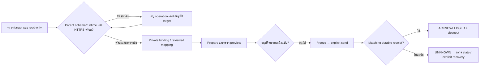

# P3 Local pilot — ส่งรายงานหนึ่งฉบับและตรวจ receipt

เป้าหมายคือให้ trusted Local operator ของ Go ใช้ Business เดิม prepare/freeze และส่งรายงานแคมเปญหนึ่งฉบับไปยัง initiative ที่เลือกชัดเจนใน Marketing ของ Zuri-AI แล้วตรวจ receipt ที่บันทึกทั้งสองระบบ. Owner approved this workflow on 2026-10-06 and selected the existing Zuri-AI database, not a new pilot database. The exact parent runtime/database location and target mapping remain unresolved. Approval advances target discovery; subsequent operations follow the concrete target and report gates below. No migration, credential or send is inferred from merely writing this document.

## Authority and current evidence

- Go [feature](feature.md), [design](design.md), [wire contract](contract.md), [P2](p2-freeze-outbox.md) และ [P3 physical design](p3-physical-delivery.md) เป็นข้อกำหนดเดิม; ไม่เปลี่ยน wire, API หรือ authorization.
- [Verification](verification.md) บันทึก Go Local/Production schema 12, Go production code rollout และ isolated paired acceptance 18/18. ผล QA ไม่ใช่หลักฐานว่าระบบจริงเชื่อมกันแล้ว.
- Parent merged source `fd9ca7c606fbe0fd69d35467802f56916675fd7a` มี FR-281–283/SDD-112 และ `docs/change-requests/marketing/ZURI-GO-REPORT-PHYSICAL-DESIGN.md` v0.3.0. Primary checkout `O:/zuri.ai` ยังอยู่ `07779662`; ไม่ได้อัปเดต source หรือ runtime ในรอบนี้.
- ตรวจ source parent operator แล้ว: policy ต้องสร้าง disabled ก่อน จากนั้น enable ด้วย expected-version แยกคำสั่ง; binding ออก dedicated report credential และคืนครั้งเดียวหลัง commit. เป็น application functions ไม่ใช่หลักฐานว่ามี operator CLI พร้อมใช้.
- Go sender รับ HTTPS origin เท่านั้นจาก private config. HTTP loopback injection ใช้เฉพาะ isolated QA; ห้ามนำไปใช้เป็น fallback สำหรับ pilot จริง.

[ASSUMPTIONS]

1. ใช้ Go persistent Local และ trusted operator/Business เดิมตาม owner decision; ไม่ใช้ Go Production เป็น source ของ pilot นี้.
2. ใช้ฐาน Zuri-AI เดิมตาม owner decision; runtime/database location, Business/initiative, HTTPS origin และ campaign/week ยังไม่ได้ยืนยันสำหรับ real pilot. ต้องตรวจและยืนยัน mapping ก่อน operation ที่เขียนข้อมูล; ไม่จับคู่ด้วยชื่อหรือใช้ UUID จากอีกระบบแทนกัน.
3. Pilot พิสูจน์ transport/receipt สำหรับ reported evidence; measurement ที่ไม่มี audited timezone/coverage ยังเป็น null/UNKNOWN และ readiness HELD ได้ตามสัญญา. ไม่เพิ่ม attestation หรืออ้างผล Ads จริงเพื่อให้ผ่าน.

## Sequential gates

| Gate | งานและสิ่งที่ต้องตรวจ | Exit / authority |
|---|---|---|
| A — target discovery | อ่าน parent AGENTS/approved records; ตรวจ checkout/WIP, active listener/runtime, actual DB engine/path/schema, approved receiver source, existing target Business/OPEN initiative และ HTTPS route. ตรวจ Go campaign ที่อ่านได้, source revision และ Monday→Monday window. เก็บ identifiers/config ใน private operator evidence | ได้ target manifest ที่ตรวจจริง; read-only ทำได้ก่อนอนุมัติ operation. ห้ามเปลี่ยน primary checkout/runtime เพื่อสำรวจ |
| B — parent readiness | เสนอ exact source/migration กับ target manifest; ตรวจ compatibility ของ actual parent engine. SQLite เป็น receiver engine ที่ qualified; PostgreSQL receiver ยัง disabled/unqualified. สำรอง whole SQLite ด้วย consistent mechanism และทดสอบ restore ใน isolated target ก่อน migration; ตรวจ preservation/custody/backup guards และ deployed receiver version | ต้องอนุมัติ parent database/runtime operation ตาม manifest ก่อนดำเนินการ. ถ้า actual engine/HTTPS/source ไม่พร้อม ให้หยุด gate นี้และเสนอ scope เฉพาะปัญหา ไม่ provision/send |
| C — private binding | operator สร้าง disabled policy ถ้ายังไม่มี; สร้าง binding ให้ exact Local deployment/Business; private one-time credential handover; reviewed Go association ระบุ parent binding/initiative และ exact row version. ตั้ง private delivery config ตาม parser เดิม; จากนั้น enable parent policy แบบ expected-version ตามอนุมัติ | ต้องอนุมัติ provisioning/enable กับ target ที่ระบุ. Credential ไม่ผ่าน chat/browser/log/Git; ไม่ใช้ human session หรือ Enterprise key แทน report credential |
| D — reviewed freeze | prepare ผ่าน API-025; ตรวจ sanitized preview, window/revision/hash และ UNKNOWN/HELD; owner review รายงานที่เป็นรูปธรรมก่อนส่ง. Freeze แบบ atomic report + QUEUED + audit; อ่านกลับตรวจ exact bytes/hash | อนุมัติรายงานหนึ่งฉบับที่ตรวจแล้วก่อน freeze/send. หาก source เปลี่ยนหรือ preparation หมดอายุ ให้ prepare ใหม่; ไม่ใช้ blanket approval สำหรับรายงานอื่น |
| E — explicit send | operator เรียก API-026 send หนึ่งครั้ง; ตรวจ parent commit และ Go matching durable receipt/ACKNOWLEDGED, IDs/hash/acceptedAt ตรงกัน. ตรวจ native Marketing/PM/Commerce และ Go source ไม่ถูกเปลี่ยนโดย intake | PASS เฉพาะ receipt ที่ตรวจครบ; HTTP 200/201 อย่างเดียวไม่ใช่ PASS. Timeout = UNKNOWN; ตรวจ state ก่อน และใช้ explicit same-byte retry เมื่อ authorized/eligible เท่านั้น ไม่ส่งซ้ำอัตโนมัติ |
| F — closeout | บันทึก source/deployment identity, target class, preview approval, preservation, receipt/state และ PASS/FAIL/NOT_RUN ใน verification; payload/cookie/raw custody อยู่ .local | เก็บ evidence/receipt อย่างน้อย 90 วันจาก parent acceptedAt; ไม่มี purge. ปิด building เฉพาะ acceptance ที่ผ่านจริง ไม่อนุมาน hosted sending |

## Acceptance and scope

Pilot สำเร็จเมื่อ mapping ตรงกัน, parent/current machine grants ตรวจจริง, frozen envelope/hash ไม่เปลี่ยน, parent มีหนึ่ง report/receipt/audit และ Go มี matching durable receipt พร้อม ACKNOWLEDGED. Existing records ต้องถูกเก็บไว้; secrets ต้องไม่อยู่ใน tracked/deployed artifacts. ใช้ source/configured authority เดิมโดยไม่ impersonate Member.

ไม่รวม hosted sending, schedule, UI ใหม่, Ads provider integration, correction revision, parent PostgreSQL qualification, production Business reset หรือ deployment-parser fix. RCA ของ parser และ historical extraction checker เป็นงานแยก; ไม่ใช้การแก้เครื่องมือเหล่านั้นเป็นเหตุข้าม pilot gate.

## Target discovery checkpoint — 2026-10-06

Go actual persistent Local was inspected in a REPEATABLE READ READ ONLY transaction using its restricted, non-superuser/non-BYPASSRLS runtime and the existing operator viewer. Migration ledger inspection used the existing operator connection in a separate READ ONLY transaction; no permission changed. Schema is exactly 001–012. Two readable non-archived campaigns both passed the actual source-reader/preview functions and have complete freeze source revision tuples. Candidate window is 2026-09-28 → 2026-10-05, Asia/Bangkok, asOf 2026-10-05T00:00:00+07:00; this is a proposed reporting window, not source-timezone attestation or owner selection. Both previews are HELD; measurements remain UNKNOWN/null. All seven Marketing custody tables have zero rows for the configured Business. No API-025 write, HTTP preview acceptance, freeze, binding or network send occurred. Private candidates/preview hashes are retained under `.local/p3-local-pilot-20261006/go-readonly.json`.

Parent primary checkout is clean at `07779662`; GitHub main was checked as `fd9ca7c606fbe0fd69d35467802f56916675fd7a`. Enumerating the primary checkout found only example environment files and no actual `.env`/`.env.local` or SQLite database under that checkout, including ignored files. Relevant local Server/API/ngrok listener ports were not listening; this is a scoped host observation, not proof that no deployment exists elsewhere. Remote Desktop Commander listed DESKTOP-VETATMQ as offline. GitHub repository metadata has no homepage and its deployments endpoint returned no records. The owner-provided repository URL identifies source, not a database or application origin.

Parent deployment guide distinguishes SQLite development from PostgreSQL-only production. The receiver remains qualified for SQLite only; real database engine must be verified before selecting a migration or enabling intake. No Docker deployment, database creation, primary checkout update, policy enable or credential provisioning was performed. Gate A is PARTIAL awaiting the existing runtime/database location and target mapping; B–F are NOT_RUN. Current checks are canonical in [verification](verification.md#local-pilot-target-discovery--2026-10-06).

## Windows recovery handoff — owner decision 2026-10-06

Owner confirmed the existing parent database is on another inaccessible machine, will reinstall Windows, and requested committing/pushing a recovery guide to GitHub for resuming afterward. The parent canonical guide is [Windows recovery and Docker handoff](https://github.com/Freshair129/zuri.ai/blob/codex/windows-recovery-handoff-20261006/docs/deployment/windows-recovery-and-docker-handoff.md) v0.1.0; this branch link retains the guide before its PR is merged. It owns old-disk backup/config custody, same-engine restore/rehearsal, Docker cutover and resume packet. This Go chapter owns only the sender pilot; do not duplicate parent restore commands here.

Current execution is **DEFERRED — awaiting preserved existing parent data/config after Windows reinstall**. No request for that inaccessible machine's path is required now; collect it with the resume packet when available. Source and these documents are on GitHub; database contents/private configs are not. A source clone, Windows installation or Docker build cannot recover old records from migrations. Preserve actual Go backups/config separately if its host/storage is also being replaced; Go Local and Neon remain independent.

Docker production uses PostgreSQL; the present parent receiver is qualified for SQLite only and explicitly disabled for PostgreSQL. Restoring/deploying the parent application and enabling Marketing exchange are separate acceptance gates. Before sending to a Docker target, qualify a PostgreSQL receiver under separately approved scope, not by changing the production database guard or importing a copied SQLite file. If the restored old parent is SQLite, preserve it first and review the actual SQLite→PostgreSQL migration path, including fail-closed legacy snapshot custody.

Resume only after the owner reports Windows/data/config ready: inspect the exact target/engine/HTTPS/release, verify backup/restore preservation, select Business/initiative/campaign/week, then follow B–F. The existing Go previews are historical candidate checks and must be regenerated for current source/window; 15-minute preparations must not be created now for a later machine move. No provision, freeze/send, real migration, scheduler or automatic monitor is started by this handoff.

## Version diff

0.2.0 → 0.3.0: owner confirmed the existing parent database is on an inaccessible other machine and requested a GitHub handoff for Windows reinstall/database move/Docker deployment. Execution is deferred until the preserved database/config is available; no new database or automated resume. Links the parent recovery guide and records the Docker PostgreSQL receiver gate. Application/schema unchanged.

0.1.0 → 0.2.0: records owner approval, existing-parent-database selection and actual read-only target-discovery results. Go source previews pass; parent location/engine/HTTPS/mapping are unresolved. Application 0.5.1 → 0.5.1; Go Local/Production schema 12 → 12; no parent operation or real report write/send.

0 → 0.1.0: เพิ่ม draft operational plan ต่อจาก Go deployment โดยแยก target discovery, parent readiness, binding และ reviewed single-report send. Application 0.5.1 → 0.5.1; Go Local/Production schema 12 → 12; parent source/runtime/database และ real report custody ไม่เปลี่ยน.
