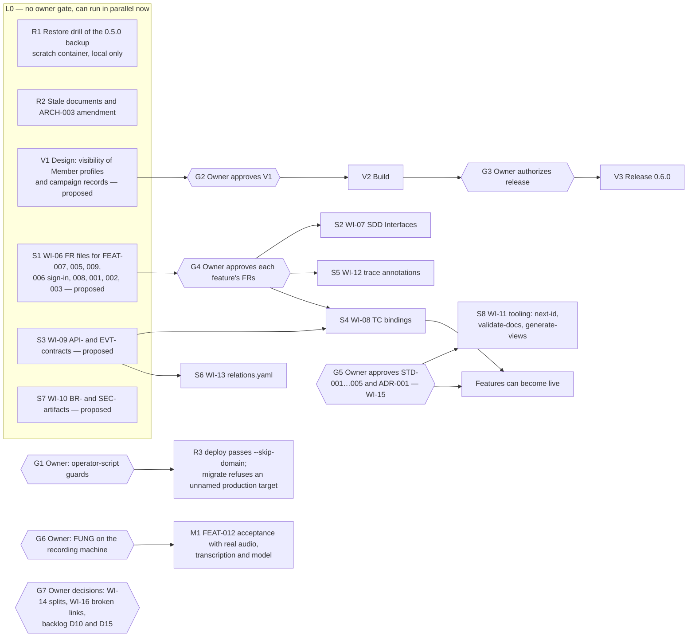

# PLAN-003 — Remaining work after release 0.5.1

Execution DAG of everything still open on 2026-10-01, after release 0.5.1 and the owner's hosted checks ([record](../../releases/0.5.1/verification.md)). It gathers the open items of [PLAN-002](PLAN-002-task-and-meeting-domains.md) (“Final state”, “Design gaps decided”) and of [PLAN-001](PLAN-001-document-standard-adoption.md) Phase 2. This document changes no code, schema or data. Each node that changes production, approves a document or changes approved meaning waits for the owner's gate.

## Execution DAG

## Status (2026-10-01, after the L0 run)

Gates G1, G5 and G7 (WI-16) were decided by the owner on 2026-10-01 as recommended. Seven tracks then ran in parallel, each accepted by an independent verify gate:

| Node | State |
|---|---|
| R1 | Done: [restore drill](../../releases/0.5.0/restore-drill.md), every table count matched |
| R2 | Done: SDD-004 correction note, ARCH-003 “Hosted deployment after 0.5.0” amendment, FEAT-011 “planned” wording (P01, FR-011-001) |
| R3 | Built locally (G1): `npm run deploy` always stages, `npm run promote -- <url>`, `npm run db:migrate -- --cloud`; tests in `apps/api/test/operator-guards.test.mjs`; not yet used for a release |
| V1 | Written, `proposed`: ADR-005, FEAT-011-P04, FR-011-013…020, NFR-011-002/003, a proposed SDD-011 section; waits for G2 (owner questions Q-V1…Q-V9 in ADR-005) |
| S1 | Written, `proposed`: FR / NFR files for FEAT-007, 005, 009, 006 (PID and sign-in), 008, 001, 002, 003; wait for G4 |
| S3, S7 | Written, `proposed`: API-001…022, EVT-001 (`docs/domains/*/contracts.md`), BR-001…021 (`docs/domains/*/rules.md`), SEC-001…020 (`architecture/requirements/security-requirements.md`); the placement of `rules.md` is an owner question (STD-003 R2 names no such file) |
| S8 | Done (G5): `scripts/docs/` — `npm run docs:validate`, `npm run docs:views`, `npm run docs:next-id`; `npm test` runs them. On this tree: 0 errors; warnings are the 131 FRs without a `verifies` edge (S4), the 10 historical links and the recorded standard gaps |
| G5, G7 | Done: STD-001…005 and ADR-001 approved; the ten historical links annotated |

## Nodes

| Node | Work | Needs | Who | Output |
|---|---|---|---|---|
| R1 | Restore the private pre-release dump (`.local/backups/cloud-pre-0.5.0-…sql`) into a throw-away PostgreSQL 18 container; reconcile every table count with the 0.5.0 “before” record; remove the container | — | Agent | Restore-drill evidence in the 0.5.0 record (counts only) |
| R2 | Correct stale text: FEAT-011 P01 and FR-011-001 still say “planned” tables; SDD-004 says a Member is not an authenticated account; ARCH-003 has no amendment for schema 6 and 7, the new hosted modules and the release procedure used for 0.5.0 | — | Agent | Documentation change |
| R3 | `npm run deploy` deploys with `--prod` and no `--skip-domain`, so it moves the public domain at once; `migrate.mjs` has no production guard and migrates whatever `ZURI_GO_ADMIN_URL` names | G1 | Agent | Operator-script change with tests |
| V1 | PLAN-002 Q1 follow-up: visibility levels for Member profiles and campaign records (Guests still read campaign records and Member names), as an ADR-004 amendment and FEAT-011 requirements | — | Agent drafts | Proposed ADR text, FR files, SDD section |
| V2, V3 | Build, then release with a migration if the design needs one | G2, G3 | Agent | Release record |
| S1 | PLAN-001 WI-06: FR / NFR / AC files for the features that have none — FEAT-007, 005, 009, the PID and sign-in part of FEAT-006, 008, 001, 002, 003 — one feature per change, from their approved specs, `status: proposed` | — | Agent, parallel per feature | Requirement files |
| S2 | WI-07: `## Interfaces` in the SDDs of features that persist data or call outside systems | G4 | Agent | SDD sections |
| S3 | WI-09: API- and EVT- contracts for `/api/zuri-go/v1` and the FUNG connector | — | Agent | Contract documents, proposed |
| S4 | WI-08: bind TC IDs in each `verification.md` to the tests that prove them | G4, S3 | Agent | Verification files |
| S5 | WI-12: `@trace` annotations at code boundaries for the approved FRs | G4 | Agent | Comment-only code change |
| S6 | WI-13: `registry/relations.yaml` (FUNG, Vercel, Neon, Docker PostgreSQL; the context map) | S3 | Agent | Registry file |
| S7 | WI-10: business rules and security rules now written in AGENTS.md and the specs, as BR- and SEC- artifacts | — | Agent | Proposed artifacts |
| S8 | WI-11: `next-id`, `validate-docs` (the validator used in this session, brought into the repository) and `generate-views` | G5 | Agent | Scripts and tests |
| M1 | FEAT-012 FR-012-002, -005 and -010 stay `building` until a real recording, transcription and model inference run end to end | G6 | Owner, with the agent | FEAT-012 verification |

## Gates

| Gate | Decision | Recommendation |
|---|---|---|
| G1 | May the agent change the operator scripts (deploy, migrate)? | Yes: `deploy` passes `--skip-domain` and `promote` becomes its own command; `migrate` takes `--cloud` like the other operator tools and refuses a production URL without it |
| G2 | Approve the V1 design | After reading it |
| G3 | Authorize the release of V2 | When built |
| G4 | Approve each feature's new FR files | Feature by feature |
| G5 | Approve STD-001…005 and ADR-001, resolving the gaps ADR-001 D8 lists (WI-15) | Approve, with the gaps noted in the session's validator output |
| G6 | Run FUNG with a real recording on the recording machine | When convenient |
| G7 | WI-14 candidate splits; WI-16 the ten broken links; the backlog items D10 (per-task weekly MoSCoW API) and D15 (FUNG status screens) | WI-16: mark the ten links as historical; the rest later |

## Not needed

- Cleaning task history events written before 0.5.1 that still hold quotes: production holds no meeting, so no such event exists there; on the local database they stay withheld on read (PLAN-002 D14).
- A Workboard backfill run: the dry runs on schema 7 found 0 Workboard tasks (FR-010-016).
