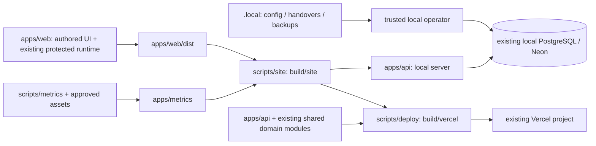

# แยก Zuri-Go เป็นโปรเจกต์อิสระ

## เป้าหมายและฐานอ้างอิง

จัด source, assets, API, PostgreSQL migrations, tests, documentation และ build/deploy tools ของ Zuri-Go ให้อยู่ใน `D:/workspace/zuri-go` และทำงานโดยไม่ต้องอ่านไฟล์จาก brand-kit เดิม ฐานพฤติกรรมคือ Zuri-Go 0.4.0: Guest อ่านได้, สมาชิกใช้ PID/รหัสส่วนตัว, actor จาก session, งานและหลักฐานเก็บใน PostgreSQL และคู่มือ/Graph View อยู่ใน site เดียว

ตรวจพบปลายทางเป็น directory ปกติและว่างก่อนสร้างเอกสารนี้ ไม่พบ AGENTS.md ที่ D:/workspace หรือปลายทาง ณ เวลาตรวจ ไม่มีการย้าย source, credential, database หรือเปลี่ยน production ในขั้นเอกสารนี้

Parent ที่อ่าน: `output/draft/zuri-go/architecture.md`, `cloud-deployment-spec.md`, `member-identity-spec.md`, `brand/brand-profile.md` ในต้นทาง
Peer ที่อ่าน: `output/draft/unified-site-spec.md`, `guest-access-spec.md`, project brief ของ Mission Control และ Metrics Map, Data App `AGENTS.md`, build scripts, runtime/config และ tests ที่อ้างเส้นทางข้ามโฟลเดอร์

เอกสารเก่าบางฉบับเป็นหลักฐานการออกแบบของรุ่นก่อน เช่น local-only/shared login; บทแก้ไข Guest 0.3.1 และ Member identity 0.4.0 มีผลเหนือข้อกำหนดเก่าเหล่านั้น คู่มือใหม่ต้องชี้สถานะปัจจุบันอย่างชัดเจน

[ASSUMPTIONS]
1. ต้องการโปรเจกต์ที่แก้ไข ทดสอบ build และเปิด local จากปลายทางได้จริง ไม่ใช่สำเนาเฉพาะไฟล์ HTML ที่ deploy แล้ว
2. ปลายทางจะเป็น working source หลัก หลังตรวจผ่าน ต้นทางเก็บเป็น checkpoint พร้อมเอกสารชี้ตำแหน่งใหม่ การลบต้นทางไม่อยู่ในแผนนี้
3. ใช้ Docker container/volume ของ local PostgreSQL, Neon database, Business UUID, Member UUID/PID, credential versions และ Vercel project เดิม ไม่สร้างฐานข้อมูลใหม่ ไม่ reimport state ไม่หมุนรหัสผ่าน
4. คง Data App เป็นหน่วยเดิมใต้ apps/web พร้อม protected files และ stable app ID; จัด outer folders และ paths ที่เป็น authored/backend/build integration เท่านั้น
5. รักษา toolchain ปัจจุบัน: Node, Python, PostgreSQL, Docker และ installed Data plugin การไม่พึ่ง brand-kit ไม่ได้หมายถึงไม่ต้องติดตั้งเครื่องมือ build

## โครงสร้างปลายทาง

```text
D:/workspace/zuri-go/
├─ README.md                     วิธีเริ่มงานและคำสั่งหลัก
├─ AGENTS.md                     กติกา DDD, scope, brand และ private/public boundary
├─ package.json                  คำสั่งระดับ root; ใช้ Node runner เท่าที่จำเป็น
├─ .gitignore                    private state, generated output, dependencies
├─ apps/
│  ├─ web/                       Data App ทั้งหน่วย คงโครงสร้างภายใน
│  │  ├─ src/content/            Overview, campaigns, business, meetings, member UI
│  │  ├─ src/data.json
│  │  ├─ AGENTS.md               คัดลอก byte-identical
│  │  ├─ protected-runtime.json
│  │  └─ dist/                   generated dashboard
│  ├─ api/                       Node API, domain services, auth, local server
│  │  ├─ migrations/             SQL 001–005 เดิมและ migration runner
│  │  ├─ test/                   backend tests ที่มีอยู่
│  │  ├─ package.json
│  │  └─ package-lock.json
│  └─ metrics/
│     ├─ index.html              คู่มือและ Graph View ที่สร้างจาก builder
│     ├─ assets/                 fonts/licenses, logo และ mascot ที่อ้างจริง
│     └─ gvm/                    ภาพประกอบอ้างอิง 8 ภาพ
├─ assets/
│  └─ logos/zuri-go/             source logo ที่ใช้จริง พร้อม provenance
├─ brand/                       สำเนากติกาและ approved product exceptions ที่เกี่ยวข้อง
├─ scripts/
│  ├─ local/                    start/local backup wrappers
│  ├─ metrics/                  generator และ static verifier ของ Metrics Map
│  ├─ site/                     unified-site packager และ packaging tests
│  └─ deploy/                   Vercel allowlist packager
├─ tests/
│  └─ campaign/                 campaign model tests และ reviewed plan fixture
├─ docs/
│  ├─ architecture/             architecture, data model, identity/deployment contracts
│  ├─ product/                  Overview, campaign, Meeting/Tasks, Metrics/Graph specs
│  ├─ operations/               local setup, backup, credentials, build/deploy
│  ├─ migrations/               แผนนี้, mapping manifest และผลตรวจการย้าย
│  └─ history/                  บันทึกผลตรวจรุ่นเดิม พร้อม original-path provenance
├─ .brain/rca/                  RCA ของ Zuri-Go/ส่วนประกอบที่เกี่ยวข้อง
├─ build/
│  ├─ site/                     static site รวมที่ใช้ local
│  └─ vercel/                   deploy package ที่สร้างซ้ำได้ + project link
└─ .local/                      ข้อมูลส่วนตัว ไม่เข้า Git/static/deploy
   ├─ config.json               local database connection และ Business เดิม
   ├─ cloud-config.json         trusted operator configuration
   ├─ postgres.env              local PostgreSQL setup secrets
   ├─ member-access/production/ private handover สมาชิก 4 คนและ index
   ├─ backups/                  full SQL checkpoints
   ├─ imports/                  import receipts/staging ที่จำเป็น
   └─ logs/                     runtime logs ที่สร้างจากตำแหน่งใหม่
```

ไม่เพิ่ม monorepo framework, package registry หรือ shared-model package ในรอบนี้ API ยังคงใช้ domain model จาก authored content ตามสัญญาปัจจุบัน โดยแก้ import paths ให้ชี้ไป apps/web อย่างชัดเจน

## Source → destination mapping

ทุก source ด้านล่างอ้างจาก D:/zuri-brand-kit; destination อ้างจาก D:/workspace/zuri-go

| Source | Destination | วิธีจัดการ |
|---|---|---|
| output/draft/campaign-mission-control/ | apps/web/ | copy ทั้ง authoring unit รวม nested AGENTS, runtime/reference/hosting metadata; สร้าง dist ใหม่หลังตรวจ integrity |
| projects/zuri-go/*.mjs, package manifests, migrations/, test/ | apps/api/ | คง modules เดิม เปลี่ยน import/static/config/private paths ที่จำเป็น |
| projects/zuri-go/start-local.ps1 | scripts/local/start.ps1 | ใช้ root-relative paths และตรวจ process เดิมก่อนสลับ listener |
| projects/zuri-go/build-cloud.py | scripts/deploy/build_cloud.py | คง explicit allowlist; สร้าง build/vercel ด้วย layout ที่ import ได้จริง |
| projects/campaign-mission-control/build_unified_site.py, test_unified_site.py | scripts/site/ | เปลี่ยน input/output roots และปรับ packaging tests |
| projects/campaign-mission-control/model.test.mjs, reviewed-plan.json | tests/campaign/ | แก้ paths; คง expected behavior |
| projects/campaign-01/build_metrics_map.py, verify_metrics_map_static.py | scripts/metrics/ | ตรวจ generation parity ก่อนยอมรับ index ใหม่; ปรับ logo/output/report paths |
| output/draft/campaign-01_metrics-map.html + referenced assets/gvm | apps/metrics/ | บันทึก baseline hashes; copy เฉพาะ dependency closure และ license files |
| assets/logos/zuri-go/download.png | assets/logos/zuri-go/download.png | คง byte-identical; ไม่ redraw logo |
| output/draft/zuri-go/*.md | docs/architecture/ และ docs/product/ | แยกตามหน้าที่ ทำ index และแก้ current links |
| Mission Control, Meeting/Tasks, Metrics/Graph, unified-site specs/briefs/guides | docs/product/ และ docs/operations/ | ย้ายเฉพาะเอกสารของ Zuri-Go และส่วนประกอบ |
| *_review / *-review reports ที่เกี่ยวข้อง | docs/history/ | เก็บ verification, version diffs และภาพ evidence ที่จำเป็น; ไม่คัดลอก before snapshots หรือ generated duplicates ทั้งก้อน |
| .brain/rca/ ของ Zuri-Go/ส่วนประกอบ | .brain/rca/ | รักษา evidence และ original-path provenance |
| projects/zuri-go/.local/ active configs, member handovers, backups/imports | .local/ | ตรวจไฟล์และ hash แบบไม่พิมพ์ secrets; source checkpoint ยังคงอยู่ |
| output/draft/zuri-go-cloud/.vercel/project.json | build/vercel/.vercel/project.json | เก็บ projectId/orgId เดิม; เชื่อมโครงการเดิมโดยไม่สร้าง project ใหม่ |

node_modules, Python caches, raw QA HTTP responses/cookies/login payloads, obsolete shared-password files, temporary scripts/logs และ generated static/deploy duplicates ไม่ยกมาเป็น source หลัก ไฟล์เก่าคงอยู่ในต้นทาง ไม่ลบในรอบนี้ เครื่องมือ operator ที่ยังจำเป็นต้องจัดให้ใช้ config จาก root ใหม่ โดยไม่มี hardcoded secret หรือ source-root fallback

Brand kit ทั้งชุด, LINE OA, case studies, rejected/approved artwork และโปรเจกต์อื่นคงเป็นของ brand-kit เช่นเดิม เฉพาะ asset dependencies ที่ Zuri-Go ใช้จริงถูกสำเนามาพร้อมที่มา ไฟล์ graphui.html เป็น design reference ไม่ใช่ runtime dependency; บันทึก provenance แทนการนำมาเป็นอีก entry point

## Dependency และผลกระทบ



- api.mjs, service.mjs, workspace.mjs และ backend tests import models จาก output/draft ของต้นทาง ต้องแก้เป็นตำแหน่ง apps/web โดยไม่เปลี่ยน business logic
- server.mjs ต้อง serve เฉพาะ build/site ไม่ serve project root หรือ .local
- config, migration/provisioning/backup/import paths ต้องอิงตำแหน่งโปรเจกต์ ไม่อิง current working directory หรือ D:/zuri-brand-kit
- metrics builder อ้าง source logo และ UI logo CSS; ย้าย dependency ทั้งสองและตรวจว่า generated guide ยังคง 18 หน้า/40 graph terms และลิงก์ที่ใช้จริง
- Data App protected runtime, AGENTS และ manifests คัดลอก byte-identical; ไม่แก้ integrity hash เพื่อให้ผ่าน ไม่มีการเปลี่ยน app ID หรือ browser storage keys
- ไฟล์ build/vercel อนุญาตเฉพาะ public assets, server modules, shared modules และ deployment manifests; .local และ operator tools ต้องไม่เข้าแพ็กเกจ
- Docker volume เป็นข้อมูล PostgreSQL จริงซึ่งอยู่นอก source tree อยู่แล้ว การจัด source tree ไม่ใช่การย้ายฐานข้อมูล

## ขั้นตอนหลังอนุมัติ และการตรวจ

1. บันทึก source→destination manifest, file counts/hashes และ ownership boundaries ก่อน copy; ตรวจปลายทางอีกครั้ง ถ้ามีไฟล์ใหม่ให้เทียบและเก็บไว้ ไม่ overwrite โดยเงียบ
2. Copy ตาม mapping และปรับ paths/commands/docs เฉพาะที่เกี่ยวข้อง; checkpoint ต้นทางใช้ rollback ได้ ไม่มี symlink/junction กลับไปอ่าน brand-kit
3. ติดตั้ง API dependencies ตาม lockfile ในปลายทาง ส่วน frontend ใช้ installed Data builder ตามสัญญาเดิม; บันทึก tool versions และ external build dependency
4. Build dashboard, Metrics Map, unified site และ Vercel package จากปลายทาง; ตรวจ protected runtime, app identity, source asset hashes, missing imports, links และ secrets exclusion
5. รัน backend suite (baseline 28), campaign model suite (baseline 35), meeting/domain suite ที่อยู่ใน authoring unit, packaging suite (baseline 5), Metrics static checks และ path-isolation checks; baseline เป็นข้อมูลรุ่นก่อน ต้องรายงานผลจริงรอบย้ายแยก
6. ตรวจ listener 4319 และ command line ของ process; สลับเฉพาะ Zuri-Go จากต้นทางเป็นปลายทางหลัง build ผ่าน ไม่หยุด process อื่น และไม่หยุด/ลบ PostgreSQL volume หาก local startup ไม่ผ่าน ให้คืน listener เดิม
7. เปิด local Overview, Members, Weekly To-do, Metrics และ Graph ผ่านตำแหน่งใหม่; ตรวจ current data/identity/file download และ Guest/Member ผ่าน cloud-handler tests ไม่สร้าง production QA recordsเพื่อทดสอบ path-only migration
8. ตรวจ Vercel project link และแพ็กเกจพร้อม deploy; งานนี้เป็นการย้าย workspace ไม่จำเป็นต้องเปลี่ยน production deployment ที่กำลังใช้งาน จัดคำสั่ง deploy เดิมไว้ให้ใช้จาก root ใหม่
9. เขียน README, current-architecture index, verification และ version diff 0.4.0→0.4.1 พร้อม relocation notice ที่ต้นทาง ให้ชัดว่าปลายทางเป็น working source หลัก

## Acceptance / success / exit criteria

- สร้างและรันโปรเจกต์จาก D:/workspace/zuri-go โดย source/build/start/test ไม่อ่าน D:/zuri-brand-kit; historical provenance links เป็นข้อยกเว้นที่ติดป้ายชัดเจน
- local source, assets, docs, scripts และ migrations ครบ; ไม่เกิด source of truth สองแห่งที่ต่างก็อ้างว่า active
- runtime integrity และ app ID เดิมผ่าน; หน้าเว็บและ API contracts ไม่เปลี่ยน
- local/cloud Business, Member UUID/PID/credentials และ PostgreSQL state ยังคงเดิม ไม่มี schema migration/reimport/credential rotation จากการย้าย
- production runtime env/URL/project ไม่เปลี่ยนโดยการย้าย source; package ใหม่ชี้ project เดิมและไม่มี secrets
- ทดสอบ paths/packaging และ domain regressions ผ่าน; local process ที่ใช้งานหลังจบมาจาก workspace ใหม่
- เอกสารระบุเครื่องมือที่ต้องมี, คำสั่ง setup/start/test/build/deploy, private paths และข้อจำกัดครบ พร้อม version diff และผลตรวจจริง

## Version diff ที่เสนอ

| 0.4.0 | 0.4.1 |
|---|---|
| source ปะปนใน projects/ และ output/draft/ ของ brand-kit | apps/, scripts/, docs/, build/, .local/ ภายใต้ workspace เฉพาะ Zuri-Go |
| build/import paths อ้าง brand-kit | resolve จาก project root ใหม่ |
| คำสั่ง local/backend/frontend กระจายหลายตำแหน่ง | README และ root commands ชุดเดียว ชี้เครื่องมือเดิม |
| credential handovers อยู่ใน service ของ brand-kit | private .local/member-access/production/ ของโปรเจกต์ใหม่ |
| source เก่าเป็น active | source ใหม่ active; ต้นทางเป็น rollback checkpoint มี relocation notice |
| Member login, Guest, PostgreSQL, Metrics/Graph | พฤติกรรมเดิม |

Approval gate: R5/SOP ที่ผู้ใช้ให้กำหนดให้อนุมัติเอกสารก่อนเปลี่ยนโค้ด การอนุมัติแผนนี้ครอบคลุม copy/จัดโครงสร้าง/แก้ paths/คัดลอก private config ที่จำเป็น/สลับ local service/ทดสอบ/อัปเดตเอกสาร ไม่รวมการลบต้นทางหรือ reset ข้อมูล


Implementation: user approved on 2026-09-30. Extraction completed; see [verification](verification.md). Automated checks passed. Browser visual verification was policy-blocked and is explicitly unverified. Single-code login is tracked separately as proposed ZGO-AUTH-003.
