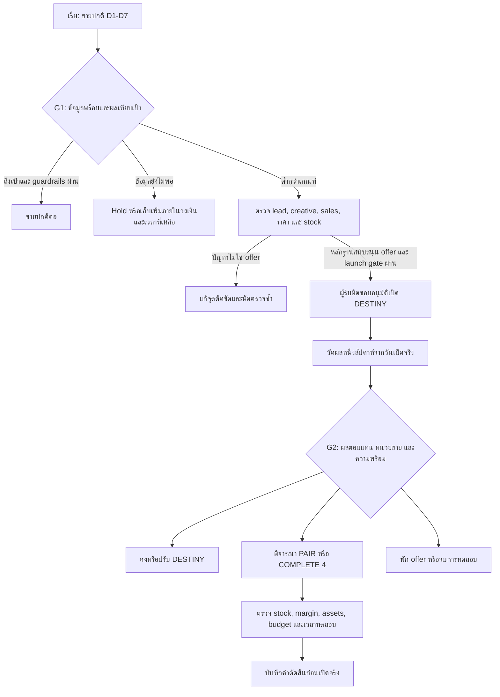

# Campaign Mission Control — requirements and decision design

**Design status:** ผู้ใช้ approve แล้ววันที่ 2026-09-29; สร้าง local dashboard ตามแบบแล้ว ไม่มี live campaign source ที่เชื่อมต่อ

**Purpose:** รู้ว่าแคมเปญถึงเป้าหรือไม่ ระบุจุดติดขัด ตัดสินใจเปิด offer/เพิ่มงบอย่างมีเงื่อนไข และติดตามงานจนวัดผลซ้ำได้

[Screen wireframes](campaign-mission-control-wireframes.md) · [Metric reference REV 04](../../apps/metrics/index.html) · [Parent brief](campaign-mission-control-brief.md)

## 1. Confirmed scope and evidence

### 1.1 User-confirmed operating plan

- เลือก objective แยกต่อ campaign; ไม่บังคับทุก campaign ใช้ ROAS หรือยอดขายเป็น North Star
- MUJEEN M1 ใช้ระยะเวลาหนึ่งเดือน เริ่มขายปกติหนึ่งสัปดาห์
- เมื่อไม่เข้าเกณฑ์จึงพิจารณาปล่อย DESTINY — 1 องค์ / 5,555 บาท ซึ่งเป็นแพ็กเกจ 1 ที่ผู้ใช้ยืนยัน
- วัด DESTINY ในรอบหนึ่งสัปดาห์จากวันเปิดจริง แล้วตัดสินใจว่าควรเปิด package เพิ่มหรือไม่
- การเปลี่ยนสัปดาห์สร้าง review checkpoint; ไม่ได้อนุมัติเปิด offer อัตโนมัติ

### 1.2 Source register

| ID | Evidence | Classification and scope |
|---|---|---|
| U01 | User messages 2026-09-29 | Authority for rollout sequence and multi-objective scope |
| M01 | `C:/Users/pc/Downloads/MUJEEN_GTM_M1_Offer_AOV_Lead_Budget_Revision_2026-09-25(1).md`, §§1–12, 17–23 | User-authored planning assumptions and targets; no observed campaign results |
| B01 | `brand/brand-profile.md`, `brand/text-rules.md`, `brand/do-dont.md` | Brand, UI language, mascot identity |
| P01 | `projects/campaign-01/brief.md`, Metrics Map REV 04 and its graph spec | Existing definitions; graph vocabulary is reference, not a performance data source |
| E01 | [Google Ads conversion lag](https://support.google.com/google-ads/answer/9347141) | Delayed conversions can change recent CPA/ROAS; supports maturity labels |
| E02 | [GA4 traffic-source scopes](https://support.google.com/analytics/answer/11080067) | User/session/event attribution scopes differ; supports explicit dimension scope |
| E03 | [HubSpot lifecycle stages](https://knowledge.hubspot.com/records/use-lifecycle-stages) | MQL and SQL are distinct qualification stages; local business criteria still required |

M01 §18 starts with validating Pair/Complete; U01 replaces that calendar logic with normal → conditional DESTINY → conditional additional offer. Preserve the uploaded document as source; do not silently edit its original assumptions.

### 1.3 Important interpretation changes

1. **108 units** is the original monthly clearance objective. Define counted order/fulfillment/return states before live tracking.
2. **43 orders / 460,700 บาท / AOV 10,714 บาท** come from the original 8 DESTINY + 20 PAIR + 15 COMPLETE mix. Adding a regular-price week changes the mix; these remain the original scenario until the phased forecast is revised.
3. Regular price in M01 is **5,900 บาท/องค์**. Confirm actual normal-sale rules, costs and SKU selection before use; the normal-phase CPL/conversion assumptions are not established by the package scenario.
4. M01 Low/Mid/High means **2% / 5% / 10% Lead-to-Sale**, all modeled toward the same 43 orders / 108 units. Low is a stress case, not a tolerable performance promise.
5. M01 calls `CPL ÷ conversion` CAC, but its calculation uses orders. Display it as **modeled media cost/order** unless one new customer per sale and the acquisition-cost scope are established. Actual CAC requires distinct acquired new customers.
6. Costs in the plan exclude shipping, payment fee, sales commission and operations. Planned contribution is not net profit or a fully loaded margin.
7. SKU quantities 40/30/25/13 and 13 Complete sets in §17 are an example, not live inventory.

## 2. Product structure and screen hierarchy

One campaign workspace has five views. A campaign selector changes objective, dates, currency, target set, owners and data scope together.

| View | Main question | Primary contents | Main action |
|---|---|---|---|
| Overview | ตอนนี้ต้องตัดสินใจหรือแก้อะไร? | Current phase, next review, 1–3 headline measures, actual versus plan trend, decision queue, due/blocking work | เปิด review checkpoint |
| Performance | ผลเกิดจากช่องทาง/offer/funnel ตรงไหน? | Cohort funnel, comparable offer rows, acquisition and cost drivers, inventory constraints, source detail | เปิด metric/segment detail |
| Plan & Gates | เป้าอะไร และผ่านเงื่อนไขไปต่อหรือยัง? | Monthly and phase targets, Low/Mid/High scenarios, release gates, remaining budget/time, versioned assumptions | บันทึกผลการตัดสินใจ |
| Workboard | ใครต้องทำอะไรให้แคมเปญเดินต่อ? | Prioritized tasks, blockers, dependencies, owners, due dates, evidence and outcome recheck | เพิ่ม/มอบหมาย action |
| Review & Decisions | เปลี่ยนอะไรไปแล้ว และได้ผลหรือไม่? | Daily/weekly factual summary, decision history, changed assumptions, work completed, next checkpoint | จัดทำ review snapshot |

Data/source status is accessible from the common header and affected metrics, rather than a sixth page required for every review. Monthly history and per-phase cohort views share the same metric definitions.

### 2.1 Overview layout

- Header: campaign, objective, period, timezone, campaign phase, source watermarks.
- Thin phase rail: Normal → review → DESTINY if released → review → selected next offer if released → month-end review. Future offers show `ยังไม่เปิด`, never zero performance.
- MUJEEN headline measures: net fulfilled units against 108; contribution after media against approved floor; media spend against released cap (guardrail role visibly labeled).
- Center: cumulative actual versus approved plan; show Low/Mid/High paths only once targets exist. Future actuals are null; forecast is a separate dashed series with method and assumptions.
- Right: decision due, eligibility status, one dominant CTA and blocking checklist.
- Lower area: tasks due before next checkpoint and short offer comparison; full diagnostics live in Performance.
- Unknown actuals show `ยังไม่มีข้อมูล` or `รอข้อมูล`; an unconfigured target shows `ยังไม่กำหนดเป้า`.

### 2.2 Objective templates

The owner chooses 1–3 headline KPIs. These are proposed starting templates, not mandatory metric collections.

| Objective | Outcome KPI candidates | Diagnostic drivers | Main guardrails |
|---|---|---|---|
| Inventory clearance / MUJEEN | Net fulfilled units; contribution after media | Orders, Units/Order, offer mix, Lead-to-Sale, stock by SKU | Released spend, margin floor, sellable/BOM capacity |
| Lead generation | Sales-accepted SQLs; closed-won outcomes when mature | MQL→SQL, qualified CPL by stage, response SLA, lost reasons | SQL quality/rejection rate, acquisition-cost ceiling |
| Revenue / commerce | Net revenue; contribution after media | Orders, AOV, purchase conversion, repeat share | Cost per outcome, returns/cancellations, fulfillment capacity |
| Awareness / consideration | Scoped reach or qualified visits, according to campaign goal | Frequency, CTR, engaged visits or defined video completion | Spend, repeated exposure range, downstream quality |

Do not aggregate different currencies, mismatched periods, overlapping reach or incompatible North Stars across campaigns. A multi-campaign list can compare status, objective, budget use and next action; totals are available only where definitions and populations match.

## 3. One-month adaptive rollout

Use D1–D7 and relative launch dates until start/end dates are provided. One calendar month is not assumed to equal exactly four weeks.

| Checkpoint | State before review | Decision options and requirements |
|---|---|---|
| Before D1 | Setup | Confirm goal, normal offer, accounting scope, source readiness, approved limits, owner and tracking |
| D1–D7 / G1 | Normal sales | Continue normal if healthy; fix the identified problem; consider DESTINY if performance is below the approved acceptable band and offer evidence supports the change; hold judgment when data is insufficient |
| 7 days after actual DESTINY launch / G2 | DESTINY test | Continue, adjust, pause this offer, or consider an additional offer. Inspect economic result and unit velocity, not conversion alone |
| 7 days after any next offer launch / G3 | Next-offer test | Review its own exposure period and mature cohort. Earlier offers may remain active only as recorded in the decision |
| Remaining month / G4 | Selected operating plan | Use the remaining time, inventory and budget to maintain/adjust the chosen plan; do not start a new test without enough time for its review |
| Month end / close | Provisional result | Reconcile orders, costs, stock and incomplete cohorts. Preserve later refunds/conversions as revisions, then finalize at the agreed lag/return cutoff |

Regular sales success does not force a discount. A release decision does not imply permission to increase budget. A budget decision does not imply a new offer. Each is recorded separately with scope and effective time.

### 3.1 Defining “ไม่เวิร์ก”

A decision-ready finding requires: applicable data ready + enough eligible observations for that rule + missed approved performance threshold + a feasible next action. When any element is absent, report the specific missing element.

- Below unit pace with weak CTR/qualified traffic → investigate creative, audience and delivery.
- Leads present but response SLA poor/backlog high → fix sales capacity/follow-up.
- Qualified, contacted leads repeatedly cite price/value and unit pace is below target → DESTINY is a candidate, subject to economics and launch readiness.
- Positive conversion but poor margin → do not scale just because conversion is green.
- 0 orders from 0 eligible leads → conversion undefined, not 0% and not offer failure.

These are diagnostic branches, not claims that any cause has been observed in MUJEEN.

## 4. Targets, scenarios and forecasting

### 4.1 Keep two separate concepts

**Performance target bands** are the acceptable minimum, committed/base target and stretch for an individual KPI. **Low/Mid/High modeled scenarios** change assumptions and show the resulting requirements/costs. A modeled scenario is never automatically an approved spending cap.

| Target field | Rule |
|---|---|
| Campaign / phase / offer scope | Store all three where relevant; never apply DESTINY thresholds silently to Normal |
| Metric and direction | Higher-is-better, lower-is-better, or acceptable range |
| Low / Mid / High | Explicit values and units; missing stays TBD. For costs, High performance usually means a lower numeric cost |
| Baseline and evidence | Actual historical range, owner requirement or planning assumption; label its type |
| Target path | Daily/weekly weights totaling 100%; dates follow actual calendar and operating days |
| Effective version | Author, approver, effective date, reason; compare historical results to the target in force then |
| Decision cutoff | Separate field with minimum sample/maturity, evaluation window and action scope |

For a higher-is-better KPI: below Low / Low to below Mid / Mid to below High / at or above High. For lower-is-better, reverse numeric boundaries; for an acceptable range, use configured bounds. Equality rules must be explicit. Missing bands cannot produce a full traffic-light score.

For MUJEEN, the monthly 108-unit goal is source-backed. Low/High unit targets, a contribution floor and normal-phase conversion baseline are still TBD. Do not invent 80%/100%/120% bands. A stretch volume target must fit actual sellable stock plus confirmed inbound.

### 4.2 Original M01 scenario — reference, pending phased reforecast

| Assumption / result | Low: stress | Mid: base | High: optimized |
|---|---:|---:|---:|
| Lead-to-Sale | 2% | 5% | 10% |
| Modeled leads required | 2,150 | 860 | 430 |
| Orders / Units | 43 / 108 | 43 / 108 | 43 / 108 |
| Revenue | 460,700 บาท | 460,700 บาท | 460,700 บาท |
| Modeled media requirement | 291,000 บาท | 116,400 บาท | 58,200 บาท |
| Revenue/media scenario ratio | 1.58× | 3.96× | 7.92× |
| Contribution after product, packaging and media only | 26,740 บาท | 201,340 บาท | 259,540 บาท |

Assumptions: offer mix 8/20/15; CPL 90/120/180 บาท respectively; no additional costs from the exclusions above. The revenue/media scenario ratio is not an observed attributed ROAS. Leads-required modeling assumes one modeled sale/order per converted lead; revise when repeat orders or different customer counts matter.

### 4.3 Pacing and forecast formulas

- Target to date = approved final target × cumulative approved daily weights. If no weights exist, a uniform calendar-day path can be proposed and labeled as a planning assumption.
- Target attainment = actual / target-to-date, when target-to-date > 0. Display actual, expected and gap together.
- Units remaining = max(0, 108 − eligible net fulfilled units to date).
- Required future units/day = units remaining / remaining eligible selling days; undefined when no days remain, then show final gap.
- Simple end forecast = actual to date + comparable recent units/day × remaining selling days. Show the lookback, known phase changes and stock/time constraints; suppress a projection based on no useful observations.
- Reforecast orders = sum(expected orders by active/planned phase and offer); units = sum(orders × units/order); revenue = sum(orders × eligible price, adjusted for expected refunds/discounts).
- Budget remaining = approved released cap − actual spend − known committed exposure. Do not add the same committed spend twice; state the commitment basis.

An illustrative 30-day uniform path gives 108 × 7/30 = 25.2 expected units at D7. This is a fractional pace reference, not a confirmed weekly target or an assumed campaign length.

## 5. Cutoff and gate contract

### 5.1 Ordered checks

1. **Hard operational constraints:** confirmed exhausted cap, invalid checkout, unavailable stock or impossible fulfillment. Raise a scoped blocking action immediately; sample-size gates do not suppress a known hard breach.
2. **Data eligibility:** relevant sources fresh enough, identity/coverage usable, denominator valid, conversion lag accounted for. Otherwise `DATA_HOLD` for performance judgment while retaining any confirmed hard breach.
3. **Evidence sufficiency:** phase has completed its planned observation window and meets its configured eligible sample criteria. An immature cohort is shown separately.
4. **Performance band:** evaluate the relevant target/rule; return the measured value, numerator, denominator, time window and threshold version.
5. **Action readiness:** margin, budget, stock/BOM, sales capacity, assets and remaining review time must support the action.
6. **Owner decision:** record continue/fix/release/scale/pause/close, reasons, scope, approver and next review. The first implementation recommends actions; platform spending/price changes require a separate authorized execution path.

### 5.2 Initial rule library

| ID | Trigger / scope | Result | Owner role / needed input |
|---|---|---|---|
| G-01 | Source stale, missing population or invalid denominator for evaluated metric | DATA_HOLD; identify affected decisions and retain last verified timestamp | Data owner; source-specific freshness and coverage limits TBD |
| G-02 | Under 7 days from offer launch, or eligible cohort/sample insufficient | LEARNING / INCONCLUSIVE; no efficacy verdict yet | Campaign owner; maturity lag, minimum sample and maximum test duration/spend TBD |
| G-03 | Mature package-cohort Lead-to-Sale ≤ 2% | FIX / NO SCALE, consistent with M01 | Marketing + Sales; does not automatically pause all ads or release another offer |
| G-04 | Mature package-cohort Lead-to-Sale > 2% and < 5% | LEARNING; diagnose offer, lead quality and sales process | Marketing + Sales; bounded corrective test |
| G-05 | Mature package-cohort Lead-to-Sale ≥ 5% and < 10% | Eligible for a scale review if other gates pass | Campaign owner; stability, economics and capacity checks |
| G-06 | Mature package-cohort Lead-to-Sale ≥ 10% | Strong candidate for scale review; inspect sample and contribution | Campaign owner; not automatic budget release |
| G-07 | Media spend/commitments reach released phase or campaign cap | BLOCK further release; propose a scoped pause/decision | Budget approver; cap, commitments, response owner and action latency |
| G-08 | Measured contribution below approved floor or cost completeness inadequate | FIX / NO SCALE or DATA_HOLD respectively | Finance/owner; all variable costs and floor TBD |
| G-09 | Sellable inventory cannot fulfill offer BOM/reservations | BLOCK affected offer; consider feasible mix | Operations; verified stock snapshot and reservation policy |
| G-10 | Sales response or fulfillment backlog breaches approved capacity/SLA | HOLD SCALE; unblock service work | Sales/operations; service hours, SLA and capacity limits TBD |
| G-11 | Unit pace below approved Low path after relevant eligibility checks | Review missed pace and offer diagnosis; DESTINY candidate only at G1 | Campaign owner; Low pace band TBD |
| G-12 | Another 7-day review cannot fit remaining time, or test cap reached inconclusively | Decide stop/hold/use existing offer; do not extend the test indefinitely | Campaign owner; remaining time and cap |

G-03–G-06 are inherited package-scenario rules, not validated Normal-phase cutoffs. Each campaign objective and phase has an explicit applicable rule set. Day 7 always produces a review record, even when the conclusion is “not enough evidence”.

M01 initial test budget **15,000–20,000 บาท** is a proposed planning range. Choose a single released ceiling and scope before execution; do not grant that range anew to every phase. The source's 116,400 บาท base estimate is not a live authorization to spend.

### 5.3 Rule fields and lifecycle

Every rule needs rule_id, version, objective/phase/offer scope, metric_id, direction/operator, value/unit, numerator/denominator policy, lookback, conversion maturity lag, minimum sample, evaluation cadence, severity, action scope, owner, deadline and source. Performance alerts also need deduplication, acknowledgment, resolution criteria and a recheck/cooldown policy.

Acknowledged ≠ resolved. Repeated evaluations of the same breach update one open item; changing a rule records a new version. An override requires a named decision owner, reason, expiry and follow-up evidence. A data-hold badge must not hide known overspend or stock-out evidence.

## 6. Measurement contracts and useful dimensions

| Measure | Definition / comparison basis | Authoritative input needed |
|---|---|---|
| Net fulfilled units | Fulfilled line-item quantities less returned units; cancellations never count as fulfilled. Show paid-unfulfilled units separately | Order lines, fulfillment/return timestamps, SKU quantities |
| Orders | Distinct eligible order IDs; separate placed, paid, fulfilled and cancelled | Order status history |
| Net revenue | Eligible paid/completed value after discounts less refunds; exclude voids without subtracting twice; choose tax/shipping policy | Order ledger and refunds |
| Contribution after media | Net revenue − product COGS − actual packaging − shipping subsidy − payment fees − commissions − other scoped variable costs − media spend | Matched cost and revenue scope; show cost completeness. No second subtraction of CAC/media |
| Media Spend / pacing | Actual scoped media spend compared with released cap and plan to date; report fees/tax policy | Platform cost facts and approved budget ledger |
| MQL / SQL | Distinct leads that reached each defined stage in the cohort/window; show current-stage stock separately from stage-entry flow | CRM stage history, eligibility definitions and dedup IDs |
| Lead-to-Sale | Distinct eligible leads with a qualifying sale within the conversion window / eligible leads in the same acquisition cohort | Lead-order link and stage/time history; mature/pending split |
| CPL / qualified CPL | Matched spend / distinct eligible leads, or stage-specific MQL or SQL count | Spend allocation and CRM; MQL + SQL is not a valid combined unique denominator |
| CPO / actual CAC | Media cost / eligible orders versus scoped acquisition cost / distinct new acquired customers | Orders plus customer identity and acquisition-cost policy |
| AOV / Units per Order | Comparable net revenue / eligible orders; net units / same eligible order base | Order-line and refund facts; disclose timing alignment |
| Response SLA | Eligible inbound requests answered within the agreed service window / eligible inbound requests | First response times, service hours and excluded automated replies |
| Available stock / complete-set capacity | Sellable stock minus reservations; capacity = minimum floor(available SKU units / required BOM units) | Inventory ledger, stock status and versioned BOM |
| Overstock SKU | max(0, available or sellable units on the selected basis − explicit SKU target) | Named stock basis, SKU-level target and horizon |

Cross-cutting dimensions: campaign, date/timezone, phase, acquisition offer/version, purchased offer/version, channel/source/medium, campaign/ad/creative, placement, audience/segment, new/returning customer, MQL/SQL stage, cohort, SKU and lost/return reason. Device and geography are optional when there is adequate coverage and a decision to make.

**Attribution safeguards:**

- A W1 lead buying DESTINY in W2 belongs to its W1 acquisition cohort and W2 transaction view; retain both, plus the purchased offer. Do not credit it as an entirely new W2 lead.
- Keep offer exposed, offer requested and offer purchased separate, including unknowns and multi-offer exposure.
- Session-source traffic, first-user acquisition and event-attributed revenue are different scopes [E02]. Do not mix them as if they share one denominator.
- Do not sum platform-attributed sales across platforms and call the result unique business sales; use the order ledger for business totals.
- Funnel rates recompute from compatible numerators/denominators, not the mean of subgroup percentages. Reach and distinct leads may overlap across segments.
- Sequential weekly offer changes are before/after observations. They do not establish causal uplift when traffic, spend, seasonality or the audience also changed.
- Recent CPA/ROAS may move as conversions arrive [E01]. Store event time, acquisition time, ingestion time and source watermark separately.

## 7. Work tracking and review summary

### 7.1 Action record

Required fields: task_id, campaign/phase, linked metric or gate, problem/hypothesis, intended action, accountable owner, due time, status, dependencies, priority, estimate/cost when relevant, evidence, acceptance criterion and outcome recheck date. Use role placeholders until actual owners are supplied.

Statuses: Backlog → Ready → Doing → Blocked / Review → Done. A task reaches Done only when its specific deliverable and evidence exist; improved KPI is checked separately at the recheck date. Avoid equating “creative uploaded” with “creative succeeded”.

Example proposed work, not recorded real assignments:

| Trigger | Action | Owner role | Closure evidence |
|---|---|---|---|
| Missing campaign attribution | Verify UTM/ad-to-CRM mapping with a test transaction | Data + Marketing | Trace from campaign click/lead to order, with scope checked |
| G1 sales response bottleneck | Update assignment and follow-up workflow | Sales lead | Service-hours SLA report and follow-up coverage |
| DESTINY approved | Prepare creative, offer copy, checkout price, packaging and inventory checks | Marketing + Sales + Operations | Launch checklist, price/version confirmation and release timestamp |
| After DESTINY week | Reforecast remaining units, spend and contribution | Campaign owner | Signed review snapshot and next decision |
| Additional bundle considered | Validate SKU BOM and reservation capacity | Operations | Available set capacity and stock reconciliation |

### 7.2 Review output

Daily summary: current phase, material KPI gaps, fresh/data-held metrics, new or unresolved breaches, today's due/blocking tasks and owner actions.

Weekly review: actual versus target and previous comparable period; offer/cohort performance; spend and cost completeness; units remaining and required pace; completed work and measured outcomes; decisions with rationale; next seven-day plan, released budget and next checkpoint.

Every summary links to a dated evidence snapshot and threshold version. An inferred explanation is labeled as a hypothesis. There are no invented causal statements or automatic external messages in the design scope.

## 8. Additional requirements before operational use

| Requirement | Why it matters | Current status |
|---|---|---|
| Start/end dates, selling calendar, timezone | Defines a real one-month horizon and review dates | Dates TBD; Asia/Bangkok proposed |
| Normal offer price/mechanics and cost basis | W1 is a distinct baseline | Source normal price 5,900; operational confirmation and costs TBD |
| Monthly unit definition and Low/High target bands | Determines achievement and missed-pace cutoff | 108-unit plan known; counted statuses and bands proposed |
| Per-phase budget cap and release approver | Bounds test loss and follow-on spending | Planning ranges exist; actual authorization TBD |
| DESTINY launch readiness and offer coexistence | Prevents accidental pricing/offer overlap | DESTINY confirmed first; coexistence/pause rules TBD |
| Additional-offer order / selection criteria | PAIR and COMPLETE serve different demand and stock needs | Candidate selection at next gate; no automatic fixed order |
| Lead qualification, sales SLA, lost reasons | Makes conversion and diagnostics actionable | Labels exist; business criteria/time targets TBD |
| Sample/maturity rules and maximum test limits | Makes a one-week review honest and bounded | Need historical conversion lag or an agreed provisional policy |
| SKU stock, reservations, BOM, packaging capacity | Prevents selling an unavailable bundle | Example stock in M01 is not actual stock |
| Shipping/payment/commission/return cost data | Makes margin and cutoff economically meaningful | Source explicitly marks these as missing |
| Source bindings and freshness/coverage policies | Establishes actual data, observed zero and data-hold | No sources connected in this design |
| Roles and permissions | Separates observation, target edits and release decisions | Role-based design only; named people TBD |

Data requirements by grain: daily ad/creative costs and delivery; lead and stage events; order headers plus line items/refunds; actual order costs; inventory snapshots and movements; offer/BOM versions; approved targets and budget releases; tasks and decisions. Join by stable IDs and preserve unmapped records for reconciliation rather than dropping them silently.

## 9. Visual and interaction requirements

- Follow zuri brand tokens: canvas #F7F8FA, white cards, ink #1F2937, amber #E8820C for the main action; semantic success/warning/danger only for states.
- Visible subtle dot texture in canvas whitespace; clear reading surfaces and contrast. No amber flood or decorative red/green.
- Outlined wordmark, Manrope, IBM Plex Sans Thai and IBM Plex Mono. Thai actions, English metric names explained consistently.
- zuri explains the current review; น้องวางใจ surfaces a check or exception. Both remain on every logical view, using current reference artwork with appropriate varied poses/placements, without obstructing tables or shrinking mobile content.
- Tabs, filters and detail drawers retain the same campaign/phase population. Offer rows include denominators, active dates and eligibility so unlike periods are not ranked blindly.
- A row/metric opens a right-side detail panel with definition, source, time basis, formula, target/cutoff, breakdown and linked tasks. On mobile it becomes a full-width detail view with a clear return.
- CTA states distinguish view evidence, create task, record decision and execute authorized change. No button pretends to change an ad platform in a design-only or read-only implementation.
- Desktop opening viewport emphasizes current decision and phase; mobile orders decision → headline outcomes → trend → work. Wide exact-value tables scroll within their own container.
- Keyboard focus, readable 14–16 px body text and status text/icons accompany color. Empty/loading/stale/no-match states are distinct.

## 10. Acceptance scenarios for implementation

| ID | Given / action | Expected result |
|---|---|---|
| AC-01 | Switch campaign objective | Metric roles, targets and rule applicability change together; no cross-campaign data leak |
| AC-02 | D7 normal performance healthy | Continue normal is available; DESTINY stays unreleased until an explicit decision |
| AC-03 | D7 normal below pace, eligible data and offer evidence present | DESTINY is proposed with launch checklist; no automatic price or budget change |
| AC-04 | D7 insufficient eligible leads | Review is recorded as inconclusive, sample/lag displayed; not labeled “offer failed” |
| AC-05 | DESTINY launches on D10 | Its seven-day observation and review anchor to D10, not nominal W2 dates |
| AC-06 | Conversion equals 2%, 5% or 10% | Exactly one applicable boundary result; ≤2 no scale, 5 base-review eligibility, 10 high-review eligibility |
| AC-07 | 0 eligible leads / 0 sales | Conversion is undefined; no divide-by-zero or fabricated 0% |
| AC-08 | High conversion but contribution below floor | Scale is blocked by the economics guardrail with an actionable reason |
| AC-09 | Source stale and confirmed budget exhausted | Data hold remains visible and the known budget breach still blocks release |
| AC-10 | Lead enters in W1 and buys in W2 | Cohort and transaction views reconcile without double-counting the lead/order |
| AC-11 | A reserved/short SKU reduces Complete capacity | Capacity recomputes from BOM; affected offer launch/scale is blocked |
| AC-12 | Same alert repeats and owner acknowledges | One open alert with updated observations; acknowledgment does not resolve it |
| AC-13 | A task is marked Done | Evidence and acceptance criterion checked; KPI outcome remains scheduled for recheck |
| AC-14 | Original target or rule changes | Historical snapshots keep the prior version and reason; old results are not silently regraded |
| AC-15 | Filter to a phase/offer then inspect/export | Cards, numerator/denominator, detail and exported snapshot use the same population |
| AC-16 | No actual sources connected | UI shows unknown actuals and plan/scenario provenance; no fake performance chart |
| AC-17 | Fewer than seven test days remain | New-offer recommendation reports time constraint and requires an explicit alternate plan |
| AC-18 | Desktop/mobile rendered review | Both mascots, texture, readable values, focus, detail navigation and scoped table scrolling work |

## 11. Design verification and remaining decisions

Arithmetic checked from M01: 43 orders, 108 units, 460,700 บาท revenue, 34,960 บาท exact packaging, 317,740 บาท contribution before media; scenario leads/media/contribution all reconcile. Destiny packaging displays 278 but uses exact 277.75; Pair uses 444.40. Retain precision for calculations and round for display.

Source conflict checked: U01 overrides initial simultaneous-package learning logic; DESTINY first confirmed by the user. The two supplied copies have identical SHA-256, recorded in the parent brief.

Design coverage was reviewed before implementation. Local application calculations and browser workflows are now verified in `campaign-mission-control-verification.md`, including the AC-01–AC-18 trace. Live data connectors and deployment are outside this local implementation.

Before live activation, the owner needs to settle the TBD fields in §8. Implementation can first render these as explicit setup requirements without filling in arbitrary thresholds.

## 12. Version diff

| Previous | Proposed 0.1.0 |
|---|---|
| Metrics Map: definitions and examples | New operational design references those definitions and links metrics to decisions/tasks |
| M01 original offer-mix scenario | Preserved as reference; new phased reforecast includes a normal-sales week |
| Calendar phase descriptions | Conditional weekly gates with confirmed DESTINY first |
| Low/Mid/High conversion assumptions | Separate scenario table, per-KPI target bands and scoped cutoff rules |
| No campaign work-control specification | Five-view layout, work/action lifecycle, evidence and acceptance scenarios |

Approval status: approved by the user's “approve” on 2026-09-29.

## 13. Approved implementation scope — 0.2.0

Use the Data app shell with custom zuri content, keeping its source inspection and presentation controls. Store the original M01 plan as read-only reviewed evidence; user-entered campaign settings, ad observations, leads, orders, inventory, tasks and decisions are a separate manual workspace in this browser, labeled with their provenance. No provider is implied to be connected.

Provide all five views, campaign/objective selection, editable target and eligibility settings, scoped measurement tables/charts, a weekly review gate, task tracking and immutable decision snapshots. Record an approved release decision separately from confirmation that an offer actually launched. Offer timing is anchored to the latter. Save locally and provide JSON backup/restore with a review step; do not replace saved work silently or reset it when a build changes.

Actuals begin empty. Day/offer/channel filtering and cohort maturity apply to entered records. Missing data or incomplete accounting must remain visible and cannot produce a green scale recommendation. A manual source-coverage/watermark declaration is required for decision-ready status. External execution, cloud synchronization and automated data imports are outside this local implementation and are not presented as working features.

Implementation evidence: 35 focused model checks and 26 browser checks passed; protected runtime build verification passed. See `campaign-mission-control-verification.md` and `../../projects/campaign-mission-control/user-guide.md` for results, version diff and operational scopes.

