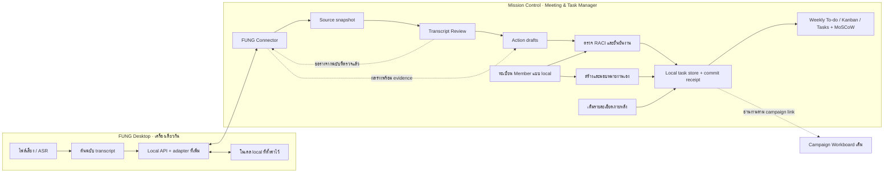
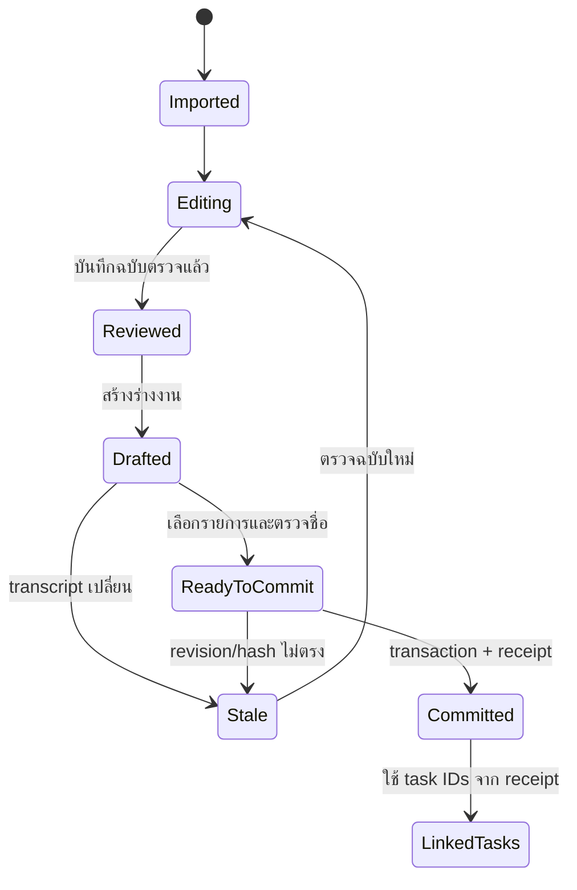

# Meeting & Task Manager — architecture and connector contract

## 1. ขอบเขตที่ยืนยัน

Mission Control นี้เป็นเจ้าของ task ที่สร้างจากประชุม; ใช้ local บนเครื่องเดียว บันทึกชื่อผู้รับผิดชอบ ผู้ใช้ยังไม่ได้ขอ shared login/notification รอบนี้ งานดังกล่าวไม่ถูกส่งไป Zuri Project Manager

ลูกศร API/adapter ที่เพิ่มเป็นข้อเสนอ ต้องไม่แสดงใน product ว่าเชื่อมแล้วจากการมีเอกสารนี้

## 2. หลักฐาน source ที่ตรวจในรอบนี้

FUNG checkout: `C:/Users/pc/workspace/fung`, HEAD `de696eaa68dbf9705bf57b765ad00b73f33ca282` วันที่ตรวจ 2026-09-30 มีไฟล์ tracked/untracked ของงานอื่นค้างอยู่; branch รายงาน behind cached origin/main 4 commits ไม่ได้ fetch และไม่ได้รับรอง remote freshness

| Ref | ไฟล์ / symbol | สิ่งที่ตรวจพบ |
|---|---|---|
| MC1 | `campaign-mission-control/src/content/dashboard/DashboardContent.jsx:9–18` | 5 tabs, localStorage ต่อ app ID, ยังไม่มี shared identity/backend |
| MC2 | `campaign-mission-control/src/content/shared/model.mjs:1–23,86–108` | schemaVersion 1; task อยู่ใต้ campaign; status/Done checks; restore รับ version เดียว |
| F1 | `fung/src-tauri/src/local_api.rs:1–63,561–686` | local HTTP API, per-launch token, loopback default, origin allowlist และ import/read routes |
| F2 | `fung/src-tauri/src/local_api.rs:824–861` + `fung/src-tauri/src/lib.rs:1926,4374` | HTTP transcript เรียก legacy `transcript_view`, ให้ segments; ไม่ใช่ native revision snapshot |
| F3 | `fung/src/lib/meetingIntelligence.ts:23–62,644–654` | native transcript snapshot/replay/correct ports มี revision, state และ human corrections |
| F4 | `fung/src-tauri/src/graph_build.rs:11–34` | มี extraction shape ของ action_items / owner / evidence แต่ยังไม่ใช่ task-manager import contract |
| F5 | `fung/src/lib/meetingIntelligence.ts:626` | external meeting dispatch flag เป็น false; ไม่ใช่เหตุให้ปิด local HTTP routes ที่ F1 มีอยู่ |
| W1 | `output/draft/weekly-kanban-2026-09-28.md` | งาน 5 รายการ, PIC ยืนยัน, A/due ยังไม่ยืนยัน, C/I/DoD เสนอ |

ตารางนี้เป็น static code evidence ไม่ใช่ test ผลเสียงจริง, runtime acceptance หรือ production integration

## 3. ทางเชื่อม FUNG

### 3.1 Reuse ที่มีอยู่

| Route ปัจจุบัน | ใช้ทำอะไร |
|---|---|
| `GET /health` | ตรวจว่าเป็น FUNG; ไม่ถือว่า credential ใช้งานได้จาก health เพียงอย่างเดียว |
| `GET /recordings` | รายการที่ผู้ใช้เลือกนำเข้า; auth ต้องสำเร็จก่อนสถานะ Connected |
| `POST /recordings/import` | ส่งไฟล์ที่เลือกไป FUNG และรับ jobId/projectId/recordingId |
| `GET /jobs/{id}` | แสดงสถานะถอดเสียงจริง |
| `GET /recordings/{id}/transcript` | legacy segments fallback แบบระบุ source mode |
| `GET /recordings/{id}/audio` | เล่นเสียงอ้างอิงในเครื่องเดียว |

Connect URL มาจาก FUNG Settings › Runtime และถือเป็น credential ไม่ใส่ตัวอย่าง token จริงในเอกสาร/log/UI notice เก็บ token ใน memory ของ connector รอบนี้ ไม่ใส่ใน task records, local backup, exported JSON หรือ URL ของ Mission Control

ยอมรับเฉพาะ loopback origin + port ของเครื่องนี้ ตรวจ URL/path ก่อน request ไม่ proxy ผ่าน server, ไม่เปิด LAN listener, ไม่สแกนพอร์ต, ไม่ค้น credential ใน browser อื่น อนุญาตให้ต่อใหม่เมื่อ FUNG restart แล้ว token เปลี่ยน

การเล่นเสียงใช้ authenticated fetch เป็น blob URL เมื่อทำได้ และ revoke หลังใช้ แทนการส่ง credential ไป URL ภายนอก การรองรับ seek/ขนาดไฟล์ต้องทดสอบกับ route จริง; maximum upload ของ FUNG source ปัจจุบันคือ 512 MiB แต่ UI ตรวจชนิด/ความพร้อมก่อน upload ไม่ใช้ขนาดสูงสุดเป็นเป้ารับไฟล์ทุกชนิด

### 3.2 Contract ที่ต้องเพิ่ม — ยังไม่มี implementation

เพื่อไม่อ้าง legacy text เป็น native reviewed revision และเพื่อใช้โมเดล FUNG โดยไม่เปิด endpoint ของโมเดลให้เว็บเรียกตรง เสนอ namespace `/integrations/meeting-task-manager/v1` ภายใต้ auth/origin gate เดิม:

| Operation ที่เสนอ | Request / Response หลัก |
|---|---|
| `GET .../capabilities` | ส่ง protocolVersion, snapshot availability, actionDraft availability, readiness reason; ไม่แสดง secrets |
| `GET .../recordings/{recordingId}/snapshot` | เรียกเจ้าของ transcript ผ่าน native service; ส่ง native revision/cursor หากมี หรือ legacy mode + content hash หากไม่มี |
| `POST .../action-drafts` | รับ selected source, reviewed revision/hash, bounded segments และ requestId; ตรวจ source ก่อน/หลัง model call; คืน draft actions พร้อม quote/span/model provenance |

FUNG เป็นผู้ใช้งาน read/service ports ของตัวเอง ห้าม Mission Control เปิด GenesisBlockDB หรือสร้าง table mutation ข้าม boundary การเพิ่ม routes ไม่เปิด external meeting provider dispatch หรือ MCP write tools

ถ้า version/readiness ไม่รองรับ ให้ UI แสดงความสามารถที่มีจริงและหยุดปุ่ม AI drafting ส่วน manual task from selected text ยังใช้ได้ โดยไม่แต่งผลลัพธ์ AI มาทดแทน

### 3.3 Source snapshot contract

Required fields: `schemaVersion`, `sourceInstanceId`, `projectId`, `recordingId`, `sourceMode`, `sourceRevision` (nullable), `sourceCursor` (nullable), `contentHash`, `capturedAt`, `meetingStartedAt` (nullable), `timezone`, `segments[]`, `coverage`.

Segment fields: `segmentId`, `nativeRevisionId` (nullable), `startMs`, `endMs`, `text`, `speakerLabel` (nullable), `reviewState` (unknown/committed/reviewed), `sourceRef`.

- `sourceInstanceId` คือ local connection identity ที่ไม่ใช่ token; ผู้ใช้ยืนยัน mapping เมื่อต่อ installation ใหม่
- Hash canonical UTF-8 JSON ของ project/recording, source mode/revision, ordered segment IDs/timecodes/text/speaker และ coverage โดยไม่รวม capturedAt; timestamps เก็บ integer milliseconds
- legacy ไม่มี native revision ให้เป็น null ไม่สร้าง revision หมายเลข 1 แทน
- error, source gaps และ empty speech เป็นคนละสถานะ; coverage unknown แสดง unknown
- HTTP legacy route เดิมไม่รับรอง M1 human edits ล่าสุด จึงไม่ใช้แทน enhanced snapshot แบบเงียบ ๆ

### 3.4 Draft request / response

Request: `requestId`, `sourceInstanceId`, `projectId`, `recordingId`, `expectedSourceHash`, `reviewRevisionId`, `reviewHash`, `reviewedSegments[]`, `locale`, `meetingStartedAt`, `timezone`.

Response: `draftBatchId`, `requestId`, `sourceHash`, `reviewRevisionId`, `reviewHash`, `modelRunRef`, `modelName`, `generatedAt`, `items[]`.

`draftBatchId` สร้างแบบ deterministic จาก requestId และ source/review identity; retry request เดิมไม่เปลี่ยน batch identity ส่วนการขอ extract ใหม่ต้องสร้าง request ใหม่และผ่าน duplicate review ก่อน commit โมเดลเป็นผู้เสนอข้อความ ไม่ได้เป็นผู้กำหนด identity ของ batch

Item: `proposalId`, `kind` (task/decision/question), `title`, `deliverable`, `suggestedResponsibleLabel` (nullable), `suggestedDueText` (nullable), `suggestedDueDate` (nullable), `evidence[]`, `unresolvedFields[]`.

Evidence: `segmentId`, `startMs`, `endMs`, `quote`, `reviewRevisionId`. Server/consumer ต้องตรวจว่า quote เป็นข้อความจริงของ revision นั้นและเวลาอยู่ใน source segment เดียวกัน ช่วงไหนไม่มีหลักฐานให้เป็น unresolved ไม่สร้าง cite หรือ confidence ขึ้นเอง

ไม่ส่ง credential, email หรือรายชื่อคนอื่นทั้งระบบเข้า prompt เนื้อหา transcript เป็น untrusted source; model ไม่มี tool execution, การเลือกปลายทาง หรืออำนาจสร้าง task โดยตรง

ใช้เฉพาะ provider local ที่ผ่าน readiness ของ FUNG และขอบเขต local-only ของงานนี้ ไม่ fallback ไป cloud เมื่อโมเดล local ใช้งานไม่ได้

## 4. Local data ownership

ใช้ IndexedDB ใน namespace ที่ผูก app ID สำหรับข้อมูลโดเมนใหม่ เหตุผลคือ transcript/revision และ task commit ต้องบันทึกหลาย records แบบ transaction; ไม่ใส่เสียงหรือ base64 media ใน localStorage

| Entity | หน้าที่และ key สำคัญ |
|---|---|
| Member | stable local ID + displayName/fullName/nickname/team/position/email/phone/notes + active/inactive + timestamps; ไม่ใช่ authenticated account |
| Meeting | ID + sourceInstanceId/projectId/recordingId + title/date + project/campaign relation ที่ผู้ใช้เลือก |
| SourceSnapshot | immutable imported source + contentHash + native revision ถ้ามี |
| ReviewRevision | ID + sourceSnapshotId + edited text/speaker mapping + parentRevisionId + reviewedAt |
| DraftBatch | reviewed revision/hash + model/manual provenance + candidates + stale flag |
| Task | stable ID + title + nullable description/deliverable + R/A/C/I + confirmation flags + state + acceptance/evidence + source references |
| WeeklyPlan | weekStart/timezone + entries `{taskId, priority, priorityNote}`; priority เป็น must/should/could/wont/null ของรอบนี้ ไม่ใช่ task copies |
| CommitReceipt | idempotencyKey + payloadHash + proposal→task mapping + committedAt |
| TaskEvent | local change history ของ assignment/status/evidence/description และ weekly priority พร้อม weekStart; ไม่อ้าง authenticated audit |

Member IDs ต้อง bind ชื่อที่ seed ไว้ ไม่ใช้ string comparison อย่างเดียวในภายหลัง การเปลี่ยน displayName ไม่เปลี่ยนคนที่รับผิดชอบ งาน manual กับงานจาก meeting ใช้ Task entity และ RACI member references ชุดเดียวกัน

Manual create/update อยู่ใน local repository ไม่ผ่าน FUNG; ใช้ sourceKind manual หรือ manual-from-meeting ตามหลักฐานที่มีจริง Member registration เก็บชื่อเป็นข้อมูลหลักและช่องอื่น optional; phone เป็น string การปิดใช้งานเป็น reversible update ห้าม cascade-delete tasks/history ส่วน seed member IDs ใช้สำหรับ idempotent mapping ไม่ใช่ user login identity

การ restore ตรวจ referential integrity ของ R/A/C/I กับ Member records ก่อนบันทึก; กรณีข้อมูลเก่าไม่มีสมาชิกที่อ้าง ให้แสดงรายการที่ต้อง resolve ไม่ผูกกับสมาชิกชื่อเหมือนกันเอง Contact data อยู่ใน local backup ที่ผู้ใช้เลือก export แต่ไม่อยู่ใน connector state, model request หรือ notification service

### 4.1 รายละเอียดที่เติมภายหลังได้

- Create task ต้องมี title และ create member ต้องมี displayName; `Task.description` และ `Member.notes` เป็น nullable multiline plain text พร้อมข้อมูลเสริม optional ตาม spec
- ไม่สร้างข้อความรายละเอียดแทนผู้ใช้; input ที่ว่าง/มีแต่ whitespace เก็บเป็น null ข้อความที่มีเนื้อหาเก็บบรรทัดภาษาไทยครบและแสดงเป็น text ไม่ execute HTML
- Update เฉพาะ field ที่ส่งมา: omitted field หมายถึงคงเดิม ส่วน null เป็นการล้างค่าที่ผู้ใช้ตั้งใจ ไม่ reset RACI/status/weekly membership เมื่อเติมรายละเอียด
- แก้ข้อมูลเสริมของสมาชิกคง memberId; แก้รายละเอียด task คง source provenance/quote และ task ID เดิม บันทึกการแก้กับ timestamp/event ใน transaction ของ store ที่เกี่ยวข้อง
- การเพิ่มรายละเอียดภายหลังไม่ผ่าน FUNG และไม่บังคับ Done validation จนผู้ใช้ขอเปลี่ยนเป็น Done

### 4.2 MoSCoW ต่อรอบสัปดาห์

- เก็บ `priority: "must" | "should" | "could" | "wont" | null` และ `priorityNote: string | null` ใน entry ของ WeeklyPlan; key ไม่ซ้ำคือ weekStart + taskId ภายใน namespace/timezone เดิม
- Task ไม่มี global priority ซ้ำอีกชุด; ฟอร์ม/list/card resolve จากสัปดาห์ที่เลือก งานที่ไม่มีสัปดาห์ยังสร้าง Backlog ได้และเลือก priority เมื่อจัดรอบ
- Seed JSON ใช้ priority/priorityNote บนแถว task เพื่ออธิบายการนำเข้า แล้ว mapper เขียนลง weekly entry ของ weekStart ไม่เขียนเป็น Task fields; description ลง Task
- เปลี่ยน priority/note พร้อม event ที่ระบุ weekStart ใน transaction เดียวกัน; null เป็นรอยืนยัน ไม่ถูกแปลงเป็น Should หรือค่าจากโมเดล
- เพิ่มงานเดิมเข้าสัปดาห์ใหม่สร้าง membership ใหม่โดย priority/note เริ่ม null; entry รอบก่อนคงอยู่ ไม่มีการ clone task หรือเปลี่ยน task state
- Won’t เป็นการกันออกจากงานที่เลือกทำในรอบนั้นเท่านั้น; projection แสดงรายการแยกที่ยังเปิดได้โดยไม่ลบ source task หรือเปลี่ยนเป็น Done การสรุปความคืบหน้ารอบนี้ใช้ M/S/C และแยก unclassified/Won’t ตาม spec
- Contract FUNG ไม่ต้องเพิ่ม field priority สำหรับรอบนี้: การเลือก MoSCoW เป็น local human input ใน Action Review/Task detail หลังได้ draft
- backup/restore ตรวจ enum, unique membership และ task references; รวม optional details/priority/note กับ event ตามข้อมูลจริง ค่า domain field ที่ขาดใน draft/seed เก่าปรับเป็น null ในขั้น normalize โดยไม่ overwrite ข้อมูลผู้ใช้หรือเดาค่า legacy campaign

## 5. Revision และการกันงานซ้ำ

- Idempotency key ผูก source instance + project + recording + reviewed revision/hash + stable draftBatchId; rerun batch/retry เดิมใช้ key เดิม
- payloadHash ผูก selected proposal IDs + final task fields + assignment/weekly plan ที่ preview แล้ว; key เดิมแต่ payload ต่างตอบ Conflict ให้ตรวจ ไม่คืน success เงียบ ๆ
- เขียน tasks, weekly membership, events และ receipt ใน IndexedDB transaction เดียว; UI แจ้ง success เมื่อ transaction complete
- ก่อน commit ตรวจ source/review revision และ task versions ที่เลือกผูก เพื่อไม่เขียนทับงานที่ถูกแก้ไปแล้ว
- extract ใหม่จาก review เดิมหรือฉบับใหม่ต้องแสดงรายการที่เคยสร้างและให้เลือก link/update/create; ใช้ source span/recording เพื่อเสนอความซ้ำ และ human review ตัดสิน ไม่ใช้ fuzzy title เพียงอย่างเดียวเป็น identity
- การแก้ transcript หลัง commit ไม่แก้ title/R/due/status ของ task ที่สร้างแล้ว อาจสร้าง proposal เปลี่ยนแปลงที่ผู้ใช้เห็นและยอมรับเท่านั้น

## 6. Compatibility และ backup

- Campaign localStorage schema v1 และ app ID เดิมคงอยู่; เพิ่ม domain store แยก มี `schemaVersion` ของตัวเอง
- ไม่ย้าย/copy legacy campaign tasks โดยอัตโนมัติ ลดความเสี่ยงกับงานที่ผู้ใช้มีอยู่
- งานใหม่ที่ผูก campaign แสดงผ่าน read projection ของ task store ใหม่; การแก้ link card dispatch ไปยัง task owner เดียว
- รวม domain snapshot ใน backup envelope v2 ที่มี `campaignWorkspace` และ `meetingTaskManager`; export พร้อม members/source/review/task/receipt แต่ไม่มี token/audio
- import backup v1 ทำงานกับ campaign scope ตาม flow เดิมและไม่ล้าง domain store ใหม่; v2 ตรวจทั้งสองส่วนก่อน preview/confirm
- การ restore ข้าม localStorage + IndexedDB ไม่ใช่ transaction เดียว: ใช้ restore journal, stage-and-validate, backup ก่อนเปลี่ยน และ recoverable finalize marker; ป้องกัน UI เขียนระหว่าง restore ให้ restart แล้ว resume/rollback ได้โดยไม่เหลือชุดข้อมูลปนกัน
- ไม่ scan localStorage ของ app ID อื่น, ไม่ล้าง browser storage, ไม่เติมข้อมูล demo ทับ user data
- private mode/quota/storage failure แสดงข้อจำกัดและให้ export; ไม่อ้าง multi-user sync หรือส่งงานถึงบุคคลจากการบันทึกชื่ออย่างเดียว

## 7. Impact / implementation boundary

| Layer | การเปลี่ยนที่จำเป็นหลังอนุมัติ |
|---|---|
| Parent product | เพิ่ม domain switch และ navigation ใน authored content; campaign เดิมยังเข้าถึงได้ |
| Peer campaign | linked tasks เป็น projection; ไม่เปลี่ยน metrics/offer rules/history |
| New domain | local member/task/meeting/review store, manual task, optional details, UI, RACI/weekly/MoSCoW, evidence/commit |
| FUNG | adapter สำหรับ normalized snapshot และ bounded local action drafting; reuse upload/auth/origin/native ownership |
| Protected app runtime | ใช้ public APIs; ไม่แก้ shell/build/context โดยการขยาย content ตามปกติ |
| Other repos / cloud | ไม่มี Zuri Project Manager writes, provider activation, messages หรือ production deploy ในขอบเขตนี้ |

## 8. Review และ exit criteria

- เอกสารแยก existing code กับ proposed contract ชัดเจน และไม่ใช้ memory เป็นหลักฐาน runtime
- Local-only, task ownership และ 5 PIC ตรงคำยืนยันผู้ใช้
- Native versus legacy transcript revision, source refresh, ambiguous people/dates, model unavailable, double import/commit, storage failure และ restore interruption มี handling ที่กำหนดไว้
- ตรวจ source/doc references และ weekly/member JSON ในรอบเอกสาร; หลัง implementation ต้องใช้ focused unit/contract/integration/browser tests ตาม MT-01–29 และทดสอบ FUNG ที่รันจริงก่อนอ้างเชื่อมต่อสำเร็จ
- ผู้ใช้อนุมัติเอกสารก่อน code ตาม R5; ไม่มีการตั้ง ready/deployed จากผลตรวจเอกสาร

## 9. Version diff

v0.2 → v0.3: เพิ่ม nullable details และ update semantics สำหรับเติมภายหลัง; เปลี่ยน weekly task-ID list เป็น entries ที่อ้าง task เดิมพร้อม MoSCoW/note; เพิ่มกติกา carryover, history และ backup ของ priority ขอบเขต FUNG API/เจ้าของข้อมูลเดิมคงอยู่ และยังไม่มีการรัน migration หรือแก้ app code

## Implementation verification — 2026-09-30

ผู้ใช้อนุมัติ v0.3 ก่อน implementation แล้ว สถานะรอบเอกสารด้านบนเป็นประวัติ; สถานะปัจจุบันและ requirement matrix อยู่ที่ [verification report](meeting-task-manager-verification.md) และวิธีใช้ใน [คู่มือ](meeting-task-manager-guide.md)

Authored dashboard content build สำเร็จโดยคง app ID และ protected runtime เดิม; ฟังก์ชัน local ทดสอบแล้ว FUNG adapter ผ่าน source/production-handler fixture แต่ยังไม่เปลี่ยนแอป FUNG ที่ติดตั้งอยู่ จึงยังไม่ปิด acceptance การทดสอบเสียงและโมเดลจริงครบเส้นทาง
